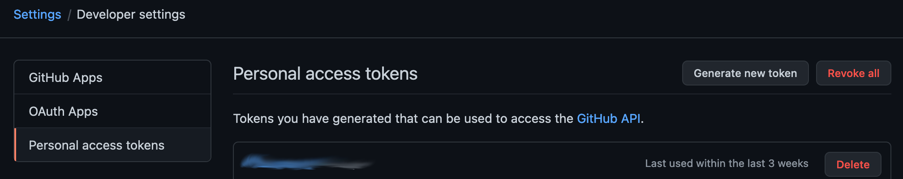
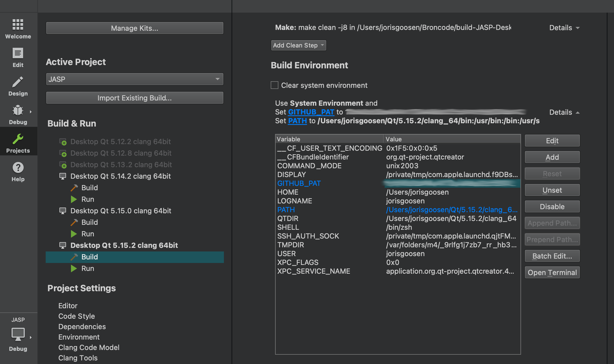

Guide to Building JASP
======================

First off, are you sure you want to build JASP? An easier way to develop modules is to just [download a nightly](http://static.jasp-stats.org/Nightlies/) and load your module as a development module. This process is described at [workflow in developing a JASP module](./jasp-module-workflow.md).

If you **really** want to build JASP, read on.

The easiest way to build JASP is to use Qt Creator. After cloning the [jasp-desktop project](https://github.com/jasp-stats/jasp-desktop), open the JASP.pro file in the jasp-desktop directory, in Qt Creator. This project contains two runnable sub-projects, *Desktop* and *Engine*. In order to run JASP, *Desktop* is the correct project to run.

For those unfamiliar with using Qt Creator for development, there is some excellent documentation available [here](http://doc.qt.io/qtcreator/index.html).

Alternatively, those that are more comfortable using command line tools can use *QMake*, the manual for which is available [here](http://doc.qt.io/qt-5/qmake-manual.html). *QMake* projects (like JASP) are typically built in two steps; first *QMake* is called, which generates a Makefile for *Make*re, and then *Make* is called with this generated Makefile.

We recommend building JASP in a separate directory to its source directory. This can be achieved by calling *QMake* in a separate directory to the source, for example we might create a separate directory beside the *jasp-desktop* directory (perhaps called *jasp-build*), and then from this directory call:
```
    qmake ../jasp-desktop/JASP.pro
    make # -j8 # <- to gain a considerable speedup on a typical quadcore system
```
This generates the Makefile in the *jasp-build* directory, and all resulting object files and executables will be output to this directory.

JASP requires several dependencies which are documented below.

JASP depends on:

 - [Qt (5.15.2 + QtWebEngine)](http://qt-project.org)
 - [R](http://cran.r-project.org)
 - [boost](http://boost.org)
 - [libarchive](http://libarchive.org/)
 - [zlib](http://zlib.net/)

Required files on Windows and macOS
--------------
To be able to build JASP the listed dependencies are required and can be easily installed on your system through [jasp-required-files](https://github.com/jasp-stats/jasp-required-files.git)
Simply clone the git repository next to your jasp-desktop folder as follows:

	[+] jasp-desktop < from github >
	[+] jasp-required-files < from github >

Windows
-------

Building JASP under windows is most temperamental but should pose no large problems. Besides the above described GitHub repositories, you will need to install the following preliminaries to build JASP on Windows, later on described in more detail:

- [Qt 5.15.2](https://www.qt.io/download) Download the Open Source version from (https://www.qt.io/download).
- [Visual Studio 2019](https://www.visualstudio.com/downloads/) Download the community version
- [R Tools 4.0](https://cran.r-project.org/bin/windows/Rtools/rtools40-x86_64.exe) Download from (https://cran.r-project.org/bin/windows/Rtools/rtools40-x86_64.exe)

Besides installing and cloning the software above, one needs to make some kits in Qt Creator to be able to build JASP and separately R-Interface.

Assume that the root folder of your JASP build folder is \<JASP\>.
To build JASP follow the next steps:

1. Clone JASP sources from the **jasp-desktop** GitHub repository.  
	From the \<JASP\> root folder in a terminal, type:

	`git clone https://github.com/jasp-stats/jasp-desktop.git`

	Or from a browser go to https://github.com/jasp-stats/jasp-desktop and choose the Clone or Download option.

	

	You should now have:  
	\<JASP\>\jasp-desktop

2. Clone some third party binaries, boost and used R-packages  from **jasp-required-files** repository on GitHub.  
	From the \<JASP\> root folder in a terminal, type:

	`git clone https://github.com/jasp-stats/jasp-required-files.git`

	Or from a browser go to https://github.com/jasp-stats/jasp-required-files and choose the Clone or Download option.

	

	You should now have:  
	\<JASP\>\jasp-required-files

3. Switch to the Windows branch in **jasp-required-files**.

***Warning in advance:***

Because the **jasp-required-files** folder contains binary files as well as R packages with text files it is necessary that git performs a checkout or commit without changing the line endings. Some packages might generate MD5 checksum errors if line endings are changed. It is possible to change this behavior of git configuration per repository. For more information on this subject see https://help.github.com/articles/dealing-with-line-endings/  
(To use a repository specific setting for this: in the **jasp-required-files** folder, type: `git config core.autocrlf false`)  
        From the \<JASP\> root folder in a terminal, type:
```
	cd <JASP>\jasp-required-files  
	git checkout Windows  
	git branch  
```
	
Should confirm that you are on the Windows branch now.
	
	
4.	Create a build folder(s). From the \<JASP\> root folder for a 64-bit version e.g.:
```
	mkdir build-release-64  
	mkdir build-debug-64  
```
Later you may want to build a debug version.
In the description it is assumed that you are now only building a release version.  
You should now have:  

- \<JASP\>\build-release-64  
- \<JASP\>\build-debug-64  

The distinction between debug version and release only differs in the option you choose in QtCreator. Only the description for the release version is given here.

5.	**Copy & Link files** to their expected locations in the build folders:    
From \<JASP\>\jasp-required-files\64\\* -> \<JASP\>\build-release-64  

You then open a cmd-prompt as admin(!) and make a symbolic link to R as follows:
```	
	cd \<JASP\>\build-release-64  
	mklink /D R ..\jasp-required-files\R  
```	
If you don't do it like that, aka a command prompt that you started as admin, JASP *will not compile at all*. So make sure to do it in the described manner.	

You should now have :  

- \<JASP\>\build-release-64\R  
- \<JASP\>\build-release-64\*.lib and *.dll  
- \<JASP\>\build-release-64\JAGS\*
   
6.	**Install Qt 5.15.2**  
Go to https://www.qt.io/download  
Choose Open Source and Download.  
Start qt-unified-windows-x86-?.?.?-online.exe from your download folder.  
Having a Qt account is now mandatory because [their sales-team wants to know us to (potentially) harass us](https://www.qt.io/blog/qt-offering-changes-2020).
Use the default options but select the following components to install:

  


You will now have QtCreator in \<QTINSTALLDIR\>\Tools\QtCreator\bin\qtcreator.exe (and in your start menu).        
For following updates of Qt you can use the MaintenanceTool for Qt in \<QTINSTALLDIR\>\MaintenanceTool.exe (and in your start menu).  


7. **Install Microsoft Visual Studio 2019**  
Go to https://www.visualstudio.com/downloads/  
Download Community version
Start vs_community_.. from your download folder.  
Choose all the default options.   
For components to install only choose the Desktop development with C++ option:  

  

8. **Install RTools 4.0**  
Download from https://cran.r-project.org/bin/windows/Rtools/rtools40-x86_64.exe
Run it and install as you like.  

If used the default options you will now have RTools 4.0 installed in C:\rtools40  

Because we are using this toolkit for building a small part of jasp as well we need to install some extra stuff. For this, open the folder where you installed rtools.
Run `msys2.exe` and see a terminal appear as your reward. 
In it, enter `pacman -Syu` to update the package manager it uses (familiar from arch linux perhaps) but don't worry if you do not know what that means.
After that run `pacman -S mingw-w64-x86_64-toolchain`

To make sure that Qt knows how to find the newly installed `make` et al, you could add the binary folder to your `PATH` environment variable in Windows.
Make sure to add `C:\rtools40\mingw_64\bin`. When you are doing, take care to place it as "early" as possible, so if possible as first entry. If you have any references to `C:\Rtools\bin` you can remove those entirely.

9.	**configuring QtCreator with the proper kits**
The last step you have to do is setting up the proper kits to build JASP.    
Start QtCreator and load, through File->Open File or Project, the JASP.pro file from \<JASP\>\jasp-desktop\JASP.pro.  
Also load \<JASP\>\jasp-desktop\R-Interface\R-Interface.pro.  
Both projects are built with a different kit in Qt because they are built with different compilers.  
Select Manage Kits in QtCreator, through Project in the side panel, and go to the Compilers Tab and manually ad the `g++` and `gcc` MINGW compiler required for building R-Interface. After adding a new compiler select its location in RTools mingw folder.   

The compiler tab should now be similar to:  
    

The Debuggers tab should now be similar to:  
   	

You should now create two kits, one for building JASP desktop and one for building R-Interface. Both are equal except for the Compiler versions. The kits should look similar to:
   

And   


Your deployment configuration, in the side panel, should now show something like:  
   
   


10. From the Projects Build Settings, in the side panel, check if your build folders are correct.
Make sure you've opened the "JASP.pro" project and R-Interface.pro.

  

For the R-Interface the Build directory should be build-release-64\R-Interface. This folder needs to be created manually.

11. **Start building the R-Interface first**, you will need this to finish the JASP build properly.

12. Now set JASP as Active project and build JASP. [Setting a github personal access token first](#github_pat) is also highly recommended. 

13. Whenever changes are made to R-Interface it will need to be built anew, while on Mac and Linux this happens automatically on Windows this must, in principle, be done manually. There is however a way to automate this and can be done as follows:
	- Open both the JASP and R-Interface project in Qt Creator.
	- Make sure JASP is your active project
	- Select "Projects" with the button on the leftside of Qt Creator.
	- Select "Dependencies" under "Project Settings"
	- Now you should see R-Interface with a checkbox
	- Tick the box, now Qt Creator will build it for you when necessary.
	- Qt will however not automatically remember this setting, to make it do so: `select File > Sessions > Manage > Restore last session on startup.`


macOS
-----

To build JASP you need to clone **jasp-desktop** and **jasp-required-files** repositories, install XCode, Command Line Tools, gfortran for macOS, Qt and some packages in R.

0. Clone the repository **jasp-desktop**
1. Qt requires the Xcode and Command Line Tools to be installed on your system.
	- You can install the Xcode from the [Mac App Store](https://apps.apple.com/us/app/xcode/id497799835?mt=12).
	- To install the Command Line Tools, **after installing the Xcode**, open the Terminal app and run this command: `xcode-select --install`.

2. Install the [gfortran for macOS](https://github.com/fxcoudert/gfortran-for-macOS). You can check your macOS version from the ** → About This Mac** menu item.

3. [Qt](https://www.qt.io/): **Install Qt 5.15.2**
Select:
	- macOS
	- Qt WebEngine


- 3.a. **Configure Qt5.15.2**: Once installed:

	- Go to "Qt Creator" - "Preference" - "Kits"
	- Auto-detect should give "Desktop Qt 5.15.2 clang 64bit". Click on this.
	- Choose the compiler **Clang (x86 64bit in /usr/bin)** for both C and C++.


- 3.b. **Configure project**: 

	- Open "JASP.pro" as the project in qtcreator.
	- Click "Projects" in the left ribbon and provide the "debug build" and "release build" folders with the correct compilers.
	- These folders should be placed in the same directory as `jasp-desktop` and `jasp-required-files` (so next to them).

The projects, once configure, should look like:


and like:


In both case, I've added the flag "-j4" to make use of all my four cores on my mac. (This seems to be enabled by default in newer versions of qtcreator)

4. Clone the repository **jasp-required-files** and select the **MacOS** branch. These files can now be put in the folders as shown here:


where the blue files are the binaries that are added manually. Keep in mind that the screenshot is kind of old and is missing the `jasp-required-files` folder. The process will be smoothened out in the near future. You should also make sure to copy the `JAGS` folder together with the binaries.

5. Make a symbolic link to Frameworks

	- If you've paid an exceptional amount of attention to the above folder-structure you will notice that there is a folder **Frameworks** next to **jasp-required-files** and the others. With even more attention it will be noticed that **jasp-required-files** also contains a folder called **Frameworks**. These are in fact one and the same! This means that whenever **jasp-required-files** gets updated the same happens for the contents of the **Frameworks** folder next to it, and this is required to compile JASP.

	- To get this same structure you will need to make a so-called symbolic link. You can do this by first navigating into your `JASP/` directory, and issuing the following command: `ln -s jasp-required-files/Frameworks Frameworks`.

6. Make sure you have `jasp-required-files` right next to `jasp-desktop`. [Setting a github personal access token](#github_pat) is also highly recommended.

7. Build JASP in Qt.

Linux
-----

### Build

#### All linux
Besides the packages mentioned below for Ubuntu and Fedora one needs a few R-packages to build JASP. 
Using the latest R you can run: `install.packages(c('renv', 'modules', 'remotes', 'rjson', 'jsonlite', 'Rcpp', 'ragg', 'systemfonts', 'pkgbuild'))`.
This will install all that is necessary to install the modules with the actual analyses.
At certain points this may fail when it misses some kind of header or something. For instance, an R-package might need `#include <png.h>` or something. In this example you should install the Fedora-package `libpng-devel` or the Ubuntu-package `libpng-dev`. In other cases you should figure out which development distribution-package you would need on the linux-distribution you're running and install that. This will probably also happen while you are building JASP and `renv` is collecting and building all the required pkgs for each module, so the same response is warranted.

Besides this we use [ReadStat](https://github.com/WizardMac/ReadStat) to read a variety of data-formats into JASP. This is however not available as a package on (most) linuxes. Instead you can either build it yourself like:
```
cd To/some/folder/where/you/want/your/sources
git clone https://github.com/WizardMac/ReadStat && cd ReadStat && git checkout v1.0.2
./autogen.sh && ./configure --enable-static && make -j4
cp .libs/libreadstat.a /path/to/your/jasp/build/folder
```
*or* you can take it easy and download the file from [jasp-required-files](https://github.com/jasp-stats/jasp-required-files/blob/Linux/libreadstat.a)

[Setting a github personal access token](#github_pat) is also highly recommended.

#### Ubuntu (and alike)
To build JASP under Ubuntu (17.10+), debian, and derivatives, you will need:
```
sudo apt-get install libboost-dev r-base-core r-cran-rcpp r-cran-rinside libqt5widgets5 qtwebengine5-dev libqt5webchannel5-dev libqt5svg5-dev qt5-qmake libarchive-dev libboost-filesystem-dev libboost-system-dev libjsoncpp-dev qt5-default qtcreator qml-module-qtquick-controls2 qtquickcontrols2-5-dev qml-module-qtwebengine qml-module-qtwebchannel qml-module-qt-labs-folderlistmodel
```
> Install the latest version of R and the same pkgs as described above.

Then you start qtcreator and open JASP.pro, run qmake and build all. After that you should be able to run JASP.

#### Fedora
Under Fedora, you need these packages:
 - qt-devel
 - qt5-qtwebengine-devel (probably)
 - qt5-qtwebchannel-devel (probably)
 - boost-devel
 - libarchive-devel
You will also need to install packages for the QML code, not sure what they are but probably something like: qt5-qtquickcontrols2 qml-module-qtwebengine qml-module-qtwebchannel qml-module-qt-labs-folderlistmodel

And (under fedora only), in R (started as root so packages are installed systemwide), you need to install:

```
install.packages(c("Rcpp","RInside"))
```

Finally, under Fedora only, you might need to create a symlink so that R is found:

```
sudo ln -s /usr/lib64/R/ /usr/lib/R
```

If you get stuck compiling or wherever in the process, we would be glad to help at https://github.com/jasp-stats/jasp-issues/issues

### Runtime
#### Ubuntu (and alike)
In order to run, you will need (Ubuntu and alike):
```
sudo apt-get install libjsoncpp1 r-base-core r-cran-rcpp r-cran-rinside r-cran-bayesfactor r-cran-lme4 r-cran-afex r-cran-car r-cran-effects r-cran-logspline r-cran-lsmeans r-cran-plotrix r-cran-rjson r-cran-vcd r-cran-vcdextra r-cran-ggplot2 r-cran-hypergeo libqt5webenginewidgets5 libqt5webengine5 libqt5webenginecore5 libqt5svg5 openssl
```

### Fedora
It works under Fedora, if you install these R packages manually in R:

```
install.packages(c("BayesFactor","lme4","afex","car","effects","logspline","hypergeo","rjson"))
```

## GITHUB_PAT
We use R both inside JASP and during building. During the buildprocess [renv](https://github.com/rstudio/renv) is used to recreate the r-library that a module expects.
As it does so it often queries [github](https://github.com), this can run foul of the rate limiter they have for anonymous requests. 

This look like:
```
Error: failed to resolve remote 'jasp-stats/jaspBase' -- failed to retrieve 'https://api.github.com/repos/jasp-stats/jaspBase' [error code 22]
In addition: Warning message:
curl: (22) The requested URL returned error: 403  
Traceback (most recent calls last):
26: pkgbuild::with_bui...
```

Luckily it is easy to solve, just create a personal access token just to let github know you are not trying to DDOS them (I guess).
You can create one under `Settings -> Developer settings -> Personal access tokens" or just [click here](https://github.com/settings/tokens/new).
You don't need to give it any scopes/permissions. 



This will generate a hashcode and you can copy it to a environment variable.
This can be done systemwide and that has the advantage that other instances of R can also use it.

The simplest cross-platform way will be described here though, just open up the projects pane in qt creator.
Then change the build environment to include an environment variable called `GITHUB_PAT` and paste the token you create in github as the value.



This can also be set in JASP itself under `Preferences -> Advanced`.