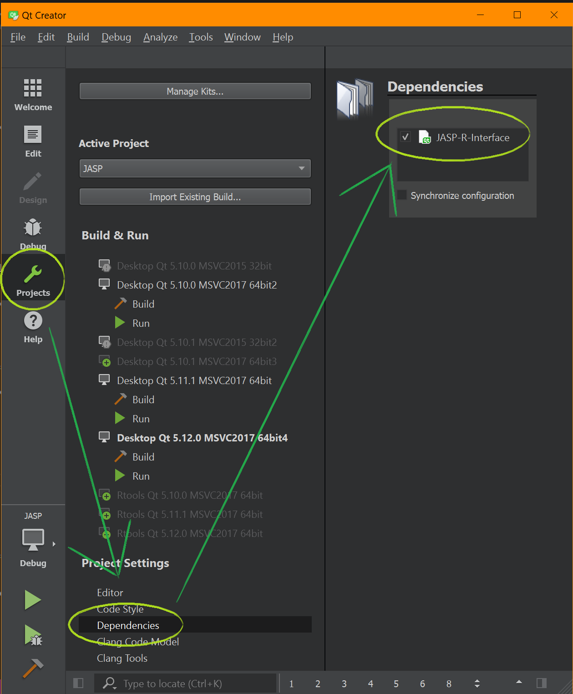

Guide to Building JASP
======================

The easiest way to build JASP is to use Qt Creator. After cloning the [jasp-desktop project](https://github.com/jasp-stats/jasp-desktop), open the JASP.pro file in the jasp-desktop directory, in Qt Creator. This project contains two runnable sub-projects, *JASP-Desktop* and *JASP-Engine*. In order to run JASP, *JASP-Desktop* is the correct project to run.

For those unfamiliar with using Qt Creator for development, there is some excellent documentation available [here](http://doc.qt.io/qtcreator/index.html).

Alternatively, those that are more comfortable using command line tools can use *QMake*, the manual for which is available [here](http://doc.qt.io/qt-5/qmake-manual.html). *QMake* projects (like JASP) are typically built in two steps; first *QMake* is called, which generates a Makefile for *Make*re, and then *Make* is called with this generated Makefile.

We recommend building JASP in a separate directory to its source directory. This can be achieved by calling *QMake* in a separate directory to the source, for example we might create a separate directory beside the *jasp-desktop* directory (perhaps called *jasp-build*), and then from this directory call:
```
    qmake ../jasp-desktop/JASP.pro
    make # -j8 # <- to gain a considerable speedup on a typical quadcore system
```
This generates the Makefile in the *jasp-build* directory, and all resulting object files and executables will be output to this directory.

JASP requires several dependencies which are documented below.

JASP depends on:

 - [Qt (5.15 + QtWebEngine)](http://qt-project.org)
 - [R](http://cran.r-project.org)
 - [boost](http://boost.org)
 - [libarchive](http://libarchive.org/)
 - [zlib](http://zlib.net/)

Required files on Windows and Mac OS X
--------------
To be able to build JASP the listed dependencies are required and can be easily installed on your system through [jasp-required-files](https://github.com/jasp-stats/jasp-required-files.git)
Simply clone the git repository next to your jasp-desktop folder as follows:

	[+] jasp-desktop < from github >
	[+] jasp-required-files < from github >

Windows
-------

Building JASP under windows is most temperamental but should pose no large problems. Besides the above described GitHub repositories, you will need to install the following preliminaries to build JASP on Windows, later on described in more detail:

- [Qt 5.12.7](https://www.qt.io/download) Download the Open Source version from (https://www.qt.io/download).
- [Visual Studio 2017](https://www.visualstudio.com/downloads/) Download the community version
- [R Tools 3.5](https://cran.r-project.org/bin/windows/Rtools/Rtools35.exe) Download from (https://cran.r-project.org/bin/windows/Rtools/Rtools35.exe)

Besides installing and cloning the software above, one needs to make some kits in Qt Creator to be able to build JASP and separately JASP-R-Interface.

Assume that the root folder of your JASP build folder is \<JASP\>.
To build JASP follow the next steps:

1. Clone JASP sources from the **jasp-desktop** GitHub repository.  
	From the \<JASP\> root folder in a terminal, type:

	`git clone https://github.com/jasp-stats/jasp-desktop.git`

	Or from a browser go to https://github.com/jasp-stats/jasp-desktop and choose the Clone or Download option.

	

	You should now have:  
	\<JASP\>\jasp-desktop

2. Clone some third party binaries, boost and used R-packages  from **jasp-required-files** repository on GitHub.  
	From the \<JASP\> root folder in a terminal, type:

	`git clone https://github.com/jasp-stats/jasp-required-files.git`

	Or from a browser go to https://github.com/jasp-stats/jasp-required-files and choose the Clone or Download option.

	

	You should now have:  
	\<JASP\>\jasp-required-files

3. Switch to the Windows branch in **jasp-required-files**.

	Warning in advance:  
Because the **jasp-required-files** folder contains binary files as well as R packages with text files it is necessary that git performs a checkout or commit without changing the line endings. Some packages might generate MD5 checksum errors if line endings are changed. It is possible to change this behavior of git configuration per repository. For more information on this subject see https://help.github.com/articles/dealing-with-line-endings/  
(To use a repository specific setting for this: in the **jasp-required-files** folder, type: `git config core.autocrlf false`)  
        From the \<JASP\> root folder in a terminal, type:
```
	cd <JASP>\jasp-required-files  
	git checkout Windows  
	git branch  
```
	Should confirm that you are on the Windows branch now.
	
	
4.	Create a build folder(s). From the \<JASP\> root folder for a 64-bit version e.g.:
```
	mkdir build-release-64  
	mkdir build-debug-64  
```
	Later you may want to build a debug version.
	In the description it is assumed that you are now only building a release version.  
	You should now have:  

	 \<JASP\>\build-release-64  
	 \<JASP\>\build-debug-64  

	The distinction between debug version and release only differs in the option you choose in QtCreator. Only the description for the release version is given here.

5.	**Copy & Link files** to their expected locations in the build folders:    
	From \<JASP\>\jasp-required-files\64\\* -> \<JASP\>\build-release-64  
	
	You then open a cmd-prompt as admin(!) and make a symbolic link to R as follows:
```	
	cd \<JASP\>\build-release-64  
	mklink /D R ..\jasp-required-files\R  
```	
	You should now have :  

	\<JASP\>\build-release-64\R  
	\<JASP\>\build-release-64\*.lib and *.dll  
	\<JASP\>\build-release-64\JAGS\*
   
6.	**Install Qt 5.12.7**  
	Go to https://www.qt.io/download  
	Choose Open Source and Download.  
	Start qt-unified-windows-x86-?.?.?-online.exe from your download folder.  
	Having a Qt account is now mandatory because [their sales-team wants to know us to harass us](https://www.qt.io/blog/qt-offering-changes-2020).
	Use the default options but select the following components to install:

  


You will now have QtCreator in \<QTINSTALLDIR\>\Tools\QtCreator\bin\qtcreator.exe (and in your start menu).        
For following updates of Qt you can use the MaintenanceTool for Qt in \<QTINSTALLDIR\>\MaintenanceTool.exe (and in your start menu).  


7. **Install Microsoft Visual Studio 2019**  
	Go to https://www.visualstudio.com/downloads/  
	Download Community version
	Start vs_community_.. from your download folder.  
	Choose all the default options.   
	For components to install only choose the Desktop development with C++ option:  

  

8. **Install RTools 3.5**  
	Download from https://cran.r-project.org/bin/windows/Rtools/Rtools35.exe  
	Start RTools35 from your download folder.  
	Choose the default options.  

	You will now have RTools 3.5 installed in C:\RTools  

9.	The last step you have to do is **configuring QtCreator with the proper kits** to build JASP.    
	Start QtCreator and load, through File->Open File or Project, the JASP.pro file from \<JASP\>\jasp-desktop\JASP.pro.  
	Also load \<JASP\>\jasp-desktop\JASP-R-Interface\JASP-R-Interface.pro.  
	Both projects are built with a different kit in Qt because they are built with different compilers.  
	Select Manage Kits in QtCreator, through Project in the side panel, and go to the Compilers Tab and add manually the MINGW compiler needed to build JASP-R-Interface. After adding a new compiler select its location in RTools mingw folder.   
	The compiler tab should now be similar to:  

    
	The Debuggers tab should now be similar to:  

   	

You should now create two kits, one for building JASP desktop and one for building JASP-R-Interface. Both are equal except for the Compiler versions. The kits should look similar to:

   

And   


Your deployment configuration, in the side panel, should now show something like:  

   
   


10. From the Projects Build Settings, in the side panel, check if your build folders are correct.


  

For the JASP-R-Interface the Build directory should be build-release-64\JASP-R-Interface. This folder needs to be created manually.

11. **Start building the JASP-R-Interface first**, you will need this to finish the JASP build properly.

12. Now set JASP as Active project and build JASP.  

13. Whenever changes are made to JASP-R-Interface it will need to be built anew, while on Mac and Linux this happens automatically on Windows this must, in principle, be done manually. There is however a way to automate this and can be done as follows:
	- Open both the JASP and JASP-R-Interface project in Qt Creator.
	- Make sure JASP is your active project
	- Select "Projects" with the button on the leftside of Qt Creator.
	- Select "Dependencies" under "Project Settings"
	- Now you should see JASP-R-Interface with a checkbox
	- Tick the box, now Qt Creator will build it for you when necessary.
	- Qt will however not automatically remember this setting, to make it do so: `select File > Sessions > Manage > Restore last session on startup.`




Mac OS X
--------
To build JASP you need to clone **jasp-desktop** and **jasp-required-files** repositories, install XCode, Command line tools, Qt and some packages in R.

 0. Clone the repository **jasp-desktop**
 1. [XCode and command line tools](https://developer.apple.com/xcode/) Qt on OS X relies on XCode and Command line tools to function. You can install them through the App Store or the link provided above. Once you've installed both, you should:
 - open XCode
 - Go to "Preferences" - "Locations"
 - Tell XCode which "Command Line Tools" to use
 - Close

 2. [Qt](https://www.qt.io/): **Install Qt 5.15**
 Select:
  - macOS
  - Qt WebEngine


 2.a. **Configure Qt5.15**: Once installed:
 - Go to "Qt Creator" - "Preference" - "Kits"
 - Auto-detect should give "Desktop Qt 5.15 clang 64bit". Click on this.
 - Choose the compiler **Clang (x86 64bit in /usr/bin)** for both C and C++.


 2.b. **Configure project**: Click "Projects" in the left ribbon and provide the "debug build" and "release build" folders with the correct compilers. This should look like:

 

 and like:

 

In both case, I've added the flag "-j4" to make use of all my four cores on my mac.

 3. Clone the repository **jasp-required-files** and select the **MacOS** branch. These files can now be put in the folders as shown here:

 

where the blue files are the binaries that are added manually. The process will be smoothened out in the near future.
You should also make sure to copy the `JAGS` folder together with the binaries.

4. Make a symbolic link to Frameworks
If you've paid an exceptional amount of attention to the above folder-structure you will notice that there is a folder **Frameworks** next to **jasp-required-files** and the others. With even more attention it will be noticed that **jasp-required-files** also contains a folder called **Frameworks**. These are in fact one and the same!

This means that whenever **jasp-required-files** gets updated the same happens for the contents of the **Frameworks** folder next to it, and this is required to compile JASP.

To get this same structure  you will need to make a so-called symbolic link by issuing the following command: `"ln -s jasp-required-files/Frameworks Frameworks"`

 5. Install packages in your local R for JASP to build JASPGraph:

```
 install.packages(c("ggplot2", "scales", "cowplot", "gridExtra", "stringr","gbm", "kknn"))
```
If you do not have R installed:  
In this case inside Qt you must specify where the R version
shipped with the jasp-required-files is located.
You can do this by setting the JASP_R_HOME build environment.
For this open the projects tab in Qt and select the Build Environment.
Here you add the environment setting to specify where the Resources from
the jasp-required-files is located:  
e.g. JASP_R_HOME=\<my-jasp-required-files-location\>/Frameworks/R.framework/Versions/3.6/Resources

 

The process will be smoothened out in the near future.

 6. Build JASP in Qt.

Linux
-----

### Build

#### All linux
Besides the packages mentioned under Ubuntu and Fedora one needs a multitude of R-packages to run every analysis. To make life easier a script has been added: `jasp-desktop/Tools/installExpectedPackages.R` which can be used to install all required R-packages. To run it simply open a terminal, make sure you are running as administrator and execute the following in your jasp-desktop source directory:
```
cd Tools
Rscript installExpectedPackages.R
```
At certain points this may fail when it misses some kind of header or something. For instance, an R-package might need `#include <png.h>` or something. In this example you should install the Fedora-package `libpng-devel` or the Ubuntu-package `libpng-dev`. In other cases you should figure out which development distribution-package you would need on the linux-distribution you're running and install that.

After installing the missing sources you can try to run `installExpectedPackages.R` again and see if it stops complaining, it will skip all packages that are already installed to save you time. And hopefully after some time it will be done and you can try everything included with JASP.

Besides this we now use [ReadStat](https://github.com/WizardMac/ReadStat) to read a variety of data-formats into JASP. This is however not available as a package on (most) linuxes. Instead you can either build it yourself like:
```
cd To/some/folder/where/you/want/your/sources
git clone https://github.com/WizardMac/ReadStat && cd ReadStat && git checkout v1.0.2
./autogen.sh && ./configure --enable-static && make -j4
cp .libs/libreadstat.a /path/to/your/jasp/build/folder
```
*or* you can take it easy and download the file from [jasp-required-files](https://github.com/jasp-stats/jasp-required-files/blob/Linux/libreadstat.a)

#### Ubuntu (and alike)
To build JASP under Ubuntu (17.10+), debian, and derivatives, you will need:
```
sudo apt-get install libboost-dev r-base-core r-cran-rcpp r-cran-rinside libqt5widgets5 qtwebengine5-dev libqt5webchannel5-dev libqt5svg5-dev qt5-qmake libarchive-dev libboost-filesystem-dev libboost-system-dev libjsoncpp-dev qt5-default qtcreator qml-module-qtquick-controls2 qtquickcontrols2-5-dev qml-module-qtwebengine qml-module-qtwebchannel qml-module-qt-labs-folderlistmodel
```
> We used R 3.6.1 for 0.11.1 and 0.12. Although other versions of R probably work as well.

Then you start qtcreator and open JASP.pro, run qmake and build all. After that you should be able to run JASP.

#### Fedora
Under Fedora, you need these packages:
 - qt-devel
 - qt5-qtwebengine-devel (probably)
 - qt5-qtwebchannel-devel (probably)
 - boost-devel
 - libarchive-devel
You will also need to install packages for the QML code, not sure what they are but probably something like: qt5-qtquickcontrols2 qml-module-qtwebengine qml-module-qtwebchannel qml-module-qt-labs-folderlistmodel

And (under fedora only), in R (started as root so packages are installed systemwide), you need to install:

```
install.packages(c("Rcpp","RInside"))
```

Finally, under Fedora only, you might need to create a symlink so that R is found:

```
sudo ln -s /usr/lib64/R/ /usr/lib/R
```

If you get stuck compiling or wherever in the process, we would be glad to help at https://github.com/jasp-stats/jasp-issues/issues

### Runtime
#### Ubuntu (and alike)
In order to run, you will need (Ubuntu and alike):
```
sudo apt-get install libjsoncpp1 r-base-core r-cran-rcpp r-cran-rinside r-cran-bayesfactor r-cran-lme4 r-cran-afex r-cran-car r-cran-effects r-cran-logspline r-cran-lsmeans r-cran-plotrix r-cran-rjson r-cran-vcd r-cran-vcdextra r-cran-ggplot2 r-cran-hypergeo libqt5webenginewidgets5 libqt5webengine5 libqt5webenginecore5 libqt5svg5 openssl
```

### Fedora
It works under Fedora, if you install these R packages manually in R:

```
install.packages(c("BayesFactor","lme4","afex","car","effects","logspline","hypergeo","rjson"))
```
