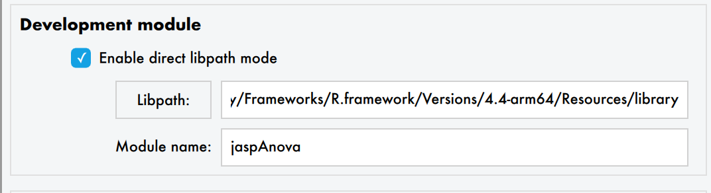
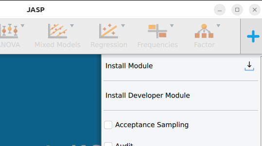
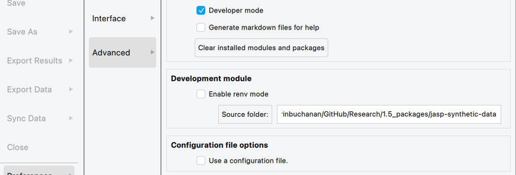
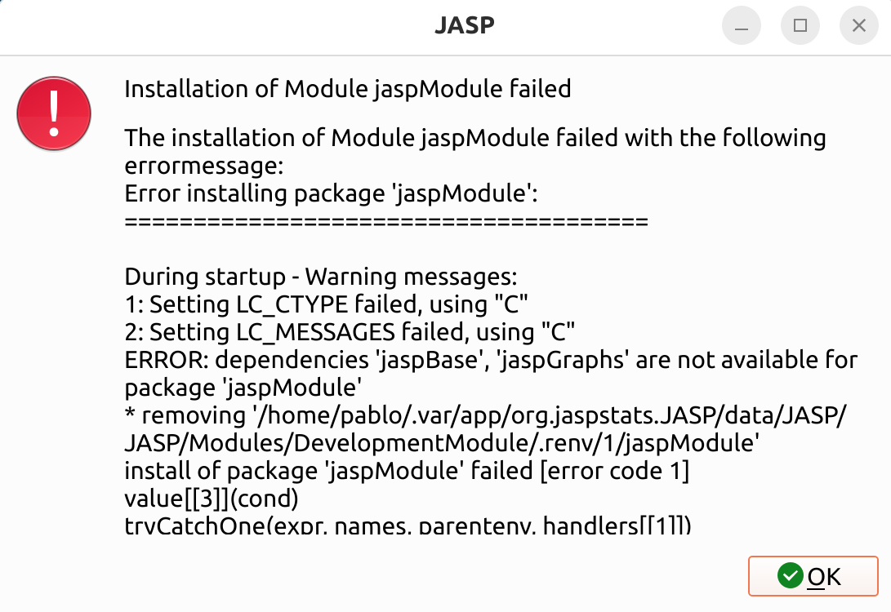

# Developing workflow in JASP for modules
So you want to develop a module for JASP? Great!

## Step 1. Install a latest version of JASP

### Windows & macOs
The easiest way to do so is downloading the latest [nightly for your system](http://static.jasp-stats.org/Nightlies/).

### Linux

0. Installing JASP in Linux requires flatpak. Please follow [this link](https://flatpak.org/setup/) if you haven't installed it yet.
1. Add the `flathub-beta` repository with: 

```sh
flatpak remote-add --if-not-exists flathub-beta https://flathub.org/beta-repo/flathub-beta.flatpakrepo
```

3. Install the latest jasp beta with:

```sh
flatpak install flathub-beta org.jaspstats.JASP
```

4. Open it in development mode:

```sh
flatpak run --branch=beta --devel org.jaspstats.JASP
```

> [!WARNING]
> JASP will remember from which branch it was launched.
> To go back to the "normal" jasp, run: 
> ```sh
> flatpak run --branch=stable org.jaspstats.JASP
> ```

#### Problems?
Some users experienced the following error:
```sh
error: runtime/org.kde.Sdk/x86_64/6.7 not installed
```
This can be fixed by manually installing the missing runtime:
```sh
flatpak install org.kde.Sdk
```
and choosing the appropriate version (`6.7` in this example).

### From source (advanced)
In case you want to go the hard way and compile JASP from source, please follow our JASP building guides:

- [For Windows](./jasp-build-guide-windows.md)
- [For macOS](./jasp-build-guide-macos.md)
- [For Linux](./jasp-build-guide-linux.md)

## Step 2. Develop your module
We recommend you to create a new module by forking [this template](https://github.com/jasp-stats/jaspModuleTemplate).
If you prefer, you can fork one of the existing modules in [jasp-stats](https://github.com/jasp-stats).

To start developing your own module you should first understand the [structure of a module](jasp-adding-module.md).
Initially you do not need to add any of the .qml, .R or icon files, but you should minimally have the `Description.qml`, `DESCRIPTION` and `NAMESPACE`.
Forking the aforementioned module template will make all of this for you.

In order to test your module while developing, you'll need to install it on JASP as a development module.
Below we show two alternative ways to do this.

### Precompile your module with renv (recommended)
The module installs as a regular R package, _i.e.:_,
```sh
R CMD INSTALL . --preclean --no-multiarch --with-keep.source <module name>
# If you use RStudio, this is equivalent to pressing `Build > Install` in the GUI.
```

#### Steps to add the module folder as a development module in JASP
1. Open JASP
2. Click on the menu in the top left corner
3. Navigate to 'Preferences'
4. Navigate to 'Advanced'
5. Place a checkmark before 'Developer mode'
6. Tick 'Enable renv mode'
7. Choose the libpath where you precompiled your module (not sure?, execute `.libPaths()` in R)
8. Fill in the module name.



9. Go back to JASP's main menu.
10. Click on the plus symbol in the top right corner
11. Click on Install Developer Module



### Using JASP to install the development module (deprecated)
An alternative way is to use R inside JASP to install your module, so basically letting JASP handle the install for you.
This is however error-prone and ignores any lockfile (which describes your dependencies) and so can fail at any time when a package does an update on CRAN.
This installation method is deprecated and not recommended.

1. Open JASP
2. Click on the menu in the top left corner
3. Navigate to 'Preferences'
4. Navigate to 'Advanced'
5. Place a checkmark before 'Developer mode'
6. Untick 'Enable renv mode'
7. Choose the path where the sources of your module are.



8. Go back to JASP's main menu.
9. Click on the plus symbol in the top right corner
10. Click on Install Developer Module

#### Problems?
If you are experiencing an error similar to the one below:



very likely GitHub is stopping you from cloning multiple repositories at the same time.

The fix is to configure a GitHub [Personal Access Token](https://docs.github.com/en/authentication/keeping-your-account-and-data-secure/managing-your-personal-access-tokens#creating-a-fine-grained-personal-access-token) (PAT). The only purpose is to identify yourself as a legit user, so a token with no permissions will suffice.

When you have it, go to `Preferences/Advanced`, untick `Use default PAT for Github` and paste your recently created token there. Don't forget to press `Enter` or `tab` to make sure the changes were saved!

### Developing the module
At this point you can start adding the various files the module requires. It is advisable to start with the .qml interface file before adding the analysis in R.

The advantage of installing the module with the non-renv install is that all changes you make from this point onwards are (almost) instantly reflected in JASP, this however requires JASP to handle the install, which can be brittle. The development module with renv support doesnt load changes automatically, so to see changes rebuild your module in Rstudio and click on the refresh symbol in the Modules list.
If you add a checkbox in your .qml file, this checkbox will also appear on the analysis input panel of your module. 
Similarly, if you change the title of your module in the .json file this will immediately change on the ribbon. 
As such JASP becomes a development tool, making it much easier to check your changes are correct as you make them. 
