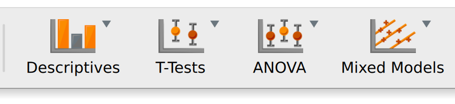
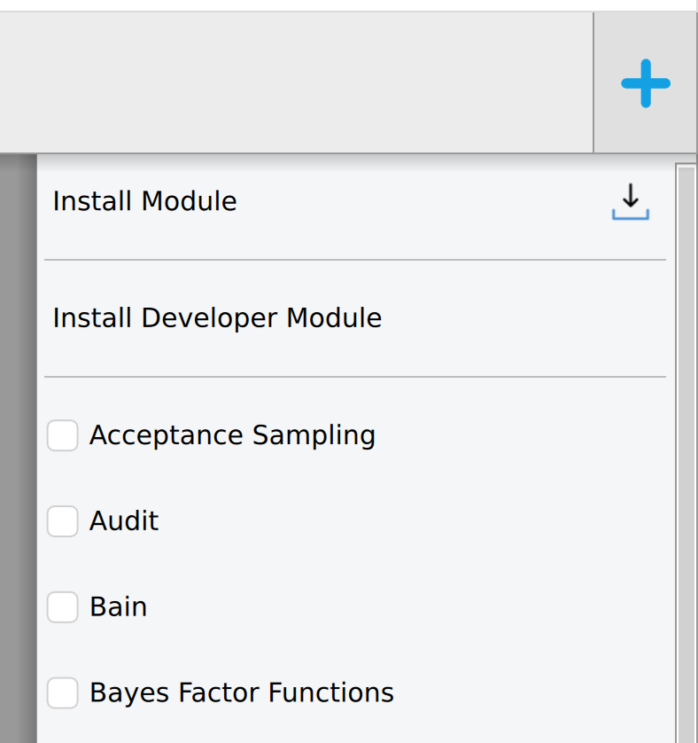
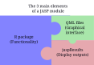

# Tutorial: Development of a JASP module

## 1. What is a JASP module?

A JASP module is an extension that adds new functionality to JASP.

Many of the modules are directly accessible in the upper ribbon of JASP (Note that many of them will not be clickable until **some** data has been introduced).



By pressing the `+` icon at the right-hand side of the screen, many more modules can be added to the ribbon.



This menu also allows you how to install a local module (via `Install Module`) and how to install a module you are working on right now (via `Install Developer Module`).

## 2. Who can write a module?

Anyone with basic R programming knowledge can write a JASP module.
Familiarity with R packaging and QML (for building the user interface) is helpful but not strictly required.

Basic knowledge of git and GitHub would also be necessary for contributing your module to our codebase.

If you think your expertise doesn't cover enough, please check our list of [curated background materials](jasp-background-materials.md).

## 3. How does a JASP module look internally?

Modules are structured as R packages with additional (QML) files for the graphical interface, help, and configuration.

Graphically, we can think of a JASP module as containing these 3 elements:



- The R functionality usually comes from importing an R package (from CRAN, bioconductor, ...) and adapting its functions to our needs.
- The graphical interface is built via the `qml` files in the `./inst/` folder.
- The results are displayed via a special R object called `jaspResults`, that lives in the `./R/` folder.

### Folder structure

The folder structure looks like this:

```sh
.
└── < An R package >
    └──inst
        ├── Description.qml     # Builds the ribbon menu
        ├──  qml                # Folder containing one or more...
        │   └── analysis_1.qml  # ... module's menus
        └── < optional stuff >

```

<details><summary>Click here for an even more detailed folder structure</summary>

```sh
.
├── <module_name>.Rproj
├── DESCRIPTION             # Describes the package and lists its dependencies
├── LICENSE
├── NAMESPACE               # Controls function importing
├── R                       # Where the package functions live
│   └── functions.R
│   └── more-functions.R
│   └── ...
├── README.md
├── renv.lock               # (Optional) Environment management...
├── _processedLockFile.lock # ...files, controlled by package renv
├── tests/                  # (Optional) Unit tests
│
│  # === So far, this is just a standard R package ===
│  # === Interaction with JASP starts below === 
│ 
└──inst
    ├── Description.qml     # Builds the ribbon menu
    ├── Upgrades.qml        # Optional
    ├──  qml                # Folder containing one or more...
    │   └── analysis_1.qml  # ... module's menus
    │   └── ...
    ├── help                # (Optional) Module's help files
    │   └── ...
    └── icons               # (Optional) Module's icons
        ├── <module_name>.svg
        └── ...
```

</details>

### An example

Below there's a screenshot of one of the submodules of `jaspModuleTemplate` (source available [here](https://github.com/jasp-stats/jaspModuleTemplate)), showing how the different elements of the graphical user interface are built:


- In blue: the menu generated by `./inst/Description.qml`.
- In red: the menu generated by `./inst/qml/Interface.qml` (where `Interface`) is the name of the chosen analysis.
- In green: the output, generated by `./R/examples.R` via the `jaspResults` package.


### How do the different moving parts work together?

So, we have a graphical user interface communicating back and forth with an R backend.
How does this work?

In order to help you learning these crucial mechanics, we created `jaspModuleTemplate`.
It serves simultaneously as a template and as a tacit tutorial.
You can find it [here](https://github.com/jasp-stats/jaspModuleTemplate); take a look at the readme!


## 4. How to install a developer JASP module

### 4.1 Compile your module
In order to install a JASP module, you'll need access to its source code.
For instance, by cloning or downloading the code from [our GitHub organization](https://github.com/orgs/jasp-stats/repositories), where we host a collection of modules.

After that, you install it as a regular R package.
The simplest way to do that is by running the code below in a shell console:

```sh
R CMD INSTALL < module path > --preclean --no-multiarch --with-keep.source < module name >
```

You can also use RStudio, `renv` or the tool of your preference.

Remember the location of your freshly installed module.
It will be shown as an output after the installation finishes.
**Tip**: consider setting it up manually to an easy-to-remember location, such as `~/code/jaspmodsdev/`.

### 4.2 Import to JASP
1. Open JASP.
2. Press the three parallel blue lines in the upper left corner.
3. Go to `Preferences > Advanced`.
4. Tick `Developer mode`.
5. At `Development module`, input the path where you installed your module (**Tip**: not sure where that is?, execute `.libPaths()` in R).
6. Input the module name (as it is listed in `DESCRIPTION`).

### 4.3 The development cycle

Developing a module involves a lot of trial and error.
Every time you change something in the source code, you'll need to do the following in order to see the changes in the JASP window:

1. Recompile the module (see step 4.1).
2. Refresh the module (from the JASP menu).
   - Press the `+` button at the upper right corner.
   - Find your module's name.
   - Press the blue refresh button.

As long as you didn't change JASP configuration, and the module is still being installed to the same folder, you won't need to reconfigure anything. Which is good, because that would be quite a tedious task!

## 5. Shall I write my own module?

Before jumping into typing code, take some time to think about your idea.
Ask yourself questions such as:

- How do I picture my module?
   - What value is it going to add on top of just R?
   - How are my menus going to look?
   - What outputs do I want?
   - Who are my potential users?
- Could it be that someone else already published a module like the one I have in mind?
   - Take a look at our collection of modules.
   - Contact and ask us!

Also keep in mind that, most of the time, JASP modules heavily rely on R packages.
If your idea involves a brand new analysis not yet existing in CRAN, consider writing a pure R package first. When it is ready, and only then, consider enriching it with a JASP interface.

## 6. How to write your own module?

Quick way:

1. Fork the [jaspModuleTemplate](https://github.com/jasp-stats/jaspModuleTemplate).
2. Clone it to your computer.
3. Modify it to your needs.

For a more in-depth approach, check-out these reference materials:

- [Detailed JASP module structure](/Docs/development/jasp-module-structure.md)
- [JASP QML guide](/Docs/development/jasp-qml-guide.md)
- [R Analyses guide](/Docs/development/r-analyses-guide.md) (or how to use `jaspResults`)

### How to submit your module to our online module library?
Send us message! Or make an issue [here](https://github.com/jasp-stats/jasp-issues/issues). 
We love to be in contact and help out!
More extensive documentation on the module submission and update process can be found [here](https://github.com/jasp-stats-modules/modules-registry/tree/main)


## 7. How to contribute to an existing module?

1. Push your changes to your fork.
2. Submit a Pull Request to the [jasp-stats](https://github.com/jasp-stats) organization.
   - Not sure how to do this? Just open an issue [here](https://github.com/jasp-stats/jasp-issues/issues), or drop us an [email](mailto:info@jasp-stats.org).
