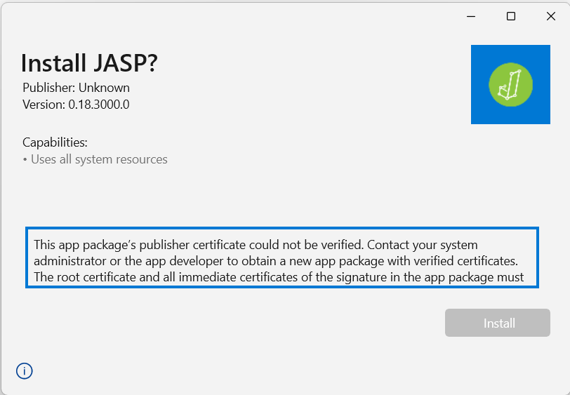
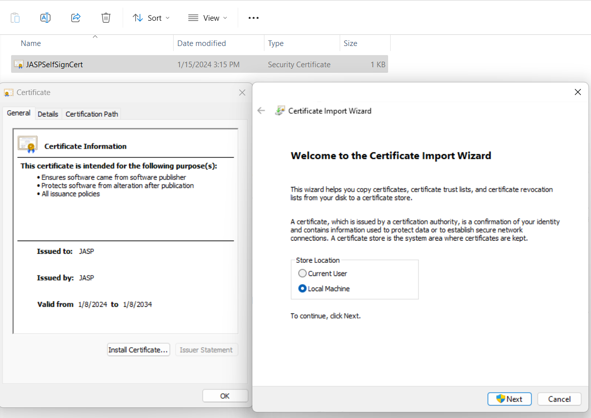
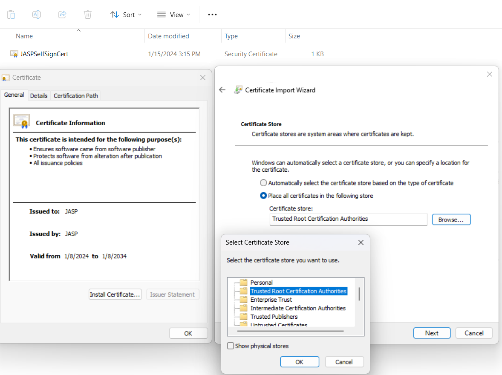

# MSIX Nightly Testing
When installing the JASP nightly you may encounter this error:

To resolve this you need to install the JASP certificate in the Trusted Root Certification Authorities of your local machine. 

Simple download the certificate [here](https://static.jasp-stats.org/JASPSelfSignCert.cer) and double click the file to install it like this:

