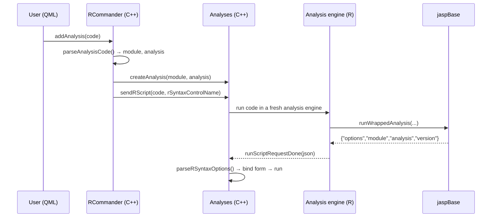

# R Commander — Batched (multiple) analyses

**Status:** Implemented (MVP) — this document reflects the current code
**Scope:** JASP Desktop, the "R in JASP" window (R Commander)
**Audience:** maintainers / module developers

---

## 1. Goals

Allow users of the R Commander ("R in JASP") to create **several analyses at once** from a
single piece of R code, instead of one at a time.

Concretely, today a user can paste

```r
jaspDescriptives::Descriptives(data = NULL, version = "0.96.5", formula = ~ contGamma)
```

and click **Add analysis** to get one analysis. We want them to be able to produce *many*
analyses from code that loops or maps over varying arguments, for example:

```r
batchAnalysis(
  jaspDescriptives::Descriptives,
  formula       = ~ contGamma,
  quantilesType = as.character(1:7)        # "1", "2", ..., "7"
)
```

and have a single click create **seven** `Descriptives` analyses.

### Non-goals

- This is **not** the existing "run a `.jasp` template against many data files" command-line
  batch feature (`Docs/user-guide/command-line-batch-howto.md`). That feature is JASP Pro,
  data-file oriented, and unrelated to R code.
- No change to the existing single-analysis "Add analysis" path (it must keep working).
  Note that **"Run code"** on a single wrapper call (e.g. `jaspDescriptives::Descriptives(...)`)
  now *does* create that analysis, because its return value is one analysis JSON string (see §4.1).
  Previously it only printed the JSON.
- No change to how analyses *run* internally — each analysis still runs in its own engine.

---

## 2. Example usage

`batchAnalysis()` takes a **function** as its first argument and **varying arguments**
after it. The same function supports two styles.

### Style A — pass the analysis wrapper directly

```r
batchAnalysis(
  jaspDescriptives::Descriptives,
  formula       = ~ contGamma,
  quantilesType = as.character(1:7)
)
```

Each argument is either length `1` (recycled to every call) or length `n` (expanded).
Here `formula` is length 1 and `quantilesType` is length 7, so this produces 7 analyses.

### Style B — pass a closure for elaborate setups

```r
batchAnalysis(
  function(qt) jaspDescriptives::Descriptives(formula = ~ contGamma, quantilesType = qt),
  qt = as.character(1:7)
)
```

This is the same function, just a different first argument. The closure receives the varying
arguments and may compute, branch, or call other modules.

### Style C — raw `lapply` (fallback, also accepted)

```r
lapply(c("contNormal", "contGamma"), \(var) {
  jaspDescriptives::Descriptives(data = NULL, version = "0.96.5",
                                 formula = as.formula(paste("~", var)))
})
```

Any code whose **return value** is a list of analysis JSON strings is accepted; `batchAnalysis()`
is sugar over exactly that, adding validation, titles, a failure summary, and a dry-run mode.

### Titles

```r
# template with {arg} interpolation (glue/cli style)
batchAnalysis(jaspDescriptives::Descriptives, formula = ~ contGamma,
              quantilesType = as.character(1:7),
              .override = list(title = "Descriptives ({quantilesType})"))

# function with full context: (index, resolved args, parsed analysis)
batchAnalysis(jaspDescriptives::Descriptives, formula = ~ contGamma,
              quantilesType = as.character(1:7),
              .override = list(title = function(i, args, a)
                paste0(a$analysis, " #", i)))
```

If no title is given and more than one analysis is produced, a title is **auto-generated** from
the varying arguments, e.g. `Descriptives: quantilesType=1`.

### Dry run

```r
batchAnalysis(jaspDescriptives::Descriptives, formula = ~ contGamma,
              quantilesType = as.character(1:7), .dryRun = TRUE)
```

Runs the loop and reports what *would* be added, without creating any analyses.

---

## 3. How it works today

The relevant flow for a *single* analysis is:



Key facts (verified in the code):

- Generated wrapper functions call `jaspBase::runWrappedAnalysis(...)`, which inside JASP
  (`jaspResultsCalledFromJasp() == TRUE`) returns
  `toJSON(list(options=…, module=…, analysis=…, version=…))`.
- The R Commander engine is a normal JASP engine, so it takes the same branch: each analysis
  call simply *returns* a JSON string. In "Run code" mode this string is printed, which is why
  `lapply` currently shows `[[1]] {json}` `[[2]] {json}` in the output window.
- `RCommander::parseAnalysisCode()` only recognizes a single leading `<module>::<analysis>(...)`
  call, so the **Add analysis** button is disabled for loops.
- `AnalysisForm::runScriptRequestDone(..., rSyntaxControlName)` is the existing entry point that
  takes one of those JSON objects and binds the form options (via `RSyntax::parseRSyntaxOptions`)
  and triggers the run.

The whole feature therefore reduces to: **get the R code's return value back to C++ as structured
JSON, then reuse the single-analysis option-binding path once per result.**

---

## 4. Implemented design

Two cooperating pieces, deliberately small:

1. **`jaspBase::batchAnalysis()`** — an exported R helper (validation, titles, error capture,
   dry run). Not required: raw `lapply` is accepted too.
2. **A marker in the R Commander engine output** — `jaspRCPP_evalRCodeCommander` wraps the
   serialized return value of every "Run code" evaluation in a marker; `RCommander` parses it out
   and creates the analyses. There is **no new engine request type, no new button, and no new
   signal** — "Run code" already does the work.

### 4.1 Transport contract (the marker)

`jaspRCPP_evalRCodeCommander` evaluates the code and appends, before the usual `print`
(the payload is computed before anything is printed, so warnings raised while normalizing end up
outside the marker):

```
@@@JASP_BATCH_RESULT@@@<json-array>@@@JASP_BATCH_RESULT_END@@@
```

`<json-array>` is produced by `jaspBase:::.normalizeBatchResult(val)`; each element is either:

```jsonc
// success
{ "module": "jaspDescriptives", "analysis": "Descriptives",
  "options": { /* r-syntax options */ }, "version": "0.96.5", "title": "…" /* optional */ }

// failure (excluded — failures are printed to the log instead)
```

Entries are serialized with `jsonlite::fromJSON(..., simplifyVector = FALSE)` (for
`batchAnalysis`) or passed through verbatim (for raw wrapper strings), so the options are exactly the
JSON that `runWrappedAnalysis` produced — no `["a"]` → `"a"` simplification.

Normalization rules (so all three styles produce the same shape):

| Return value of the code | Normalized to |
|---|---|
| `jaspBatchAnalysis` object | JSON array of its (success) elements |
| unclassed list of analysis JSON strings (`lapply`) | the strings, verbatim, as an array |
| character vector of analysis JSON strings (e.g. a single wrapper call) | the strings, verbatim, as an array |
| `NULL` / invisible (e.g. a `for` loop) | `[]` → nothing happens |
| anything else (data frames, model objects, other lists, ordinary strings) | `[]`, **without** serializing the value |

A list or character vector only counts as analyses if *every* element is a JSON object with
`module` and `analysis` fields; otherwise it is left alone, so ordinary "Run code" output is
unaffected and large values are never serialized.

`RCommander::rCodeReturnedLog` strips the marker from the displayed output, parses the array, and
creates one analysis per entry (applying `title` if present). Because options must be bound to a
form that is created asynchronously, each entry is applied via `Analysis::analysisInitialized()`.

### 4.2 Files changed

| File | Change |
|---|---|
| `Engine/jaspBase/R/batchAnalysis.R` *(new)* | `batchAnalysis()`, `jaspBatchAnalysis` class, `print.jaspBatchAnalysis`, validation, titles, dry run, failure summary, `.normalizeBatchResult()` |
| `Engine/jaspBase/NAMESPACE` | `export(batchAnalysis)` + `S3method(print,jaspBatchAnalysis)` |
| `R-Interface/jasprcpp.cpp` | `jaspRCPP_evalRCodeCommander` emits the result marker around `jaspBase:::.normalizeBatchResult(val)` |
| `Desktop/qquick/rcommander.h` | `Analysis` forward-declaration; `createAnalysesFromBatchJson()` / `applyBatchEntryToAnalysis()` |
| `Desktop/qquick/rcommander.cpp` | strips the marker, creates analyses, sets title, applies options on `analysisInitialized()` |

No changes to `Engine/engine.cpp`, `EngineRepresentation`, `rscriptstore.h`, the QML window, or
the analysis form.

---

## 5. `batchAnalysis()` API

```r
batchAnalysis(.fun, ..., .override = NULL, .dryRun = FALSE)
```

- `.fun`: the analysis wrapper (Style A) or a closure (Style B).
- `...`: named arguments, each of effective length `1` (recycled) or `n` (expanded).
- `.override`: a named list. Currently only `title` is used:
  - **absent** → auto-title from the varying arguments (`Analysis: var=value, …`), only when `n > 1`.
  - **character scalar** → a template with `{arg}` placeholders, interpolated per iteration.
  - **character length `n`** → one title per analysis.
  - **function** → `function(i, args, analysis)`, full control.
- `.dryRun`: run and report, but create nothing (the marker payload is `[]`).

Expansion / escape-hatch rules:

- `NULL` arguments (e.g. `data = NULL` from pasted syntax) are recycled as a scalar.
- A length-`n` vector is expanded; wrap in `list(...)` or `I(...)` to pass it as a single value.
- A formula (`~ x`) is a single value; vary formulas by passing `list(~a, ~b, ~c)`.

Return value: an object of class `c("jaspBatchAnalysis", "list")` containing only the successful
analyses; failures are printed to the log and excluded.

---

## 6. Argument-expansion ambiguity (the one trap)

`...` cannot distinguish "vector meant as one value" from "vector meant as many analyses":

```r
batchAnalysis(Descriptives,
              variables         = c("a", "b", "c"),        # 3 analyses
              percentileValues  = c(0.25, 0.5, 0.75))     # 1 analysis, 3 percentiles?!
```

Rule and escape hatch (same convention as `tidyr::expand_grid`):

- An argument of length `n` is **expanded**; length `1` is recycled.
- To force "single value", wrap in `list(...)` **or** `I(...)`:

```r
batchAnalysis(Descriptives,
              variables        = c("a", "b", "c"),
              percentileValues = list(c(0.25, 0.5, 0.75)))  # one analysis, three percentiles
```

A clear error is raised for mismatched lengths ("…wrap it in `list()` or `I()`…").

Formulas are a special case worth noting: `formula = ~ contGamma` is a length-1 object and is
recycled correctly. To *vary* a formula, build it per call with `as.formula(paste("~", var))`
inside a closure (Style B), which avoids formula-environment surprises.

---

## 7. Error handling

- Per-call errors are caught with `tryCatch`, printed to the log (`Error in analysis i: …`), and
  the successful calls are kept. A call whose return value is not an analysis (e.g. a Style B
  closure returning something else) counts as a failed call too.
- If the desktop cannot parse the marker payload, it prints "Could not read the analyses returned
  by the R code" instead of silently doing nothing.
- A **failure summary** is printed at the end: `Batch summary: 2 of 3 analyses succeeded, 1 failed.`
- Option-binding failures (e.g. pasted syntax version no longer matches the installed module) go
  through the existing `parseRSyntaxOptions()` → form-error path, per analysis.

---

## 8. End-to-end flow (implemented)

```mermaid
sequenceDiagram
    participant U as User (QML)
    participant R as RCommander (C++)
    participant E as Commander engine (R)
    participant B as jaspBase
    participant A as Analyses (C++)
    U->>R: click "Run code"
    R->>E: runScriptOnProcess(code) [returnLog]
    E->>B: eval code; cat marker + normalizeBatchResult(val) + print(val)
    E-->>R: log (contains marker)
    R->>R: strip marker → display log
    R->>A: for each entry: createAnalysis(module, analysis) + setTitle
    R->>A: runScriptRequestDone(options, rSyntaxControlName) on analysisInitialized
    R-->>U: "Added N analyses"
```

Notes:

- The loop runs **once**, in the commander engine, asynchronously; each created analysis then runs
  in its own engine.
- Options are applied through the existing `runScriptRequestDone(..., rSyntaxControlName)` path.

---

## 9. User experience

- **No new button.** "Run code" evaluates the code and, if its return value contains analyses,
  creates them. Failures appear in the output window.
- Feedback: the `print` method shows a summary (`<jaspBatchAnalysis> N analyses: …`), the failure
  summary line, and the desktop appends `Added N analyses`.
- Raw `lapply` users keep working; `batchAnalysis()` is the documented, discoverable helper.

---

## 10. Edge cases & risks

| Case | Behavior |
|---|---|
| Zero-length args / all `NULL` | `batchAnalysis` errors; raw `lapply` yields `[]` → no analyses |
| Mixed modules in one batch | Supported — each entry carries its own `module`/`analysis` |
| Module not loaded | Skip that entry with a message (as the single path already requires a loaded module) |
| Version mismatch in pasted syntax | Surfaced by `parseRSyntaxOptions` as a per-analysis form error |
| Re-entrancy / double-click | Guarded by the existing `_running` flag and engine `idle()` check |
| Non-ASCII column names | Reuse `ColumnEncoder::encodeAll/decodeAll` exactly as `runRCodeCommander` does |
| Engine crash mid-batch | Existing engine crash/restart path; partial results are reported |

---

## 11. Alternatives considered

1. **Parse the printed `[[1]]…[[2]]` text** — fragile (formatting, newlines, non-JSON around it).
   Rejected in favor of the structured return value.
2. **A collection hook inside `runWrappedAnalysis`** (a global flag that accumulates every call) —
   would also support `for` loops, but adds mutable global state and touches `runWrappedAnalysis`.
   Deferred; can be added later if `for`-loop support is wanted.
3. **Reuse RPC `analysis_create` / `analysis_run`** — `form->parseOptions` expects *control* names,
   not r-syntax names; wrong layer. The `runScriptRequestDone`/`parseRSyntaxOptions` path is correct.
4. **Require `batchAnalysis()` and reject raw `lapply`** — cleaner diagnostics, but a new API
   users must learn. Decided to accept both.

---

## 12. Deferred / future work

These were considered and **deliberately deferred**:

- **Hide particular output elements by name.** There is no generic per-result `hidden` flag today;
  the only built-in hide is the `"hide me"` title convention, and it applies to HTML/report nodes
  only (not tables/plots). Table/plot visibility is controlled by per-analysis *options*. Doing
  this generically needs a new hidden flag in `jaspObject` + the results viewer + a post-run walker
  that matches by shown title (case-insensitive). Discussed with the team; out of scope for now.
- **Notes.** Not exposed from `jaspBase`; notes live in the analysis's user data, set from the
  results view UI. No clean R-side hook, so skipped rather than adding new logic.
- **Progress bar for large batches.** `jaspBase::startProgressbar()/progressbarTick()` require a
  live `jaspResults`/analysis context that the commander engine does not have, so they are unsafe
  there. The loop and the creation step are fast; the heavy work (analysis runs) already has its
  own per-analysis progress bar.
- **Grouping into a results collection.** Results collections are not exposed in a way that makes
  this cheap; skipped for now.
- **`for`-loop support.** The return-value transport only sees what the code returns; a `for` loop
  returns `NULL`. Could be added later with a collection hook inside `runWrappedAnalysis`.

---

## 13. Decisions made

- Function/class name: `batchAnalysis` / `jaspBatchAnalysis`.
- Escape hatch: support **both** `list(...)` and `I(...)`.
- Failures: **separate log stream** (not in the JSON array); the remaining analyses are shown.
- No special button — the feature runs as ordinary R code via "Run code".
- Titles: a single `.override = list(title = ...)` named-list argument (default `NULL`), avoiding
  clashes with analysis option names.
