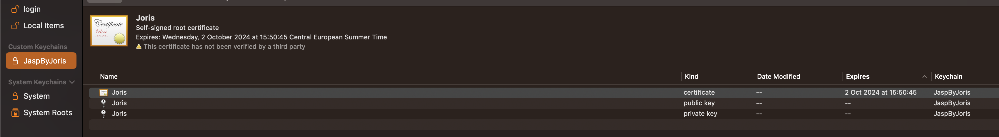
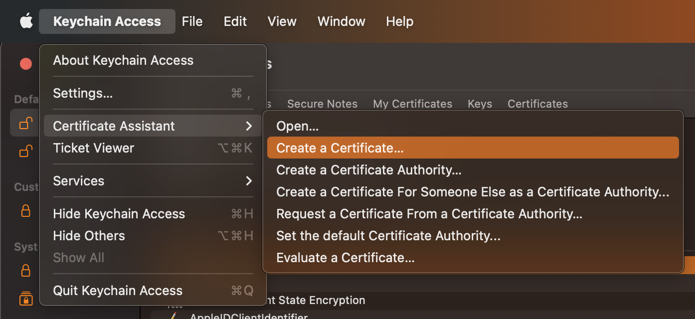
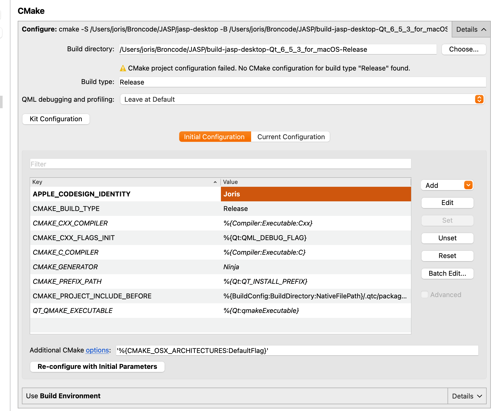

## Creating your own codesigning certificate

For any of the following steps you will need to have `Keychain access.app` opened, you can easily do so by using "Command+Space" and typing the name.

### Separate keychain
To keeps things organized I suggest creating a separate keychain for your certificate.
You can create one by rightclicking somewhere in the list of keychains on the lefthandside of the application.
It is not necessary to have a password, but you have to insist a bit, because macOs will refuse the first time.

I created one called "JaspByJoris" and this is what it looks like with the certificate already in it:

### Certificate Assistant
Now we will actually create the certificate.
First select you above created keychain and then choose "Certificate assistant -> Create a certificate" from the mainmenu.

Make sure to specify the key is for  "Code Signing" and create it.

### Using it in JASP
To sure this in JASP be sure to start from an empty buildfolder, this to avoid any previous codesigning failures that might prevent R from running.
Then set the `LOCAL_CODESIGN_IDENTITY` in your environment somewhere, somehow.

My suggestion is using the "Project Settings: Environment" tab under "Projects" in qtcreator:

This will make sure the correct certificate is used during building, but it will also disable hardened runtime because that breaks the build with this kind of certificate