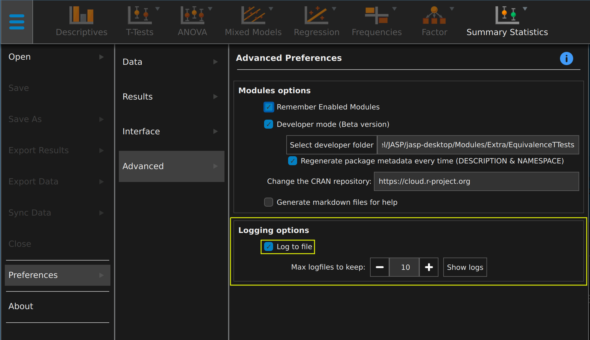
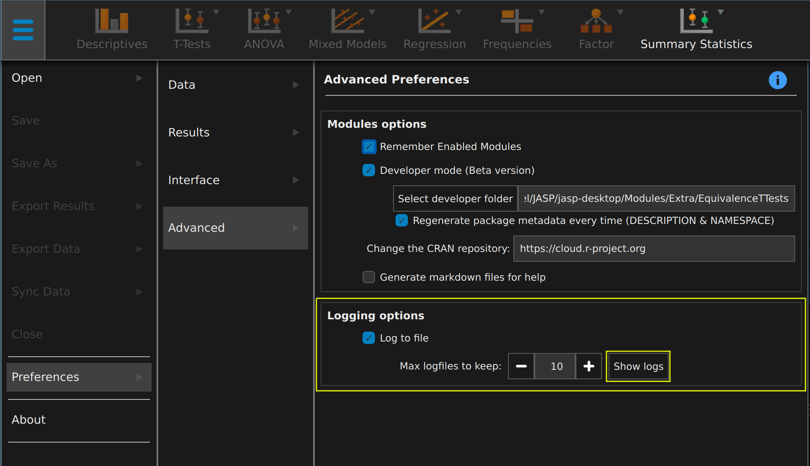

# Logging

This guide explains how to turn logging in JASP on, off and where to find them.


## Rationale

JASP is not normally logging what a user does and we certainly never send this information anywhere.
What happens in JASP stays in JASP.

However, we do sometimes need this information to solve a problem, bug or something similar.
Usually because someone has opened a bugreport in our [issue tracker](https://github.com/jasp-stats/jasp-issues/issues).
In that case it is quite helpful to be able to see what JASP was doing when it crashed.

## Turning logging on or off

To enable logging you should open the file menu (the blue hamburger button left top) and navigated to Advanced Preferences:


From the moment you turn logging on JASP start writing logfiles, but of course that means any bug that happened before will not be in the logs yet.

It shouldn't really be a problem to leave logging turned on, if you have "max logfiles to keep" at a low number (such as the default) JASP will remove superfluous logfiles whenever it starts.

## Finding the logfiles

When JASP runs well enough to allow you to navigate to the preferences getting to the logfiles is easy, just click the button:


The logfiles are written as a set of textfiles with names formatted as: `JASP YEAR-MONTH-DAY HOUR_MINUTE_SEC Desktop/Engine#.log`, which looks like:
```
JASP 2020-11-24 10_48_37 Desktop.log
JASP 2020-11-24 10_48_37 Engine 0.log
JASP 2020-11-24 10_48_37 Engine 1.log
```
The date and time is when JASP started exactly and it can be used to collect all the logfiles belonging together. 
So if you want to send us all of the files for one JASP run you should collect all of the ones that start with the same date/time.
That would usually be at least a single one `Desktop` and several `Engine #`.

## JASP won't open at all

Sadly enough, sometimes a problem occurs that blocks JASP from even showing it's face.
If you've previously enabled logging then you can find the logfiles as described [a bit further down](#logs-location).
Otherwise it is a bit more elaborate and quite platform-specific.

### Windows

On windows one should open a "Command Prompt", which can be done easily from the start menu and simply typing that.
After that it depends on where JASP is installed but, unless you installed to a custom directory, should be one of the following:
- `C:\Program Files\JASP`
- `C:\Program Files (x86)\JASP`

Let's assume it is the first, then in the opened command prompt enter:
```bat
cd "C:\Program Files\JASP"
JASP --logToFile 1> "%USERPROFILE%\AppData\Roaming\JASP\JASP\Logs\startup.log" 2>&1
```

In fact, just entering `JASP --logToFile` instead of the last command would be enough to enable logging, but sometimes when JASP won't start properly it does not even reach a stage where it can start logging to file. So we humbly request Windows to save those few lines of output somewhere by adding ` 1> ...\startup.log 2>&1` and it should make sure you can find that file (`startup.log`) in the logsfolder. When you are collecting the logfiles as described under [finding the logfiles](#finding-the-logfiles) you shouldn't forget to add that of course.

Presumably you still do not see a JASP window opening now, so you'll have to [navigate manually to the logfiles](#logs-location).

### Mac

On Mac one should open a terminal from `Applications -> Utilities -> Terminal` in the finder.
Then if you've installed JASP without changing it's name you should be able to start it as follows:

```bash
cd /Applications/JASP.app/Contents/MacOS/
./JASP --logToFile
```

You will also see some lines of output there in the terminal, these might be useful to a developer in case JASP doesn't even reach a state in which it can start logging.
Presumably you still do not see a JASP window opening now, so you'll have to [navigate manually to the logfiles](#logs-location).

### Linux

On Linux one should open their favorite (or any) terminal and run jasp as `flatpak run org.jaspstats.JASP --logToFile`.

You will also see some lines of output there in the terminal, these might be useful to a developer in case JASP doesn't even reach a state in which it can start logging.

Presumably you still do not see a JASP window opening now, so you'll have to [navigate manually to the logfiles](#logs-location).

## Logs location

### Windows
The logfiles should be found under `%USERPROFILE%\AppData\Roaming\JASP\JASP\Logs` and to go there you can simply paste that line into the addressbar of explorer.

### Mac
The logfiles can be found under `~/Library/Application\ Support/JASP/JASP/Logs/` and to go there you can choose "Go to folder" under "Go" in Finder and paste this path there.

### Linux
The logfiles can be found under `~/.var/app/org.jaspstats.JASP/data/JASP/JASP/Logs`.