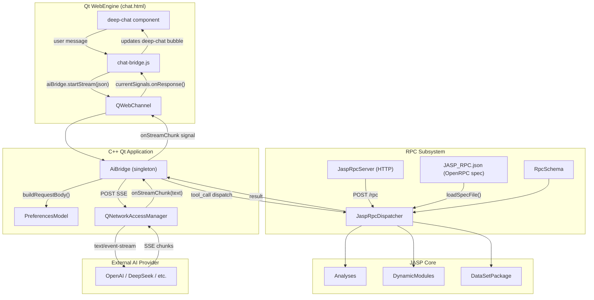
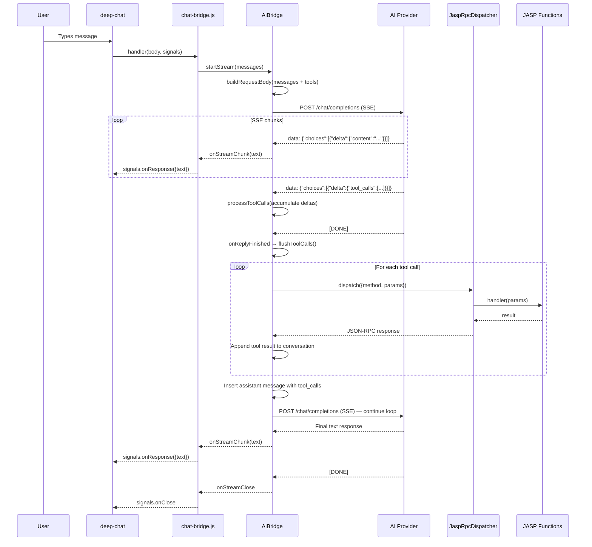

# JASP AI, RPC & Chat Framework — Deep Technical Reference

> **Covers**: AiBridge, JaspRpcServer, JaspRpcDispatcher, RpcSchema, deep-chat UI,  
> OpenRPC spec, tool-calling loop, SSE streaming, QWebChannel bridge,  
> and all 13 registered RPC methods with their full schemas.

---

## Table of Contents

1. [Architecture Overview](#1-architecture-overview)
2. [AiBridge — AI Chat Backend](#2-aibridge----ai-chat-backend)
3. [Deep Chat — Frontend UI Framework](#3-deep-chat----frontend-ui-framework)
4. [chat-bridge.js — QWebChannel Glue](#4-chat-bridgejs----qwebchannel-glue)
5. [JaspRpcDispatcher — JSON-RPC 2.0 Hub](#5-jasprpcdispatcher----json-rpc-20-hub)
6. [JaspRpcServer — HTTP Transport](#6-jasprpcserver----http-transport)
7. [RpcSchema — OpenRPC Schema Types](#7-rpcschema----openrpc-schema-types)
8. [OpenRPC Specification (JASP_RPC.json)](#8-openrpc-specification-jasp_rpcjson)
9. [All 13 Registered RPC Methods](#9-all-13-registered-rpc-methods)
10. [Tool-Calling Loop (AI ↔ JASP)](#10-tool-calling-loop-ai--jasp)
11. [SSE Streaming Protocol](#11-sse-streaming-protocol)
12. [Configuration & Preferences](#12-configuration--preferences)
13. [Key Implementation Details](#13-key-implementation-details)

---

## 1. Architecture Overview



### Data Flow Summary

1. **User types message** → deep-chat captures it
2. **chat-bridge.js** receives from deep-chat's `connect.handler` callback
3. **chat-bridge.js** calls `aiBridge.startStream(JSON.stringify(messages))` via QWebChannel
4. **AiBridge** builds OpenAI-compatible request body with system prompt, tools, conversation history
5. **AiBridge** POSTs to configured endpoint with `Accept: text/event-stream`
6. **SSE chunks** arrive → `onReadyRead()` → `processSSELine()` → `processSSEData()`
7. **Text chunks** emitted as `onStreamChunk(text)` signal → QWebChannel → chat-bridge.js → deep-chat bubble
8. **Tool calls** accumulated in `m_toolCallAccum`, then dispatched through `JaspRpcDispatcher`
9. **Tool results** appended to conversation, loop continues with `sendToAI(m_conversation)`

---

## 2. AiBridge — AI Chat Backend

### File Locations

- Header: `Desktop/engine/aiBridge.h`
- Implementation: `Desktop/engine/aiBridge.cpp`

### Class Definition

```cpp
class AiBridge : public QObject
{
    Q_OBJECT

public:
    explicit AiBridge(QObject *parent = nullptr);
    ~AiBridge() override;
    static AiBridge * singleton() { return _singleton; }

    // Configuration — reads PreferencesModel directly at request time
    QString endpoint() const;    // PreferencesModel::aiEndpoint()
    QString authToken() const;   // SecretStore::read("aiApiKey", Settings::AI_API_KEY)
    QString model() const;       // PreferencesModel::aiModel()

    // Q_INVOKABLE — callable from JavaScript via QWebChannel
    Q_INVOKABLE void startStream(const QString &messagesJson);
    Q_INVOKABLE void stopStream();
    Q_INVOKABLE void clearConversation();
    Q_INVOKABLE void clearChat();
    Q_INVOKABLE QString conversationStats() const;
    Q_INVOKABLE void setDebugDumpEnabled(bool enabled);
    Q_INVOKABLE void testConnection();
    Q_INVOKABLE void setSystemMessage(const QString &text);
    Q_INVOKABLE void setExtraParams(const QString &json);

signals:
    void onStreamOpen();
    void onStreamClose();
    void onStreamChunk(const QString &text);
    void onStreamError(const QString &error);
    void onClearChat();
    void testConnectionResult(bool success, const QString &message);

private slots:
    void onReadyRead();
    void onReplyFinished();
    void onReplyError(QNetworkReply::NetworkError error);

private:
    void sendToAI(const QJsonArray &messages);
    void processSSELine(const QByteArray &line);
    void processSSEData(const QString &eventType, const QByteArray &data);
    void processToolCalls(const QJsonArray &toolCalls);
    void flushToolCalls();
    void continueWithToolResults(const QJsonArray &toolResults);
    QByteArray buildRequestBody(const QJsonArray &messages);
    void emitError(const QString &message);
    static QString networkErrorToString(QNetworkReply::NetworkError, QNetworkReply * = nullptr);
    static int estimateTokens(const QString &);
    static int estimateTokens(const QJsonObject &);
    static int estimateTokens(const QJsonArray &);
    static int estimateTokens(const QJsonValue &);
    void logConversationStats(const char *context) const;
    void logToolCall(const QJsonObject &toolCall, const QString &resultText) const;

    // Members
    QNetworkAccessManager *m_networkManager = nullptr;
    QNetworkReply *m_activeReply = nullptr;
    QByteArray m_sseBuffer;
    QJsonArray m_conversation;           // Full conversation history
    QJsonArray m_pendingToolCalls;       // Tool calls from last stream
    int m_totalRequestsSent = 0;
    int m_totalToolCallsDispatched = 0;
    int m_totalStreamChunks = 0;
    int m_totalInputTokens = 0;
    int m_totalOutputTokens = 0;
    QMap<int, QJsonObject> m_toolCallAccum;  // Accumulates streaming tool call deltas
    QJsonObject m_assistantDelta;        // Accumulates assistant text delta
    bool m_debugDumpEnabled = true;
    bool m_streaming = false;
    static AiBridge *_singleton;
};
```

### Key Methods

#### `startStream(const QString &messagesJson)`

Called from JavaScript when the user sends a message. Flow:

1. **Re-entrancy guard**: Checks `JaspRpcDispatcher::inFlight()` — rejects if a tool call is executing
2. **Validates endpoint**: Checks `endpoint()` is configured
3. **Stops any active stream**: If `m_streaming` is true, calls `stopStream()`
4. **Parses JSON**: Expects a JSON array of message objects
5. **Appends to conversation**: `m_conversation.append(v)` for each message
6. **Clears accumulators**: `m_assistantDelta`, `m_toolCallAccum`
7. **Estimates tokens**: Logs conversation size
8. **Emits `onStreamOpen()`**: Signals frontend
9. **Calls `sendToAI(m_conversation)`**: Initiates HTTP request

#### `buildRequestBody(const QJsonArray &messages)`

Constructs the OpenAI-compatible JSON request body:

```json
{
    "model": "<from PreferencesModel>",
    "stream": true,
    "messages": [
        {"role": "system", "content": "<system prompt>"},
        {"role": "system", "content": "Available tools:\n[{...full tool definitions...}]"},
        ...conversation messages (with "text" → "content" normalization)...
    ],
    "tools": [
        {"type": "function", "function": {"name": "analysis_create"}},
        {"type": "function", "function": {"name": "analysis_run"}},
        ...
    ],
    ...extra params from PreferencesModel::aiExtraParams()...
}
```

Key behaviors:
- **System prompt**: From `PreferencesModel::aiSystemPrompt()`
- **Tool definitions**: Built from `JaspRpcDispatcher::knownSpecNames()` — each spec becomes a tool
- **Compact vs full schema**: When `aiUseCompleteSchema` is true, full JSON schemas go in `tools` array; otherwise, full definitions go as a system message and `tools` gets name-only stubs
- **Message normalization**: deep-chat uses `"text"` key; AI APIs use `"content"` — `buildRequestBody` converts
- **Per-message extras**: `aiMessageExtra` JSON is merged into every message (e.g., Anthropic `cache_control`)
- **Body extras**: `aiExtraParams` JSON is merged into the top-level body (e.g., `max_tokens`, `thinking`)

#### `sendToAI(const QJsonArray &messages)`

Sends the HTTP POST:

1. Builds `QNetworkRequest` with:
   - `Content-Type: application/json`
   - `Accept: text/event-stream`
   - `Transfer-Timeout: 120000` (2 minutes)
   - `Authorization: Bearer <token>` (if configured)
2. Calls `buildRequestBody(messages)`
3. In developer mode, dumps request to `<tempDir>/ai-request.json`
4. Logs token estimates
5. Posts via `m_networkManager->post(request, body)`
6. Connects `readyRead`, `finished`, `errorOccurred` signals

#### `onReadyRead()`

Handles incoming SSE data:

1. Reads all available bytes from `m_activeReply`
2. Checks HTTP status (rejects 4xx/5xx)
3. Appends to `m_sseBuffer`
4. Splits on `\n`, calls `processSSELine()` for each line

#### `processSSELine(const QByteArray &line)`

Parses SSE format:

```
event: <eventType>
data: <json>
```

- Extracts `event:` and `data:` fields
- Calls `processSSEData(eventType, data)`

#### `processSSEData(const QString &eventType, const QByteArray &data)`

Processes a single SSE data event:

1. Parses JSON
2. Checks for `"error"` object → emits `onStreamError`
3. Extracts `choices[0].delta`
4. If delta contains `"tool_calls"` → calls `processToolCalls()`
5. Otherwise, merges delta fields into `m_assistantDelta`:
   - String fields concatenated (streaming fragments)
   - Non-string fields overwritten
   - `"content"` chunks emitted as `onStreamChunk(text)`

#### `processToolCalls(const QJsonArray &toolCalls)`

Accumulates streaming tool call deltas:

- Each delta has `index`, `id`, `function.name`, `function.arguments`
- Arguments are concatenated across fragments (they stream in pieces)
- Handles providers that omit `index` (Gemini) by matching on `id`
- Stores in `m_toolCallAccum[idx]`

#### `flushToolCalls()`

Called when the stream ends with pending tool calls:

For each accumulated tool call:
1. Normalizes arguments (empty → `"{}"`)
2. Extracts `functionName`
3. Builds JSON-RPC request: `{"jsonrpc":"2.0","method":"<functionName>","params":<arguments>}`
4. Dispatches through `JaspRpcDispatcher::dispatch(requestJson)`
5. Extracts result or error
6. Increments `m_totalToolCallsDispatched`
7. Builds `tool` role message with `tool_call_id` and result content
8. Appends to `m_conversation`
9. Builds assistant message with `tool_calls` array, inserts before tool results

#### `onReplyFinished()`

Called when the HTTP response is complete:

1. Processes any remaining SSE data in buffer
2. Calls `flushToolCalls()`
3. If `m_pendingToolCalls` is not empty:
   - Sets `m_streaming = true`
   - Emits `onStreamOpen()`
   - Calls `sendToAI(m_conversation)` — **continues the tool-call loop**
4. Otherwise, saves assistant response to conversation history, emits `onStreamClose()`

#### `testConnection()`

Sends a minimal request to verify the endpoint works:

- Body: `{"model":"gpt-3.5-turbo","stream":false,"max_tokens":1,"messages":[{"role":"user","content":"Hi"}]}`
- Reports success/failure via `testConnectionResult(bool, QString)` signal
- 10-second timeout

#### Token Estimation

```cpp
int AiBridge::estimateTokens(const QString &text) {
    return text.length() / 4;  // ~1 token per 4 chars for English
}
```

Also overloads for `QJsonObject`, `QJsonArray`, `QJsonValue` that recursively estimate.

---

## 3. Deep Chat — Frontend UI Framework

### What is deep-chat?

[Deep Chat](https://github.com/ovidijusparsiunas/deep-chat) is a fully customizable AI chatbot web component. It's a framework-agnostic HTML custom element (`<deep-chat>`) that provides:

- Message bubbles (user and AI)
- Text input with submit button
- Streaming support (SSE and ReadableStream)
- Markdown rendering
- File attachments
- Custom buttons
- Avatars
- Theming via CSS and JSON attributes
- Connect handler for custom backends

JASP bundles it as `Desktop/html/js/deepChat.bundle.js` (404 KB).

### How JASP Uses deep-chat

The chat UI lives in `Desktop/html/chat.html`. It's loaded in a `QWebEngineView` (or `QQuickWebEngineView`) inside a `QWindow` managed by `MainWindow`.

#### `chat.html` Structure

```html
<!doctype html>
<html>
<head>
    <script src="js/qwebchannel.js"></script>      <!-- Qt WebChannel -->
    <script src="js/deepChat.bundle.js"></script>   <!-- deep-chat component -->
    <script src="js/chat-bridge.js"></script>        <!-- JASP bridge -->
</head>
<body>
    <deep-chat
        style="border-radius: 10px"
        auxiliaryStyle="/* markdown table styles */"
        errorMessages='{"displayServiceErrorMessages": true}'
        messageStyles='{...}'           <!-- Bubble styling -->
        avatars='{"default": {"styles": {"position": "start"}}}'
        submitButtonStyles='{...}'      <!-- Send/stop button styling -->
        textInput='{"placeholder": {"text": "Ask anything..."}}'
        introMessage='{"text": "Hello! I am JASP AI, your statistical assistant."}'
        customButtons='[...]'           <!-- Clear conversation button -->
    ></deep-chat>
</body>
</html>
```

#### Key deep-chat Attributes Used

| Attribute | Purpose |
|-----------|---------|
| `messageStyles` | Configures bubble appearance — user messages black text, AI messages with light background and borders |
| `submitButtonStyles` | Custom send button (green arrow), loading spinner, stop button (square) |
| `textInput` | Placeholder text "Ask anything..." |
| `introMessage` | Welcome message "Hello! I am JASP AI, your statistical assistant." |
| `customButtons` | Clear conversation button (trash icon) positioned outside-start |
| `auxiliaryStyle` | CSS for markdown tables (fit within chat, no overflow) |
| `errorMessages` | `{"displayServiceErrorMessages": true}` |
| `avatars` | Default avatar positioning |

#### deep-chat Connect Handler

The key integration point. In `chat-bridge.js`:

```javascript
chat.connect = {
    stream: true,
    handler: function (body, signals) {
        // body.messages = [{role: "user", text: "Hello"}, ...]
        // signals = {onOpen, onResponse, onClose, stopClicked}
        
        currentSignals = signals;
        
        signals.stopClicked.listener = function () {
            aiBridge.stopStream();
        };
        
        aiBridge.startStream(JSON.stringify(body.messages));
    }
};
```

When `stream: true`, deep-chat:
1. Calls `handler(body, signals)` when user sends a message
2. Expects `signals.onOpen()` to create the AI message bubble
3. Expects `signals.onResponse({text: "..."})` to append text to the bubble
4. Expects `signals.onClose()` to finalize the message
5. If `signals.onResponse({error: "..."})` is called, shows an error

#### Message Format

deep-chat sends messages as:
```json
{
    "messages": [
        {"role": "user", "text": "Hello"},
        {"role": "ai", "text": "Hi there!"}
    ]
}
```

AiBridge normalizes `"text"` → `"content"` in `buildRequestBody()`.

---

## 4. chat-bridge.js — QWebChannel Glue

### File: `Desktop/html/js/chat-bridge.js`

This file bridges the deep-chat web component to the C++ `AiBridge` singleton via Qt's `QWebChannel`.

### Initialization

```javascript
document.addEventListener("DOMContentLoaded", function () {
    // IMPORTANT: use window.qt, not bare qt — deepChat.bundle.js declares
    // `const qt="Authorization header"` at top level, which creates a global
    // lexical binding that shadows the Qt-injected window.qt transport object.
    
    if (typeof window.qt !== "undefined" && window.qt.webChannelTransport) {
        new QWebChannel(window.qt.webChannelTransport, function (channel) {
            aiBridge = channel.objects.aiBridge;
            // Connect signals...
            setupDeepChat();
        });
    }
});
```

**Important note**: The code uses `window.qt` instead of bare `qt` because `deepChat.bundle.js` declares `const qt="Authorization header"` at the top level, which shadows the Qt-injected transport object.

### Signal Connections

| AiBridge Signal | Handler | Action |
|----------------|---------|--------|
| `onStreamOpen` | `currentSignals.onOpen()` | Creates AI message bubble in deep-chat |
| `onStreamChunk(text)` | `currentSignals.onResponse({text: text})` | Appends text to bubble |
| `onStreamClose` | `currentSignals.onClose()` | Finalizes message |
| `onStreamError(msg)` | `onOpen()` + `onResponse({text: msg})` + `onClose()` | Shows error in bubble |
| `onClearChat` | `chat.clearMessages()` | Clears deep-chat UI |

### Tool-Call Loop Handling

When a stream ends with tool calls, `onReplyFinished()` in C++ re-emits `onStreamOpen()` to start a new stream. The JS side handles this gracefully:

```javascript
aiBridge.onStreamOpen.connect(function () {
    if (currentSignals) {
        currentSignals.onOpen();
        if (streamHasContent) currentSignals._needNewline = true;
    }
});

aiBridge.onStreamChunk.connect(function (text) {
    if (currentSignals) {
        if (currentSignals._needNewline) {
            currentSignals._needNewline = false;
            text = "\n" + text;
        }
        currentSignals.onResponse({text: text});
    }
    streamHasContent = true;
});
```

This ensures that when the AI calls tools and then continues generating, the continuation appears in the same message bubble with a newline separator.

### Clear Conversation Button

```javascript
if (chat.customButtons && chat.customButtons[0]) {
    chat.customButtons[0].onClick = function (state) {
        if (aiBridge) aiBridge.clearChat();
        return "default";
    };
}
```

The trash icon button calls `aiBridge.clearChat()` which stops any active stream, clears conversation history, and emits `onClearChat` to clear the UI.

---

## 5. JaspRpcDispatcher — JSON-RPC 2.0 Hub

### File Locations

- Header: `Desktop/rpc/jasprpcdispatcher.h`
- Implementation: `Desktop/rpc/jasprpcdispatcher.cpp`

### Class Definition

```cpp
using RpcHandler = std::function<Json::Value(const Json::Value& params)>;

class JaspRpcDispatcher
{
public:
    JaspRpcDispatcher();
    ~JaspRpcDispatcher();
    static JaspRpcDispatcher* singleton() { return _singleton; }

    // Registration — low level (no automatic validation)
    bool registerMethod(const std::string& method, RpcHandler handler);

    // Registration — flat param spec
    bool registerMethod(const std::string& method,
                        std::vector<RpcParamSpec> paramSpec,
                        RpcHandler handler);

    // Registration — full OpenRPC method spec
    bool registerMethod(const RpcMethodSpec& spec, RpcHandler handler);

    // Convenience: parse specJson then register
    bool registerMethodFromSpec(const std::string& specJson, RpcHandler handler);

    // Look up spec by name from pre-loaded registry, register handler
    bool registerMethodByName(const std::string& methodName, RpcHandler handler);

    // Spec loading
    int loadSpecFromString(const std::string& openRpcJson);
    int loadSpecFile(const std::string& path);
    std::vector<std::string> knownSpecNames() const;

    // Unregistration / introspection
    void unregisterMethod(const std::string& method);
    std::vector<std::string> registeredMethods() const;
    const RpcMethodSpec* getSpec(const std::string& method) const;

    // Dispatch
    std::string dispatch(const std::string& requestJson);
    Json::Value dispatch(const Json::Value& request);

    // Re-entrancy
    bool inFlight() const { return m_inFlight; }

    // Nested event loop helper
    static void waitAndProcessEvents(int timeoutMs,
        std::function<void(QEventLoop& loop, QTimer& timer)> setup);

    // Static helpers
    static Json::Value successResult();                        // {"status":"success"}
    static Json::Value errorResult(const std::string& message); // {"status":"error","message":"..."}
    static Json::Value validateParams(const Json::Value&, const std::vector<RpcParamSpec>&);
    static Json::Value validateSchema(const Json::Value&, const RpcSchema&);
    static Json::Value validateResult(const Json::Value&, const RpcResultSpec&);
    static Json::Value applyDefaults(const Json::Value&, const std::vector<RpcParamSpec>&);

private:
    void registerBuiltins();
    static Json::Value makeError(int code, const std::string& message, const Json::Value& id);
    static Json::Value makeResponse(const Json::Value& result, const Json::Value& id);

    static JaspRpcDispatcher* _singleton;
    bool m_inFlight = false;
    std::unordered_map<std::string, RpcHandler> _handlers;
    std::unordered_map<std::string, RpcMethodSpec> _specs;
};
```

### Constructor

```cpp
JaspRpcDispatcher::JaspRpcDispatcher()
{
    assert(!_singleton);
    _singleton = this;

    // Auto-load the OpenRPC spec file from Resources
    std::string specPath = Dirs::resourcesDir() + "JASP_RPC.json";
    int n = loadSpecFile(specPath);
    if (n > 0)
        Log::log() << "[JaspRpcDispatcher] Loaded " << n
                  << " method specs from " << specPath << std::endl;

    registerBuiltins();
}
```

### Registration Pipeline

When `registerMethod(const RpcMethodSpec& spec, RpcHandler handler)` is called, the handler is wrapped with a 4-step pipeline:

```cpp
auto wrapped = [handler, spec](const Json::Value& params) -> Json::Value
{
    // 1. Validate incoming params against declared schemas
    Json::Value err = validateParams(params, spec.params);
    if (!err.isNull()) return err;

    // 2. Apply declared default values for missing optional params
    Json::Value safeParams = applyDefaults(params, spec.params);

    // 3. Call the handler with validated, defaulted params
    Json::Value result = handler(safeParams);

    // 4. Validate the handler's return value against result.schema
    if (!(result.isMember("status") && result["status"] == "error"))
    {
        err = validateResult(result, spec.result);
        if (!err.isNull()) return err;
    }

    return result;
};
```

### Dispatch Flow

```cpp
Json::Value JaspRpcDispatcher::dispatch(const Json::Value& request)
{
    Json::Value id = request.get("id", Json::nullValue);

    // Re-entrancy guard
    if (m_inFlight)
        return makeError(-32000, "Procedure call already in flight", id);

    // JSON-RPC 2.0: "method" is required
    if (!request.isMember("method") || !request["method"].isString())
        return makeError(-32600, "Invalid Request: missing 'method'", id);

    std::string method = request["method"].asString();
    auto it = _handlers.find(method);
    if (it == _handlers.end())
        return makeError(-32601, "Method not found: '" + method + "'", id);

    Json::Value params = request.get("params", Json::objectValue);

    m_inFlight = true;
    try {
        Json::Value result = it->second(params);
        m_inFlight = false;

        if (result.isObject() && result.isMember("code") && result.isMember("message"))
            return makeError(result["code"].asInt(), result["message"].asString(), id);

        return makeResponse(result, id);
    }
    catch (const std::exception& e) {
        m_inFlight = false;
        return makeError(-32603, std::string("Internal error: ") + e.what(), id);
    }
}
```

### Re-entrancy Guard

The `m_inFlight` flag prevents concurrent dispatches. This is critical because:

1. **AiBridge tool calls**: When the AI calls a tool, `flushToolCalls()` dispatches through the same dispatcher. If a handler uses `waitAndProcessEvents()` (blocking wait), a second dispatch would corrupt state.
2. **HTTP server**: The `JaspRpcServer` runs on the Qt event loop. If a handler blocks in a nested event loop, a second HTTP request could arrive.
3. **AiBridge startStream**: Checks `disp->inFlight()` before starting a new stream.

### Nested Event Loop Helper

```cpp
void JaspRpcDispatcher::waitAndProcessEvents(int timeoutMs,
    std::function<void(QEventLoop&, QTimer&)> setup)
{
    QTimer timer;
    timer.setSingleShot(true);
    QEventLoop loop;

    QMetaObject::Connection timerConn = QObject::connect(
        &timer, &QTimer::timeout, &loop, &QEventLoop::quit);

    setup(loop, timer);  // Caller connects their condition signals to loop.quit()

    timer.start(timeoutMs);
    loop.exec();         // Processes Qt events while waiting
    timer.stop();
    QObject::disconnect(timerConn);
}
```

This allows RPC handlers to block waiting for analysis results while keeping the UI responsive.

### Built-in Methods

```cpp
void JaspRpcDispatcher::registerBuiltins()
{
    // ping — liveness check
    registerMethod("ping", [](const Json::Value&) -> Json::Value {
        Json::Value result;
        result["message"] = "pong";
        return result;
    });

    // rpc_discover — schema introspection
    registerMethod("rpc_discover", [this](const Json::Value&) -> Json::Value {
        Json::Value methods(Json::arrayValue);
        for (const auto& name : registeredMethods()) {
            if (auto* spec = getSpec(name))
                methods.append(spec->toJson());
            else {
                Json::Value obj;
                obj["name"] = name;
                methods.append(obj);
            }
        }
        Json::Value result;
        result["methods"] = methods;
        return result;
    });
}
```

### Validation

**`validateSchema()`**: Recursively checks type, required properties, and nested schemas.

**`validateParams()`**: Checks each param spec — required params must be present, values must match schemas.

**`validateResult()`**: Checks handler return value against result schema.

**`applyDefaults()`**: Fills in declared default values for missing optional params.

---

## 6. JaspRpcServer — HTTP Transport

### File Locations

- Header: `Desktop/rpc/jasprpcserver.h`
- Implementation: `Desktop/rpc/jasprpcserver.cpp`

### Class Definition

```cpp
class JaspRpcServer : public QObject
{
    Q_OBJECT

public:
    explicit JaspRpcDispatcher& dispatcher,
               QObject* parent = nullptr,
               const QString& host = "127.0.0.1",
               quint16 port = 48164,
               const QString& endpointPath = "/rpc");

    ~JaspRpcServer() override;
    bool start();
    void stop();
    quint16 serverPort() const;

private:
    JaspRpcDispatcher& _dispatcher;
    QString _host; quint16 _port; QString _endpointPath;
    QHttpServer _httpServer;
    QTcpServer* _tcpServer = nullptr;
};
```

### Start Method

```cpp
bool JaspRpcServer::start()
{
    // POST /rpc — main JSON-RPC endpoint
    _httpServer.route(_endpointPath, QHttpServerRequest::Method::Post,
        [this](const QHttpServerRequest& request) {
            const QByteArray body = request.body();
            const std::string input(body.constData(), body.size());
            const std::string output = _dispatcher.dispatch(input);
            return QHttpServerResponse(
                QByteArray::fromStdString(output),
                QHttpServerResponse::StatusCode::Ok);
        });

    // OPTIONS /rpc — CORS pre-flight
    _httpServer.route(_endpointPath, QHttpServerRequest::Method::Options,
        [](const QHttpServerRequest&) {
            QHttpHeaders corsHeaders;
            corsHeaders.append("Access-Control-Allow-Origin", "*");
            corsHeaders.append("Access-Control-Allow-Methods", "POST, OPTIONS");
            corsHeaders.append("Access-Control-Allow-Headers", "Content-Type");
            QHttpServerResponse resp(QHttpServerResponse::StatusCode::Ok);
            resp.setHeaders(corsHeaders);
            return resp;
        });

    // TCP listener
    _tcpServer = new QTcpServer(this);
    if (!_tcpServer->listen(QHostAddress(_host), _port)) { ... return false; }
    if (!_httpServer.bind(_tcpServer)) { ... return false; }

    Log::log() << "[JaspRpcServer] Listening on http://"
              << _host.toStdString() << ":" << _tcpServer->serverPort()
              << _endpointPath.toStdString() << std::endl;
    return true;
}
```

### Default Configuration

- **Host**: `127.0.0.1` (localhost only)
- **Port**: `48164`
- **Endpoint**: `/rpc`
- **CORS**: Allows all origins (`*`)

---

## 7. RpcSchema — OpenRPC Schema Types

### File Locations

- Header: `Desktop/rpc/rpcschema.h`
- Implementation: `Desktop/rpc/rpcschema.cpp`

### Types

```cpp
struct RpcSchema {
    std::string type;          // "string","integer","number","boolean","object","array","null","any"
    std::string description;
    Json::Value defaultValue;  // Json::nullValue = no default
    std::vector<std::string> required;  // Only for objects

    struct Property {
        std::string name, description;
        bool required = false;
        Json::Value defaultValue;
        std::unique_ptr<RpcSchema> schema;  // Recursive
    };
    std::vector<Property> properties;

    static RpcSchema fromJson(const Json::Value& json);
    static RpcSchema any();
    Json::Value toJson() const;
};

struct RpcParamSpec {
    std::string name, description;
    bool required = true;
    RpcSchema schema;
};

struct RpcResultSpec {
    std::string name, description;
    RpcSchema schema;
};

struct RpcMethodSpec {
    std::string name, summary;
    std::vector<RpcParamSpec> params;
    RpcResultSpec result;

    static RpcMethodSpec fromJson(const Json::Value& json);
    static RpcMethodSpec fromJsonString(const std::string& jsonStr);
    Json::Value toJson() const;
};
```

### Parsing

`RpcMethodSpec::fromJson()` parses an OpenRPC-style JSON object:

```json
{
    "name": "analysis_create",
    "summary": "Create and start an analysis...",
    "params": [
        {
            "name": "module",
            "required": true,
            "description": "JASP module name",
            "schema": {"type": "string"}
        }
    ],
    "result": {
        "name": "analysis_create_result",
        "description": "Metadata about the created analysis",
        "schema": {
            "type": "object",
            "properties": {
                "status": {"type": "string"},
                "analysisId": {"type": "integer"}
            },
            "required": ["status", "analysisId"]
        }
    }
}
```

---

## 8. OpenRPC Specification (JASP_RPC.json)

### File: `Resources/JASP_RPC.json`

OpenRPC 1.2.6 document defining all 13 methods. Loaded at startup by `JaspRpcDispatcher::loadSpecFile()`.

### Methods Defined

| Method | Summary |
|--------|---------|
| `analysis_create` | Create and start an analysis by module/analysis name |
| `analysis_run` | Set options and run an analysis (blocking or non-blocking) |
| `analysis_getOptions` | Retrieve current analysis options |
| `analysis_results` | Poll for analysis results (blocking or non-blocking) |
| `analysis_composeResults` | Compose custom results from existing elements + markdown |
| `analysis_context` | Get help text and metadata for an analysis |
| `modules_list` | List all loaded modules and their analyses |
| `analyses_list` | List all current analyses |
| `data_load` | Load a dataset from file path |
| `data_load_status` | Poll for data load job status |
| `data_info` | Get current dataset metadata |
| `ping` | Liveness check (returns "pong") |
| `rpc_discover` | Schema introspection (returns all method specs) |

---

## 9. All 13 Registered RPC Methods

### 9.1 `analysis_create`

**Registered in**: `Analyses::registerRpcHandlers()` (analyses.cpp L870)

**Params**: `module` (string, required), `analysis` (string, required)

**Handler**:
```cpp
Analysis* a = Analyses::analyses()->createAnalysis(module, analysis);
a->setTitle(a->title() + " (AI)");  // Mark AI-created analyses
// Returns: status, analysisId, module, analysis, options, optionMeta
```

**Returns**: `{status, analysisId, module, analysis, options, optionMeta}`

**Key behavior**: Creates the analysis, instantiates its QML form, and returns default options plus `optionMeta` (describes each option's type, choices, constraints).

### 9.2 `analysis_run`

**Registered in**: `Analyses::registerRpcHandlers()` (analyses.cpp L899)

**Params**: `analysisId` (int, required), `options` (object, required), `wait` (bool, default true), `timeoutMs` (int, default 30000), `relaxInputConstraints` (bool, optional)

**Handler**:
```cpp
// 1. Parse and validate options
form->parseOptions(rawOptions, parsedOptions, errorMsg);
// 2. Check form validation errors
// 3. Trigger analysis
a->boundValueChangedHandler();
// 4. If wait=true, block with nested QEventLoop
JaspRpcDispatcher::waitAndProcessEvents(timeoutMs, [&](QEventLoop& loop, QTimer&) {
    QObject::connect(a, &Analysis::statusChanged, &loop,
        [&loop](Analysis* analysis) {
            if (analysis->isFinished()) loop.quit();
        });
});
```

**Returns**: `{status, analysisId, module, analysis, options, optionMeta, results?, message?}`

**Status values**: `"success"` (finished), `"running"` (timeout), `"error"` (validation failed)

### 9.3 `analysis_getOptions`

**Registered in**: `Analyses::registerRpcHandlers()` (analyses.cpp L987)

**Params**: `analysisId` (int, required), `includeDescriptions` (bool, default true)

**Returns**: `{status, analysisId, module, analysis, options, optionMeta}`

### 9.4 `analysis_results`

**Registered in**: `Analyses::registerRpcHandlers()` (analyses.cpp L1005)

**Params**: `analysisId` (int, required), `wait` (bool, default true), `timeoutMs` (int, default 30000)

**Handler**: Similar to `analysis_run` but doesn't set options. Uses `waitAndProcessEvents()` to block.

**Returns**: `{status, analysisId, module, analysis, results}`

**Important**: The spec warns: "ONLY call this after analysis_run returned status 'running' (timeout). Do NOT call if analysis_run already returned 'success' or 'error'."

### 9.5 `analysis_composeResults`

**Registered in**: `Analyses::registerRpcHandlers()` (analyses.cpp L1111)

**Params**: `analysisId` (int, required), `elements` (array, required), `status` (string, optional)

**Elements format**:
```json
[
    {"name": "ttest"},           // Reference existing result element
    {"md_text": "# Summary\n..."} // Insert markdown block
]
```

**Handler**: Recursively searches the analysis results tree for named elements, builds composed results with new `.meta` array, sets as analysis results.

**Returns**: `{status, analysisId, module, analysis, message}`

### 9.6 `analysis_context`

**Registered in**: `Analyses::registerRpcHandlers()` (analyses.cpp L1250)

**Params**: `module` (string, required), `analysis` (string, required)

**Handler**: Reads help file from `<moduleInstFolder>/help/<functionName>.md`

**Returns**: `{status, module, analysis, help}` — help is markdown text or empty string

### 9.7 `modules_list`

**Registered in**: `Analyses::registerRpcHandlers()` (analyses.cpp L1291)

**Params**: none

**Handler**: Iterates `DynamicModules::moduleNames()`, collects each module's name, title, and analysis list.

**Returns**: `{modules: [{name, title, analyses: [{name, title}]}]}`

### 9.8 `analyses_list`

**Registered in**: `Analyses::registerRpcHandlers()` (analyses.cpp L1325)

**Params**: none

**Handler**: Iterates all analyses, collects id, module, analysis, title. Resolves active analysis.

**Returns**: `{activeAnalysisId, analyses: [{id, module, analysis, title}]}`

### 9.9 `data_load`

**Registered in**: `MainWindow::registerRpcHandlers()` (mainwindow.cpp L1402)

**Params**: `path` (string, required), `wait` (bool, default true), `timeoutMs` (int, default 30000), `delimiter` (string, optional)

**Handler**: Creates `FileEvent(FileOpen)`, starts async loader, optionally blocks with `waitAndProcessEvents()`. Tracks jobs in `_rpcJobs` map.

**Returns**: `{status, jobId?, path?, rowCount?, columnCount?, columns?, message?}`

### 9.10 `data_load_status`

**Registered in**: `MainWindow::registerRpcHandlers()` (mainwindow.cpp L1506)

**Params**: `jobId` (int, required), `wait` (bool, default true), `timeoutMs` (int, default 30000)

**Handler**: Checks `_rpcJobs[jobId]` status, optionally blocks waiting for completion.

**Returns**: `{jobId, status, message?, path?, rowCount?, columnCount?, columns?}`

### 9.11 `data_info`

**Registered in**: `MainWindow::registerRpcHandlers()` (mainwindow.cpp L1591)

**Params**: none

**Handler**: Returns current dataset metadata from `DataSetPackage::pkg()`.

**Returns**: `{status, loaded, path?, rowCount?, columnCount?, columns?: [{name, type, distinctCount}]}`

### 9.12 `ping`

**Registered in**: `JaspRpcDispatcher::registerBuiltins()` (jasprpcdispatcher.cpp L447)

**Params**: none

**Returns**: `{message: "pong"}`

### 9.13 `rpc_discover`

**Registered in**: `JaspRpcDispatcher::registerBuiltins()` (jasprpcdispatcher.cpp L460)

**Params**: none

**Handler**: Returns all registered method specs (from the spec registry + bare methods).

**Returns**: `{methods: [<RpcMethodSpec objects>]}`

---

## 10. Tool-Calling Loop (AI ↔ JASP)

The tool-calling loop is the mechanism by which the AI model can invoke JASP functions during a conversation.

### Loop Flow



### Tool Definition Format

Tools are defined by converting `RpcMethodSpec` objects to OpenAI's function calling format:

```json
{
    "type": "function",
    "function": {
        "name": "analysis_create",
        "description": "Create and start an analysis by module name and analysis name.",
        "parameters": {
            "type": "object",
            "properties": {
                "module": {
                    "type": "string",
                    "description": "JASP module name, e.g. 'jaspTTests'."
                },
                "analysis": {
                    "type": "string",
                    "description": "Analysis name within the module, e.g. 'TTestIndependent'."
                }
            },
            "required": ["module", "analysis"]
        }
    }
}
```

### Compact vs Full Schema Mode

Controlled by `PreferencesModel::aiUseCompleteSchema`:

- **Compact mode** (default): Full tool definitions go as a system message (text), `tools` array gets name-only stubs. This saves tokens because the system message is cached.
- **Full schema mode**: Full JSON schemas go directly in the `tools` array. Models see proper JSON types (integer, boolean, etc.).

### Tool Call Accumulation

Streaming tool calls arrive in fragments:

```
data: {"choices":[{"delta":{"tool_calls":[{"index":0,"id":"call_abc","function":{"name":"ana..."]}}]}
data: {"choices":[{"delta":{"tool_calls":[{"index":0,"function":{"arguments":"{\"modu..."}}]}}]}
data: {"choices":[{"delta":{"tool_calls":[{"index":0,"function":{"arguments":"le\":\"jasp..."}}]}}]}
```

`processToolCalls()` accumulates these by index, concatenating argument fragments.

### Tool Result Format

After dispatching, the result is appended as:

```json
{
    "role": "tool",
    "tool_call_id": "call_abc123",
    "content": "{\"status\":\"success\",\"analysisId\":42,...}"
}
```

And the assistant message with tool calls is inserted before the tool results:

```json
{
    "role": "assistant",
    "tool_calls": [
        {
            "id": "call_abc123",
            "type": "function",
            "function": {
                "name": "analysis_create",
                "arguments": "{\"module\":\"jaspTTests\",\"analysis\":\"TTestIndependent\"}"
            }
        }
    ]
}
```

---

## 11. SSE Streaming Protocol

### Request

```
POST <endpoint> HTTP/1.1
Content-Type: application/json
Accept: text/event-stream
Authorization: Bearer <api-key>

{"model":"<model>","stream":true,"messages":[...],"tools":[...]}
```

### Response

Server-Sent Events stream:

```
data: {"id":"chatcmpl-abc","object":"chat.completion.chunk","choices":[{"index":0,"delta":{"role":"assistant","content":""},"finish_reason":null}]}

data: {"id":"chatcmpl-abc","object":"chat.completion.chunk","choices":[{"index":0,"delta":{"content":"Hello"},"finish_reason":null}]}

data: {"id":"chatcmpl-abc","object":"chat.completion.chunk","choices":[{"index":0,"delta":{"content":"!"},"finish_reason":null}]}

data: {"id":"chatcmpl-abc","object":"chat.completion.chunk","choices":[{"index":0,"delta":{},"finish_reason":"stop"}]}

data: [DONE]
```

### AiBridge SSE Processing

```cpp
void AiBridge::processSSELine(const QByteArray &line)
{
    // Skip empty lines and comments
    if (line.isEmpty() || line.startsWith(':')) return;

    // Parse "event: <type>" and "data: <json>"
    if (line.startsWith("data: ")) {
        QByteArray data = line.mid(6);
        if (data == "[DONE]") return;  // Stream complete
        processSSEData(m_lastEventType, data);
    }
    else if (line.startsWith("event: ")) {
        m_lastEventType = line.mid(7);
    }
}
```

### Error Handling

- **Network errors**: `onReplyError()` → `networkErrorToString()` → `emitError()`
- **HTTP errors**: `onReplyFinished()` checks status code, emits error for 4xx/5xx
- **API errors**: `processSSEData()` checks for `"error"` object in response
- **Parse errors**: Logged and skipped

---

## 12. Configuration & Preferences

### AI-Related Preferences

All read from `PreferencesModel` at request time (no cached copies):

| Property | Type | Purpose |
|----------|------|---------|
| `aiEndpoint` | QString | API endpoint URL (e.g., `https://api.openai.com/v1/chat/completions`) |
| `aiApiKey` | QString | API key (stored encrypted via `SecretStore`) |
| `aiModel` | QString | Model name (e.g., `gpt-4`, `deepseek-chat`) |
| `aiSystemPrompt` | QString | System prompt prepended to every conversation |
| `aiExtraParams` | QString | JSON merged into request body (e.g., `{"max_tokens":4096,"temperature":0.7}`) |
| `aiUseCustomKey` | bool | Whether to use custom key vs default |
| `aiUseCompleteSchema` | bool | Full JSON schemas in tools array vs compact mode |
| `aiMessageExtra` | QString | JSON merged into every message (e.g., Anthropic `cache_control`) |

### API Key Storage

The API key is stored encrypted using `SecretStore`:

```cpp
// Read
QString AiBridge::authToken() const {
    return SecretStore::read(QStringLiteral("aiApiKey"), Settings::AI_API_KEY);
}

// Write (in PreferencesModel)
void PreferencesModel::setAiApiKey(const QString& key) {
    SecretStore::write(QStringLiteral("aiApiKey"), key, Settings::AI_API_KEY);
}
```

`SecretStore` uses libsodium `crypto_secretbox_easy` with a machine-derived key (from machine-id, kern.uuid, or MachineGuid).

### Debug Dump

When `m_debugDumpEnabled` is true and developer mode is on, the full request body is written to `<tempDir>/ai-request.json` in a readable format with messages and tools arrays formatted.

---

## 13. Key Implementation Details

### Gemini Compatibility

The `processToolCalls()` method handles Gemini's OpenAI-compatible endpoint which omits the `"index"` field in streaming tool call deltas:

```cpp
if (idx < 0) {
    QString fallbackId = delta["id"].toString();
    if (!fallbackId.isEmpty()) {
        // Try to find existing accumulator entry with this id
        for (auto it = m_toolCallAccum.begin(); it != m_toolCallAccum.end(); ++it) {
            if (it.value()["id"].toString() == fallbackId) {
                idx = it.key();
                found = true;
                break;
            }
        }
        if (!found) idx = nextAutoIdx++;
    }
}
```

### Message Normalization

deep-chat uses `"text"` key for message content, but AI APIs use `"content"`. `buildRequestBody()` normalizes:

```cpp
if (msg.contains("text") && !msg.contains("content")) {
    msg["content"] = msg["text"].toString();
    msg.remove("text");
}
```

### Protected Fields

When merging `aiMessageExtra` and `aiExtraParams`, certain fields are protected from override:

- Body level: `model`, `stream`, `messages`, `tools`, `text`
- Message level: `role`, `content`, `text`

### Conversation Stats

`conversationStats()` returns a JSON object with:
- `messageCount`: Number of messages in conversation
- `estimatedTokens`: Estimated total tokens
- `toolCallsDispatched`: Total tool calls executed
- `requestsSent`: Total HTTP requests sent
- `streamChunks`: Total SSE chunks received
- `totalInputTokens` / `totalOutputTokens` / `totalTokens`

### Network Error Mapping

`networkErrorToString()` maps `QNetworkReply::NetworkError` codes to user-friendly messages:

| Error | Message |
|-------|---------|
| `ConnectionRefusedError` | "Connection refused — the AI service may be unavailable." |
| `HostNotFoundError` | "AI service host not found — check your endpoint URL." |
| `TimeoutError` | "Request timed out — the AI service did not respond in time." |
| `SslHandshakeFailedError` | "SSL/TLS handshake failed — check your certificate or endpoint URL." |
| `AuthenticationRequiredError` | "Authentication required — check your API key." |
| `ContentAccessDenied` | "Access to the AI service was denied (HTTP 403)." |

### Thread Safety

- `AiBridge` is a singleton living in the main thread
- All Q_INVOKABLE methods are called from the Qt event loop (main thread or WebChannel thread)
- `m_inFlight` flag on `JaspRpcDispatcher` prevents concurrent dispatches
- `QNetworkAccessManager` handles async HTTP on the event loop
- `waitAndProcessEvents()` uses nested `QEventLoop` which processes events while waiting

### R Client (Rpkg/)

The `jasprpc` R package provides an R client for the RPC API:

```r
library(jasprpc)
jasp <- jasp_connect("http://localhost:48164")
jasp$createAnalysis("jaspTTests", "TTestIndependentSamples", options = list(...))
results <- jasp$getAnalysisResults(analysisId)
```

---

*Generated from JASP codebase version 0.97.0.*
