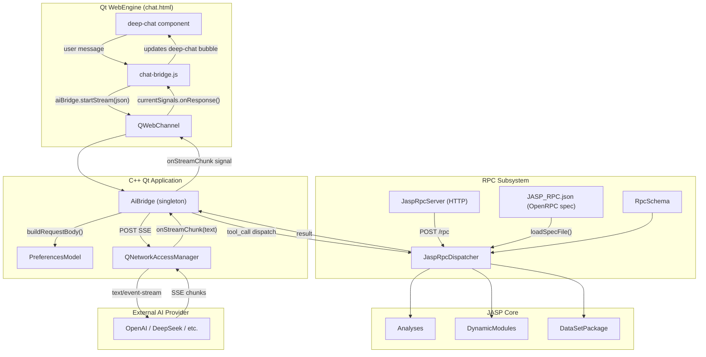
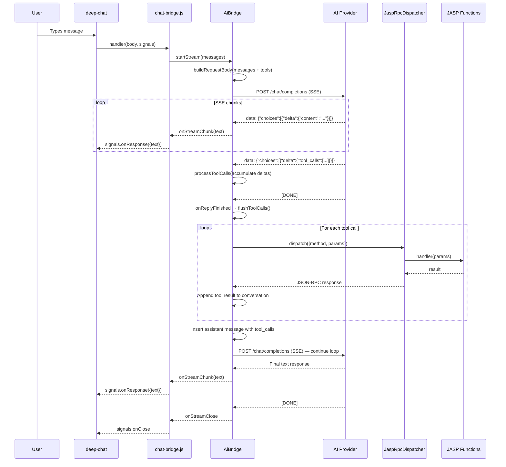

# JASP Codebase — Agent-Oriented Technical Reference

> **Version**: 0.97.0 | **C++ Standard**: C++20 | **Qt**: 6 | **R**: 4.5 (via RInside/Rcpp)  
> **Total**: ~1,782 `.cpp`, ~3,327 `.h`, ~424 `.qml`, ~1,520 `.R` files (~862K lines)  
> **Purpose**: Exhaustive API reference for AI agents working on the JASP codebase.

---

## Table of Contents

1. [Common/ — Shared Utilities](#1-common----shared-utilities)
2. [CommonData/ — Shared Data Layer](#2-commondata----shared-data-layer)
3. [Engine/ — R Engine Process](#3-engine----r-engine-process)
4. [R-Interface/ — C Bridge to R](#4-r-interface----c-bridge-to-r)
5. [Desktop/analysis/ — Analysis Management](#5-desktopanalysis----analysis-management)
6. [Desktop/data/ — Data Management](#6-desktopdata----data-management)
7. [Desktop/engine/ — Engine Orchestration](#7-desktopengine----engine-orchestration)
8. [Desktop/gui/ — GUI Models](#8-desktopgui----gui-models)
9. [Desktop/modules/ — Module System](#9-desktopmodules----module-system)
10. [Desktop/results/ — Results Interface](#10-desktopresults----results-interface)
11. [Desktop/utilities/ — Utilities](#11-desktoputilities----utilities)
12. [Desktop/widgets/ — File Menu](#12-desktopwidgets----file-menu)
14. [Desktop/qquick/ — Custom QQuick Items](#14-desktopqquick----custom-qquick-items)
15. [Desktop/data/importers/ — Data Importers](#15-desktopdataimporters----data-importers)
16. [Desktop/data/exporters/ — Data Exporters](#16-desktopdataexporters----data-exporters)
17. [QMLComponents/controls/ — QML Control Backends](#17-qmlcomponentscontrols----qml-control-backends)
18. [QMLComponents/boundcontrols/ — Option Binding](#18-qmlcomponentsboundcontrols----option-binding)
19. [QMLComponents/models/ — List Models](#19-qmlcomponentsmodels----list-models)
20. [QMLComponents/rsyntax/ — R Syntax Generation](#20-qmlcomponentsrsyntax----r-syntax-generation)
21. [QMLComponents/modules/ — Module Infrastructure](#21-qmlcomponentsmodules----module-infrastructure)
22. [QMLComponents/ Top-Level Files](#22-qmlcomponents--top-level-files)
23. [SyntaxInterface/ — R Wrapper Generation](#23-syntaxinterface----r-wrapper-generation)
24. [Build System](#24-build-system)
25. [Module Catalog](#25-module-catalog)
26. [IPC Message Protocol](#26-ipc-message-protocol)
27. [Database Schema](#27-database-schema)
28. [Key Data Flow Sequences](#28-key-data-flow-sequences)
29. [AI & RPC Architecture Overview](#29-ai--rpc-architecture-overview)
30. [AiBridge — Full Implementation](#30-aibridge----full-implementation)
31. [Deep Chat — Frontend UI Framework](#31-deep-chat----frontend-ui-framework)
32. [chat-bridge.js — QWebChannel Glue](#32-chat-bridgejs----qwebchannel-glue)
33. [JaspRpcDispatcher — Full Implementation](#33-jasprpcdispatcher----full-implementation)
34. [JaspRpcServer — Full Implementation](#34-jasprpcserver----full-implementation)
35. [RpcSchema — Full Implementation](#35-rpcschema----full-implementation)
36. [OpenRPC Specification](#36-openrpc-specification)
37. [All 13 RPC Methods — Full Schemas](#37-all-13-rpc-methods----full-schemas)
38. [Tool-Calling Loop (AI ↔ JASP)](#38-tool-calling-loop-ai--jasp)
39. [SSE Streaming Protocol](#39-sse-streaming-protocol)
40. [AI Configuration & Preferences](#40-ai-configuration--preferences)
41. [AI/RPC Key Implementation Details](#41-airpc-key-implementation-details)

---

## 1. Common/ — Shared Utilities

### 1.1 `common.h`

```cpp
typedef unsigned int uint;
// ARCH_64 / ARCH_32 based on _WIN64 || __amd64__
```

### 1.2 `version.h`

```cpp
class Version {
    struct encodingError : public std::runtime_error { ... };
    Version(const char * version);
    Version(const std::string & version);
    explicit Version(unsigned int major = 0, unsigned int minor = 0, unsigned int release = 0, unsigned int fourth = 0);
    std::string asString(size_t versionNumbersToInclude = 0) const;
    unsigned int major() const; unsigned int minor() const; unsigned int release() const; unsigned int fourth() const;
    bool isEmpty() const; void swap(Version &other);
    bool operator < / <= / >= / > / == / != (const Version & other) const;
private:
    unsigned int _major = 0, _minor = 0, _release = 0, _fourth = 0;
};

class BundleVersion : public Version {
    enum class Type { Alpha = 1, Beta = 4, Release = 9001 };
    Type _type = Type::Release; unsigned int _buildnum = 0;
};
```

### 1.3 `appinfo.h`

```cpp
class AppInfo {
public:
    static const Version version;       // Version(0, 97, 0, 0)
    static const std::string name;      // "JASP"
    static const std::string builddate; // __DATE__ " " __TIME__
    static const std::string gitBranch; // "development"
    static const std::string gitCommit;
    static std::string getShortDesc();
    static std::string getBuildYear();
    static std::string getRVersion();    // "4.5"
    static std::string getRDirName();    // "4.5-x86_64"
    static long long   getSimpleCryptKey(); // 0x0c2ad4a4acb9f023
};
```

### 1.4 `columntype.h`

```cpp
DECLARE_ENUM(columnType,              unknown = 0, scale = 1, ordinal = 2, nominal = 3, nominalText = 4);
DECLARE_ENUM(columnTypeChangeResult,  changed, cannotConvertStringValueToInteger, cannotConvertStringValueToDouble, cannotConvertDoubleValueToInteger, generatedFromAnalysis, unknownError);
DECLARE_ENUM(computedColumnType,      notComputed, rCode, constructorCode, analysis, analysisNotComputed);
DECLARE_ENUM(dbDbl,                   nan, inf, neg_inf);
DECLARE_ENUM(dropLevelsType,          noChoice = 0, drop = 1, keep = 2);
```

### 1.5 `enumutilities.h`

Macro-generated enum utilities. For each enum `E`:
- `enum class E : T { ... }`
- `EFromString(string)`, `EToString(E)`, `EToVector()`, `EValid(T)`
- Qt variants when `JASP_USES_QT_HERE`: `EFromQString`, `EToQString`

### 1.6 `utilenums.h`

```cpp
DECLARE_ENUM(FileTypeBase, jasp = 0, html, csv, txt, tsv, sav, zsav, ods, xls, xlsx, pdf, sas7bdat, sas7bcat, por, xpt, dta, database, rdata, rds, mwx, mpx, empty, unknown);
DECLARE_ENUM(DbType, NOTCHOSEN, QDB2, QMYSQL, QOCI, QODBC, QPSQL, QSQLITE);
```

### 1.7 `utils.h`

```cpp
typedef std::vector<double>                 doublevec;
typedef std::vector<bool>                   boolvec;
typedef std::vector<int>                    intvec;
typedef std::set<std::string>               stringset;
typedef std::vector<std::string>            stringvec;
typedef std::map<std::string, std::string>  strstrmap;

class Utils {
    static Utils::FileType getTypeFromFileName(const std::string &path);
    static int64_t currentMillis(); static int64_t currentSeconds();
    static int64_t getFileModificationTime(const std::string &filename);
    static bool removeFile(const std::string &path);
    static void sleep(int ms);
    static bool isEqual(const double a, const double b);
};
```

### 1.8 `stringutils.h`

```cpp
class stringUtils {
    static std::string stripRComments(const std::string & rCode, bool stripStrings = false);
    static std::vector<std::string> split(const std::string & str, const char sep = ',');
    static std::string join(const stringvec & strs, const std::string & sep = ",");
    static std::string toLower(std::string input);
    static std::string replaceBy(std::string input, const std::string & replaceThis, const std::string & withThis);
    static bool startsWith(const std::string & line, const std::string & startsWithThis);
    static bool endsWith(const std::string & line, const std::string & endsWithThis);
};
```

### 1.9 `dirs.h`

```cpp
class Dirs {
    static std::string tempDir();    // JASP_TMP_DIR env var
    static std::string exeDir();     // GetModuleFileName / proc_pidpath / /proc/<pid>/exe
    static std::string resourcesDir(); // exeDir()/../Resources/
    static void setReportingDir(const std::string & dir);
    static void setLocalAppdataDir(const std::string & dir);
};
```

### 1.10 `log.h`

```cpp
DECLARE_ENUM(logType,  cout, file, null);
DECLARE_ENUM(logError, noProblem, fileNotOpen, filePathNotSet);

class Log {
    static std::ostream & log(bool addTimestamp = true);
    static void setDefaultDestination(logType newDestination);
    static void setLoggingToFile(bool logToFile);
    static void setEngineNo(int num);
    static Json::Value createLogCfgMsg();
    static void parseLogCfgMsg(const Json::Value & json);
    static const char * getTimestamp(); // "HH:MM:SS.mmm"
};
```

### 1.11 `enginedefinitions.h`

```cpp
DECLARE_ENUM(engineState, initializing, idle, analysis, filter, filterByName, rCode, computeColumn, moduleInstallRequest, moduleUninstallRequest, moduleLoadRequest, pauseRequested, paused, resuming, stopRequested, stopped, logCfg, settings, killed, reloadData);
DECLARE_ENUM(performType, run, abort, saveImg, editImg, rewriteImgs);
DECLARE_ENUM(analysisResultStatus, validationError, fatalError, imageSaved, imageEdited, imagesRewritten, complete, running, changed, waiting);
DECLARE_ENUM(moduleStatus, initializing, installNeeded, uninstallNeeded, loading, readyForUse, error);
DECLARE_ENUM(engineAnalysisStatus, empty, toRun, running, changed, complete, error, exception, aborted, stopped, saveImg, editImg, rewriteImgs, synchingData);
DECLARE_ENUM(enginesListRoles, channel = 257, module, engineState, analysisStatus, runsWhat, running, idle, idleSoon);

#define ENGINE_KILLTIME       750        // ms
#define ENGINE_BORED_SHUTDOWN (30 * 60)  // seconds
#define ENGINE_COOLDOWN       200        // ms
```

### 1.12 `processinfo.h`

```cpp
class ProcessInfo {
    static unsigned long currentPID();   // GetCurrentProcessId() / getpid()
    static unsigned long parentPID();    // Toolhelp32Snapshot / getppid()
    static bool isParentRunning();       // checks parent exit code
    static bool inWinContainer();        // TokenIsAppContainer (Windows)
};
```

### 1.13 `tempfiles.h`

```cpp
class TempFiles {
    static void init(long _sessionId);
    static void attach(long _sessionId);
    static void heartbeat(); // touch status file every 30s
    static void createSessionDir(); static void clearSessionDir();
    static void create(const std::string &extension, int id, std::string &root, std::string &relativePath);
    static void createSpecific(const std::string &name, int id, std::string &root, std::string &relativePath);
    static stringvec retrieveList(int id = -1, const std::string &dir = "");
    static void deleteAll(int id = -1);
    static void deleteOrphans(); // outOfDateDelta = 24 * 3600
};
```

### 1.14 `timers.h`

When `PROFILE_JASP` defined:
```cpp
struct customtimer {
    void start(); void resume(); void stop(); std::string format();
    std::chrono::time_point<std::chrono::steady_clock> lastStart;
    double totalDuration = 0;
};
#define JASPTIMER_START(TIMERNAME) / JASPTIMER_STOP / JASPTIMER_SCOPE / JASPTIMER_CLASS
```

### 1.15 `columnencoder.h`

```cpp
class ColumnEncoder {
    typedef std::map<std::string, std::string>                colMap;
    typedef std::map<std::string, columnType>                 colTypeMap;
    typedef std::set<std::pair<std::string, columnType>>      colsPlusTypes;

    ColumnEncoder(std::string prefix, std::string postfix = "_Encoded");
    static ColumnEncoder * columnEncoder();
    static bool isColumnName(const std::string & in);
    static bool isEncodedColumnName(const std::string & in);
    static void setCurrentColumnNames(const colTypeMap & names);
    static std::string replaceColumnNamesInRScript(const std::string & rCode, const std::map<std::string, std::string> & changedNames);

    bool shouldEncode(const std::string & in); bool shouldDecode(const std::string & in);
    std::string encode(const std::string &in); std::string decode(const std::string &in);
    std::string encodeRScript(std::string text, std::set<std::string> * columnNamesFound = nullptr);
    static std::string encodeAll(const std::string & text); static std::string decodeAll(const std::string & text);
    static void encodeJson(Json::Value & json, bool replaceNames = false, bool replaceStrict = false);
    static void decodeJson(Json::Value & json, bool replaceNames = true);
    static colsPlusTypes encodeColumnNamesinOptions(Json::Value & options, bool preloadingData);

private:
    static ColumnEncoder * _columnEncoder;
    static ColumnEncoders * _otherEncoders;
    colMap _encodingMap, _decodingMap;
    colVec _originalNames, _encodedNames;
    colTypeMap _decodingTypes, _dataSetTypes;
    std::string _encodePrefix = "JaspColumn_", _encodePostfix = "_Encoded";
};
```

### 1.16 `r_functionwhitelist.h`

```cpp
class R_FunctionWhiteList {
    static const std::set<std::string> functionWhiteList; // ~300+ R functions
    static void scriptIsSafe(std::string const & script);
    static std::set<std::string> findIllegalFunctions(std::string const & script);
    static std::string returnOrderedWhiteList();
    static const std::set<std::string>& getWhiteList();
};
```

### 1.17 `otoolstuff.h`

```cpp
std::string _system(std::string cmd);
void _moduleLibraryFixer(const std::string & moduleLibrary, bool engineCall = false, bool printStuff = false, bool devMod = false);
```
macOS-only: fixes `@rpath` in R-library dylibs using `otool -L` and `install_name_tool`. Re-signs with `codesign`.

---

## 2. CommonData/ — Shared Data Layer

### 2.1 `datasetbasenode.h`

```cpp
DECLARE_ENUM(dataSetBaseNodeType, unknown, dataSet, data, filters, filter, column, label);

class DataSetBaseNode {
    typedef std::set<DataSetBaseNode*> NodeSet;
    DataSetBaseNode(dataSetBaseNodeType typeNode, DataSetBaseNode * parent = nullptr);
    ~DataSetBaseNode();
    dataSetBaseNodeType nodeType() const;
    void registerChild(DataSetBaseNode * child); void unregisterChild(DataSetBaseNode * child);
    bool nodeStillExists(DataSetBaseNode * node) const;
    virtual void incRevision(); int revision(); int nestedRevision(); // product of all child revisions
    void setModifiedCallback(std::function<void()> callback);
protected:
    dataSetBaseNodeType _type; DataSetBaseNode * _parent; NodeSet _children; int _revision = 1;
    std::function<void()> _somethingModifiedCallback;
};
```

### 2.2 `emptyvalues.h`

```cpp
class EmptyValues {
    explicit EmptyValues(EmptyValues * parent = nullptr);
    bool isEmptyValue(const std::string & data) const; bool isEmptyValue(double data) const;
    const stringset & emptyStrings() const; const doubleset & emptyDoubles() const;
    void setEmptyValues(const stringset & values); void setHasCustomEmptyValues(bool hasThem);
    static const int    missingValueInteger;  // std::numeric_limits<int>::lowest()
    static const double missingValueDouble;   // NAN
private:
    EmptyValues * _parent; stringset _emptyStrings; doubleset _emptyDoubles; bool _hasEmptyValues;
};
```

### 2.3 `filter.h`

```cpp
#define DEFAULT_FILTER_JSON  "{\"formulas\":[]}"
#define DEFAULT_FILTER_GEN   "generatedFilter <- rep(TRUE, rowcount)"
#define DEFAULT_FILTER_NAME  "DEFAULT_FILTER"

class Filter : public DataSetBaseNode {
    Filter(DataSet * data); Filter(DataSet * data, const std::string & name, bool createIfMissing = true);
    int id() const; const std::string & name() const; const std::string & rFilter() const;
    const std::string & generatedFilter() const; const std::string & constructorJson() const;
    const std::string & errorMsg() const; const std::vector<bool> & filtered() const; int filteredRowCount() const;
    void setRFilter(const std::string &); void setGeneratedFilter(const std::string &);
    void setConstructorJson(const std::string &); void setErrorMsg(const std::string &);
    bool setFilterVector(const boolvec & filterResult); void setRowCount(size_t rows);
    void dbCreate(); void dbUpdate(bool writeFiltered = false); void dbLoad(); void dbDelete();
    static bool filterNameIsFree(const std::string & filterName); void reset();
private:
    DataSet * _data; int _id, _filteredRowCount;
    std::string _rFilter, _generatedFilter, _constructorJson, _constructorR, _errorMsg, _name;
    std::vector<bool> _filtered;
};
```

### 2.4 `label.h`

```cpp
class Label : public DataSetBaseNode {
    static const int NO_LABEL; // -1
    Label(Column * column, const std::string & label, int value, bool filterAllows = true, ...);
    int dbId() const; int intsId() const; int order() const; bool filterAllows() const;
    const Json::Value & originalValue() const; double originalValueAsDouble() const;
    std::string label(bool lie=true) const; std::string labelDisplay() const;
    std::string originalValueAsString(bool fancyEmptyValue = false, bool ignoreEmpty = true) const;
    bool setLabel(const std::string &); bool setOriginalValue(const Json::Value &);
    bool setDescription(const std::string &); bool setFilterAllows(bool);
    void dbCreate(); void dbLoad(int labelId = -1); void dbUpdate(); void dbDelete();
    Json::Value serialize(bool forCompare = false) const;
private:
    Column * _column; Json::Value _originalValue; int _dbId, _order, _intsId;
    std::string _label, _description; bool _filterAllows, _userAdded; double _dblValue;
};
typedef std::vector<Label*> Labels;
```

### 2.5 `column.h`

```cpp
class Column : public DataSetBaseNode {
    Column(DataSet * data, int id); ~Column();
    // Metadata
    columnType type() const; int id() const; int analysisId() const; bool isComputed() const;
    dropLevelsType dropLevels() const; bool invalidated() const; bool autoSortByValue() const;
    bool hasLabels() const; computedColumnType codeType() const;
    const std::string & name() / title() / error() / rCode() / description() / computeFilter() const;
    const Json::Value & constructorJson() const; size_t rowCount() const;
    const intvec & ints() const; const doublevec & dbls() const; const stringvec & strs() const;
    // Setters
    bool setName(const std::string &); void setTitle(const std::string &);
    bool setRCode(const std::string &); bool setError(const std::string &);
    void setType(columnType); columnTypeChangeResult changeType(columnType);
    void setCodeType(computedColumnType); void setDescription(const std::string &);
    void setComputeFilter(const std::string &); bool setConstructorJson(const std::string &);
    void setAutoSortByValue(bool); void setAnalysisId(int); void setIndex(int);
    void setInvalidated(bool); void setDropLevels(dropLevelsType);
    // Labels
    void labelsClear(bool doIncRevision = true);
    int labelsAdd(const std::string &display); int labelsAdd(const std::string &display, const std::string &value);
    void labelsRemove(int labelIndex); void labelsReverse(); void labelsOrderByValue();
    Labels & labels(); Label * labelByRow(int row) const; Label * labelByValue(const std::string &) const;
    // Values
    std::string getValue(size_t row, ...) const; std::string getDisplay(size_t row, ...) const;
    bool setStringValue(size_t row, const std::string & userEntered, ...);
    bool setValue(size_t row, int valueInt, bool writeToDB = true);
    bool setValue(size_t row, double valueDbl, const std::string & valueStr, ...);
    columnType setValues(const stringvec & values, const stringvec & labels, int thresholdScale = 10, ...);
    // Computed columns
    void invalidate(); void validate(); void invalidateDependents();
    void findDependencies(); bool hasError(); void checkForLoopInDependencies(const std::string &);
    const stringset & dependsOnColumns() const;
    // Persistence
    void dbCreate(int index = -1); void dbLoad(int id, bool getValues = true);
    void dbUpdateValues(); void dbDelete(bool cleanUpRest = true);
    Json::Value serialize() const; void deserialize(const Json::Value &);
    // Empty values
    bool isEmptyValue(const std::string & val) const; bool isEmptyValue(double val) const;
    bool hasCustomEmptyValues() const; bool setCustomEmptyValues(const stringset &);
private:
    DataSet * _data; EmptyValues * _emptyValues; Labels _labels; columnType _type;
    int _id, _analysisId, _highestIntsId; stringvec _nonFilteredLevels; int _nonFilteredNumericsCount;
    bool _invalidated, _autoSortByValue, _hasShadows, _hasLabels; dropLevelsType _dropLevels;
    computedColumnType _codeType; std::string _name, _title, _description, _error, _rCode, _computeFilter;
    Json::Value _constructorJson; intvec _ints; stringvec _strs; doublevec _dbls;
    stringset _dependsOnColumns; std::map<int, Label*> _labelByIntsIdMap;
    std::map<Label*, int> _labelNonEmptyIndexByLabel;
};
typedef std::vector<Column*> Columns;
```

### 2.6 `dataset.h`

```cpp
class DataSet : public DataSetBaseNode {
    DataSet(int index = -1); ~DataSet();
    Filter * filter(); Columns & columns(); EmptyValues * emptyValues();
    Column * column(const std::string & name); Column * column(size_t columnIndex);
    int id() const; int columnCount() const; int rowCount() const;
    bool dataFileSynch() const; const std::string & dataFilePath() const;
    // Persistence
    void dbCreate(); void dbUpdate(); void dbLoad(int index = -1, ...); void dbDelete();
    void beginBatchedToDB(); void endBatchedToDB(...);
    // Column operations
    void removeColumn(const std::string & name); void insertColumn(size_t index, bool alterDataSetTable = true);
    Column * newColumn(const std::string & name); int getColumnIndex(const std::string & name) const;
    void columnsReorder(stringvec order);
    // Row/column counts
    void setColumnCount(size_t colCount); void setRowCount(size_t rowCount, bool alsoLoadData = true);
    bool checkForUpdates(stringvec * colsChanged = nullptr, ...);
    stringvec getColumnNames(); colTypeMap getColumnTypesMap();
    void setDataFile(const std::string &, long); void setDatabaseJson(const std::string &);
private:
    Columns _columns; Filter * _filter; EmptyValues * _emptyValues;
    int _dataSetID, _rowCount, _writeBatchedToDBDepth;
    std::string _dataFilePath, _databaseJson; bool _dataFileSynch; char _csvDelimiter;
};
```

### 2.7 `databaseinterface.h`

```cpp
class DatabaseInterface {
    DatabaseInterface(bool create = false, bool inMemory = false); ~DatabaseInterface();
    static DatabaseInterface * singleton(); static void closeInterfaces();
    bool hasConnection(); void upgradeDBFromVersion(Version originalVersion);
    // Generic queries
    void runQuery(const std::string & query, bindParametersType, processRowType);
    void runStatements(const std::string & statements, bool ignoreFails=false);
    // DataSets
    int dataSetGetId(); bool dataSetExists(int); void dataSetDelete(int);
    int dataSetInsert(const std::string & dataFilePath = "", ...);
    void dataSetUpdate(int, ...); void dataSetLoad(int, ...);
    void dataSetSetRowCount(int, size_t); int dataSetIncRevision(int);
    void dataSetBatchedValuesUpdate(DataSet *, Columns, ...);
    // Filters
    int filterGetId(int dataSetId); bool filterSelect(int, boolvec &);
    void filterWrite(int, const boolvec &); int filterInsert(int, ...);
    void filterUpdate(int, ...); void filterLoad(int, ...); void filterClear(int); void filterDelete(int);
    // Columns
    int columnInsert(int, int, const std::string &, columnType, bool);
    void columnDelete(int); void columnSetType(int, columnType);
    void columnSetName(int, const std::string &); void columnSetTitle(int, const std::string &);
    void columnSetValues(int, const intvec &); void columnSetValues(int, const doublevec &, const stringvec &);
    void columnGetValues(int, intvec &, const std::string & = "");
    void columnGetValues(int, doublevec &, stringvec &, const std::string & = "");
    void columnSetComputedInfo(int, int, bool, computedColumnType, const std::string &, ...);
    void columnGetComputedInfo(int, int &, bool &, computedColumnType &, std::string &, ...);
    // Labels
    void labelsClear(int); int labelAdd(int, int, const std::string &, bool, ...);
    void labelSet(int, int, int, const std::string &, bool, ...);
    void labelDelete(int); void labelsLoad(Column *); void labelsWrite(Column *);
    void labelsSetOrder(const intintmap &);
    // Transactions
    void transactionWriteBegin(); void transactionWriteEnd(bool rollback = false);
    void transactionReadBegin(); void transactionReadEnd();
    void doWalCheckPoint();
private:
    std::map<std::thread::id, sqlite3*> _dbs; std::mutex _loadMutex, _dbCheckMutex;
    static const std::string _dbConstructionSql; static const std::string _dbIndexesSql;
    static DatabaseInterface * _singleton;
};
```

### 2.8 `databridge.h`

```cpp
class DataBridge {
    DataBridge(unsigned long sessionID, bool useMemory = false);
    std::string createColumn(const std::string &, bool computed=false);
    bool deleteColumn(const std::string &);
    bool setColumnDataAndType(const std::string &, const std::vector<std::string> &, columnType, bool);
    int getColumnType(const std::string &); int getColumnAnalysisId(const std::string &);
    DataSet * provideAndUpdateDataSet();
    void provideJaspResultsFileName(std::string &, std::string &);
    void provideStateFileName(std::string &, std::string &);
    void provideTempFileName(const std::string &, std::string &, std::string &);
    int dataSetRowCount(); void updateOptionsAccordingToMeta(Json::Value &);
protected:
    DataSet * _dataSet; DatabaseInterface * _db; int _analysisId;
    std::function<void()> _datasetProvidedCallback;
};
```

### 2.9 `ipcchannel.h`

```cpp
class IPCChannel {
    IPCChannel(std::string name, size_t channelNumber, bool isSlave = false);
    ~IPCChannel();
    void send(const std::string & data, bool alreadyLockedMutex = false);
    bool receive(std::string & data, int timeout = 0);
    void resend(); size_t channelNumber();
    bool jaspAlive(); void touchHeartbeat();
    void findConstructAllAgain();
private:
    // 3 shared memory segments: Control, MasterToSlave, SlaveToMaster
    boost::interprocess::managed_shared_memory * _memoryControl, * _memoryMasterToSlave, * _memorySlaveToMaster, * _memoryIn, * _memoryOut;
    boost::interprocess::interprocess_mutex * _mutexOut, * _mutexIn;
    String * _dataOut, * _dataIn; size_t * _sizeMtoS, * _sizeStoM;
    std::string _baseName; size_t _channelNumber; bool _isSlave;
    uint64_t _msgIDSend = 0, _msgIDRecv = 1;
    // Heartbeat
    std::string _jaspHeartBeatPath; unsigned int _heatbeatDelayS = 5, _maxHeartbeatDiffS = 60;
    static std::thread _heartbeatThread;
};
```
Initial shared memory: 8MB. Doubles on overflow. Heartbeat file touched every 5s.

### 2.10 `rbridge.h`

```cpp
// C functions (STDCALL on Windows)
RBridgeColumn* rbridge_readDataSet(RBridgeColumnType*, size_t, bool);
RBridgeColumn* rbridge_readFullDataSet(size_t *);
RBridgeColumn* rbridge_readFullFilteredDataSet(size_t *);
char** rbridge_readDataColumnNames(size_t *);
bool rbridge_requestTempFileName(const char *, const char **, const char **);
bool rbridge_runCallback(const char *, int, const char **);
int rbridge_getColumnType(const char *); int rbridge_getColumnAnalysisId(const char *);
const char * rbridge_createColumn(const char *, bool); bool rbridge_deleteColumn(const char *);
bool rbridge_setColumnDataAndType(const char *, const char **, size_t, int, bool);
int rbridge_dataSetRowCount();
const char * rbridge_encodeColumnName(const char *); const char * rbridge_decodeColumnName(const char *);
bool rbridge_shouldEncodeColumnName(const char *); bool rbridge_shouldDecodeColumnName(const char *);
const char ** rbridge_allColumnNames(size_t &, bool);

// C++ functions
void rbridge_init(DataBridge *, sendFuncDef, pollMessagesFuncDef, ColumnEncoder *, const char *, bool);
void rbridge_memoryCleaning();
std::string rbridge_runModuleCall(const std::string &name, const std::string &title, const std::string &moduleCall, ...);
std::vector<bool> rbridge_applyFilter(const std::string & filterCode, const std::string & generatedFilterCode);
std::string rbridge_evalRCodeWhiteListed(const std::string & rCode, bool setWd);
std::string rbridge_evalRComputedColumn(const std::string & rCode, const std::string & setColumnCode, const std::string & filterName);
```

### 2.11 `archivereader.h`

```cpp
struct ManifestInfo { std::string jaspArchiveVersion, jaspVersion; };
class ArchiveReader {
    ArchiveReader(const std::string &archivePath, const std::string &entryPath);
    int64_t size() const; int64_t bytesAvailable() const;
    int64_t readData(char * data, int64_t maxSize, int &errorCode);
    std::string readAllData(int blockSize, int &errorCode);
    void openEntry(const std::string &, const std::string &); void close();
    static std::vector<std::string> getEntryPaths(const std::string &archivePath, ...);
    static ManifestInfo readManifest(const std::string & path);
};
```

### 2.12 `base64.h`

```cpp
namespace base64 {
    inline std::string to_base64(std::string_view data);
    inline std::string from_base64(std::string_view data);
}
```

### 2.13 `jsonutilities.h`

```cpp
class JsonUtilities {
    static std::set<std::string> convertDragNDropFilterJSONToSet(std::string jsonStr);
    static std::string removeColumnsFromDragNDropFilterJSONStr(const std::string &, const stringset &);
    static std::string replaceColumnNamesInDragNDropFilterJSONStr(const std::string &, const strstrmap &);
    template<typename T> static Json::Value vecToJsonArray(const std::vector<T> & vec);
};
```

---

## 3. Engine/ — R Engine Process

### 3.1 `engine.h`

```cpp
class Engine : public DataBridge {
    typedef engineAnalysisStatus Status;
    explicit Engine(int slaveNo, unsigned long parentPID);
    ~Engine();
    static Engine * theEngine() { return _EngineInstance; }
    void run(); bool receiveMessages(int timeout = 0);
    void sendString(Json::Value message); bool parentAlive();
    Status getAnalysisStatus(); analysisResultStatus getStatusToAnalysisStatus();
    bool paused();
private:
    void initialize(); void beIdle(bool newlyIdle);
    void receiveRCodeMessage(const Json::Value &); void receiveFilterMessage(const Json::Value &);
    void receiveFilterByNameMessage(const Json::Value &); void receiveAnalysisMessage(const Json::Value &);
    void receiveComputeColumnMessage(const Json::Value &); void receiveModuleRequestMessage(const Json::Value &);
    void receiveReloadData(); void receiveLogCfg(const Json::Value &); void receiveSettings(const Json::Value &);
    void absorbSettings(const Json::Value &);
    void runAnalysis(); void runComputeColumn(const std::string &, const std::string &, columnType);
    void runFilter(const std::string &, const std::string &, int); void runFilterByName(const std::string &);
    void runRCode(const std::string &, int, bool); void runRCodeCommander(std::string);
    void stopEngine(); void pauseEngine(const Json::Value &); void resumeEngine(const Json::Value &);
    void saveImage(); void editImage(); void rewriteImages();
    void sendAnalysisResults(); void sendFilterResult(int); void sendRCodeResult(int, const std::string &);
    // Members
    static Engine * _EngineInstance; const int _engineNum; const unsigned long _parentPID;
    IPCChannel * _channel; ColumnEncoder * _extraEncodings;
    engineState _engineState = engineState::initializing;
    Status _analysisStatus = Status::empty;
    int _analysisRevision, _progress, _ppi = 96, _numDecimals = 3;
    bool _developerMode, _fixedDecimals, _exactPValues, _normalizedNotation, _analysisPreloadData;
    std::string _analysisName, _analysisTitle, _analysisDataKey, _analysisStateKey, _resultFont, _imageBackground, _analysisRFile, _dynamicModuleCall;
    Json::Value _imageOptions, _analysisOptions, _analysisResults;
    ColumnEncoder::colsPlusTypes _analysisColsTypes;
};
```

### 3.2 `engine.cpp` Key Logic

**Main loop:**
```cpp
do {
    if(!initDone && _engineState == engineState::initializing) { initialize(); initDone = true; }
    receiveMessages(100);
    switch(_engineState) {
    case engineState::idle:         beIdle(_lastRequest == engineState::analysis); break;
    case engineState::analysis:     runAnalysis(); break;
    case engineState::reloadData:   provideAndUpdateDataSet(); break;
    default: break;
    }
} while(_engineState != engineState::stopped && parentAlive());
```

**`runAnalysis()`:** Calls `provideAndUpdateDataSet()`, encodes column names via `ColumnEncoder::encodeColumnNamesinOptions()`, calls `rbridge_runModuleCall()`.

**`runFilter()`:** Strips R comments, calls `rbridge_applyFilter()`.

**`runComputeColumn()`:** Maps columnType to function: `{scale→".setColumnDataAsScale", ordinal→".setColumnDataAsOrdinal", nominal→".setColumnDataAsNominal", nominalText→".setColumnDataAsNominalText"}`. Calls `rbridge_evalRComputedColumn()`.

**`absorbSettings()`:** Reads ppi, developerMode, imageBackground, languageCode, use1000Seps, numDecimals, fixedDecimals, exactPValues, normalizedNotation, resultFont, GITHUB_PAT.

### 3.3 `main.cpp`

```cpp
int main(int argc, char *argv[]) {
    // Args: slaveNo, parentPID, logFileBase, logFileWhere, optional reportingDir
    Engine engine(slaveNo, parentPID);
    engine.run();
}
```

### 3.4 jaspBase R Package

**DESCRIPTION:** Version 0.20.4, Imports: cli, ggplot2, grDevices, grid, gridExtra, jaspGraphs, jsonlite, officer, ragg, R6, Rcpp, rvg, svglite, systemfonts, withr

**Key R functions:**

`R/zzzWrappers.R`:
- `runJaspResults(name, title, dataKey, options, stateKey, functionCall, preloadData)` — Main entry point
- `startProgressbar(expectedTicks, label)` / `progressbarTick()` — Progress API
- `signalAnalysisAbort()` — Raises `jaspAnalysisAbort` condition

`R/common.R`:
- `loadJaspResults(name)` — Creates `cpp_jaspResults` with `.retrieveState()`
- `finishJaspResults(jaspResultsCPP, calledFromAnalysis)` — Saves state, completes
- `.readDataSetToEnd(columns, columns.as.numeric, columns.as.ordinal, columns.as.factor, all.columns, exclude.na.listwise)` — Reads dataset
- `.readFullDataset(exclude.na.listwise)` — Reads full dataset
- `.shortToLong()` — Reshapes wide to long

`R/writeImage.R`:
- `writeImageJaspResults(plot, width, height, ...)` — Renders plot to PNG via `ragg::agg_png()`
- `decodeplot(x, ...)` — S3 generic for gg, patchwork, recordedplot, gtable, etc.

`R/formula.R`:
- `jaspFormula(formula, data)` — Parses R formulas
- `jaspFormulaRhs(terms, group, intercept, correlated)` — Creates RHS specification

**C++ classes (Rcpp-exposed via `RCPP_MODULE(jaspResults)`):**

| Class | Key Members |
|-------|-------------|
| `jaspObject` | `_title`, `_type`, `_error`, `_errorMessage`, `_messages`, `_citations`, `_name`, dependency maps, `convertToJSON()`, `convertFromJSON()`, `checkDependencies()` |
| `jaspContainer` | `_data` (map<string, jaspObject*>), `insert()`, `at()`, `findObjectWithUniqueNestedName()` |
| `jaspResults` | `_analysisId`, `_ipccSendFunc`, `_ipccPollFunc`, `send()`, `constructResultJson()`, `complete()`, `saveResults()`, `loadResults()`, `startProgressbar()`, `progressbarTick()` |
| `jaspTable` | `_colNames`, `_colTypes`, `_colTitles`, `_colFormats`, `_rowNames`, `_data` (2D vector), `_footnotes`, `addColumnInfo()`, `addFootnote()`, `setData()`, `addColumns()`, `addRows()` |
| `jaspPlot` | `_aspectRatio`, `_width`, `_height`, `_filePathPng`, `_status`, `_interactiveJsonData`, `setPlotObject()`, `renderPlot()` |
| `jaspHtml` | `_rawText`, `_elementType`, `_class`, `_maxWidth`, `setText()`, `getText()` |
| `jaspState` | `_envName`, `setObject()`, `getObject()` |
| `jaspColumn` | `_columnName`, `_columnType`, static function pointers for createColumn/deleteColumn/getColumnType/setColumnData, `setScale()`, `setOrdinal()`, `setNominal()` |
| `jaspReport` | `_rawText`, `_report`, `_totalWarnings` |

---

## 4. R-Interface/ — C Bridge to R

### 4.1 `jasprcpp_interface.h`

**Structs:**
```cpp
struct RBridgeColumn { char* name; bool isScale, isOrdinal, dropLevels; double* doubles; int* ints; char** labels; size_t nbRows, nbLabels; };
struct RBridgeColumnDescription { int type; char* name; bool isScale, isOrdinal; char** labels; size_t nbLabels; };
struct RBridgeColumnType { char* name; int type; };
```

**Callbacks (`RBridgeCallBacks`):** 23 function pointers for data access, file management, encoding.

**Exported functions (extern "C"):** `jaspRCPP_init`, `jaspRCPP_init_jaspBase`, `jaspRCPP_runModuleCall`, `jaspRCPP_saveImage`, `jaspRCPP_editImage`, `jaspRCPP_rewriteImages`, `jaspRCPP_evalRCode`, `jaspRCPP_runFilter`, `jaspRCPP_evalComputedColumn`, `jaspRCPP_runScript`, `jaspRCPP_purgeGlobalEnvironment`, `jaspRCPP_setShouldDropLevels`.

### 4.2 `jasprcpp.cpp` Key Logic

**`jaspRCPP_init()`:** Creates `RInside()`, registers ~40 native functions in R global env (`.callbackNative`, `.readDatasetToEndNative`, `.readFullDatasetToEnd`, `.setColumnDataAsScale`, `.encodeColNamesStrict`, `.decodeColNamesStrict`, etc.), loads `library(methods)`.

**`jaspRCPP_init_jaspBase()`:** Creates `Rcpp::XPtr` for function pointers, assigns to global env (`.sendToDesktopFunction`, `.pollMessagesFunction`, `.createColumn`, `.deleteColumn`, etc.), calls `jaspBase:::setColumnFuncs(...)`, `library(jaspBase)`.

**`jaspRCPP_runModuleCall()`:** Sets R variables, calls `_setJaspResultsInfo()`, evaluates `jaspBase::runJaspResults(...)`, calls `jaspBase:::destroyAllAllocatedObjects()`.

**`jaspRCPP_runFilter()`:** Wraps filter code in `tryCatch`, evaluates, converts result to bool array.

**`jaspRCPP_evalRCodeCommander()`:** Redirects log output, evaluates R code with `withCallingHandlers`.

---

## 5. Desktop/analysis/ — Analysis Management

### 5.1 `analyses.h`

```cpp
class Analyses : public QAbstractListModel {
    Q_PROPERTY(int count READ count NOTIFY countChanged)
    Q_PROPERTY(int currentAnalysisIndex READ currentAnalysisIndex WRITE setCurrentAnalysisIndex NOTIFY currentAnalysisIndexChanged)
    Q_PROPERTY(bool visible READ visible WRITE setVisible NOTIFY visibleChanged)

    enum myRoles { formPathRole = Qt::UserRole + 1, analysisRole, titleRole, nameRole, idRole };

    // Members
    static Analyses* _singleton; Json::Value _resultsMeta, _allUserData;
    std::map<size_t, Analysis*> _analysisMap; std::vector<size_t> _orderedIds;
    size_t _nextId = 0; int _currentAnalysisIndex = -1;
    QMap<int, QPair<Analysis*, QString>> _scriptIDMap;

    // Key methods
    static Analyses* analyses();
    Analysis* createFromJaspFileEntry(Json::Value, RibbonModel*);
    Analysis* create(Modules::AnalysisEntry*);
    Analysis* get(size_t id) const; void clear();
    void reload(Analysis*, bool qmlFileChanged, bool logProblem);
    void applyToAll(std::function<void(Analysis*)>);
    void selectAnalysis(Analysis*);
    void loadAnalysesFromDatasetPackage(bool&, std::stringstream&, RibbonModel*);
    Json::Value asJson() const;

    // Signals
    void analysisAdded(Analysis*); void analysisRemoved(Analysis*);
    void analysisResultsChanged(Analysis*); void analysisStatusChanged(Analysis*);
    void sendRScript(QString, int, bool, QString); void sendFilterByName(QString, QString);
};
```

### 5.2 `analysis.h`

```cpp
class Analysis : public AnalysisBase {
    enum Status { Empty, Running, RunningImg, Complete, Aborting, Aborted, ValidationError, SaveImg, EditImg, RewriteImgs, FatalError, KeepStatus };

    // Members
    Status _status = Empty; bool _refreshBlocked;
    Json::Value _results, _resultsMeta, _imgResults, _userData, _imgOptions, _progress;
    size_t _id; std::string _name, _qml, _titleDefault, _title, _rfile;
    Modules::AnalysisEntry* _moduleData; Modules::DynamicModule* _dynamicModule;
    int _revision = 0; bool _isDuplicate, _wasUpgraded, _roboReportActive;
    std::map<std::string, Json::Value> _rSources;

    // Key methods
    Analysis(size_t id, Modules::AnalysisEntry*, const std::string& title, const Version&, const Json::Value&);
    void setStatus(Status); static std::string statusToString(Status);
    void setResults(const Json::Value&, Status, const Json::Value& progress = Json::nullValue);
    void imageSaved(const Json::Value&); void saveImage(const Json::Value&);
    void editImage(const Json::Value&); void rewriteImages();
    void run() override; void refresh() override; void reloadForm() override;
    void remove(); Json::Value asJSON(bool withRSources = false) const;
    Json::Value createAnalysisRequestJson();
    void createForm(QQuickItem* parentItem = nullptr) override;
    stringset usedVariables(); stringset createdVariables();
    void setRSources(const Json::Value&); void setUserData(Json::Value);

    // Status queries
    bool isEmpty() const; bool isRunning() const; bool isFinished() const; bool isErrorState() const;

    // Signals
    void statusChanged(Analysis*); void resultsChangedSignal(Analysis*);
    void imageSavedSignal(Analysis*); void titleChanged();
    void requestComputedColumnCreation(const std::string&, Analysis*);
    void requestColumnCreation(const std::string&, Analysis*, columnType);
    void userModifiedSomething();
};
```

---

## 6. Desktop/data/ — Data Management

### 6.1 `datasetpackage.h`

```cpp
class DataSetPackage : public QAbstractItemModel {
    Q_PROPERTY(int columnsFilteredCount READ columnsFilteredCount NOTIFY columnsFilteredCountChanged)
    Q_PROPERTY(QString folder READ write setFolder NOTIFY folderChanged)
    Q_PROPERTY(bool modified READ isModified WRITE setModified NOTIFY isModifiedChanged)
    Q_PROPERTY(bool loaded READ isLoaded NOTIFY loadedChanged)
    Q_PROPERTY(QString currentFile READ currentFile NOTIFY currentFileChanged)
    Q_PROPERTY(bool dataMode READ dataMode NOTIFY dataModeChanged)

    typedef DataSetPackageSubNodeModel SubNodeModel;

    // Members
    static DataSetPackage* _singleton; DatabaseInterface* _db; DataSet* _dataSet; EngineSync* _engineSync;
    QString _currentFile, _folder, _analysesHTML; std::string _id, _warningMessage, _initialMD5;
    bool _isJaspFile, _isModified, _isLoaded, _dataMode, _manualEdits;
    Json::Value _analysesData, _database; Version _archiveVersion, _jaspVersion;
    SubNodeModel* _dataSubModel; SubNodeModel* _filterSubModel; SubNodeModel* _labelsSubModel;
    QTimer _databaseIntervalSyncher, _autoSaveTimer; UndoStack* _undoStack;

    // Singleton
    static DataSetPackage* pkg(); static Filter* filter(); DataSet* dataSet();

    // Data lifecycle
    void reset(bool newDataSet = true); void createDataSet(); void loadDataSet(...); void deleteDataSet();
    void beginLoadingData(bool informEngines = true); void endLoadingData(bool informEngines = true);
    void beginSynchingData(bool); void endSynchingData(const stringvec&, const stringvec&, const strstrmap&, bool, bool, bool);

    // QAbstractItemModel
    QHash<int, QByteArray> roleNames() const override;
    int rowCount/columnCount(const QModelIndex&) const override;
    QVariant data(const QModelIndex&, int) const override;
    bool setData(const QModelIndex&, const QVariant&, int) override;
    QModelIndex parent/index(const QModelIndex&) const override;
    bool insertRows/insertColumns/removeRows/removeColumns(int, int, const QModelIndex&) override;

    // Column operations
    Column* createColumn(const std::string&, columnType);
    Column* createComputedColumn(const std::string&, columnType, computedColumnType, Analysis* = nullptr);
    void renameColumn(const std::string&, const std::string&); void removeColumn(const std::string&);
    bool setColumnType(int, columnType); void columnsReorder(const stringvec&);
    stringvec getColumnNames(); std::map<std::string, columnType> getColumnTypesMap();

    // Filter
    bool getRowFilter(int) const; std::vector<bool> filterVector(); void resetAllFilters();

    // Workspace
    const stringset& workspaceEmptyValues() const; void setWorkspaceEmptyValues(const stringset&, bool);

    // Signals (29)
    void datasetChanged(QStringList, QStringList, QMap<QString,QString>, bool, bool);
    void columnsFilteredCountChanged(); void runFilter(); void isModifiedChanged();
    void enginesPrepareForDataSignal(); void enginesReceiveNewDataSignal();
    void refreshAllAnalyses(); void refreshAllCompCols(); void makeAnAutoSave();
};
```

### 6.2 `datasettablemodel.h`

```cpp
class DataSetTableModel : public DataSetTableProxy {
    Q_PROPERTY(int columnsFilteredCount READ columnsFilteredCount NOTIFY columnsFilteredCountChanged)
    Q_PROPERTY(bool showInactive READ showInactive WRITE setShowInactive NOTIFY showInactiveChanged)
    bool filterAcceptsRow(int, const QModelIndex&) const override;
    Q_INVOKABLE bool isColumnNameFree(QString); Q_INVOKABLE QString columnName(int) const;
    void pasteSpreadsheet(size_t, size_t, const std::vector<std::vector<QString>>&, ...);
};
```

### 6.3 `columnmodel.h`

```cpp
class ColumnModel : public DataSetTableProxy {
    Q_PROPERTY(int filteredOut READ filteredOut NOTIFY filteredOutChanged)
    Q_PROPERTY(int chosenColumn READ chosenColumn WRITE setChosenColumn NOTIFY chosenColumnChanged)
    Q_PROPERTY(QString columnName READ columnNameQ WRITE setColumnNameQ NOTIFY columnNameChanged)
    Q_PROPERTY(QString columnTitle READ columnTitle WRITE setColumnTitle NOTIFY columnTitleChanged)
    Q_PROPERTY(QString currentColumnType READ currentColumnType WRITE setColumnType NOTIFY columnTypeChanged)
    Q_PROPERTY(bool isComputed READ isComputed NOTIFY isComputedChanged)
    Q_PROPERTY(QString computeFilter READ computeFilter WRITE setComputeFilter NOTIFY computeFilterChanged)
    // 28 total Q_PROPERTYs
    Q_INVOKABLE void reverse(); void reverseValues(); void toggleAutoSortByValues();
    void moveSelectionUp/Down(); void resetFilterAllows();
    void setValue(int, const QString&); void setLabel(int, QString);
    void deleteLabel(int); void addLabel(QString, QString);
};
```

### 6.4 `computedcolumnmodel.h`

```cpp
class ComputedColumnModel : public QObject {
    Q_PROPERTY(bool computeColumnUsesRCode READ computeColumnUsesRCode NOTIFY computeColumnUsesRCodeChanged)
    Q_PROPERTY(QString computeColumnRCode READ computeColumnRCode WRITE setComputeColumnRCode NOTIFY computeColumnRCodeChanged)
    Q_PROPERTY(QString computeColumnJson READ computeColumnJson NOTIFY computeColumnJsonChanged)
    static ComputedColumnModel* _singleton; Column* _selectedColumn;
    Q_INVOKABLE void sendCode(const QString&); Q_INVOKABLE void removeColumn();
    Column* createComputedColumn(const std::string&, int, computedColumnType, Analysis* = nullptr);
    bool areLoopDependenciesOk(const std::string&);
};
```

### 6.5 `filtermodel.h`

```cpp
class FilterModel : public QObject {
    Q_PROPERTY(QString generatedFilter READ generatedFilter WRITE setGeneratedFilter NOTIFY generatedFilterChanged)
    Q_PROPERTY(QString rFilter READ rFilter WRITE setRFilter NOTIFY rFilterChanged)
    Q_PROPERTY(QString constructorJson READ constructorJson WRITE setConstructorJson NOTIFY constructorJsonChanged)
    Q_PROPERTY(QString statusBarText READ statusBarText NOTIFY statusBarTextChanged)
    Q_PROPERTY(QString filterErrorMsg READ filterErrorMsg NOTIFY filterErrorMsgChanged)
    // 11 total Q_PROPERTYs
    Q_INVOKABLE void resetRFilter(); Q_INVOKABLE bool isJustGeneratedFilter() const;
    void sendGeneratedAndRFilter(); void updateStatusBar(); void reset();
};
```

### 6.6 `workspacemodel.h`

```cpp
class WorkspaceModel : public QObject {
    Q_PROPERTY(QString name READ name NOTIFY nameChanged)
    Q_PROPERTY(QString description READ description WRITE setDescription NOTIFY descriptionChanged)
    Q_PROPERTY(QStringList emptyValues READ emptyValues NOTIFY emptyValuesChanged)
    static WorkspaceModel* _singleton;
    void removeEmptyValue(const QString&); void addEmptyValue(const QString&); void resetEmptyValues();
};
```

### 6.7 `undostack.h`

30+ command classes including: `SetColumnPropertyCommand`, `FilterLabelCommand`, `SetJsonFilterCommand`, `SetRFilterCommand`, `CreateComputedColumnCommand`, `SetDataCommand`, `DeleteLabelCommand`, `AddLabelCommand`, `SetLabelCommand`, `PasteSpreadsheetCommand`, `SetColumnTypeCommand`, `InsertColumnCommand`, `InsertColumnsCommand`, `InsertRowsCommand`, `RemoveColumnsCommand`, `RemoveRowsCommand`, `CopyColumnsCommand`, `SetWorkspaceEmptyValuesCommand`.

### 6.8 `fileevent.h`

```cpp
class FileEvent : public QObject {
    enum FileMode { FileSave, FileNew, FileOpen, FileExportResults, FileExportData, FileGenerateData, FileSyncData, FileClose };
    bool setPath(const QString&); void setComplete(bool success, const QString& message, bool cancelled);
    void chain(FileEvent*); bool isDatabase() const; bool isExample() const; bool isReadOnly() const;
    signal: void completed(FileEvent*);
};
```

### 6.9 `asyncloader.h`

```cpp
class AsyncLoader : public QObject {
    void io(FileEvent*); void setOnlineDataManager(OnlineDataManager*);
    signal: void beginLoad(FileEvent*); void beginSave(FileEvent*); void progress(QString, int);
};
```

### 6.10 `datasetloader.h`

```cpp
class DataSetLoader {
    static void loadPackage(const std::string&, const std::string&, std::function<void(int)>);
    static Importer* getImporter(const std::string&, const std::string&); // returns CSVImporter/ExcelImporter/ODSImporter/RDataImporter/ReadStatImporter/MinitabImporter/DatabaseImporter/JASPImporter
};
```

---

## 7. Desktop/engine/ — Engine Orchestration

### 7.1 `enginesync.h`

```cpp
class EngineSync : public QAbstractListModel {
    Q_PROPERTY(bool activateUtilEngine READ activateUtilEngine WRITE setActivateUtilEngine NOTIFY activateUtilEngineChanged)
    // Members
    static EngineSync* _singleton; QTimer* _timerProcess; QTimer* _timerBeat;
    RFilterStore* _waitingFilter; std::queue<RScriptStore*> _waitingScripts;
    std::queue<RComputeColumnStore*> _waitingCompCols;
    std::map<std::string, EngineRepresentation*> _moduleEngines;
    std::set<EngineRepresentation*> _engines; std::vector<IPCChannel*> _channels;
    EngineRepresentation* _rCmder; IPCChannel* _rCmderChannel;

    // Key methods
    void start(); EngineRepresentation* createNewEngine(bool, int, bool);
    int sendFilter(const QString&, const QString&); void sendRCode(const QString&, int, bool, QString);
    void computeColumn(const QString&, const QString&, columnType);
    void pauseEngines(bool); void stopEngines(); void resumeEngines(); void restartEngines();
    void cleanRestart(); void killModuleEngine(Modules::DynamicModule*);
    void enginesPrepareForData(); void enginesReceiveNewData();

    // Signals
    void processNewFilterResult(int); void computeColumnSucceeded(const QString&, const QString&, bool);
    void computeColumnFailed(const QString&, const QString&);
    void moduleInstallationSucceeded(const QString&); void moduleLoadingSucceeded(const QString&);
    void reloadData(); void checkDataSetForUpdates(); void settingsChanged();
};
```

### 7.2 `enginerepresentation.h`

```cpp
class EngineRepresentation : public QObject {
    Q_PROPERTY(bool runsAnalysis READ runsAnalysis NOTIFY runsAnalysisChanged)
    Q_PROPERTY(bool runsUtility READ runsUtility NOTIFY runsUtilityChanged)
    Q_PROPERTY(engineState state READ state NOTIFY stateChanged)
    // Members
    size_t _channelNumber; engineState _engineState; QProcess* _slaveProcess;
    Analysis* _analysisInProgress; bool _pauseRequested, _stopRequested, _slaveCrashed;
    bool _runsAnalysis, _runsUtility, _runsRCmd; std::string _dynModName;

    // Key methods
    void runAnalysisOnProcess(Analysis*); void runScriptOnProcess(RFilterStore*);
    void runModuleInstallRequestOnProcess(Json::Value); void killEngine(bool);
    void shutEngineDown(); void pauseEngine(bool); void resumeEngine(bool);
    void processReplies(); // dispatches to type-specific handlers
    bool idle() const; bool busyWithData() const; bool isBored() const;

    // Signals (30+)
    void engineTerminated(); void checkDataSetForUpdates();
    void filterDone(int); void computeColumnSucceeded(const QString&, const QString&, bool);
    void moduleInstallationSucceeded(const QString&); void requestEngineRestartAfterCrash(EngineRepresentation*);
    void stateChanged(); void analysisStatusChanged(); void moduleChanged();
    IPCChannel* channelSignal(size_t);
};
```

### 7.3 `rscriptstore.h`

```cpp
struct RScriptStore { engineState typeScript; QString script, module; int requestId; bool whiteListedVersion, returnLog; };
struct RFilterStore : public RScriptStore { QString generatedfilter; };
struct RFilterByNameStore : public RScriptStore { QString name; };
struct RComputeColumnStore : public RScriptStore { QString _columnName; columnType _columnType; };
```

---

## 8. Desktop/gui/ — GUI Models

### 8.1 `preferencesmodel.h`

97 Q_PROPERTYs covering:
- **Display**: `uiScale`, `customPPI`, `defaultPPI`, `plotPPI`, `whiteBackground`, `plotBackground`, `interfaceFont`, `codeFont`, `resultFont`, `currentThemeName`, `disableAnimations`, `numDecimals`, `fixedDecimals`, `exactPValues`, `normalizedNotation`, `useThousandSeparators`
- **Developer**: `developerMode`, `developerFolder`, `directLibpathEnabled`, `directLibpathFolder`, `directDevModName`, `logToFile`, `logFilesMax`, `safeGraphics`
- **Engine**: `maxEngines`, `engineSandbox`, `cranRepoURL`, `githubPatCustom`, `githubPatUseDefault`
- **AI**: `aiEndpoint`, `aiApiKey`, `aiModel`, `aiSystemPrompt`, `aiExtraParams`, `aiUseCustomKey`, `aiUseCompleteSchema`, `aiMessageExtra`
- **General**: `modulesRemember`, `modulesRemembered`, `emptyValues`, `generateMarkdown`, `showRSyntax`, `showAllROptions`, `showRSyntaxInResults`, `languageCode`, `useNativeFileDialog`, `autoSaveIntervalSec`, `autoSaveAtAll`, `checkUpdates`, `startMaximized`, `pdfPageSize`, `pdfLandscape`

### 8.2 `aboutmodel.h`

```cpp
class AboutModel : public QObject {
    Q_PROPERTY(QString version READ version CONSTANT)
    Q_PROPERTY(QString buildDate READ buildDate CONSTANT)
    Q_PROPERTY(QString copyrightMessage READ copyrightMessage CONSTANT)
    Q_PROPERTY(QString citation READ citation CONSTANT)
    static QString version(); // MainWindow::versionString()
    static QString buildDate(); // AppInfo::builddate
    static QString citation(); // "JASP Team (year). JASP (Version X) [Computer software]."
};
```

### 8.3 `jaspversionchecker.h`

Downloads version from `http://static.jasp-stats.org/JASP-Version.txt`, compares with `AppInfo::version`, emits `showDownloadButton` if newer. Also downloads known issues JSON.

### 8.4 `encryptionsettingsmodel.h`

```cpp
class EncryptionSettingsModel : public QObject {
    Q_PROPERTY(bool visible READ visible WRITE setVisible NOTIFY visibleChanged)
    Q_PROPERTY(QString password READ password WRITE setPassword NOTIFY passwordChanged)
    Q_PROPERTY(bool jaspSubmission READ jaspSubmission WRITE setJaspSubmission NOTIFY jaspSubmissionChanged)
    Q_PROPERTY(bool encryptionActive READ encryptionActive WRITE setEncryptionActive NOTIFY encryptionActiveChanged)
    Q_INVOKABLE void submit(); Q_INVOKABLE void cancel();
    void queryEncryptionSettings(bool readingMode);
};
```

### 8.5 `pdfdefinition.h`

```cpp
DECLARE_ENUM(pdfPageSize, letter = 0, legal, executive, A0, A1, A2, A3, A4, A5, A6);
```

---

## 9. Desktop/modules/ — Module System

### 9.1 `dynamicmodules.h`

```cpp
class DynamicModules : public QObject {
    Q_PROPERTY(bool developersModuleInstallButtonEnabled READ developersModuleInstallButtonEnabled WRITE setDevelopersModuleInstallButtonEnabled NOTIFY developersModuleInstallButtonEnabledChanged)
    Q_PROPERTY(bool dataLoaded READ dataLoaded WRITE setDataLoaded NOTIFY dataLoadedChanged)
    Q_PROPERTY(QStringList loadedModules READ loadedModules NOTIFY loadedModulesChanged)

    static DynamicModules* _singleton; std::set<std::string> _commonModuleNames;
    std::vector<std::string> _moduleNames; Modules::ModulesMap _modules;
    std::set<std::string> _moduleBundlesNeedingInstall, _modulesNeedingRemoval;
    std::filesystem::path _modulesInstallDirectory; Modules::DynamicModule* _devModule;

    static DynamicModules* dynMods();
    bool unpackAndInstallModule(const std::string&); void uninstallModule(const std::string&);
    std::string loadModule(const std::string&); void unloadModule(const std::string&);
    bool initializeModuleFromDir(std::string, bool bundled, bool isCommon);
    Modules::DynamicModule* dynamicModule(const std::string&) const;
    Q_INVOKABLE void installJASPModule(const QString&); Q_INVOKABLE void uninstallJASPModule(const QString&);
    Q_INVOKABLE void installJASPDeveloperModule();
    QStringList importPaths() const;

    signal: void dynamicModuleAdded(Modules::DynamicModule*); void dynamicModuleUnloadBegin(Modules::DynamicModule*);
            void dynamicModuleChanged(Modules::DynamicModule*); void reloadQmlImportPaths();
            void moduleEnabledChanged(QString, bool); void loadedModulesChanged();
};
```

### 9.2 `installedmodules.h`

```cpp
struct ModuleInfo { std::string name, libpath; bool common, bundled; BundleVersion version; };
class InstalledModules {
    static std::vector<ModuleInfo> getAllAvailableModules(); // reads manifests from bundled + user dirs
    static std::vector<ModuleInfo> getModules(); // deduplicates, orders by modules-settings.json
};
```

### 9.3 `modulelibrary.h`

```cpp
class ModuleLibrary : public QObject {
    Q_PROPERTY(bool isInstalling READ isInstalling NOTIFY isInstallingChanged)
    Q_INVOKABLE QVariantMap getEnvironmentInfo() const;
    Q_INVOKABLE void uninstallJASPModule(const QString&);
    void startInstalling(); void finishInstalling();
};
```

### 9.4 `ribbonmodel.h`

```cpp
class RibbonModel : public QAbstractListModel {
    Q_PROPERTY(int highlightedModuleIndex READ highlightedModuleIndex WRITE setHighlightedModuleIndex NOTIFY highlightedModuleIndexChanged)
    Q_PROPERTY(bool dataMode READ dataMode WRITE setDataMode NOTIFY dataModeChanged)
    enum { ClusterRole = Qt::UserRole, DisplayRole, RibbonRole, EnabledRole, CommonRole, ModuleNameRole, ModuleTitleRole, ModuleRole, ActiveRole, BundledRole, DevModRole, VersionRole, SpecialRole };
    enum class RowType { Analyses = 0, Data };

    static RibbonModel* _singleton;
    std::map<std::string, RibbonButton*> _buttonModelsByName;
    std::vector<stringvec> _buttonNames; // [ { Analyses }, { Data Mode } ]

    void loadModules(const std::vector<InstalledModules::ModuleInfo>&);
    void addRibbonButtonModelFromDynamicModule(Modules::DynamicModule*);

    signal: void analysisClickedSignal(QString, QString, QString, QString);
            void showRCommander(); void dataModeChanged(bool);
            void dataInsertColumnBefore/After(int, bool, bool); void dataRemoveColumn/Row();
            void dataUndo/Redo(); void showNewData();
};
```

### 9.5 `ribbonbutton.h`

```cpp
class RibbonButton : public QObject {
    Q_PROPERTY(bool enabled READ enabled WRITE setEnabled NOTIFY enabledChanged)
    Q_PROPERTY(bool requiresData READ requiresData NOTIFY requiresDataChanged)
    Q_PROPERTY(QString title READ titleQ NOTIFY titleChanged)
    Q_PROPERTY(QString iconSource READ iconSource NOTIFY iconSourceChanged)
    Q_PROPERTY(QVariant menu READ menu NOTIFY analysisMenuChanged)
    Q_PROPERTY(bool ready READ ready NOTIFY readyChanged)
    Q_PROPERTY(bool error READ error NOTIFY errorChanged)
    Q_PROPERTY(bool remember READ remember WRITE setRemember NOTIFY rememberChanged)
    Q_PROPERTY(bool separator READ separator NOTIFY separatorChanged)
    // Constructors: separator, module-backed, function-backed
    MenuModel* _menuModel; Modules::DynamicModule* _module;
    std::function<void()> _specialButtonFunc; bool _separator;
};
```

### 9.6 `menumodel.h`

```cpp
class MenuModel : public QAbstractListModel {
    enum { DisplayRole, AnalysisFunctionRole, MenuImageSourceRole, IsSeparatorRole, isGroupTitleRole, IsEnabledRole, isSmallRole };
    RibbonButton* _ribbonButton; Modules::DynamicModule* _module; Modules::AnalysisEntries _entries;
    Q_INVOKABLE QString getAnalysisFunction(int) const; Q_INVOKABLE QString getAnalysisTitle(int) const;
    Q_INVOKABLE QVariant getSubMenu(int) const; Q_INVOKABLE bool hasSubMenus() const;
};
```

---

## 10. Desktop/results/ — Results Interface

### 10.1 `resultsjsinterface.h`

```cpp
class ResultsJsInterface : public QObject {
    Q_PROPERTY(QString resultsPageUrl READ resultsPageUrl WRITE setResultsPageUrl NOTIFY resultsPageUrlChanged)
    Q_PROPERTY(double zoom READ zoom WRITE setZoom NOTIFY zoomChanged)
    Q_PROPERTY(bool resultsLoaded READ resultsLoaded NOTIFY resultsLoadedChanged)

    void setStatus(Analysis*); void changeTitle(Analysis*); void analysisChanged(Analysis*);
    void showAnalysis(int id); void showInstruction(); void exportHTML(); void resetResults();
    void setRSyntax(int, const QString&); Q_INVOKABLE void runJavaScript(const QString&);

    // Signals callable from JS
    signal: void analysisSelected(int); void analysisUnselected();
            void analysisChangedDownstream(int, QString); void analysisSaveImage(int, QString);
            void analysisTitleChangedInResults(int, QString); void removeAnalysisRequest(int);
            void duplicateAnalysis(int); void refreshAllAnalyses(); void removeAllAnalyses();
            void exportToPDF(QString); void showRSyntaxInResults(bool);
            void saveTextToFile(const QString&, const QString&);
};
```

### 10.2 `ploteditormodel.h`

```cpp
namespace PlotEditor {
class PlotEditorModel : public QObject {
    enum class AxisType { Xaxis, Yaxis };
    Q_PROPERTY(bool visible READ visible NOTIFY visibleChanged)
    Q_PROPERTY(QString name READ name NOTIFY nameChanged)
    Q_PROPERTY(AxisModel* xAxis READ xAxis CONSTANT)
    Q_PROPERTY(AxisModel* yAxis READ yAxis CONSTANT)
    Q_PROPERTY(References* references READ references CONSTANT)
    void showPlotEditor(int id, QString options); void savePlot() const;
    void undoSomething(); void redoSomething();
};
}
```

### 10.3 `resultmenumodel.h`

```cpp
class ResultMenuModel : public QAbstractListModel {
    enum { DisplayRole, NameRole, MenuImageSourceRole, JSFunctionRole, IsSeparatorRole, IsEnabledRole };
    Q_INVOKABLE void setOptions(QString, QStringList);
    Q_INVOKABLE QString getJSFunction(int) const;
};
```

---

## 11. Desktop/utilities/ — Utilities

### 11.1 `application.h`

```cpp
class Application : public QApplication {
    MainWindow* _mainWindow;
    void init(QString filePath, bool newData, bool unitTest, int timeOut, bool save, bool logToFile, const Json::Value&, QString);
    bool notify(QObject*, QEvent*) override; // catches exceptions
    bool event(QEvent*) override; // handles QEvent::FileOpen (macOS)
};
```

### 11.2 `helpmodel.h`

```cpp
class HelpModel : public QObject {
    Q_PROPERTY(bool visible READ visible WRITE setVisible NOTIFY visibleChanged)
    Q_PROPERTY(QString pagePath READ pagePath WRITE setPagePath NOTIFY pagePathChanged)
    Q_PROPERTY(QString markdown READ markdown WRITE setMarkdown NOTIFY markdownChanged)
    void showOrTogglePage(QString); void showOrTogglePageForAnalysis(Analysis*);
    void generateJavascript(); void loadMarkdown(QString);
};
```

### 11.3 `languagemodel.h`

```cpp
class LanguageModel : public QAbstractListModel {
    Q_PROPERTY(QString currentLanguage READ currentLanguage WRITE setCurrentLanguage NOTIFY currentLanguageChanged)
    Q_PROPERTY(QStringList altLanguages READ altLanguages CONSTANT)
    struct LanguageInfo { QString code, entryName; QLocale locale; QVector<QString> qmFilenames; };
    // Allowed: en, nl, de, pt, gl, ja, es, zh_Hans, zh_Hant, fr, pl, sr, ta, tr, eu
    void refreshAll(); // stops engines, retranslates, resets results
};
```

### 11.4 `reporter.h`

```cpp
class Reporter : public QObject {
    static Reporter* _reporter; QDir _reportingDir; Json::Value _reports;
    void analysesFinished(); // checkReports → writeResultsJson → writeReportLog → writeReport
    bool checkReports(); void exportPdf(); void writeResultsJson();
};
```

### 11.5 `csvpreviewmodel.h`

```cpp
class CsvPreviewModel : public QAbstractTableModel {
    Q_PROPERTY(QString rawData READ rawData WRITE setRawData NOTIFY rawDataChanged)
    Q_PROPERTY(QChar delimiter READ delimiter WRITE setDelimiter NOTIFY delimiterChanged)
    void preparePreview(const QString& data, char delimiter); void updateLocale();
};
```

### 11.6 `settings.h`

```cpp
class Settings {
    enum Type { NUM_DECIMALS = 0, EXACT_PVALUES, NORMALIZED_NOTATION, ... AI_ENDPOINT, AI_API_KEY, AI_MODEL, AI_SYSTEM_PROMPT, AI_EXTRA_PARAMS, AI_USE_CUSTOM_KEY, AI_USE_COMPLETE_SCHEMA, AI_MESSAGE_EXTRA }; // 90+ settings
    static QVariant value(Settings::Type key); // checks GPO (Windows), user INI, legacy registry, defaults
    static void setValue(Settings::Type key, const QVariant& value);
};
```

### 11.7 `processhelper.h`

```cpp
class ProcessHelper {
    static QProcessEnvironment getProcessEnvironmentForJaspEngine(); // sets R_HOME, R_LIBS, JAGS_HOME, etc.
};
```

### 11.8 `imgschemehandler.h` / `plotschemehandler.h`

Custom URL scheme handlers for WebEngine. `img://` resolves module images, `plot://` serves PNGs from temp dir.

### 11.9 `codepageswindows.h` (Windows-only)

```cpp
class CodePagesWindows : public QObject {
    static std::string convertCodePageStrToUtf8(const std::string&); // MultiByteToWideChar/WideCharToMultiByte
};
```

### 11.10 `wincontainermanager.h` (Windows-only)

```cpp
class WinContainerManager {
    static bool launchSandboxedEngine(QProcess*, const QString&, const QStringList&);
    // Creates Windows AppContainer sandbox
};
```

---

## 12. Desktop/widgets/ — File Menu

### 12.1 `filemenu.h`

```cpp
class FileMenu : public QObject {
    enum FileLocation { Recent = 0, Current, ThisComputer, Osf, Examples, AutoSavesLoc, CountLocations };
    Q_PROPERTY(DataLibrary* datalibrary CONSTANT)
    Q_PROPERTY(CurrentDataFile* currentFile CONSTANT)
    Q_PROPERTY(RecentFiles* recentFiles CONSTANT)
    Q_PROPERTY(AutoSaves* autoSaves CONSTANT)
    Q_PROPERTY(Computer* computer CONSTANT)
    Q_PROPERTY(OSF* osf CONSTANT)
    Q_PROPERTY(DatabaseFileMenu* database CONSTANT)
    Q_PROPERTY(ActionButtons* actionButtons CONSTANT)
    Q_PROPERTY(ResourceButtons* resourceButtons CONSTANT)
    Q_PROPERTY(bool visible READ visible WRITE setVisible NOTIFY visibleChanged)
};
```

### 12.2 `actionbuttons.h`

```cpp
enum FileOperation { None = 0, New, Open, Save, SaveAs, SaveAsEncrypt, ExportResults, ExportData, SyncData, Close, Preferences, Contact, Community, About };
```

### 12.3 `resourcebuttons.h`

```cpp
enum ButtonType { None, RecentFiles, CurrentFile, Computer, AutoSaves, OSF, Database, DataLibrary, PrefsData, PrefsResults, PrefsUI, PrefsAdvanced, PrefsAI };
```

### 12.4 `filesystementry.h`

```cpp
enum EntryType { JASP = 0, CSV = 1, ReadStat = 2, Folder = 3, Other = 4, NoOfTypes = 5 };
struct FileSystemEntry { QString name, path, description; QDateTime created, modified; EntryType entryType; };
```

### 12.5 `databasefilemenu.h`

15 Q_PROPERTYs: `dbType`, `database`, `hostname`, `username`, `password`, `connected`, `queryResult`, `query`, `dbTypes`, `lastError`, `port`, `resultsOK`, `interval`, `dbMaybeFile`, `rememberMe`.

### 12.6 `osf.h`

12 Q_PROPERTYs: `loggedin`, `processing`, `showfiledialog`, `savefilename`, `savefoldername`, `rememberme`, `username`, `password`, `listModel`, `breadCrumbs`, `sortedMenuModel`.

---

## 14. Desktop/qquick/ — Custom QQuick Items

### 14.1 `datasetview.h`

```cpp
class DataSetView : public DataSetViewBase {
    Q_PROPERTY(bool expandDataSet READ expandDataSet WRITE setExpandDataSet NOTIFY expandDataSetChanged)
    Q_PROPERTY(bool mainData READ mainData WRITE setMainData NOTIFY mainDataChanged)
    static DataSetView* _mainDataSetView; ExpandDataProxyModel* _expandedModel;
    void cut/copy/paste(QPoint); void columnInsertBefore/After(int, bool, bool);
    void rowInsertBefore/After(int); void columnsDeleteSelected(); void rowsDeleteSelected();
    void cellsClear(); void undo/redo(); void setColumnType(int, int); void resizeData(int, int);
};
```

### 14.2 `rcommander.h`

```cpp
class RCommander : public QQuickItem {
    Q_PROPERTY(QString output READ output NOTIFY outputChanged)
    Q_PROPERTY(bool running READ running NOTIFY runningChanged)
    static RCommander* _lastCommander; EngineRepresentation* _engine; QString _output, _lastCmd;
    bool runCode(const QString&); bool addAnalysis(const QString&); void loadModule(const QString&);
    void checkRCode(const QString&); void clearOutput();
};
```

---

## 15. Desktop/data/importers/ — Data Importers

### Base classes

```cpp
class Importer : public QObject {
    void loadDataSet(const std::string&, std::function<void(int)>); void syncDataSet(const std::string&, std::function<void(int)>);
    virtual ImportDataSet* loadFile(const std::string&, std::function<void(int)>) = 0;
    virtual bool importerDeliversLabels() const { return true; }
};
class ImportDataSet : public QObject { ImportColumns _columns; std::map<std::string, ImportColumn*> _nameToColMap; };
class ImportColumn : public QObject { std::string _name, _title; virtual size_t size() const = 0; virtual const stringvec allValuesAsStrings() const = 0; };
```

### Importers

| Importer | Formats | Notes |
|----------|---------|-------|
| `CSVImporter` | CSV, TSV | `importerDeliversLabels()` returns false |
| `ExcelImporter` | XLSX, XLS | Uses QXlsx/QAxObject |
| `ODSImporter` | ODS | LibreOffice format |
| `RDataImporter` | RData, RDS | Via ReadStat |
| `ReadStatImporter` | SPSS (.sav), SAS (.sas7bdat), Stata (.dta) | Via ReadStat C library |
| `MinitabImporter` | Minitab (.mtw) | |
| `DatabaseImporter` | SQL databases | Via QSqlDatabase |
| `JASPImporter` | JASP files (.jasp) | SQLite-based since 0.18 |

### `JASPImporter`

```cpp
class JASPImporter {
    enum class Compatibility { NotCompatible, Limited, Compatible };
    static void loadDataSet(const std::string&, std::function<void(int)>);
    static Compatibility isCompatible(const std::string&);
};
```

---

## 16. Desktop/data/exporters/ — Data Exporters

```cpp
class Exporter {
    virtual void saveDataSet(const std::string&, std::function<void(int)>) = 0;
    bool setFileType(Utils::FileType);
};
class JASPExporter : public Exporter {
    static const Version jaspArchiveVersion;
    void saveDataSet(const std::string&, std::function<void(int)>) override;
    static void createSnapshot(const std::string& = "jasp_snapshot_");
};
class DataExporter : public Exporter { bool _includeComputeColumns; };
class ResultExporter : public Exporter { void prepareForExport(); };
```

---

## 17. QMLComponents/controls/ — QML Control Backends

### 17.1 `jaspcontrol.h`

```cpp
class JASPControl : public QQuickItem {
    struct ParentKey { std::string name, key; std::vector<std::string> value; };
    enum class ControlType { DefaultControl, Expander, CheckBox, Switch, TextField, RadioButton, RadioButtonGroup, VariablesListView, ComboBox, FactorLevelList, InputListView, TableView, Slider, TextArea, Button, FactorsForm, ComponentsList, GroupBox, TabView, VariablesForm, ColorPicker };
    enum class DropMode { DropNone, DropInsert, DropReplace };
    enum class ListViewType { AssignedVariables, Interaction, AvailableVariables, RepeatedMeasures, Layers };
    enum class CombinationType { NoCombination, CombinationCross, CombinationInteraction, Combination2Way, Combination3Way, Combination4Way, Combination5Way };
    enum class TextType { TextTypeDefault, TextTypeModel, TextTypeRcode, TextTypeJAGSmodel, TextTypeSource, TextTypeLavaan, TextTypeMetaSem, TextTypeCSem };
    enum class ModelType { Simple, GridInput, CustomContrasts, MultinomialChi2Model, JAGSDataInputModel, FilteredDataEntryModel };
    enum class ItemType { String, Integer, Double };

    // 30+ Q_PROPERTYs: controlType, name, title, info, isBound, isDependency, hasError, hasWarning, parentListView, childControlsArea, innerControl, background, focusIndicator, depends, ...
    AnalysisForm* _form; JASPListControl* _parentListView; Set _depends;
    virtual void setUp(); virtual BoundControl* boundControl();
    void addDependency(JASPControl*); void removeDependency(JASPControl*);
    void runRScript(const QString&, bool); void runFilter(const QString&);
    QVector<JASPControl::ParentKey> getParentKeys();
};
```

### 17.2 `jasplistcontrol.h`

```cpp
class JASPListControl : public JASPControl {
    // 25+ Q_PROPERTYs: model, source, rSource, values, count, maxRows, optionKey, rowComponent, containsVariables, containsInteractions, allowedColumns, allowTypeChange, ...
    QVector<SourceItem*> _sourceItems; QString _optionKeyValue = "value"; QQmlComponent* _rowComponent;
    virtual ListModel* model() const; virtual void setUpModel();
    Q_INVOKABLE JASPControl* getRowControl(const QString&, const QString&) const;
    virtual bool containsVariables() const; virtual stringvec usedVariables() const;
    QAbstractListModel* allowedTypesModel();
};
```

### 17.3 Concrete controls

| Class | Inherits | Bound? | Key Members |
|-------|----------|--------|-------------|
| `CheckBoxBase` | `JASPControl`, `BoundControlBase` | Yes | `checked()`, `clicked()` |
| `ColorPickerBase` | `JASPControl`, `BoundControlBase` | Yes | `value()` |
| `ComboBoxBase` | `JASPListControl`, `BoundControlBase` | Yes | `_model`, `_currentLabel`, `_currentValue`, `currentIndex`, `currentText`, `currentValue` |
| `ComponentsListBase` | `JASPListControl`, `BoundControlBase` | Yes | `addItemManually`, `minimumItems`, `maximumItems`, `newItemValue` |
| `ExpanderButtonBase` | `JASPControl` | No | Simple type setter |
| `FactorLevelListBase` | `JASPListControl`, `BoundControlBase` | Yes | `factorName`, `levelName`, `factors` |
| `FactorsFormBase` | `JASPListControl`, `BoundControlBase` | Yes | `initNumberFactors`, `baseName`, `baseTitle` |
| `GroupBoxBase` | `JASPControl` | No | Simple type setter |
| `InputListBase` | `JASPListControl`, `BoundControlBase` | Yes | Uses `ListModelInputValue` |
| `RadioButtonBase` | `JASPControl` | No | `group`, `_nameIsOptionValue = true` |
| `RadioButtonsGroupBase` | `JASPControl`, `BoundControlBase` | Yes | `value`, `checkedButton`, `buttons`, `defaultValue` |
| `SliderBase` | `JASPControl`, `BoundControlBase` | Yes | `moved()`, 300ms debounce |
| `TableViewBase` | `JASPListControl`, `BoundControl` | Yes | `modelType`, `itemType`, `defaultValue`, `initialValuesSource`, `columnCount`, `rowCount` |
| `TextAreaBase` | `JASPListControl`, `BoundControl` | Yes | `infoText`, `textType`, `hasScriptError`, `autoCheckSyntax` |
| `TextInputBase` | `JASPControl`, `BoundControlBase` | Yes | `TextInputType` enum, `hasScriptError`, `defaultValue`, `value` |
| `VariablesFormBase` | `JASPControl` | No | `availableVariablesList`, `allAssignedVariablesList` |
| `VariablesListBase` | `JASPListControl`, `BoundControl` | Yes | `listViewType`, `columns`, `dropKeys`, `interactionHighOrderCheckBox` |

### 17.4 `rowcontrols.h`

```cpp
class RowControls : public QObject {
    ListModel* _parentModel; QQmlComponent* _rowComponent; QQuickItem* _rowObject;
    QMap<QString, JASPControl*> _rowJASPControlMap; QQmlContext* _context;
    void initValues(int row, const Term& key, const QMap<QString, Json::Value>& rowValues);
    JASPControl* getJASPControl(const QString&); bool addJASPControl(JASPControl*);
};
```

### 17.5 `sourceitem.h`

```cpp
class SourceItem : public QObject, public VariableInfoConsumer {
    struct ConditionVariable { QString name, controlName, propertyName; bool addQuotes; };
    JASPListControl* _targetListControl, *_sourceListControl; QString _sourceName;
    QStringList _sourceFilter; Terms _values; bool _isValuesSource, _isRSource;
    JASPControl::CombinationType _combineTerms;
    static QVector<SourceItem*> readAllSources(JASPListControl*);
};
```

### 17.6 `rsyntaxhighlighter.h`

```cpp
class RSyntaxHighlighter : public QSyntaxHighlighter, public VariableInfoConsumer {
    // Highlighting rules: operators, variables, strings, keywords, booleans, numbers, punctuation, comments, column names
};
```

---

## 18. QMLComponents/boundcontrols/ — Option Binding

### 18.1 `boundcontrol.h`

```cpp
class BoundControl {
    virtual Json::Value createJson() const = 0;
    virtual Json::Value createMeta() const = 0;
    virtual bool isJsonValid(const Json::Value&) const = 0;
    virtual void bindTo(const Json::Value&) = 0;
    virtual const Json::Value& boundValue() const = 0;
    virtual void resetBoundValue() = 0;
    virtual void setBoundValue(const Json::Value&, bool emitChange = true) = 0;
    virtual const Json::Value& defaultBoundValue() const = 0;
    virtual void setDefaultBoundValue(const Json::Value&) = 0;
};
```

### 18.2 `boundcontrolbase.h`

```cpp
class BoundControlBase : public BoundControl {
    JASPControl* _control; bool _isComputedColumn, _isColumn; std::set<std::string> _isRCode;
    Json::Value _orgValue, _defaultValue; columnType _columnType; std::string _filterForValues;
    Json::Value createMeta() const override; // builds {shouldEncode, isRCode, filterForValues}
    void setIsRCode(std::string key = ""); void setFilterForValues(const std::string&);
    void setIsColumn(bool isComputed, columnType type = columnType::unknown);
};
```

### 18.3 Specialized bound controls

| Class | Purpose |
|-------|---------|
| `BoundControlTerms` | Serializes `Terms` (variable lists) to/from JSON arrays |
| `BoundControlTableView` | Serializes table grid data |
| `BoundControlTextArea` | Serializes text areas with R/JAGS/Lavaan syntax checking |
| `BoundControlMultiTerms` | Multi-term assignment |
| `BoundControlContrastsTableView` | Contrast matrix serialization |
| `BoundControlFilteredTableView` | Filtered data entry tables |
| `BoundControlGridTableView` | Grid-based table input |
| `BoundControlJagsTextArea` | JAGS-specific text area binding |
| `BoundControlRLangTextArea` | R language text area binding |
| `BoundControlSourceTextArea` | Source code text area binding |
| `BoundControlLayers` | Layer assignment binding |
| `BoundControlMeasuresCells` | Repeated measures cells binding |

---

## 19. QMLComponents/models/ — List Models

### 19.1 `term.h`

```cpp
class Term {
    QStringList _components; QString _label, _value, _info; bool _draggable; columnTypeVec _types;
    Term(const std::string&, columnType = columnType::unknown);
    Term(const QStringList&, const columnTypeVec&);
    const QStringList& components() const; const QString& label() const; const QString& value() const;
    columnType type() const; columnTypeVec types() const;
    Json::Value toJson(bool useArray = true, bool useValueAndType = true) const;
    static const char* separator; // ":"
};
```

### 19.2 `terms.h`

```cpp
class Terms {
    typedef QMap<QString, QMap<QString, Json::Value>> RelatedValuesPerTerm;
    const Terms* _parent; std::vector<Term> _terms; bool _hasDuplicate; std::map<QString, int> _valueMap;
    void add(const Term&, bool isUnique = true); void insert(int, const Term&); void remove(const Term&);
    size_t size() const; const Term& at(size_t) const; bool containsValue(const Term&) const;
    QStringList values() const; QStringList labels() const;
    Terms crossCombinations() const; Terms wayCombinations(int) const;
    Terms combineTerms(JASPControl::CombinationType) const;
    Json::Value types(bool onlyChanged = false, ...) const;
    Json::Value getOptionsWithRelatedValues(...) const;
};
```

### 19.3 `listmodel.h`

```cpp
class ListModel : public QAbstractTableModel, public VariableInfoConsumer {
    enum ListModelRoles { NameRole = Qt::UserRole + 1, InfoRole, TypeRole, SelectedRole, SelectableRole, ColumnTypeRole, ColumnPreviewRole, ColumnRealTypeRole, ColumnTypeIconRole, ColumnDescriptionRole, ColumnTypeDisabledIconRole, RowComponentRole, VirtualRole, DeletableRole };
    JASPListControl* _listView; Terms _terms; QMap<QString, RowControls*> _rowControlsMap;
    Terms::RelatedValuesPerTerm _rowControlsValues; QList<int> _selectedItems;
    virtual void initTerms(const Terms&, const Terms::RelatedValuesPerTerm&);
    Terms getSourceTerms(); void setRowComponent(QQmlComponent*);
    virtual void setUpRowControls(int startRow = 0, bool onlyRemove = false);
    Q_INVOKABLE int searchTermWith(QString); Q_INVOKABLE void selectItem(int, bool);
    Q_INVOKABLE void clearSelectedItems(bool); Q_INVOKABLE void selectAllItems();
};
```

### 19.4 Model hierarchy

```
ListModel (QAbstractTableModel)
├── ListModelDraggable
│   ├── ListModelTermsAvailable (also Sortable)
│   └── ListModelAssignedInterface
│       ├── ListModelTermsAssigned
│       ├── ListModelInteractionAssigned
│       ├── ListModelMultiTermsAssigned
│       ├── ListModelLayersAssigned
│       └── ListModelMeasuresCellsAssigned
├── ListModelFactorLevels
├── ListModelFactorsForm
├── ListModelInputValue
├── ListModelTableViewBase
│   ├── ListModelGridInput
│   ├── ListModelCustomContrasts
│   ├── ListModelMultinomialChi2Test
│   ├── ListModelJAGSDataInput
│   └── ListModelFilteredDataEntry
```

### 19.5 `columntypesmodel.h`

```cpp
class ColumnTypesModel : public QAbstractListModel {
    enum { DisplayRole, NameRole, MenuImageSourceRole, JSFunctionRole, IsSeparatorRole, IsEnabledRole, TypeRole };
    ColumnTypesModel(QObject*, columnTypeVec types = {}); void setTypes(columnTypeVec);
    bool hasType(columnType) const; bool hasMandatoryType() const; columnType defaultType() const;
};
```

---

## 20. QMLComponents/rsyntax/ — R Syntax Generation

### 20.1 `rsyntax.h`

```cpp
class RSyntax : public QObject {
    AnalysisForm* _form; QVector<FormulaBase*> _formulas;
    QMap<QString, QString> _controlNameToRSyntaxMap, _rSyntaxToControlNameMap;
    QString generateSyntax(bool showAllOptions = true, bool useHtml = false) const;
    QString generateWrapper(const QString& moduleName, const QString& analysisName, const QString& qmlFileName, const QString& analysisTitle, bool preloadData) const;
    static QString transformJsonToR(const Json::Value&); // null→NULL, bool→TRUE/FALSE, string→"...", array→list(...)
    bool parseRSyntaxOptions(Json::Value&) const;
    void addFormula(FormulaBase*); FormulaBase* getFormula(const QString&) const;
};
```

### 20.2 `formulabase.h`

```cpp
class FormulaBase : public QQuickItem {
    Q_PROPERTY(QString userMustSpecify READ userMustSpecify NOTIFY ...)
    Q_PROPERTY(QString lhs READ lhs NOTIFY ...)
    Q_PROPERTY(QString rhs READ rhs NOTIFY ...)
    Q_PROPERTY(QString name READ name NOTIFY ...)
    void setUp(); QString toString(const QString&, const QString&, bool&) const;
    bool parseRSyntaxOptions(Json::Value&) const;
};
```

### 20.3 `formulaparser.h`

```cpp
struct RandomTerm { Terms terms; bool intercept = true, correlated = true; };
struct ParsedTerms { Terms fixedTerms; bool intercept = true; QMap<QString, RandomTerm> randomTerms; };
class FormulaParser {
    static bool parse(const Json::Value&, bool isLhs, ParsedTerms&, QString& error);
    static Terms parseTerm(QString); static Terms parseTerms(const Json::Value&);
    static const char interactionSeparator; // ':'
};
```

### 20.4 `formulasource.h`

```cpp
struct ExtraOption { QString optionName; bool useFormula; };
struct RandomEffects { QString name, fixedEffectsSource, variablesControl, checkControl, correlationControl; ListModel* fixedEffectsModel; ComponentsListBase* componentsList; };
class FormulaSource : public QObject {
    static const QString interceptTerm;
    static QVector<FormulaSource*> makeFormulaSources(FormulaBase*, const QVariant&);
    QString toString() const;
};
```

---

## 21. QMLComponents/modules/ — Module Infrastructure

### 21.1 `dynamicmodule.h`

```cpp
namespace Modules {
class DynamicModule : public QObject {
    Q_PROPERTY(QString installLog READ installLog NOTIFY installLogChanged)
    Q_PROPERTY(QString status READ statusQ NOTIFY statusChanged)
    Q_PROPERTY(bool installed READ installed NOTIFY installedChanged)
    Q_PROPERTY(bool installing READ installing NOTIFY installingChanged)
    Q_PROPERTY(bool isBundled READ isBundled NOTIFY bundledChanged)
    Q_PROPERTY(bool isDevMod READ isDevMod CONSTANT)
    Q_PROPERTY(bool readyForUse READ readyForUse NOTIFY readyForUseChanged)

    DynamicModule(QString moduleDirectory, QObject*, bool isBundled, bool isCommon);
    const std::string& name() const; std::string title() const; bool requiresData() const;
    std::string moduleInstFolder() const; std::string qmlFilePath(const std::string&) const;
    std::string rModuleCall(const std::string&) const;
    std::string generateModuleLoadingR(bool shouldReturnSucces = true);
    void initialize(QQmlContext*); void loadDescriptionQml(QQmlContext*, const QString&, const QUrl&);
    bool hasUpgradesToApply(const std::string&, const Version&);
    void applyUpgrade(const std::string&, const Version&, Json::Value&, UpgradeMsgs&, StepsTaken&);
};
}
```

### 21.2 `analysisentry.h`

```cpp
namespace Modules {
class AnalysisEntry {
    AnalysisEntry(std::function<void()> specialFunc, std::string internalTitle, ...); // function-backed
    AnalysisEntry(std::string menuTitle, std::string icon, bool small); // group title
    AnalysisEntry(Json::Value&, DynamicModule*, bool defaultRequiresData); // analysis
    AnalysisEntry(); // separator
    std::string menu() const; std::string title() const; std::string function() const;
    std::string qml() const; std::string icon() const;
    bool isSeparator() const; bool isGroupTitle() const; bool isAnalysis() const;
    bool requiresData() const; bool preloadData() const; bool hasWrapper() const;
    DynamicModule* dynamicModule() const; std::string getFullRCall() const;
    Json::Value asJsonForJaspFile() const; std::string codedReference() const;
};
typedef std::vector<AnalysisEntry*> AnalysisEntries;
typedef std::map<std::string, DynamicModule*> ModulesMap;
}
```

### 21.3 `description.h`

```cpp
namespace Modules {
class Description : public QQuickItem {
    Q_PROPERTY(QString name READ name NOTIFY nameChanged)
    Q_PROPERTY(QString title READ title NOTIFY titleChanged)
    Q_PROPERTY(QString icon READ icon NOTIFY iconChanged)
    Q_PROPERTY(QString version READ version NOTIFY versionChanged)
    Q_PROPERTY(bool requiresData READ requiresData NOTIFY requiresDataChanged)
    Q_PROPERTY(bool hasWrappers READ hasWrappers NOTIFY hasWrappersChanged)
    // Instantiates Description.qml from module
};
}
```

### 21.4 Upgrader system

```cpp
typedef std::map<std::string, std::vector<std::string>> UpgradeMsgs;
struct upgradeError : public std::runtime_error { bool isWarning; };
struct StepTaken { std::string module, name; Version version; };
typedef std::set<StepTaken> StepsTaken;

class Upgrade : public QQuickItem { /* fromVersion, toVersion, functionName, vector<ChangeBase*> */ };
class Upgrades : public QQuickItem { /* collects Upgrade instances, findClosestVersion(), applyUpgrade() */ };

// Change classes:
class ChangeRename : public ChangeBase { Q_PROPERTY(QString from/to) };
class ChangeCopy : public ChangeBase { Q_PROPERTY(QString from/to) };
class ChangeRemove : public ChangeBase { Q_PROPERTY(QString name) };
class ChangeSetValue : public ChangeBase { Q_PROPERTY(QString name, QJsonValue/QJSValue) };
class ChangeJS : public ChangeBase { Q_PROPERTY(QString name, QJSValue/QJsonValue) };
class ChangeIncompatible : public ChangeBase { /* removes all options */ };
```

---

## 22. QMLComponents/ Top-Level Files

### 22.1 `analysisform.h`

```cpp
class AnalysisForm : public QQuickItem {
    Q_PROPERTY(QString title READ title NOTIFY titleChanged)
    Q_PROPERTY(QString errors READ errors NOTIFY errorsChanged)
    Q_PROPERTY(bool needsRefresh READ needsRefresh NOTIFY needsRefreshChanged)
    Q_PROPERTY(bool runOnChange READ runOnChange WRITE setRunOnChange NOTIFY runOnChangeChanged)
    Q_PROPERTY(QString rSyntaxText READ rSyntaxText NOTIFY rSyntaxTextChanged)

    AnalysisBase* _analysis; QMap<QString, JASPControl*> _controls;
    QVector<JASPControl*> _dependsOrderedCtrls; QMap<QString, ListModel*> _modelMap;
    QVector<ExpanderButtonBase*> _expanders; RSyntax* _rSyntax;

    void bindTo(const Json::Value& defaultOptions);
    void runRScript(const QString&, const QString&, bool); void runFilter(const QString&);
    Q_INVOKABLE JASPControl* getControl(const QString&);
    void addControl(JASPControl*); void addListView(JASPListControl*, JASPListControl*);
    void addControlError(JASPControl*, QString, bool, bool, bool); void clearControlError(JASPControl*);
    Q_INVOKABLE void clearFormErrors(); Q_INVOKABLE void clearFormWarnings();
    Q_INVOKABLE void reset(); Q_INVOKABLE void exportResults();
    Q_INVOKABLE void refreshAnalysis();
    void setBoundValue(const std::string&, const Json::Value&, const Json::Value&, const QVector<JASPControl::ParentKey>&);
    stringset usedVariables(); Json::Value optionMeta(bool includeDescriptions = true) const;
    QString generateRSyntax(bool useHtml = false) const;
    void setAnalysis(AnalysisBase*); void cleanUpForm(); bool hasError();
};
```

### 22.2 `analysisbase.h`

```cpp
class AnalysisBase : public QObject {
    Q_PROPERTY(QQuickItem* formItem READ formItem NOTIFY formItemChanged)
    Q_PROPERTY(QString qmlError READ qmlError NOTIFY qmlErrorChanged)

    AnalysisForm* _analysisForm; QQuickItem* _parentItem; Json::Value _boundValues;

    virtual void run(); virtual void refresh(); virtual void reloadForm(); virtual void exportResults();
    virtual void createForm(QQuickItem* parent = nullptr); virtual void destroyForm();
    virtual const std::string module() const; virtual const std::string& name() const;
    virtual const std::string& title() const; virtual void setTitle(const std::string&);
    virtual bool isColumnFreeOrMine(const QString&) const;
    virtual QVariant getConstant(const QString&, const QVariant&) const;

    const Json::Value& boundValues() const; const Json::Value& boundValue(const std::string&, const QVector<JASPControl::ParentKey>& = {});
    void setBoundValue(const std::string&, const Json::Value&, const Json::Value&, const QVector<JASPControl::ParentKey>& = {});
    void sendRScript(const QString&, const QString&, bool); void sendFilter(const QString&);

    signal: void sendRScriptSignal(QString, QString, bool, QString);
            void sendFilterSignal(QString, QString); void boundValuesChanged();
            virtual void boundValueChangedHandler();
            virtual void requestColumnCreationHandler(const std::string&, columnType);
            virtual void requestComputedColumnCreationHandler(const std::string&);
            virtual void requestComputedColumnDestructionHandler(const std::string&);
};
```

### 22.3 `jasptheme.h`

~680 Q_PROPERTYs: 40+ colors (`white`, `black`, `gray` (4 shades), `blue` (4), `red`, `green`, `jaspBlue`, `jaspGreen`, `textEnabled`, `textDisabled`, `uiBackground`, `uiBorder`, `buttonColor`, `itemHighlight`, `borderColor`, `controlBackgroundColor`, `controlErrorBackgroundColor`, `sliderPartOn/Off`, ...), 30+ distances (`borderRadius`, `shadowRadius`, `itemPadding`, `rowSpacing`, `formWidth`, ...), 30+ sizes (`minPanelWidth`, `resultWidth`, `formWidth`, `iconSize`, `ribbonButtonHeight`, ...), 4 times (`hoverTime`, `fileMenuSlideDuration`, `toolTipDelay`, `toolTipTimeout`), 10 fonts (`font`, `fontLink`, `fontLabel`, `fontRibbon`, `fontRCode`, `fontCode`, ...), `uiScale`, `themeName`, `isDark`.

### 22.4 `variableinfo.h`

```cpp
enum InfoType { VariableType, VariableNames, DataSetRowCount, Labels, DoubleValues, NameRole, DataSetValue, DataSetValues, MaxWidth, SignalsBlocked, DataAvailable, TotalNumericValues, TotalLevels, PreviewScale, PreviewOrdinal, PreviewNominal, DataSetPointer, ColumnDescription };
class VariableInfo : public QObject { /* singleton signal relay */ };
class VariableInfoProvider { virtual QVariant provideInfo(InfoType, const QString&, int) const = 0; };
class VariableInfoConsumer { QVariant requestInfo(InfoType, const QString&, int) const; };
```

### 22.5 `datasetprovider.h`

```cpp
class DataSetProvider : public QAbstractTableModel, public VariableInfoProvider {
    static DataSetProvider* getProvider(bool inMemory, bool reset = true, QObject* = nullptr);
    DataSet* dataSet(); void resetDataSet();
    QVariant provideInfo(VariableInfo::InfoType, const QString&, int) const override;
};
```

### 22.6 `datasetviewbase.h`

```cpp
class DataSetViewBase : public QQuickItem {
    // Viewport-based caching for millions of rows/columns
    struct ItemContextualized { QQuickItem* item; QQmlContext* context; };
    Q_PROPERTY(QAbstractItemModel* model READ model WRITE setModel NOTIFY modelChanged)
    Q_PROPERTY(double viewportX/Y/W/H READ ... WRITE ... NOTIFY ...)
    Q_PROPERTY(QQmlComponent* itemDelegate/rowNumberDelegate/columnHeaderDelegate READ ... WRITE ... NOTIFY ...)
    QQuickItem* edit(int, int); void commitEdit(int, int, QVariant);
};
```

### 22.7 QML Files (69 components)

`Form.qml`, `Section.qml`, `Group.qml`, `CheckBox.qml`, `Switch.qml`, `DropDown.qml`, `TextField.qml`, `IntegerField.qml`, `DoubleField.qml`, `PercentField.qml`, `CIField.qml`, `FormulaField.qml`, `Slider.qml`, `RadioButton.qml`, `RadioButtonGroup.qml`, `VariablesList.qml`, `AvailableVariablesList.qml`, `AssignedVariablesList.qml`, `AssignedPairsVariablesList.qml`, `AssignedRepeatedMeasuresCells.qml`, `VariablesForm.qml`, `ModelTermsList.qml`, `FactorsForm.qml`, `FactorLevelList.qml`, `FactorsList.qml`, `TextArea.qml`, `JAGSTextArea.qml`, `TableView.qml`, `SimpleTableView.qml`, `BasicThreeButtonTableView.qml`, `Chi2TestTableView.qml`, `CustomContrastsTableView.qml`, `JagsTableView.qml`, `ContrastsList.qml`, `ComponentsList.qml`, `InputListView.qml`, `TabView.qml`, `Button.qml`, `RectangularButton.qml`, `RoundedButton.qml`, `Label.qml`, `Text.qml`, `ColorPicker.qml`, `ColorPalette.qml`, `BayesFactorType.qml`, `SetSeed.qml`, `SubjectivePriors.qml`, `FileSelector.qml`, `RowLayout.qml`, `ColumnLayout.qml`, `GridLayout.qml`, `Divider.qml`, `AssignButton.qml`, `CrossButton.qml`, `HelpButton.qml`, `MenuButton.qml`, `SortMenuButton.qml`, `ALTNavTag.qml`, `AllowedTypeIcons.qml`, `ControlErrorMessage.qml`, `JASPScrollBar.qml`, `ScrollMoreIndicator.qml`, `AddColumnField.qml`, `ComputedColumnField.qml`, `CheckColumnIsFreeOrMineField.qml`.

---

## 23. SyntaxInterface/ — R Wrapper Generation

### 23.1 `syntaxbridge.h`

```cpp
struct AnalysisInfo { std::string analysisName, qmlFileName, analysisTitle; bool preloadData, hasWrapper; };
struct ModuleInfo { std::string name, title, author, website, license, maintainer, description; bool requiresData, isCommon, hasWrappers; Version version; std::vector<AnalysisInfo> analyses; };

void init(bool inMemory = false);
AnalysisForm* getQmlForm(const std::string& moduleName, const std::string& analysisName, const std::string& qmlFileName);
std::string generateWrapper(const std::string& moduleName, const std::string& analysisName, const std::string& qmlFileName, const std::string& analysisTitle, bool preloadData);
ModuleInfo parseDescription(const std::string& modulePath, const std::string& moduleName);
void sendRScriptHandler(const std::string& script, const std::string& controlName, bool whiteListedVersion);
```

---

## 24. Build System

### 24.1 Root `CMakeLists.txt`

```cmake
cmake_minimum_required(VERSION 3.21)
project(JASP VERSION 0.97.0.0 LANGUAGES CXX C)
set(CMAKE_CXX_STANDARD 20)

# Conan dependencies: boost, jsoncpp, libarchive, readstat, zlib, fmt, range-v3, semver
# Qt 6: Core, Gui, Widgets, Qml, Quick, QuickLayouts, QuickControls2, WebEngine, WebChannel, Network, Svg, Test

add_subdirectory(Common)
add_subdirectory(CommonData)
add_subdirectory(QMLComponents)
add_subdirectory(SyntaxInterface)
add_subdirectory(R-Interface)  # MinGW on Windows
add_subdirectory(Engine)
add_subdirectory(Desktop)
```

### 24.2 CMake Modules (`Tools/CMake/`)

| Module | Purpose |
|--------|---------|
| `Config.cmake` | Build options (BUILD_TESTS, USE_QT_STATIC_LIBS, etc.) |
| `Conan.cmake` | Conan dependency manager integration |
| `Programs.cmake` | Find programs (git, bison, flex) |
| `Libraries.cmake` | Find libraries (Boost, Qt, R, etc.) |
| `Dependencies.cmake` | Irregular deps (ReadStat, etc.) |
| `JASP.cmake` | JASP version, paths |
| `R.cmake` | R environment, R_HOME_PATH |
| `Modules.cmake` | Module build/install |
| `Install.cmake` | Installation |
| `Pack.cmake` | CPack packaging |
| `Sign.cmake.in` | Code signing |

### 24.3 Platform-Specific

| Platform | Notes |
|----------|-------|
| macOS | Deployment target 12.0, universal/arm64/x86_64, DMG |
| Windows | MSVC for Desktop/Engine, MinGW for R-Interface, NSIS |
| Linux | GCC/Clang, Debian/Flatpak/AppImage |

---

## 25. Module Catalog

### Common (on ribbon by default)

`jaspDescriptives`, `jaspTTests`, `jaspAnova`, `jaspMixedModels`, `jaspRegression`, `jaspFrequencies`, `jaspFactor`

### Extra (30 modules)

`jaspAcceptanceSampling`, `jaspAudit`, `jaspBain`, `jaspBFF`, `jaspBfpack`, `jaspBsts`, `jaspCircular`, `jaspCochrane`, `jaspDistributions`, `jaspEquivalenceTTests`, `jaspEsci`, `jaspJags`, `jaspLearnBayes`, `jaspLearnStats`, `jaspMachineLearning`, `jaspMetaAnalysis`, `jaspNetwork`, `jaspPower`, `jaspPredictiveAnalytics`, `jaspProcess`, `jaspProphet`, `jaspQualityControl`, `jaspReliability`, `jaspRobustTTests`, `jaspSem`, `jaspSurvival`, `jaspSummaryStatistics`, `jaspTimeSeries`, `jaspVisualModeling`, `jaspTestModule`

---

## 26. IPC Message Protocol

### Desktop → Engine

| typeRequest | Key Fields | Purpose |
|-------------|-----------|---------|
| `analysis` | `name`, `title`, `dynamicModuleCall`, `options`, `dataKey`, `stateKey`, `image`, `performType`, `revision`, `preloadData` | Run analysis |
| `filter` | `filter`, `generatedFilter`, `filterRequestId` | Run filter |
| `filterByName` | `name`, `module` | Run named filter |
| `rCode` | `rCode`, `rCodeRequestId`, `whiteListed` | Evaluate R code |
| `computeColumn` | `columnName`, `computeCode`, `columnType` | Compute column |
| `moduleInstallRequest` | `moduleJson` | Install module |
| `moduleLoadRequest` | `moduleJson` | Load module |
| `moduleUninstallRequest` | `moduleJson` | Uninstall module |
| `reloadData` | — | Reload data from DB |
| `logCfg` | `where`, `logFileNameBase` | Configure logging |
| `settings` | `ppi`, `developerMode`, `imageBackground`, `languageCode`, etc. | Update settings |
| `pauseRequested` | `unloadData` | Pause engine |
| `resuming` | — | Resume engine |
| `stopRequested` | — | Stop engine |

### Engine → Desktop

| typeRequest | Key Fields | Purpose |
|-------------|-----------|---------|
| `analysisResults` | `results`, `status`, `progress`, `imgResults`, `filesToKeep` | Analysis results |
| `filterResult` | `filterRequestId`, `result` (bool array) | Filter results |
| `filterError` | `filterRequestId`, `errorMessage` | Filter error |
| `rCodeResult` | `rCodeRequestId`, `rCodeResult` | R code results |
| `rCodeError` | `rCodeRequestId` | R code error |
| `computeColumnDone` | `columnName`, `error`, `columnType` | Compute column done |
| `moduleRequestDone` | `moduleName`, `success`, `errorMessage` | Module request done |
| `enginePaused` | — | Engine paused |
| `engineResumed` | `justReloadedData` | Engine resumed |
| `engineStopped` | — | Engine stopped |
| `filterByNameDone` | `name`, `errorMessage` | Filter by name done |
| `logCfg` | — | Log config acknowledged |
| `settings` | — | Settings acknowledged |
| `reloadData` | — | Data reloaded |

---

## 27. Database Schema

```sql
CREATE TABLE DataSets (
    id INTEGER PRIMARY KEY, dataFilePath TEXT, dataFileTimestamp INT DEFAULT 0,
    description TEXT, databaseJson TEXT, emptyValuesJson TEXT,
    revision INT DEFAULT 0, dataFileSynch INT, showRSyntax INT DEFAULT 0, csvDelimiter INT DEFAULT 0
);

CREATE TABLE Filters (
    id INTEGER PRIMARY KEY, dataSet INT, rFilter TEXT, name TEXT,
    generatedFilter TEXT, constructorJson TEXT, constructorR TEXT,
    errorMsg TEXT, revision INT DEFAULT 0,
    FOREIGN KEY(dataSet) REFERENCES DataSets(id)
);

CREATE TABLE Columns (
    id INTEGER PRIMARY KEY, dataSet INT, name TEXT, title TEXT, description TEXT,
    columnType TEXT, computeFilter TEXT DEFAULT "", colIdx INT,
    autoSortByValue INT, dropLevels INT, invalidated INT NULL,
    hasLabels INT DEFAULT 0, codeType TEXT NULL, rCode TEXT NULL,
    error TEXT NULL, constructorJson TEXT NULL, analysisID INT NULL,
    emptyValuesJson TEXT NULL, revision INT DEFAULT 0,
    FOREIGN KEY(dataSet) REFERENCES DataSets(id)
);

CREATE TABLE Labels (
    id INTEGER PRIMARY KEY, columnId INT, value INT, ordering INT,
    filterAllows INT, userAdded INT DEFAULT 0, label TEXT,
    originalValueJson TEXT, description TEXT,
    FOREIGN KEY(columnId) REFERENCES Columns(id)
);

CREATE INDEX IF NOT EXISTS ColumnOrderIdx        ON Columns (id, dataSet, colIdx);
CREATE INDEX IF NOT EXISTS LabelOrderPerColumnIdx ON Labels  (id, columnId, ordering);
```

**Double trouble**: `NAN`/`INF`/`-INF` stored as text strings since SQLite doesn't support them natively.

**Batched loading**: Uses `std::thread::hardware_concurrency()` threads for parallel column loading.

---

## 28. Key Data Flow Sequences

### Analysis Execution

```
User clicks analysis → RibbonModel::analysisClickedSignal
→ Analyses::create(AnalysisEntry*) → new Analysis
→ Analysis::createForm() → QML Form{} loaded
→ User configures options → AnalysisForm::boundValueChangedHandler
→ Analysis::run() → status = Empty
→ EngineSync::process() detects Empty → assigns to idle EngineRepresentation
→ EngineRepresentation::runAnalysisOnProcess() → sends JSON via IPCChannel
→ Engine::receiveAnalysisMessage() → sets engineState = analysis
→ Engine::runAnalysis() → provideAndUpdateDataSet() → rbridge_runModuleCall()
→ jaspRCPP_runModuleCall() → jaspBase::runJaspResults()
→ R analysis code runs, creates jaspTable/jaspPlot/etc.
→ jaspResults$constructResultJson() → returns JSON string
→ Engine sends results via IPCChannel
→ EngineRepresentation::processAnalysisReply() → Analysis::setResults()
→ ResultsJsInterface::analysisChanged() → WebEngine displays results
```

### Data Loading

```
User opens file → FileMenu::open() → FileEvent(FileOpen)
→ AsyncLoader::io() → background thread
→ DataSetLoader::loadPackage() → getImporter() → Importer::loadDataSet()
→ DataSetPackage::endLoadingData() → DatabaseInterface inserts data
→ DataSetPackage::enginesPrepareForData() → EngineSync::enginesPrepareForData()
→ Engine receives reloadData → provideAndUpdateDataSet() → loads from SQLite
→ DataSetPackage::enginesReceiveNewData() → UI updates
```

### Filter Execution

```
User edits filter → FilterModel sends generatedFilter + rFilter
→ EngineSync::sendFilter() → assigns to engine
→ Engine::runFilter() → rbridge_applyFilter()
→ jaspRCPP_runFilter() → evaluates R code → returns bool array
→ Engine sends filter result → EngineSync::filterDone()
→ DataSetPackage::setFilterVector() → UI updates filtered rows
```

---

## 29. AI & RPC Architecture Overview



### Data Flow Summary

1. **User types message** → deep-chat captures it
2. **chat-bridge.js** receives from deep-chat's `connect.handler` callback
3. **chat-bridge.js** calls `aiBridge.startStream(JSON.stringify(messages))` via QWebChannel
4. **AiBridge** builds OpenAI-compatible request body with system prompt, tools, conversation history
5. **AiBridge** POSTs to configured endpoint with `Accept: text/event-stream`
6. **SSE chunks** arrive → `onReadyRead()` → `processSSELine()` → `processSSEData()`
7. **Text chunks** emitted as `onStreamChunk(text)` signal → QWebChannel → chat-bridge.js → deep-chat bubble
8. **Tool calls** accumulated in `m_toolCallAccum`, then dispatched through `JaspRpcDispatcher`
9. **Tool results** appended to conversation, loop continues with `sendToAI(m_conversation)`

---

## 30. AiBridge — Full Implementation

### File Locations

- Header: `Desktop/engine/aiBridge.h`
- Implementation: `Desktop/engine/aiBridge.cpp`

### Class Definition

```cpp
class AiBridge : public QObject
{
    Q_OBJECT

public:
    explicit AiBridge(QObject *parent = nullptr);
    ~AiBridge() override;
    static AiBridge * singleton() { return _singleton; }

    // Configuration — reads PreferencesModel directly at request time
    QString endpoint() const;    // PreferencesModel::aiEndpoint()
    QString authToken() const;   // SecretStore::read("aiApiKey", Settings::AI_API_KEY)
    QString model() const;       // PreferencesModel::aiModel()

    // Q_INVOKABLE — callable from JavaScript via QWebChannel
    Q_INVOKABLE void startStream(const QString &messagesJson);
    Q_INVOKABLE void stopStream();
    Q_INVOKABLE void clearConversation();
    Q_INVOKABLE void clearChat();
    Q_INVOKABLE QString conversationStats() const;
    Q_INVOKABLE void setDebugDumpEnabled(bool enabled);
    Q_INVOKABLE void testConnection();
    Q_INVOKABLE void setSystemMessage(const QString &text);
    Q_INVOKABLE void setExtraParams(const QString &json);

signals:
    void onStreamOpen();
    void onStreamClose();
    void onStreamChunk(const QString &text);
    void onStreamError(const QString &error);
    void onClearChat();
    void testConnectionResult(bool success, const QString &message);

private slots:
    void onReadyRead();
    void onReplyFinished();
    void onReplyError(QNetworkReply::NetworkError error);

private:
    void sendToAI(const QJsonArray &messages);
    void processSSELine(const QByteArray &line);
    void processSSEData(const QString &eventType, const QByteArray &data);
    void processToolCalls(const QJsonArray &toolCalls);
    void flushToolCalls();
    void continueWithToolResults(const QJsonArray &toolResults);
    QByteArray buildRequestBody(const QJsonArray &messages);
    void emitError(const QString &message);
    static QString networkErrorToString(QNetworkReply::NetworkError, QNetworkReply * = nullptr);
    static int estimateTokens(const QString &);
    static int estimateTokens(const QJsonObject &);
    static int estimateTokens(const QJsonArray &);
    static int estimateTokens(const QJsonValue &);
    void logConversationStats(const char *context) const;
    void logToolCall(const QJsonObject &toolCall, const QString &resultText) const;

    // Members
    QNetworkAccessManager *m_networkManager = nullptr;
    QNetworkReply *m_activeReply = nullptr;
    QByteArray m_sseBuffer;
    QJsonArray m_conversation;           // Full conversation history
    QJsonArray m_pendingToolCalls;       // Tool calls from last stream
    int m_totalRequestsSent = 0;
    int m_totalToolCallsDispatched = 0;
    int m_totalStreamChunks = 0;
    int m_totalInputTokens = 0;
    int m_totalOutputTokens = 0;
    QMap<int, QJsonObject> m_toolCallAccum;  // Accumulates streaming tool call deltas
    QJsonObject m_assistantDelta;        // Accumulates assistant text delta
    bool m_debugDumpEnabled = true;
    bool m_streaming = false;
    static AiBridge *_singleton;
};
```

### Key Methods

#### `startStream(const QString &messagesJson)`

Called from JavaScript when the user sends a message. Flow:

1. **Re-entrancy guard**: Checks `JaspRpcDispatcher::inFlight()` — rejects if a tool call is executing
2. **Validates endpoint**: Checks `endpoint()` is configured
3. **Stops any active stream**: If `m_streaming` is true, calls `stopStream()`
4. **Parses JSON**: Expects a JSON array of message objects
5. **Appends to conversation**: `m_conversation.append(v)` for each message
6. **Clears accumulators**: `m_assistantDelta`, `m_toolCallAccum`
7. **Estimates tokens**: Logs conversation size
8. **Emits `onStreamOpen()`**: Signals frontend
9. **Calls `sendToAI(m_conversation)`**: Initiates HTTP request

#### `buildRequestBody(const QJsonArray &messages)`

Constructs the OpenAI-compatible JSON request body:

```json
{
    "model": "<from PreferencesModel>",
    "stream": true,
    "messages": [
        {"role": "system", "content": "<system prompt>"},
        {"role": "system", "content": "Available tools:\n[{...full tool definitions...}]"},
        ...conversation messages (with "text" → "content" normalization)...
    ],
    "tools": [
        {"type": "function", "function": {"name": "analysis_create"}},
        {"type": "function", "function": {"name": "analysis_run"}},
        ...
    ],
    ...extra params from PreferencesModel::aiExtraParams()...
}
```

Key behaviors:
- **System prompt**: From `PreferencesModel::aiSystemPrompt()`
- **Tool definitions**: Built from `JaspRpcDispatcher::knownSpecNames()` — each spec becomes a tool
- **Compact vs full schema**: When `aiUseCompleteSchema` is true, full JSON schemas go in `tools` array; otherwise, full definitions go as a system message and `tools` gets name-only stubs
- **Message normalization**: deep-chat uses `"text"` key; AI APIs use `"content"` — `buildRequestBody` converts
- **Per-message extras**: `aiMessageExtra` JSON is merged into every message (e.g., Anthropic `cache_control`)
- **Body extras**: `aiExtraParams` JSON is merged into the top-level body (e.g., `max_tokens`, `thinking`)

#### `sendToAI(const QJsonArray &messages)`

Sends the HTTP POST:

1. Builds `QNetworkRequest` with:
   - `Content-Type: application/json`
   - `Accept: text/event-stream`
   - `Transfer-Timeout: 120000` (2 minutes)
   - `Authorization: Bearer <token>` (if configured)
2. Calls `buildRequestBody(messages)`
3. In developer mode, dumps request to `<tempDir>/ai-request.json`
4. Logs token estimates
5. Posts via `m_networkManager->post(request, body)`
6. Connects `readyRead`, `finished`, `errorOccurred` signals

#### `onReadyRead()`

Handles incoming SSE data:

1. Reads all available bytes from `m_activeReply`
2. Checks HTTP status (rejects 4xx/5xx)
3. Appends to `m_sseBuffer`
4. Splits on `\n`, calls `processSSELine()` for each line

#### `processSSELine(const QByteArray &line)`

Parses SSE format:

```
event: <eventType>
data: <json>
```

- Extracts `event:` and `data:` fields
- Calls `processSSEData(eventType, data)`

#### `processSSEData(const QString &eventType, const QByteArray &data)`

Processes a single SSE data event:

1. Parses JSON
2. Checks for `"error"` object → emits `onStreamError`
3. Extracts `choices[0].delta`
4. If delta contains `"tool_calls"` → calls `processToolCalls()`
5. Otherwise, merges delta fields into `m_assistantDelta`:
   - String fields concatenated (streaming fragments)
   - Non-string fields overwritten
   - `"content"` chunks emitted as `onStreamChunk(text)`

#### `processToolCalls(const QJsonArray &toolCalls)`

Accumulates streaming tool call deltas:

- Each delta has `index`, `id`, `function.name`, `function.arguments`
- Arguments are concatenated across fragments (they stream in pieces)
- Handles providers that omit `index` (Gemini) by matching on `id`
- Stores in `m_toolCallAccum[idx]`

#### `flushToolCalls()`

Called when the stream ends with pending tool calls:

For each accumulated tool call:
1. Normalizes arguments (empty → `"{}"`)
2. Extracts `functionName`
3. Builds JSON-RPC request: `{"jsonrpc":"2.0","method":"<functionName>","params":<arguments>}`
4. Dispatches through `JaspRpcDispatcher::dispatch(requestJson)`
5. Extracts result or error
6. Increments `m_totalToolCallsDispatched`
7. Builds `tool` role message with `tool_call_id` and result content
8. Appends to `m_conversation`
9. Builds assistant message with `tool_calls` array, inserts before tool results

#### `onReplyFinished()`

Called when the HTTP response is complete:

1. Processes any remaining SSE data in buffer
2. Calls `flushToolCalls()`
3. If `m_pendingToolCalls` is not empty:
   - Sets `m_streaming = true`
   - Emits `onStreamOpen()`
   - Calls `sendToAI(m_conversation)` — **continues the tool-call loop**
4. Otherwise, saves assistant response to conversation history, emits `onStreamClose()`

#### `testConnection()`

Sends a minimal request to verify the endpoint works:

- Body: `{"model":"gpt-3.5-turbo","stream":false,"max_tokens":1,"messages":[{"role":"user","content":"Hi"}]}`
- Reports success/failure via `testConnectionResult(bool, QString)` signal
- 10-second timeout

#### Token Estimation

```cpp
int AiBridge::estimateTokens(const QString &text) {
    return text.length() / 4;  // ~1 token per 4 chars for English
}
```

Also overloads for `QJsonObject`, `QJsonArray`, `QJsonValue` that recursively estimate.

---

## 31. Deep Chat — Frontend UI Framework

### What is deep-chat?

[Deep Chat](https://github.com/ovidijusparsiunas/deep-chat) is a fully customizable AI chatbot web component. It's a framework-agnostic HTML custom element (`<deep-chat>`) that provides:

- Message bubbles (user and AI)
- Text input with submit button
- Streaming support (SSE and ReadableStream)
- Markdown rendering
- File attachments
- Custom buttons
- Avatars
- Theming via CSS and JSON attributes
- Connect handler for custom backends

JASP bundles it as `Desktop/html/js/deepChat.bundle.js` (404 KB).

### How JASP Uses deep-chat

The chat UI lives in `Desktop/html/chat.html`. It's loaded in a `QWebEngineView` (or `QQuickWebEngineView`) inside a `QWindow` managed by `MainWindow`.

#### `chat.html` Structure

```html
<!doctype html>
<html>
<head>
    <script src="js/qwebchannel.js"></script>      <!-- Qt WebChannel -->
    <script src="js/deepChat.bundle.js"></script>   <!-- deep-chat component -->
    <script src="js/chat-bridge.js"></script>        <!-- JASP bridge -->
</head>
<body>
    <deep-chat
        style="border-radius: 10px"
        auxiliaryStyle="/* markdown table styles */"
        errorMessages='{"displayServiceErrorMessages": true}'
        messageStyles='{...}'           <!-- Bubble styling -->
        avatars='{"default": {"styles": {"position": "start"}}}'
        submitButtonStyles='{...}'      <!-- Send/stop button styling -->
        textInput='{"placeholder": {"text": "Ask anything..."}}'
        introMessage='{"text": "Hello! I am JASP AI, your statistical assistant."}'
        customButtons='[...]'           <!-- Clear conversation button -->
    ></deep-chat>
</body>
</html>
```

#### Key deep-chat Attributes Used

| Attribute | Purpose |
|-----------|--------|
| `messageStyles` | Configures bubble appearance — user messages black text, AI messages with light background and borders |
| `submitButtonStyles` | Custom send button (green arrow), loading spinner, stop button (square) |
| `textInput` | Placeholder text "Ask anything..." |
| `introMessage` | Welcome message "Hello! I am JASP AI, your statistical assistant." |
| `customButtons` | Clear conversation button (trash icon) positioned outside-start |
| `auxiliaryStyle` | CSS for markdown tables (fit within chat, no overflow) |
| `errorMessages` | `{"displayServiceErrorMessages": true}` |
| `avatars` | Default avatar positioning |

#### deep-chat Connect Handler

The key integration point. In `chat-bridge.js`:

```javascript
chat.connect = {
    stream: true,
    handler: function (body, signals) {
        // body.messages = [{role: "user", text: "Hello"}, ...]
        // signals = {onOpen, onResponse, onClose, stopClicked}
        
        currentSignals = signals;
        
        signals.stopClicked.listener = function () {
            aiBridge.stopStream();
        };
        
        aiBridge.startStream(JSON.stringify(body.messages));
    }
};
```

When `stream: true`, deep-chat:
1. Calls `handler(body, signals)` when user sends a message
2. Expects `signals.onOpen()` to create the AI message bubble
3. Expects `signals.onResponse({text: "..."})` to append text to the bubble
4. Expects `signals.onClose()` to finalize the message
5. If `signals.onResponse({error: "..."})` is called, shows an error

#### Message Format

deep-chat sends messages as:
```json
{
    "messages": [
        {"role": "user", "text": "Hello"},
        {"role": "ai", "text": "Hi there!"}
    ]
}
```

AiBridge normalizes `"text"` → `"content"` in `buildRequestBody()`.

---

## 32. chat-bridge.js — QWebChannel Glue

### File: `Desktop/html/js/chat-bridge.js`

This file bridges the deep-chat web component to the C++ `AiBridge` singleton via Qt's `QWebChannel`.

### Initialization

```javascript
document.addEventListener("DOMContentLoaded", function () {
    // IMPORTANT: use window.qt, not bare qt — deepChat.bundle.js declares
    // `const qt="Authorization header"` at top level, which creates a global
    // lexical binding that shadows the Qt-injected window.qt transport object.
    
    if (typeof window.qt !== "undefined" && window.qt.webChannelTransport) {
        new QWebChannel(window.qt.webChannelTransport, function (channel) {
            aiBridge = channel.objects.aiBridge;
            // Connect signals...
            setupDeepChat();
        });
    }
});
```

**Important note**: The code uses `window.qt` instead of bare `qt` because `deepChat.bundle.js` declares `const qt="Authorization header"` at the top level, which shadows the Qt-injected transport object.

### Signal Connections

| AiBridge Signal | Handler | Action |
|----------------|---------|--------|
| `onStreamOpen` | `currentSignals.onOpen()` | Creates AI message bubble in deep-chat |
| `onStreamChunk(text)` | `currentSignals.onResponse({text: text})` | Appends text to bubble |
| `onStreamClose` | `currentSignals.onClose()` | Finalizes message |
| `onStreamError(msg)` | `onOpen()` + `onResponse({text: msg})` + `onClose()` | Shows error in bubble |
| `onClearChat` | `chat.clearMessages()` | Clears deep-chat UI |

### Tool-Call Loop Handling

When a stream ends with tool calls, `onReplyFinished()` in C++ re-emits `onStreamOpen()` to start a new stream. The JS side handles this gracefully:

```javascript
aiBridge.onStreamOpen.connect(function () {
    if (currentSignals) {
        currentSignals.onOpen();
        if (streamHasContent) currentSignals._needNewline = true;
    }
});

aiBridge.onStreamChunk.connect(function (text) {
    if (currentSignals) {
        if (currentSignals._needNewline) {
            currentSignals._needNewline = false;
            text = "\n" + text;
        }
        currentSignals.onResponse({text: text});
    }
    streamHasContent = true;
});
```

This ensures that when the AI calls tools and then continues generating, the continuation appears in the same message bubble with a newline separator.

### Clear Conversation Button

```javascript
if (chat.customButtons && chat.customButtons[0]) {
    chat.customButtons[0].onClick = function (state) {
        if (aiBridge) aiBridge.clearChat();
        return "default";
    };
}
```

The trash icon button calls `aiBridge.clearChat()` which stops any active stream, clears conversation history, and emits `onClearChat` to clear the UI.

---

## 33. JaspRpcDispatcher — Full Implementation

### File Locations

- Header: `Desktop/rpc/jasprpcdispatcher.h`
- Implementation: `Desktop/rpc/jasprpcdispatcher.cpp`

### Class Definition

```cpp
using RpcHandler = std::function<Json::Value(const Json::Value& params)>;

class JaspRpcDispatcher
{
public:
    JaspRpcDispatcher();
    ~JaspRpcDispatcher();
    static JaspRpcDispatcher* singleton() { return _singleton; }

    // Registration — low level (no automatic validation)
    bool registerMethod(const std::string& method, RpcHandler handler);

    // Registration — flat param spec
    bool registerMethod(const std::string& method,
                        std::vector<RpcParamSpec> paramSpec,
                        RpcHandler handler);

    // Registration — full OpenRPC method spec
    bool registerMethod(const RpcMethodSpec& spec, RpcHandler handler);

    // Convenience: parse specJson then register
    bool registerMethodFromSpec(const std::string& specJson, RpcHandler handler);

    // Look up spec by name from pre-loaded registry, register handler
    bool registerMethodByName(const std::string& methodName, RpcHandler handler);

    // Spec loading
    int loadSpecFromString(const std::string& openRpcJson);
    int loadSpecFile(const std::string& path);
    std::vector<std::string> knownSpecNames() const;

    // Unregistration / introspection
    void unregisterMethod(const std::string& method);
    std::vector<std::string> registeredMethods() const;
    const RpcMethodSpec* getSpec(const std::string& method) const;

    // Dispatch
    std::string dispatch(const std::string& requestJson);
    Json::Value dispatch(const Json::Value& request);

    // Re-entrancy
    bool inFlight() const { return m_inFlight; }

    // Nested event loop helper
    static void waitAndProcessEvents(int timeoutMs,
        std::function<void(QEventLoop& loop, QTimer& timer)> setup);

    // Static helpers
    static Json::Value successResult();                        // {"status":"success"}
    static Json::Value errorResult(const std::string& message); // {"status":"error","message":"..."}
    static Json::Value validateParams(const Json::Value&, const std::vector<RpcParamSpec>&);
    static Json::Value validateSchema(const Json::Value&, const RpcSchema&);
    static Json::Value validateResult(const Json::Value&, const RpcResultSpec&);
    static Json::Value applyDefaults(const Json::Value&, const std::vector<RpcParamSpec>&);

private:
    void registerBuiltins();
    static Json::Value makeError(int code, const std::string& message, const Json::Value& id);
    static Json::Value makeResponse(const Json::Value& result, const Json::Value& id);

    static JaspRpcDispatcher* _singleton;
    bool m_inFlight = false;
    std::unordered_map<std::string, RpcHandler> _handlers;
    std::unordered_map<std::string, RpcMethodSpec> _specs;
};
```

### Constructor

```cpp
JaspRpcDispatcher::JaspRpcDispatcher()
{
    assert(!_singleton);
    _singleton = this;

    // Auto-load the OpenRPC spec file from Resources
    std::string specPath = Dirs::resourcesDir() + "JASP_RPC.json";
    int n = loadSpecFile(specPath);
    if (n > 0)
        Log::log() << "[JaspRpcDispatcher] Loaded " << n
                  << " method specs from " << specPath << std::endl;

    registerBuiltins();
}
```

### Registration Pipeline

When `registerMethod(const RpcMethodSpec& spec, RpcHandler handler)` is called, the handler is wrapped with a 4-step pipeline:

```cpp
auto wrapped = [handler, spec](const Json::Value& params) -> Json::Value
{
    // 1. Validate incoming params against declared schemas
    Json::Value err = validateParams(params, spec.params);
    if (!err.isNull()) return err;

    // 2. Apply declared default values for missing optional params
    Json::Value safeParams = applyDefaults(params, spec.params);

    // 3. Call the handler with validated, defaulted params
    Json::Value result = handler(safeParams);

    // 4. Validate the handler's return value against result.schema
    if (!(result.isMember("status") && result["status"] == "error"))
    {
        err = validateResult(result, spec.result);
        if (!err.isNull()) return err;
    }

    return result;
};
```

### Dispatch Flow

```cpp
Json::Value JaspRpcDispatcher::dispatch(const Json::Value& request)
{
    Json::Value id = request.get("id", Json::nullValue);

    // Re-entrancy guard
    if (m_inFlight)
        return makeError(-32000, "Procedure call already in flight", id);

    // JSON-RPC 2.0: "method" is required
    if (!request.isMember("method") || !request["method"].isString())
        return makeError(-32600, "Invalid Request: missing 'method'", id);

    std::string method = request["method"].asString();
    auto it = _handlers.find(method);
    if (it == _handlers.end())
        return makeError(-32601, "Method not found: '" + method + "'", id);

    Json::Value params = request.get("params", Json::objectValue);

    m_inFlight = true;
    try {
        Json::Value result = it->second(params);
        m_inFlight = false;

        if (result.isObject() && result.isMember("code") && result.isMember("message"))
            return makeError(result["code"].asInt(), result["message"].asString(), id);

        return makeResponse(result, id);
    }
    catch (const std::exception& e) {
        m_inFlight = false;
        return makeError(-32603, std::string("Internal error: ") + e.what(), id);
    }
}
```

### Re-entrancy Guard

The `m_inFlight` flag prevents concurrent dispatches. This is critical because:

1. **AiBridge tool calls**: When the AI calls a tool, `flushToolCalls()` dispatches through the same dispatcher. If a handler uses `waitAndProcessEvents()` (blocking wait), a second dispatch would corrupt state.
2. **HTTP server**: The `JaspRpcServer` runs on the Qt event loop. If a handler blocks in a nested event loop, a second HTTP request could arrive.
3. **AiBridge startStream**: Checks `disp->inFlight()` before starting a new stream.

### Nested Event Loop Helper

```cpp
void JaspRpcDispatcher::waitAndProcessEvents(int timeoutMs,
    std::function<void(QEventLoop&, QTimer&)> setup)
{
    QTimer timer;
    timer.setSingleShot(true);
    QEventLoop loop;

    QMetaObject::Connection timerConn = QObject::connect(
        &timer, &QTimer::timeout, &loop, &QEventLoop::quit);

    setup(loop, timer);  // Caller connects their condition signals to loop.quit()
    timer.start(timeoutMs);
    loop.exec();         // Processes Qt events while waiting
    timer.stop();
    QObject::disconnect(timerConn);
}
```

This allows RPC handlers to block waiting for analysis results while keeping the UI responsive.

### Built-in Methods

```cpp
void JaspRpcDispatcher::registerBuiltins()
{
    // ping — liveness check
    registerMethod("ping", [](const Json::Value&) -> Json::Value {
        Json::Value result;
        result["message"] = "pong";
        return result;
    });

    // rpc_discover — schema introspection
    registerMethod("rpc_discover", [this](const Json::Value&) -> Json::Value {
        Json::Value methods(Json::arrayValue);
        for (const auto& name : registeredMethods()) {
            if (auto* spec = getSpec(name))
                methods.append(spec->toJson());
            else {
                Json::Value obj;
                obj["name"] = name;
                methods.append(obj);
            }
        }
        Json::Value result;
        result["methods"] = methods;
        return result;
    });
}
```

### Validation

**`validateSchema()`**: Recursively checks type, required properties, and nested schemas.

**`validateParams()`**: Checks each param spec — required params must be present, values must match schemas.

**`validateResult()`**: Checks handler return value against result schema.

**`applyDefaults()`**: Fills in declared default values for missing optional params.

---

## 34. JaspRpcServer — Full Implementation

### File Locations

- Header: `Desktop/rpc/jasprpcserver.h`
- Implementation: `Desktop/rpc/jasprpcserver.cpp`

### Class Definition

```cpp
class JaspRpcServer : public QObject
{
    Q_OBJECT

public:
    explicit JaspRpcServer(
               JaspRpcDispatcher& dispatcher,
               QObject* parent = nullptr,
               const QString& host = "127.0.0.1",
               quint16 port = 48164,
               const QString& endpointPath = "/rpc");

    ~JaspRpcServer() override;
    bool start();
    void stop();
    quint16 serverPort() const;

private:
    JaspRpcDispatcher& _dispatcher;
    QString _host; quint16 _port; QString _endpointPath;
    QHttpServer _httpServer;
    QTcpServer* _tcpServer = nullptr;
};
```

### Start Method

```cpp
bool JaspRpcServer::start()
{
    // POST /rpc — main JSON-RPC endpoint
    _httpServer.route(_endpointPath, QHttpServerRequest::Method::Post,
        [this](const QHttpServerRequest& request) {
            const QByteArray body = request.body();
            const std::string input(body.constData(), body.size());
            const std::string output = _dispatcher.dispatch(input);
            return QHttpServerResponse(
                QByteArray::fromStdString(output),
                QHttpServerResponse::StatusCode::Ok);
        });

    // OPTIONS /rpc — CORS pre-flight
    _httpServer.route(_endpointPath, QHttpServerRequest::Method::Options,
        [](const QHttpServerRequest&) {
            QHttpHeaders corsHeaders;
            corsHeaders.append("Access-Control-Allow-Origin", "*");
            corsHeaders.append("Access-Control-Allow-Methods", "POST, OPTIONS");
            corsHeaders.append("Access-Control-Allow-Headers", "Content-Type");
            QHttpServerResponse resp(QHttpServerResponse::StatusCode::Ok);
            resp.setHeaders(corsHeaders);
            return resp;
        });

    // TCP listener
    _tcpServer = new QTcpServer(this);
    if (!_tcpServer->listen(QHostAddress(_host), _port)) { ... return false; }
    if (!_httpServer.bind(_tcpServer)) { ... return false; }

    Log::log() << "[JaspRpcServer] Listening on http://"
              << _host.toStdString() << ":" << _tcpServer->serverPort()
              << _endpointPath.toStdString() << std::endl;
    return true;
}
```

### Default Configuration

- **Host**: `127.0.0.1` (localhost only)
- **Port**: `48164`
- **Endpoint**: `/rpc`
- **CORS**: Allows all origins (`*`)

---

## 35. RpcSchema — Full Implementation

### File Locations

- Header: `Desktop/rpc/rpcschema.h`
- Implementation: `Desktop/rpc/rpcschema.cpp`

### Types

```cpp
struct RpcSchema {
    std::string type;          // "string","integer","number","boolean","object","array","null","any"
    std::string description;
    Json::Value defaultValue;  // Json::nullValue = no default
    std::vector<std::string> required;  // Only for objects

    struct Property {
        std::string name, description;
        bool required = false;
        Json::Value defaultValue;
        std::unique_ptr<RpcSchema> schema;  // Recursive
    };
    std::vector<Property> properties;

    static RpcSchema fromJson(const Json::Value& json);
    static RpcSchema any();
    Json::Value toJson() const;
};

struct RpcParamSpec {
    std::string name, description;
    bool required = true;
    RpcSchema schema;
};

struct RpcResultSpec {
    std::string name, description;
    RpcSchema schema;
};

struct RpcMethodSpec {
    std::string name, summary;
    std::vector<RpcParamSpec> params;
    RpcResultSpec result;

    static RpcMethodSpec fromJson(const Json::Value& json);
    static RpcMethodSpec fromJsonString(const std::string& jsonStr);
    Json::Value toJson() const;
};
```

### Parsing

`RpcMethodSpec::fromJson()` parses an OpenRPC-style JSON object:

```json
{
    "name": "analysis_create",
    "summary": "Create and start an analysis...",
    "params": [
        {
            "name": "module",
            "required": true,
            "description": "JASP module name",
            "schema": {"type": "string"}
        },
        {
            "name": "analysis",
            "required": true,
            "description": "Analysis name",
            "schema": {"type": "string"}
        }
    ],
    "result": {
        "name": "analysis_create_result",
        "description": "Metadata about the created analysis",
        "schema": {
            "type": "object",
            "properties": {
                "status": {"type": "string"},
                "analysisId": {"type": "integer"}
            },
            "required": ["status", "analysisId"]
        }
    }
}
```

---

## 36. OpenRPC Specification

### File: `Resources/JASP_RPC.json`

OpenRPC 1.2.6 document defining all 13 methods. Loaded at startup by `JaspRpcDispatcher::loadSpecFile()`.

### Methods Defined

| Method | Summary |
|--------|--------|
| `analysis_create` | Create and start an analysis by module/analysis name |
| `analysis_run` | Set options and run an analysis (blocking or non-blocking) |
| `analysis_getOptions` | Retrieve current analysis options |
| `analysis_results` | Poll for analysis results (blocking or non-blocking) |
| `analysis_composeResults` | Compose custom results from existing elements + markdown |
| `analysis_context` | Get help text and metadata for an analysis |
| `modules_list` | List all loaded modules and their analyses |
| `analyses_list` | List all current analyses |
| `data_load` | Load a dataset from file path |
| `data_load_status` | Poll for data load job status |
| `data_info` | Get current dataset metadata |
| `ping` | Liveness check (returns "pong") |
| `rpc_discover` | Schema introspection (returns all method specs) |

---

## 37. All 13 RPC Methods — Full Schemas

### 37.1 `analysis_create`

**Registered in**: `Analyses::registerRpcHandlers()` (analyses.cpp L870)

**Params**: `module` (string, required), `analysis` (string, required)

**Handler**:
```cpp
Analysis* a = Analyses::analyses()->createAnalysis(module, analysis);
a->setTitle(a->title() + " (AI)");  // Mark AI-created analyses
// Returns: status, analysisId, module, analysis, options, optionMeta
```

**Returns**: `{status, analysisId, module, analysis, options, optionMeta}`

**Key behavior**: Creates the analysis, instantiates its QML form, and returns default options plus `optionMeta` (describes each option's type, choices, constraints).

### 37.2 `analysis_run`

**Registered in**: `Analyses::registerRpcHandlers()` (analyses.cpp L899)

**Params**: `analysisId` (int, required), `options` (object, required), `wait` (bool, default true), `timeoutMs` (int, default 30000), `relaxInputConstraints` (bool, optional)

**Handler**:
```cpp
// 1. Parse and validate options
form->parseOptions(rawOptions, parsedOptions, errorMsg);
// 2. Check form validation errors
// 3. Trigger analysis
a->boundValueChangedHandler();
// 4. If wait=true, block with nested QEventLoop
JaspRpcDispatcher::waitAndProcessEvents(timeoutMs, [&](QEventLoop& loop, QTimer&) {
    QObject::connect(a, &Analysis::statusChanged, &loop,
        [&loop](Analysis* analysis) {
            if (analysis->isFinished()) loop.quit();
        });
});
```

**Returns**: `{status, analysisId, module, analysis, options, optionMeta, results?, message?}`

**Status values**: `"success"` (finished), `"running"` (timeout), `"error"` (validation failed)

### 37.3 `analysis_getOptions`

**Registered in**: `Analyses::registerRpcHandlers()` (analyses.cpp L987)

**Params**: `analysisId` (int, required), `includeDescriptions` (bool, default true)

**Returns**: `{status, analysisId, module, analysis, options, optionMeta}`

### 37.4 `analysis_results`

**Registered in**: `Analyses::registerRpcHandlers()` (analyses.cpp L1005)

**Params**: `analysisId` (int, required), `wait` (bool, default true), `timeoutMs` (int, default 30000)

**Handler**: Similar to `analysis_run` but doesn't set options. Uses `waitAndProcessEvents()` to block.

**Returns**: `{status, analysisId, module, analysis, results}`

**Important**: The spec warns: "ONLY call this after analysis_run returned status 'running' (timeout). Do NOT call if analysis_run already returned 'success' or 'error'."

### 37.5 `analysis_composeResults`

**Registered in**: `Analyses::registerRpcHandlers()` (analyses.cpp L1111)

**Params**: `analysisId` (int, required), `elements` (array, required), `status` (string, optional)

**Elements format**:
```json
[
    {"name": "ttest"},           // Reference existing result element
    {"md_text": "# Summary\n..."} // Insert markdown block
]
```

**Handler**: Recursively searches the analysis results tree for named elements, builds composed results with new `.meta` array, sets as analysis results.

**Returns**: `{status, analysisId, module, analysis, message}`

### 37.6 `analysis_context`

**Registered in**: `Analyses::registerRpcHandlers()` (analyses.cpp L1250)

**Params**: `module` (string, required), `analysis` (string, required)

**Handler**: Reads help file from `<moduleInstFolder>/help/<functionName>.md`

**Returns**: `{status, module, analysis, help}` — help is markdown text or empty string

### 37.7 `modules_list`

**Registered in**: `Analyses::registerRpcHandlers()` (analyses.cpp L1291)

**Params**: none

**Handler**: Iterates `DynamicModules::moduleNames()`, collects each module's name, title, and analysis list.

**Returns**: `{modules: [{name, title, analyses: [{name, title}]}]}`

### 37.8 `analyses_list`

**Registered in**: `Analyses::registerRpcHandlers()` (analyses.cpp L1325)

**Params**: none

**Handler**: Iterates all analyses, collects id, module, analysis, title. Resolves active analysis.

**Returns**: `{activeAnalysisId, analyses: [{id, module, analysis, title}]}`

### 37.9 `data_load`

**Registered in**: `MainWindow::registerRpcHandlers()` (mainwindow.cpp L1402)

**Params**: `path` (string, required), `wait` (bool, default true), `timeoutMs` (int, default 30000), `delimiter` (string, optional)

**Handler**: Creates `FileEvent(FileOpen)`, starts async loader, optionally blocks with `waitAndProcessEvents()`. Tracks jobs in `_rpcJobs` map.

**Returns**: `{status, jobId?, path?, rowCount?, columnCount?, columns?, message?}`

### 37.10 `data_load_status`

**Registered in**: `MainWindow::registerRpcHandlers()` (mainwindow.cpp L1506)

**Params**: `jobId` (int, required), `wait` (bool, default true), `timeoutMs` (int, default 30000)

**Handler**: Checks `_rpcJobs[jobId]` status, optionally blocks waiting for completion.

**Returns**: `{jobId, status, message?, path?, rowCount?, columnCount?, columns?}`

### 37.11 `data_info`

**Registered in**: `MainWindow::registerRpcHandlers()` (mainwindow.cpp L1591)

**Params**: none

**Handler**: Returns current dataset metadata from `DataSetPackage::pkg()`.

**Returns**: `{status, loaded, path?, rowCount?, columnCount?, columns?: [{name, type, distinctCount}]}`

### 37.12 `ping`

**Registered in**: `JaspRpcDispatcher::registerBuiltins()` (jasprpcdispatcher.cpp L447)

**Params**: none

**Returns**: `{message: "pong"}`

### 37.13 `rpc_discover`

**Registered in**: `JaspRpcDispatcher::registerBuiltins()` (jasprpcdispatcher.cpp L460)

**Params**: none

**Handler**: Returns all registered method specs (from the spec registry + bare methods).

**Returns**: `{methods: [<RpcMethodSpec objects>]}`

---

## 38. Tool-Calling Loop (AI ↔ JASP)

### Loop Flow



### Tool Definition Format

Tools are defined by converting `RpcMethodSpec` objects to OpenAI's function calling format:

```json
{
    "type": "function",
    "function": {
        "name": "analysis_create",
        "description": "Create and start an analysis by module name and analysis name.",
        "parameters": {
            "type": "object",
            "properties": {
                "module": {
                    "type": "string",
                    "description": "JASP module name, e.g. 'jaspTTests'."
                },
                "analysis": {
                    "type": "string",
                    "description": "Analysis name within the module, e.g. 'TTestIndependent'."
                }
            },
            "required": ["module", "analysis"]
        }
    }
}
```

### Compact vs Full Schema Mode

Controlled by `PreferencesModel::aiUseCompleteSchema`:

- **Compact mode** (default): Full tool definitions go as a system message (text), `tools` array gets name-only stubs. This saves tokens because the system message is cached.
- **Full schema mode**: Full JSON schemas go directly in the `tools` array. Models see proper JSON types (integer, boolean, etc.).

### Tool Call Accumulation

Streaming tool calls arrive in fragments:

```
data: {"choices":[{"delta":{"tool_calls":[{"index":0,"id":"call_abc","function":{"name":"ana..."}}]}}]}
data: {"choices":[{"delta":{"tool_calls":[{"index":0,"function":{"arguments":"{\"modu..."}}]}}]}
data: {"choices":[{"delta":{"tool_calls":[{"index":0,"function":{"arguments":"le\":\"jasp..."}}]}}]}
```

`processToolCalls()` accumulates these by index, concatenating argument fragments.

### Tool Result Format

After dispatching, the result is appended as:

```json
{
    "role": "tool",
    "tool_call_id": "call_abc123",
    "content": "{\"status\":\"success\",\"analysisId\":42,...}"
}
```

And the assistant message with tool calls is inserted before the tool results:

```json
{
    "role": "assistant",
    "tool_calls": [
        {
            "id": "call_abc123",
            "type": "function",
            "function": {
                "name": "analysis_create",
                "arguments": "{\"module\":\"jaspTTests\",\"analysis\":\"TTestIndependent\"}"
            }
        }
    ]
}
```

---

## 39. SSE Streaming Protocol

### Request

```
POST <endpoint> HTTP/1.1
Content-Type: application/json
Accept: text/event-stream
Authorization: Bearer <api-key>

{"model":"<model>","stream":true,"messages":[...],"tools":[...]}
```

### Response

Server-Sent Events stream:

```
data: {"id":"chatcmpl-abc","object":"chat.completion.chunk","choices":[{"index":0,"delta":{"role":"assistant","content":""},"finish_reason":null}]}

data: {"id":"chatcmpl-abc","object":"chat.completion.chunk","choices":[{"index":0,"delta":{"content":"Hello"},"finish_reason":null}]}

data: {"id":"chatcmpl-abc","object":"chat.completion.chunk","choices":[{"index":0,"delta":{"content":"!"},"finish_reason":null}]}

data: {"id":"chatcmpl-abc","object":"chat.completion.chunk","choices":[{"index":0,"delta":{},"finish_reason":"stop"}]}

data: [DONE]
```

### AiBridge SSE Processing

```cpp
void AiBridge::processSSELine(const QByteArray &line)
{
    // Skip empty lines and comments
    if (line.isEmpty() || line.startsWith(':')) return;

    // Parse "event: <type>" and "data: <json>"
    if (line.startsWith("data: ")) {
        QByteArray data = line.mid(6);
        if (data == "[DONE]") return;  // Stream complete
        processSSEData(m_lastEventType, data);
    }
    else if (line.startsWith("event: ")) {
        m_lastEventType = line.mid(7);
    }
}
```

### Error Handling

- **Network errors**: `onReplyError()` → `networkErrorToString()` → `emitError()`
- **HTTP errors**: `onReplyFinished()` checks status code, emits error for 4xx/5xx
- **API errors**: `processSSEData()` checks for `"error"` object in response
- **Parse errors**: Logged and skipped

---

## 40. AI Configuration & Preferences

### AI-Related Preferences

All read from `PreferencesModel` at request time (no cached copies):

| Property | Type | Purpose |
|----------|------|--------|
| `aiEndpoint` | QString | API endpoint URL (e.g., `https://api.openai.com/v1/chat/completions`) |
| `aiApiKey` | QString | API key (stored encrypted via `SecretStore`) |
| `aiModel` | QString | Model name (e.g., `gpt-4`, `deepseek-chat`) |
| `aiSystemPrompt` | QString | System prompt prepended to every conversation |
| `aiExtraParams` | QString | JSON merged into request body (e.g., `{"max_tokens":4096,"temperature":0.7}`) |
| `aiUseCustomKey` | bool | Whether to use custom key vs default |
| `aiUseCompleteSchema` | bool | Full JSON schemas in tools array vs compact mode |
| `aiMessageExtra` | QString | JSON merged into every message (e.g., Anthropic `cache_control`) |

### API Key Storage

The API key is stored encrypted using `SecretStore`:

```cpp
// Read
QString AiBridge::authToken() const {
    return SecretStore::read(QStringLiteral("aiApiKey"), Settings::AI_API_KEY);
}

// Write (in PreferencesModel)
void PreferencesModel::setAiApiKey(const QString& key) {
    SecretStore::write(QStringLiteral("aiApiKey"), key, Settings::AI_API_KEY);
}
```

`SecretStore` uses libsodium `crypto_secretbox_easy` with a machine-derived key (from machine-id, kern.uuid, or MachineGuid).

### Debug Dump

When `m_debugDumpEnabled` is true and developer mode is on, the full request body is written to `<tempDir>/ai-request.json` in a readable format with messages and tools arrays formatted.

---

## 41. AI/RPC Key Implementation Details

### Gemini Compatibility

The `processToolCalls()` method handles Gemini's OpenAI-compatible endpoint which omits the `"index"` field in streaming tool call deltas:

```cpp
if (idx < 0) {
    QString fallbackId = delta["id"].toString();
    if (!fallbackId.isEmpty()) {
        // Try to find existing accumulator entry with this id
        for (auto it = m_toolCallAccum.begin(); it != m_toolCallAccum.end(); ++it) {
            if (it.value()["id"].toString() == fallbackId) {
                idx = it.key();
                found = true;
                break;
            }
        }
        if (!found) idx = nextAutoIdx++;
    }
}
```

### Message Normalization

deep-chat uses `"text"` key for message content, but AI APIs use `"content"`. `buildRequestBody()` normalizes:

```cpp
if (msg.contains("text") && !msg.contains("content")) {
    msg["content"] = msg["text"].toString();
    msg.remove("text");
}
```

### Protected Fields

When merging `aiMessageExtra` and `aiExtraParams`, certain fields are protected from override:

- Body level: `model`, `stream`, `messages`, `tools`, `text`
- Message level: `role`, `content`, `text`

### Conversation Stats

`conversationStats()` returns a JSON object with:
- `messageCount`: Number of messages in conversation
- `estimatedTokens`: Estimated total tokens
- `toolCallsDispatched`: Total tool calls executed
- `requestsSent`: Total HTTP requests sent
- `streamChunks`: Total SSE chunks received
- `totalInputTokens` / `totalOutputTokens` / `totalTokens`

### Network Error Mapping

`networkErrorToString()` maps `QNetworkReply::NetworkError` codes to user-friendly messages:

| Error | Message |
|-------|--------|
| `ConnectionRefusedError` | "Connection refused — the AI service may be unavailable." |
| `HostNotFoundError` | "AI service host not found — check your endpoint URL." |
| `TimeoutError` | "Request timed out — the AI service did not respond in time." |
| `SslHandshakeFailedError` | "SSL/TLS handshake failed — check your certificate or endpoint URL." |
| `AuthenticationRequiredError` | "Authentication required — check your API key." |
| `ContentAccessDenied` | "Access to the AI service was denied (HTTP 403)." |

### Thread Safety

- `AiBridge` is a singleton living in the main thread
- All Q_INVOKABLE methods are called from the Qt event loop (main thread or WebChannel thread)
- `m_inFlight` flag on `JaspRpcDispatcher` prevents concurrent dispatches
- `QNetworkAccessManager` handles async HTTP on the event loop
- `waitAndProcessEvents()` uses nested `QEventLoop` which processes events while waiting

### R Client (Rpkg/)

The `jasprpc` R package provides an R client for the RPC API:

```r
library(jasprpc)
jasp <- jasp_connect("http://localhost:48164")
jasp$createAnalysis("jaspTTests", "TTestIndependentSamples", options = list(...))
results <- jasp$getAnalysisResults(analysisId)
```

---

*Generated from JASP codebase version 0.97.0. ~862,000 lines across 7,053 source files.*
