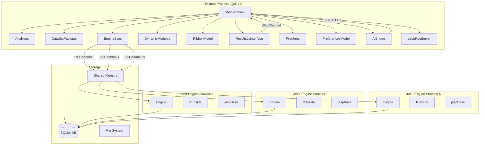
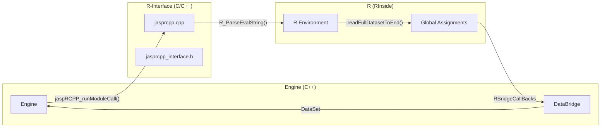
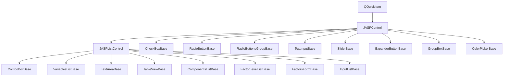
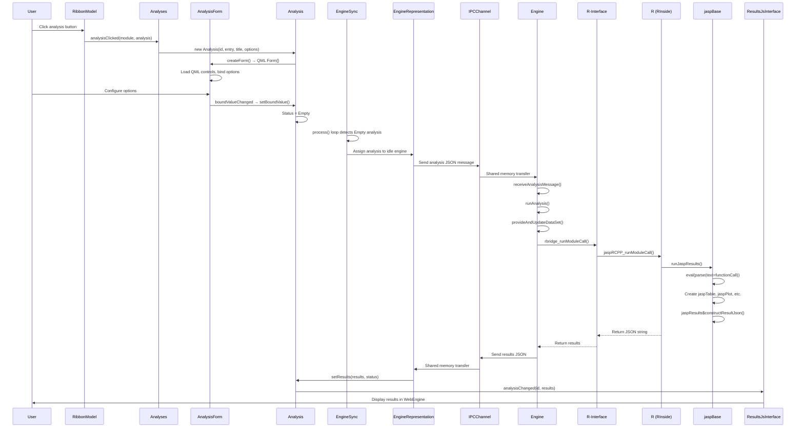
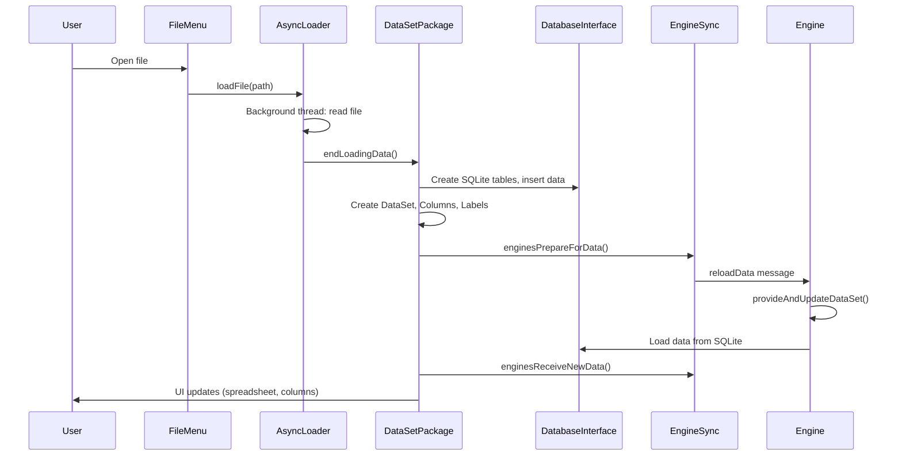
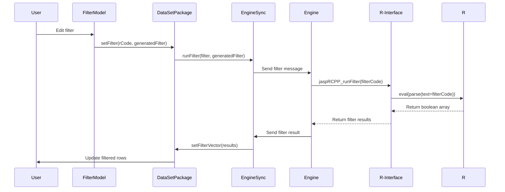
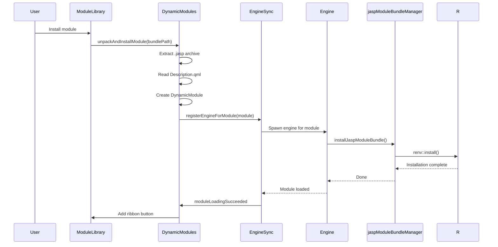

# JASP Codebase — Comprehensive Technical Summary

> **Version**: 0.97.0 | **License**: AGPL-3.0 (core), GPL-2.0+ (analyses) | **Language**: C++20, R, QML/JavaScript  
> **Build System**: CMake + Conan + Ninja | **UI Framework**: Qt 6 (QML + WebEngine) | **Stats Backend**: R (via RInside/Rcpp)  
> **Total Source**: ~1,782 `.cpp` files, ~3,327 `.h` files, ~424 `.qml` files, ~1,520 `.R` files (~862K lines total)

---

## Table of Contents

1. [Project Overview](#1-project-overview)
2. [High-Level Architecture](#2-high-level-architecture)
3. [Directory Structure](#3-directory-structure)
4. [Build System](#4-build-system)
5. [Desktop Application (`Desktop/`)](#5-desktop-application-desktop)
6. [Engine System (`Engine/`)](#6-engine-system-engine)
7. [R-Interface (`R-Interface/`)](#7-r-interface-r-interface)
8. [Common Utilities (`Common/`)](#8-common-utilities-common)
9. [Common Data Layer (`CommonData/`)](#9-common-data-layer-commondata)
10. [QML Components (`QMLComponents/`)](#10-qml-components-qmlcomponents)
11. [Module System](#11-module-system)
12. [Data Management](#12-data-management)
13. [IPC Communication](#13-ipc-communication)
14. [Results Interface](#14-results-interface)
15. [File Menu and Navigation](#15-file-menu-and-navigation)
16. [Preferences and Settings](#16-preferences-and-settings)
17. [AI Bridge](#17-ai-bridge)
18. [RPC System](#18-rpc-system)
19. [Syntax Interface (`SyntaxInterface/`)](#19-syntax-interface-syntaxinterface)
20. [Testing](#20-testing)
21. [Deployment and Packaging](#21-deployment-and-packaging)
22. [Key Classes Reference](#22-key-classes-reference)
23. [Module Catalog](#23-module-catalog)
24. [Data Flow Diagrams](#24-data-flow-diagrams)

---

## 1. Project Overview

**JASP** (Just Another Statistics Program) is a cross-platform desktop application for statistical analysis. It provides a GUI that makes both Bayesian and Frequentist statistics accessible without programming. The application is developed primarily by the University of Amsterdam.

### Key Design Goals

- **No programming required**: Users interact through QML-based forms; R code runs behind the scenes
- **Both Bayesian and Frequentist**: Each module can offer both approaches side by side
- **Reproducible**: Full R syntax generation for every analysis; JASP files bundle data + results + options
- **Extensible**: Plugin-based module system — anyone can create a new statistical module
- **SPSS-like familiarity**: Data spreadsheet view, variable labels, column types

### Technology Stack

| Layer | Technology |
|-------|-----------|
| GUI | Qt 6 / QML (forms, ribbon, file menu) + Qt WebEngine (results pane) |
| Application Logic | C++20 |
| Statistics | R (embedded via RInside/Rcpp) |
| Data Persistence | SQLite (via sqlite3) |
| IPC | Boost.Interprocess shared memory |
| Build | CMake 3.21+ / Conan / Ninja |
| Packaging | CPack (macOS DMG, Windows NSIS) |
| Dependencies | Boost, Qt 6, R, RInside, Rcpp, jsoncpp, libarchive, ReadStat, zlib, fmt, range-v3 |

---

## 2. High-Level Architecture

JASP uses a **multi-process architecture**:



### Process Architecture

1. **Desktop Process** — The main Qt application. Manages the GUI, data, modules, and orchestrates engine processes.
2. **JASPEngine Processes** — Separate OS processes, each embedding R via RInside. Spawned on demand by `EngineSync`, one per active analysis/module. Idle engines shut down after 30 minutes.
3. **Shared Memory IPC** — `IPCChannel` uses Boost.Interprocess for bidirectional JSON message passing between Desktop and each Engine.
4. **SQLite Database** — Shared between Desktop and all Engines (WAL mode for concurrent access). Stores dataset, columns, labels, filters, and analysis state.

### Subsystem Overview

| Subsystem | Directory | Purpose |
|-----------|-----------|---------|
| Desktop Application | `Desktop/` | Main GUI, analysis management, engine sync, data models, results, file I/O |
| Engine Runtime | `Engine/` | R process wrapper, jaspBase R package, module bundle manager |
| R-Interface | `R-Interface/` | C bridge between Engine (C++) and R (RInside/Rcpp) |
| Common Utilities | `Common/` | Shared types, logging, paths, versioning, column encoding |
| Common Data | `CommonData/` | DataSet, Column, Filter, Label, DatabaseInterface, IPCChannel |
| QML Components | `QMLComponents/` | QML controls for analysis forms (69 components), models, R syntax generation |
| Syntax Interface | `SyntaxInterface/` | R-syntax wrapper generation for analyses |
| Modules | `Modules/` | Module settings, install scripts, remote bundle definitions |
| R Package | `Rpkg/` | `jasprpc` — R client for JASP's JSON-RPC API |
| Build Tooling | `Tools/` | CMake modules, platform scripts, package lists |
| Documentation | `Docs/` | Developer guides, building instructions, module tutorials |
| Tests | `Tests/` | Unit tests (GTest-based) for engine, QML, CSV preview |
| Resources | `Resources/` | Example datasets, help files, translations, RPC schema |

---

## 3. Directory Structure

```
jasp-desktop/
├── CMakeLists.txt              # Root build file
├── conanfile.py                # Conan dependency manager config
├── version.txt                 # Version string (0.96.0)
├── CITATION.cff                # Citation metadata
├── CHANGES.md                  # Release notes (all versions)
├── README.md                   # Project readme
│
├── Common/                     # Shared utilities (no Qt dependency for Engine builds)
│   ├── appinfo.{h,cpp}        #   Application name/version/build info
│   ├── columnencoder.{h,cpp}  #   Column name encoding/decoding for safe R interop
│   ├── columntype.{h,cpp}     #   Column type enum (unknown, nominal, ordinal, scale)
│   ├── dirs.{h,cpp}           #   Path resolution (R home, modules, temp, appdata)
│   ├── enginedefinitions.{h,cpp}  #   Enums shared between Desktop and Engine
│   ├── log.{h,cpp}            #   Logging framework
│   ├── tempfiles.{h,cpp}      #   Temporary file management
│   ├── utils.{h,cpp}          #   General utilities
│   ├── version.{h,cpp}        #   Version comparison class
│   └── json/                  #   jsoncpp library
│
├── CommonData/                 # Shared data structures (Desktop + Engine)
│   ├── column.{h,cpp}         #   Single data column (type, values, labels, computed)
│   ├── dataset.{h,cpp}        #   Data table (collection of columns + filter)
│   ├── datasetbasenode.{h,cpp}#   Tree node base with revision tracking
│   ├── databaseinterface.{h,cpp}  #   SQLite abstraction layer (singleton)
│   ├── databridge.{h,cpp}     #   Engine-side data access
│   ├── filter.{h,cpp}         #   Row filter (R code + results vector)
│   ├── label.{h,cpp}          #   Column label/value mapping
│   ├── ipcchannel.{h,cpp}     #   Shared-memory IPC channel
│   ├── rbridge.{h,cpp}        #   R bridge utilities
│   ├── emptyvalues.{h,cpp}    #   Empty/missing value handling
│   ├── columnutils.{h,cpp}    #   Column utility functions
│   ├── jsonutilities.{h,cpp}  #   JSON helper functions
│   ├── archivereader.{h,cpp}  #   ZIP/archive reading
│   ├── internalDbDefinition.sql   #   Database schema
│   ├── createIndexes.sql      #   Database indexes
│   └── jaspBase_*.h           #   Transform/distribution/sampler headers
│
├── Desktop/                    # Main Qt application
│   ├── main.cpp               #   Entry point
│   ├── mainwindow.{h,cpp}     #   Main window (orchestrates everything)
│   ├── CMakeLists.txt         #   Build config
│   │
│   ├── analysis/              #   Analysis management
│   │   ├── analyses.{h,cpp}   #     Collection of all analyses
│   │   └── analysis.{h,cpp}   #     Single analysis instance
│   │
│   ├── data/                  #   Data layer
│   │   ├── datasetpackage.{h,cpp}       #   Central data hub (QAbstractItemModel)
│   │   ├── datasettablemodel.{h,cpp}    #   Table model for spreadsheet view
│   │   ├── columnmodel.{h,cpp}          #   Single column model
│   │   ├── columnsmodel.{h,cpp}         #   All columns model
│   │   ├── computedcolumnmodel.{h,cpp}  #   Computed column management
│   │   ├── filtermodel.{h,cpp}          #   Filter editor model
│   │   ├── workspacemodel.{h,cpp}       #   Workspace metadata
│   │   ├── undostack.{h,cpp}            #   Undo/redo
│   │   ├── asyncloader.{h,cpp}          #   Async file loading
│   │   ├── fileevent.{h,cpp}            #   File I/O event
│   │   ├── jaspencrypt.{h,cpp}          #   Encryption support
│   │   ├── importers/                   #   Data importers (CSV, Excel, ODS, RData, ReadStat, Minitab, Database)
│   │   └── exporters/                   #   Data exporters (CSV, JASP, Results, generic)
│   │
│   ├── engine/                #   Engine management
│   │   ├── enginesync.{h,cpp}           #   Engine orchestrator
│   │   ├── enginerepresentation.{h,cpp} #   Per-engine state machine
│   │   ├── aiBridge.{h,cpp}             #   AI chat bridge (OpenAI SSE)
│   │   └── secretstore.{h,cpp}          #   API key storage
│   │
│   ├── gui/                   #   GUI models
│   │   ├── preferencesmodel.{h,cpp}     #   User preferences (~90 settings)
│   │   ├── aboutmodel.{h,cpp}           #   About dialog
│   │   ├── jaspversionchecker.{h,cpp}   #   Version update checker
│   │   ├── encryptionsettingsmodel.{h,cpp}  #   Encryption settings
│   │   └── pdfdefinition.{h,cpp}        #   PDF export
│   │
│   ├── modules/               #   Module management
│   │   ├── dynamicmodules.{h,cpp}       #   Module manager (install, load, unload)
│   │   ├── installedmodules.{h,cpp}     #   Installed module registry
│   │   ├── modulelibrary.{h,cpp}        #   Module library UI
│   │   ├── ribbonmodel.{h,cpp}          #   Ribbon bar model
│   │   ├── ribbonbutton.{h,cpp}         #   Ribbon button
│   │   ├── ribbonmodelfiltered.{h,cpp}  #   Filtered ribbon
│   │   ├── ribbonmodeluncommon.{h,cpp}  #   Uncommon modules ribbon
│   │   └── menumodel.{h,cpp}            #   Analysis menu model
│   │
│   ├── results/               #   Results display
│   │   ├── resultsjsinterface.{h,cpp}   #   C++ ↔ JS bridge (WebChannel)
│   │   ├── ploteditormodel.{h,cpp}      #   Plot editor
│   │   ├── ploteditoraxismodel.{h,cpp}  #   Plot axis editor
│   │   ├── ploteditorcoordinates.{h,cpp}#   Plot coordinates
│   │   ├── ploteditorreferencelines.{h,cpp} #   Plot reference lines
│   │   └── resultmenumodel.{h,cpp}      #   Results context menu
│   │
│   ├── widgets/               #   Custom widgets
│   │   └── filemenu/          #     File menu subsystem
│   │       ├── filemenu.{h,cpp}         #     Main file menu controller
│   │       ├── recentfiles.{h,cpp}      #     Recent files
│   │       ├── computer.{h,cpp}         #     Local filesystem browser
│   │       ├── osf/                     #     Open Science Framework integration
│   │       └── ...                      #     Data library, auto-saves, etc.
│   │
│   ├── utilities/             #   Utility classes
│   │   ├── application.{h,cpp}          #   QApplication subclass
│   │   ├── helpmodel.{h,cpp}            #   Help viewer
│   │   ├── languagemodel.{h,cpp}        #   i18n language model
│   │   ├── reporter.{h,cpp}             #   Report generation
│   │   ├── csvpreviewmodel.{h,cpp}      #   CSV import preview
│   │   └── settings.{h,cpp}             #   QSettings wrapper
│   │
│   ├── rpc/                   #   JSON-RPC server
│   │   ├── jasprpcserver.{h,cpp}        #   HTTP RPC server
│   │   ├── jasprpcdispatcher.{h,cpp}    #   Method dispatcher
│   │   └── rpcschema.{h,cpp}            #   OpenRPC schema
│   │
│   ├── qquick/                #   Custom QQuick items
│   │   ├── datasetview.{h,cpp}          #   Data spreadsheet view
│   │   └── rcommander.{h,cpp}           #   R console
│   │
│   ├── html/                  #   Web content
│   │   ├── index-jasp.html              #   Results page
│   │   ├── chat.html                    #   AI chat page
│   │   ├── css/                         #   Stylesheets
│   │   ├── js/                          #   JavaScript
│   │   └── img/                         #   Images
│   │
│   ├── resources/             #   Qt resources (QML, icons, etc.)
│   ├── translations/          #   .ts translation files
│   └── po/                    #   PO translation files
│
├── Engine/                     # R engine process
│   ├── main.cpp               #   Engine entry point
│   ├── engine.{h,cpp}         #   Engine class (inherits DataBridge)
│   ├── CMakeLists.txt         #   Build config
│   │
│   ├── jaspBase/              #   jaspBase R package
│   │   ├── DESCRIPTION        #     Package metadata
│   │   ├── NAMESPACE          #     Exports
│   │   ├── R/                 #     R code (~30 files)
│   │   │   ├── common.R       #       runJaspResults(), core analysis framework
│   │   │   ├── writeImage.R   #       Plot rendering
│   │   │   ├── exposeUs.R     #       Public API
│   │   │   ├── moduleInstall.R#       Module installation
│   │   │   ├── jaspDeps.R     #       Dependency tracking
│   │   │   └── ...
│   │   ├── src/               #     C++ (Rcpp) source
│   │   │   ├── jaspResults.cpp#       Top-level results container
│   │   │   ├── jaspContainer.cpp#     Named object collection
│   │   │   ├── jaspTable.cpp  #       Statistical tables
│   │   │   ├── jaspPlot.cpp   #       Plot objects
│   │   │   ├── jaspHtml.cpp   #       HTML output
│   │   │   ├── jaspState.cpp  #       Serializable state
│   │   │   ├── jaspColumn.cpp #       Computed columns
│   │   │   └── ...
│   │   └── tests/             #     R unit tests
│   │
│   └── jaspModuleBundleManager/ #  Module bundle R package
│       ├── R/                 #     Bundle management functions
│       └── ...
│
├── R-Interface/                # C bridge between Engine and R
│   ├── jasprcpp.{h,cpp}       #   R/Rcpp integration (init, runModuleCall, runFilter, etc.)
│   ├── jasprcpp_interface.h   #   C interface definitions (RBridgeCallBacks, extern "C" functions)
│   └── CMakeLists.txt         #   Build config (MinGW on Windows)
│
├── QMLComponents/              # QML controls library
│   ├── CMakeLists.txt         #   Build config (static Qt QML module URI: JASP.Controls)
│   ├── analysisform.{h,cpp}   #   QML Form{} backend
│   ├── analysisbase.{h,cpp}   #   Abstract analysis base
│   ├── jasptheme.{h,cpp}      #   Theme singleton (~760 lines)
│   │
│   ├── controls/              #   C++ backends for QML controls
│   │   ├── jaspcontrol.{h,cpp}        #   Base control class
│   │   ├── jasplistcontrol.{h,cpp}    #   Base list control
│   │   ├── checkboxbase.{h,cpp}       #   CheckBox backend
│   │   ├── comboboxbase.{h,cpp}       #   DropDown/ComboBox backend
│   │   ├── variableslistbase.{h,cpp}  #   VariablesList backend
│   │   ├── textinputbase.{h,cpp}      #   TextField backend
│   │   ├── textareabase.{h,cpp}       #   TextArea backend
│   │   ├── tableviewbase.{h,cpp}      #   TableView backend
│   │   ├── componentslistbase.{h,cpp} #   ComponentsList backend
│   │   ├── radiobuttonsgroupbase.{h,cpp} # RadioButtonGroup backend
│   │   ├── sliderbase.{h,cpp}         #   Slider backend
│   │   ├── expanderbuttonbase.{h,cpp} #   Section backend
│   │   ├── sourceitem.{h,cpp}         #   Data sourcing
│   │   └── rowcontrols.{h,cpp}        #   Row-level controls
│   │
│   ├── boundcontrols/         #   Option binding implementations
│   │   ├── boundcontrol.h             #   Interface
│   │   ├── boundcontrolbase.{h,cpp}   #   Default implementation
│   │   ├── boundcontrolterms.{h,cpp}  #   Variable list binding
│   │   ├── boundcontroltableview.{h,cpp} #  Table binding
│   │   └── ...                        #   12+ specialized bindings
│   │
│   ├── models/                #   Qt models for list controls
│   │   ├── listmodel.{h,cpp}          #   Base model
│   │   ├── listmodeldraggable.{h,cpp} #   Drag-and-drop model
│   │   ├── listmodeltermsavailable.{h,cpp}  # Available variables
│   │   ├── listmodelassignedinterface.{h,cpp} # Assigned variables interface
│   │   ├── listmodeltermsassigned.{h,cpp}    # Assigned variables
│   │   ├── listmodelinteractionassigned.{h,cpp} # Interaction terms
│   │   └── ...                        #   15+ model classes
│   │
│   ├── rsyntax/               #   R syntax generation
│   │   ├── rsyntax.{h,cpp}            #   Main R syntax generator
│   │   ├── formulabase.{h,cpp}        #   QML Formula{} element
│   │   ├── formulaparser.{h,cpp}      #   R formula parser
│   │   └── formulasource.{h,cpp}      #   Formula data source
│   │
│   ├── components/JASP/       #   QML files (69 components)
│   │   └── Controls/          #     All JASP.Controls QML files
│   │
│   ├── modules/               #   Module infrastructure
│   │   ├── dynamicmodule.{h,cpp}      #   Single module representation
│   │   ├── analysisentry.{h,cpp}      #   Analysis entry in module menu
│   │   ├── description.{h,cpp}        #   Description.qml parser
│   │   └── upgrader/                  #   Module upgrade system
│   │
│   ├── icons/                 #   Icon resources
│   └── doc/                   #   Generated documentation
│
├── SyntaxInterface/            # R-syntax wrapper generation
│   ├── syntaxbridge.{h,cpp}   #   Bridge for generating R wrappers
│   ├── syntaxbridge_interface.h #  C interface
│   └── Dummy.qml              #   Placeholder QML
│
├── Modules/                    # Module definitions
│   ├── modules-settings.json  #   Common (7) and extra (30) module lists
│   ├── remote-bundles.json    #   Remote bundle URLs
│   ├── install-modules.R.in   #   Module install script template
│   ├── install-renv.R.in      #   renv install script
│   └── local/                 #   Local module builds (empty by default)
│
├── Rpkg/                       # jasprpc R package
│   ├── DESCRIPTION            #   R client for JASP JSON-RPC API
│   ├── R/                     #   R functions
│   └── tests/                 #   Tests
│
├── Tools/                      # Build and deployment tooling
│   ├── CMake/                 #   CMake modules (20 files)
│   │   ├── Config.cmake       #     Build options
│   │   ├── Conan.cmake        #     Conan dependency setup
│   │   ├── Libraries.cmake    #     Library detection
│   │   ├── R.cmake            #     R environment setup
│   │   ├── JASP.cmake         #     JASP-specific config
│   │   ├── Modules.cmake      #     Module build/install
│   │   ├── Install.cmake      #     Installation logic
│   │   └── ...
│   ├── macOS/                 #   macOS-specific scripts
│   ├── windows/               #   Windows-specific scripts
│   ├── debian/                #   Debian packaging
│   ├── flatpak/               #   Flatpak packaging
│   └── *.R                    #   R helper scripts
│
├── Tests/                      # Test suite
│   ├── testall.{h,cpp}        #   Main test runner
│   ├── testengine.{h,cpp}     #   Engine tests
│   ├── testqml.{h,cpp}        #   QML tests
│   └── qmlTests/              #   QML-specific tests
│
├── Docs/                       # Documentation
│   └── development/           #   Developer guides
│
└── Resources/                  # Static resources
    ├── Data Sets/             #   Example datasets
    ├── Help/                  #   Help content
    ├── Translations/          #   Translation files
    ├── OSF/                   #   OSF integration resources
    └── JASP_RPC.json          #   OpenRPC specification
```

---

## 4. Build System

### CMake Structure

The root `CMakeLists.txt` orchestrates the entire build:

```
CMakeLists.txt (root)
├── Tools/CMake/Config.cmake       # Build options (BUILD_TESTS, USE_QT_STATIC_LIBS, etc.)
├── Tools/CMake/Conan.cmake        # Conan dependency manager integration
├── Tools/CMake/Programs.cmake     # Find programs (git, bison, flex)
├── Tools/CMake/Libraries.cmake    # Find libraries (Boost, Qt, R, etc.)
├── Tools/CMake/Dependencies.cmake # Irregular deps (ReadStat, etc.)
├── Tools/CMake/JASP.cmake         # JASP version, paths
├── Tools/CMake/R.cmake            # R environment, R_HOME_PATH
├── Tools/CMake/Modules.cmake      # Module build/install
├── Tools/CMake/Install.cmake      # Installation
├── Tools/CMake/Pack.cmake         # CPack packaging
│
├── add_subdirectory(Common)
├── add_subdirectory(CommonData)
├── add_subdirectory(QMLComponents)
├── add_subdirectory(SyntaxInterface)
├── add_subdirectory(R-Interface)  # MinGW on Windows
├── add_subdirectory(Engine)
├── add_subdirectory(Desktop)
└── add_subdirectory(Tests)        # If BUILD_TESTS
```

### Conan Dependencies

Defined in `conanfile.py`:

| Package | Purpose |
|---------|---------|
| `boost` | Shared memory IPC, UUID, algorithms |
| `jsoncpp` | JSON parsing/serialization |
| `libarchive` | ZIP/JASP file reading |
| `readstat` | SPSS/SAS/Stata file import |
| `zlib` | Compression |
| `fmt` | String formatting |
| `range-v3` | Range algorithms |
| `semver` | Semantic versioning |

Qt 6 is found separately (not via Conan) — Qt Core, Gui, Widgets, Qml, Quick, QuickLayouts, QuickControls2, WebEngine, WebChannel, Network, Svg, Test.

### Platform-Specific Builds

| Platform | Notes |
|----------|-------|
| **macOS** | Deployment target 12.0 (Monterey), universal/arm64/x86_64, DMG packaging |
| **Windows** | MSVC for Desktop/Engine, MinGW for R-Interface (Rtools), NSIS installer |
| **Linux** | GCC/Clang, Debian/Flatpak/AppImage packaging |

### R-Interface Special Build

On Windows, `R-Interface` must be built with MinGW (Rtools) because RInside requires it. The root CMakeLists.txt creates a custom target that invokes MinGW CMake separately:

```cmake
add_custom_target(R-Interface
    COMMAND ${CMAKE_COMMAND} -G "MinGW Makefiles" -S . -B ${CMAKE_BINARY_DIR}/R-Interface
    COMMAND ${CMAKE_COMMAND} --build ${CMAKE_BINARY_DIR}/R-Interface
)
```

On Linux/macOS, R-Interface is a static library linked directly into the Engine.

---

## 5. Desktop Application (`Desktop/`)

### Entry Point (`main.cpp`)

The `main()` function:

1. **Parses arguments** — file paths, unit test mode, save mode, timeout, database JSON, reporting directory, safe graphics mode
2. **Creates junctions** (Windows only) — for module library symlinks
3. **Sets up Qt** — `Application` (custom QApplication subclass), `PlotSchemeHandler`, `ImgSchemeHandler`
4. **Creates `MainWindow`** — the singleton that orchestrates everything
5. **Runs unit tests** if requested, then exits
6. **Enters event loop** — `a.exec()`

### MainWindow (`mainwindow.h/cpp`)

The central orchestrator. It is **not** a QWidget but a `QObject` that manages QML loading. Key responsibilities:

- **Instantiates all models** — `EngineSync`, `Analyses`, `DataSetPackage`, `DynamicModules`, `RibbonModel`, `PreferencesModel`, `ResultsJsInterface`, `FileMenu`, `HelpModel`, `PlotEditorModel`, `LanguageModel`, `WorkspaceModel`, `ModuleLibrary`, `CsvPreviewModel`, `AiBridge`, `JaspRpcServer`, etc.
- **Loads QML** — `loadQml()` loads `qrc:///components/JASP/Widgets/MainWindow.qml` via `QQmlApplicationEngine`
- **Makes connections** — `makeConnections()` wires up all signals/slots between models
- **Handles file I/O** — `open()`, `showNewData()`, save operations
- **Manages progress** — progress bar for loading/analyses
- **Version checking** — `JaspVersionChecker` for updates

### Key Subsystems in Desktop

#### Analysis Management (`Desktop/analysis/`)

**`Analyses`** — Collection manager for all running analyses. QAbstractListModel.

**`Analysis`** — A single analysis instance. Inherits `AnalysisBase` (from QMLComponents). Key aspects:

- **Status state machine**: `Empty → Running → Complete` (or `Aborted`, `FatalError`, `ValidationError`, `SaveImg`, `EditImg`, `RewriteImgs`)
- **Options**: `_options` (Json::Value) — the analysis configuration
- **Results**: `_results` (Json::Value) — the analysis output
- **QML Form**: `AnalysisForm*` — the QML UI for the analysis
- **R file**: `_rfile` — the R script to execute
- **Dynamic module**: `_dynamicModule` — which module this analysis belongs to
- **Signals**: `statusChanged`, `resultsChangedSignal`, `imageSavedSignal`, etc.

Lifecycle:
1. User clicks analysis in ribbon → `Analyses` creates `Analysis` object
2. `Analysis::createForm()` instantiates the QML `Form{}`
3. User configures options → `AnalysisForm` updates `boundValues`
4. `Analysis::run()` sets status to `Empty` → `EngineSync` picks it up
5. Engine runs R code → results returned → `Analysis::setResults()` → UI updates

#### Engine Management (`Desktop/engine/`)

**`EngineSync`** — The orchestrator for all engine processes. QAbstractListModel. Detailed in [Section 6](#6-engine-system-engine).

**`EngineRepresentation`** — State machine for a single engine. Tracks:
- `engineState` — current state (idle, analysis, filter, rCode, etc.)
- `analysisStatus` — status of the current analysis
- `_runsAnalysis` / `_runsUtility` / `_runsRCmd` — capability flags
- `_process` (QProcess*) — the child process handle
- `_channel` (IPCChannel*) — the IPC channel

**`AiBridge`** — AI chat bridge. Detailed in [Section 17](#17-ai-bridge).

**`SecretStore`** — Secure storage for API keys.

#### Data Layer (`Desktop/data/`)

**`DataSetPackage`** — The central data hub. QAbstractItemModel (tree). Singleton. Detailed in [Section 12](#12-data-management).

**`DataSetTableModel`** — QAbstractTableModel for the spreadsheet view.

**`ColumnsModel`** — Model for the columns list.

**`ColumnModel`** — Model for a single column's properties.

**`ComputedColumnModel`** — Manages computed columns (R code or constructor).

**`FilterModel`** — Model for the filter editor.

**`WorkspaceModel`** — Workspace metadata (name, description, empty values).

**`UndoStack`** — Undo/redo for data operations.

**`AsyncLoader` / `AsyncLoaderThread`** — Background file loading.

**`FileEvent`** — Event object for async file I/O coordination.

#### Data Importers (`Desktop/data/importers/`)

| Importer | Formats |
|----------|---------|
| `CSVImporter` | CSV, TSV (with delimiter detection) |
| `ExcelImporter` | XLSX, XLS |
| `ODSImporter` | ODS (LibreOffice) |
| `RDataImporter` | RData, RDS (via ReadStat) |
| `ReadStatImporter` | SPSS (.sav), SAS (.sas7bdat), Stata (.dta) |
| `MinitabImporter` | Minitab (.mtw) |
| `DatabaseImporter` | SQL databases (MySQL, PostgreSQL, SQLite) |
| `JASPImporter` | JASP files (.jasp — ZIP archives) |

#### Data Exporters (`Desktop/data/exporters/`)

| Exporter | Formats |
|----------|---------|
| `DataExporter` | CSV |
| `JASPExporter` | JASP files |
| `ResultExporter` | HTML results |

#### GUI Models (`Desktop/gui/`)

**`PreferencesModel`** — ~90 user preferences. QML-exposed. Categories:
- Display (UI scale, PPI, fonts, theme, decimal settings)
- Developer (dev mode, module folder, logging)
- Engine (max engines, sandbox, CRAN repo, GitHub PAT)
- AI (endpoint, API key, model, system prompt)
- General (language, auto-save, update checks, PDF export)

**`AboutModel`** — About dialog data.

**`JaspVersionChecker`** — Checks for JASP updates.

**`EncryptionSettingsModel`** — Encryption configuration.

**`PDFDefinition`** — PDF export configuration.

#### Module Management (`Desktop/modules/`)

**`DynamicModules`** — Singleton manager for all modules. Detailed in [Section 11](#11-module-system).

**`InstalledModules`** — Reads filesystem to report available modules.

**`ModuleLibrary`** — QML-exposed module library UI.

**`RibbonModel`** — The ribbon bar model. Two rows:
- Row 0: Statistical module buttons (from `InstalledModules`)
- Row 1: Data-mode buttons (new, resize, insert, remove, sync, undo, redo)

**`RibbonButton`** — A single ribbon button. Can be module-backed, function-backed, or separator.

**`MenuModel`** — Dropdown menu for a ribbon button (lists analyses in a module).

#### Results (`Desktop/results/`)

**`ResultsJsInterface`** — C++ ↔ JavaScript bridge for the WebEngine results pane. Detailed in [Section 14](#14-results-interface).

**`PlotEditorModel`** — Model for editing plots (axis ranges, labels, etc.).

**`PlotEditorAxisModel`** — Model for plot axis properties.

**`PlotEditorCoordinates`** — Plot coordinate system.

**`PlotEditorReferenceLines`** — Plot reference lines.

**`ResultMenuModel`** — Context menu for results.

#### Widgets (`Desktop/widgets/`)

**`FileMenu`** — File operations controller. Sub-models: RecentFiles, CurrentDataFile, Computer, OSF, DataLibrary, Database, AutoSaves, ActionButtons, ResourceButtons. Detailed in [Section 15](#15-file-menu-and-navigation).

#### Utilities (`Desktop/utilities/`)

**`Application`** — Custom QApplication subclass.

**`HelpModel`** — Help viewer model.

**`LanguageModel`** — i18n language model.

**`Reporter`** — Report generation.

**`CsvPreviewModel`** — CSV import preview.

**`Settings`** — QSettings wrapper.

**`ProcessHelper`** — Process management utilities.

**`PlotSchemeHandler` / `ImgSchemeHandler`** — Custom URL scheme handlers for plots and images.

#### RPC (`Desktop/rpc/`)

**`JaspRpcServer`** — HTTP JSON-RPC 2.0 server.

**`JaspRpcDispatcher`** — Method dispatcher for RPC calls.

**`RpcSchema`** — OpenRPC schema definition.

Detailed in [Section 18](#18-rpc-system).

#### Custom QQuick Items (`Desktop/qquick/`)

**`DataSetView`** — Custom QQuickPaintedItem for the data spreadsheet.

**`RCommander`** — R console widget.

#### HTML/JS (`Desktop/html/`)

- `index-jasp.html` — Main results page (loaded in WebEngine)
- `chat.html` — AI chat page (deep-chat component)
- `css/` — Stylesheets for results
- `js/` — JavaScript for results rendering, WebChannel
- `img/` — Images

---

## 6. Engine System (`Engine/`)

### Architecture

Each JASPEngine is a **separate OS process** that:

1. Embeds R via RInside
2. Communicates with Desktop via IPCChannel (shared memory)
3. Accesses data via SQLite (shared with Desktop)
4. Executes one analysis/filter/compute-column at a time

### Engine Class (`Engine/engine.h`)

Inherits `DataBridge` for data access. Key aspects:

- **Main loop** (`run()`): `do { receiveMessages(); switch(state) { ... } } while (!stopped)`
- **State machine** (`engineState`): `initializing → idle → analysis/filter/rCode/computeColumn → idle → stopped`
- **Message handling**: `receiveAnalysisMessage()`, `receiveFilterMessage()`, `receiveRCodeMessage()`, `receiveComputeColumnMessage()`, `receiveModuleRequestMessage()`
- **R execution**: Calls `rbridge_runModuleCall()` (which calls `jaspRCPP_runModuleCall()`)
- **Data access**: `provideAndUpdateDataSet()` loads/refreshes the DataSet from SQLite
- **Column encoding**: `ColumnEncoder` encodes column names for safe R interop
- **Heartbeat**: `parentAlive()` checks if the Desktop process is still running

### Engine Entry Point (`Engine/main.cpp`)

```cpp
int main(int argc, char *argv[]) {
    // Parse args: channel number, parent PID, log file base, log mode
    Engine engine(slaveNo, parentPID);
    engine.run();  // Main loop
}
```

### Engine States

```
engineState: initializing, idle, analysis, filter, filterByName, rCode,
             computeColumn, moduleInstallRequest, moduleUninstallRequest,
             moduleLoadRequest, pauseRequested, paused, resuming,
             stopRequested, stopped, logCfg, settings, killed, reloadData
```

### jaspBase R Package (`Engine/jaspBase/`)

The foundation for all JASP analyses. Version 0.20.4.

#### R Layer (`R/`)

**`common.R`** — Core framework:
- `runJaspResults(name, title, initFunName, ...)` — Main entry point called by `jaspRCPP_runModuleCall()`
- Creates `jaspResults` C++ object, wraps in R6 `jaspResultsR`
- Parses options and data keys
- `eval(parse(text=functionCall))` — Evaluates the analysis function
- Catches errors (validation vs fatal), builds result JSON

**`writeImage.R`** — Plot rendering via `ragg::agg_png()`

**`exposeUs.R`** — Public API: `readDataSetToEnd()`, `.v()`, `.unv()`, etc.

**`moduleInstall.R`** — Module installation via renv

**`jaspDeps.R`** — Dependency tracking system

**`commonerrorcheck.R`** — Common error checking utilities

**`memoryMaintenance.R`** — Memory cleanup between analyses

**`transformFunctions.R`** — Box-Cox, Johnson, Yeo-Johnson transforms

#### C++ Layer (`src/`)

Rcpp-exposed classes (registered via `RCPP_MODULE(jaspResults)`):

| Class | Purpose |
|-------|---------|
| `jaspObject` | Base — title, warnings, messages, dependencies, JSON serialization |
| `jaspContainer` | Named collection of child objects |
| `jaspResults` | Top-level container — send/poll, progress bars, state persistence, write seals |
| `jaspTable` | Statistical tables with columns, rows, footnotes, overtitles |
| `jaspPlot` | Plots with aspect ratio, dimensions, PNG paths, interactive JSON |
| `jaspHtml` | HTML output |
| `jaspState` | Serializable R objects for state persistence |
| `jaspColumn` | Computed columns written back to dataset |
| `jaspReport` | Report generation |
| `jaspQmlSource` | Dynamic QML source |

### jaspModuleBundleManager (`Engine/jaspModuleBundleManager/`)

R package for managing module bundles (`.JASPModule` files).

Key functions:
- `installJaspModuleBundle()` — Extracts bundle, installs binary packages, creates symlinks
- `createJaspModuleBundle()` — Packages installed module into distributable bundle
- `uninstallJaspModuleBundle()` — Removes module
- `repairJaspModuleBundle()` — Downloads missing packages

---

## 7. R-Interface (`R-Interface/`)

### Purpose

The C bridge between the Engine (C++) and R (RInside/Rcpp). Compiled as a shared library (`R-Interface.dll` / `libR-Interface.so`).

### Architecture



### Interface Definition (`jasprcpp_interface.h`)

#### Data Structures

```c
struct RBridgeColumn {
    char*   name;
    bool    isScale, isOrdinal, dropLevels;
    double* doubles;
    int*    ints;
    char**  labels;
    size_t  nbRows, nbLabels;
};

struct RBridgeColumnDescription {
    int     type;
    char*   name;
    bool    isScale, isOrdinal;
    char**  labels;
    size_t  nbLabels;
};
```

#### Callbacks (`RBridgeCallBacks`)

| Callback | Purpose |
|----------|---------|
| `readDataSetCB` | Read specific columns from dataset |
| `readFullDataSetCB` | Read all columns |
| `readFullFilteredDataSetCB` | Read filtered columns |
| `readDataColumnNamesCB` | Get column names |
| `readDataSetDescriptionCB` | Get column descriptions |
| `requestTempFileNameCB` | Request temp file |
| `runCallbackCB` | Progress bar callback to Desktop |
| `dataSetGetColumnType` | Get column type |
| `dataSetCreateColumn` | Create new column |
| `dataSetDeleteColumn` | Delete column |
| `dataSetColumnAsDataAndType` | Set column data and type |
| `dataSetRowCount` | Get row count |
| `encoder` / `decoder` | Column name encoding/decoding |

#### Exported Functions

| Function | Purpose |
|----------|---------|
| `jaspRCPP_init()` | Initialize R environment, register native functions |
| `jaspRCPP_init_jaspBase()` | Load jaspBase package, set up function pointers |
| `jaspRCPP_runModuleCall()` | Execute an analysis |
| `jaspRCPP_saveImage()` | Save a plot to file |
| `jaspRCPP_editImage()` | Edit a plot |
| `jaspRCPP_rewriteImages()` | Rewrite all plots |
| `jaspRCPP_evalRCode()` | Evaluate arbitrary R code |
| `jaspRCPP_runFilter()` | Run a data filter |
| `jaspRCPP_runScript()` | Run a script |
| `jaspRCPP_purgeGlobalEnvironment()` | Clean up R environment |

### Initialization Sequence

1. `jaspRCPP_init(buildYear, version, callbacks, ...)`:
   - Creates `RInside()` instance (embedded R)
   - Registers ~40 C++ functions into R's global environment as `Rcpp::InternalFunction`
   - Loads `library(methods)`
   - Injects friendly R functions (`source`, `install.packages`, etc.)

2. `jaspRCPP_init_jaspBase()`:
   - Passes C++ function pointers to jaspBase via `Rcpp::XPtr`
   - Calls `jaspBase:::setColumnFuncs()`, `jaspBase:::setSendFunc()`, etc.
   - `library(jaspBase)`

3. `.initializeDoNotRemoveList()` — Snapshots global env variables to preserve between analyses

### Column Name Encoding

A critical feature — column names with special characters are encoded/decoded transparently through `ColumnEncoder`. This ensures safe passage through R and JSON.

---

## 8. Common Utilities (`Common/`)

Shared between Desktop and Engine. No Qt dependency (for Engine builds).

| File | Purpose |
|------|---------|
| `appinfo.{h,cpp}` | Application name, version, build year, company |
| `columnencoder.{h,cpp}` | Column name encoding/decoding for safe R interop |
| `columntype.{h,cpp}` | Column type enum: `unknown`, `nominal`, `ordinal`, `scale` |
| `dirs.{h,cpp}` | Path resolution: R home, modules, temp, appdata, documents |
| `enginedefinitions.{h,cpp}` | Enums shared between Desktop and Engine (see below) |
| `log.{h,cpp}` | Logging framework with levels (trace, debug, info, warning, error, fatal) |
| `tempfiles.{h,cpp}` | Temporary file management |
| `utils.{h,cpp}` | General utilities (string, file, process) |
| `version.{h,cpp}` | Semantic version comparison class |
| `timers.{h,cpp}` | Performance timers |
| `processinfo.{h,cpp}` | Process information |
| `otoolstuff.{h,cpp}` | macOS otool integration |
| `r_functionwhitelist.{h,cpp}` | Whitelist of safe R functions |
| `enumutilities.h` | Template-based enum ↔ string conversion |
| `stringutils.h` | String utilities |
| `common.h` | Common includes |

### Engine Definitions (`enginedefinitions.h`)

Shared enums with automatic string conversion:

```cpp
DECLARE_ENUM(engineState,          initializing, idle, analysis, filter, filterByName,
             rCode, computeColumn, moduleInstallRequest, moduleUninstallRequest,
             moduleLoadRequest, pauseRequested, paused, resuming, stopRequested,
             stopped, logCfg, settings, killed, reloadData);

DECLARE_ENUM(performType,          run, abort, saveImg, editImg, rewriteImgs);
DECLARE_ENUM(analysisResultStatus, validationError, fatalError, imageSaved, imageEdited,
             imagesRewritten, complete, running, changed, waiting);
DECLARE_ENUM(moduleStatus,         initializing, installNeeded, uninstallNeeded,
             loading, readyForUse, error);
DECLARE_ENUM(engineAnalysisStatus, empty, toRun, running, changed, complete, error,
             exception, aborted, stopped, saveImg, editImg, rewriteImgs, synchingData);
```

---

## 9. Common Data Layer (`CommonData/`)

Shared between Desktop and Engine. Contains the core data structures.

### DataSetBaseNode (`datasetbasenode.{h,cpp}`)

Base class for the data tree hierarchy:

```cpp
class DataSetBaseNode {
    enum dataSetBaseNodeType { unknown, dataSet, data, filters, filter, column, label };
    DataSetBaseNode* _parent;
    std::vector<DataSetBaseNode*> _children;
    int _revision;
    // Tree operations, revision tracking
};
```

### DataSet (`dataset.{h,cpp}`)

The data table. Inherits `DataSetBaseNode`.

| Member | Type | Purpose |
|--------|------|---------|
| `_columns` | `vector<Column*>` | Column data |
| `_filter` | `Filter*` | Default filter |
| `_emptyValues` | `EmptyValues*` | Workspace empty values |
| `_dataFilePath` | `string` | Source file path |
| `_databaseJson` | `Json::Value` | Database connection info |
| `_csvDelimiter` | `char` | CSV delimiter |

Key methods: `dbCreate()`, `dbUpdate()`, `dbLoad()`, `dbDelete()`, `insertColumn()`, `removeColumn()`, `setRowCount()`, `checkForUpdates()`, `beginBatchedToDB()`/`endBatchedToDB()`.

### Column (`column.{h,cpp}`)

A single data column. Inherits `DataSetBaseNode`.

| Member | Type | Purpose |
|--------|------|---------|
| `_ints` | `intvec` | Integer-encoded values (nominal/ordinal) |
| `_dbls` | `doublevec` | Double values (scale) |
| `_strs` | `stringvec` | String values (display) |
| `_labels` | `vector<Label*>` | Label definitions |
| `_type` | `columnType` | `unknown`, `nominal`, `ordinal`, `scale` |
| `_rCode` | `string` | R code for computed columns |
| `_computeFilter` | `string` | Row-level filter |
| `_codeType` | `computedColumnType` | `rCode` or `constructor` |
| `_invalidated` | `bool` | Needs recomputation |
| `_dependsOnColumns` | `stringset` | Dependency tracking |

Label management: Multiple lookup maps (`_labelByIntsIdMap`, `_labelByValDis`, `_labelsByValue`, `_labelsByDisplay`).

### Label (`label.{h,cpp}`)

A label/value mapping:

| Member | Type | Purpose |
|--------|------|---------|
| `_intsId` | `int` | Integer ID |
| `_originalValue` | `string` | Original value |
| `_display` | `string` | Display string |
| `_filterAllow` | `bool` | Whether this label passes the filter |
| `_description` | `string` | Label description |

### Filter (`filter.{h,cpp}`)

A data filter. Inherits `DataSetBaseNode`.

| Member | Type | Purpose |
|--------|------|---------|
| `_rFilter` | `string` | User-entered R filter expression |
| `_generatedFilter` | `string` | Auto-generated R code |
| `_constructorJson` | `Json::Value` | Easy filter builder JSON |
| `_filtered` | `vector<bool>` | Per-row filter result |
| `_filteredRowCount` | `int` | Rows passing filter |
| `_errorMsg` | `string` | R execution error |

Default filter: `generatedFilter <- rep(TRUE, rowcount)`

### DatabaseInterface (`databaseinterface.{h,cpp}`)

The SQLite abstraction layer. Singleton. Thread-safe (per-thread `sqlite3*` connections).

| Category | Methods |
|----------|---------|
| DataSet | `dataSetGetId()`, `dataSetExists()`, `dataSetDelete()`, `dataSetInsert()`, `dataSetUpdate()`, `dataSetLoad()` |
| Column | `columnInsert()`, `columnDelete()`, `columnSetType()`, `columnSetName()`, `columnSetValues()`, `columnGetValues()` |
| Filter | `filterGetId()`, `filterSelect()`, `filterWrite()`, `filterInsert()`, `filterUpdate()`, `filterLoad()` |
| Label | `labelsClear()`, `labelAdd()`, `labelSet()`, `labelDelete()`, `labelLoad()`, `labelsLoad()` |
| Transaction | `transactionWriteBegin()`/`transactionWriteEnd()`, `transactionReadBegin()`/`transactionReadEnd()` |

### DataBridge (`databridge.{h,cpp}`)

Engine-side data access. Used by JASPEngine processes.

- `provideAndUpdateDataSet()` — Returns DataSet pointer, loading from DB if needed
- `createColumn()`, `deleteColumn()`, `setColumnDataAndType()` — Column CRUD from R
- `getColumnType()`, `getColumnAnalysisId()` — Column metadata
- `provideJaspResultsFileName()`, `provideStateFileName()`, `provideTempFileName()` — File paths

### IPCChannel (`ipcchannel.{h,cpp}`)

Bidirectional string channel via Boost.Interprocess shared memory. Detailed in [Section 13](#13-ipc-communication).

### EmptyValues (`emptyvalues.{h,cpp}`)

Workspace-wide and per-column empty value definitions (e.g., `""`, `"NA"`, `"NaN"`, `"."`).

### ColumnUtils (`columnutils.{h,cpp}`)

Column utility functions for type conversion, value handling.

### ArchiveReader (`archivereader.{h,cpp}`)

ZIP/archive reading via libarchive. Used for JASP files.

### JSON Utilities (`jsonutilities.{h,cpp}`)

JSON helper functions.

---

## 10. QML Components (`QMLComponents/`)

A static Qt QML module (`JASP.Controls`, version 1.0) providing 69 QML components for analysis forms.

### Build Configuration

```cmake
# URI: JASP.Controls, version 1.0
# Links: Qt::Core, Qt::Gui, Qt::Widgets, Qt::Qml, Qt::Quick, Qt::QuickLayouts, Qt::QuickControls2
# Dependencies: Common, CommonData
```

### Control Hierarchy



### JASPControl (Base Class)

Every JASP QML control inherits from `JASPControl`. Key properties:

| Property | Type | Purpose |
|----------|------|---------|
| `name` | string | Option name this control maps to |
| `title` | string | Human-visible label |
| `isBound` | bool | Whether bound to an analysis option |
| `isDependency` | bool | Whether other controls depend on this |
| `hasError` / `hasWarning` | bool | Validation state |
| `parentListView` | JASPListControl | Parent list (if nested) |
| `childControlsArea` | Item | QML item for child controls |

Enums:
- `ControlType` — 21 types (DefaultControl, Expander, CheckBox, Switch, TextField, RadioButton, RadioButtonGroup, VariablesListView, ComboBox, FactorLevelList, InputListView, TableView, Slider, TextArea, Button, FactorsForm, ComponentsList, GroupBox, TabView, VariablesForm, ColorPicker)
- `DropMode` — DropNone, DropInsert, DropReplace
- `ListViewType` — AssignedVariables, Interaction, AvailableVariables, RepeatedMeasures, Layers
- `CombinationType` — NoCombination, CombinationCross, CombinationInteraction, Combination2Way–Combination5Way
- `TextType` — TextTypeDefault, TextTypeModel, TextTypeRcode, TextTypeJAGSmodel, TextTypeSource, TextTypeLavaan, TextTypeMetaSem, TextTypeCSem
- `ModelType` — Simple, GridInput, CustomContrasts, MultinomialChi2Model, JAGSDataInputModel, FilteredDataEntryModel
- `ItemType` — String, Integer, Double

Key functionality:
- Dependency tracking (`_depends` set, `addDependency()`/`removeDependency()`)
- Error/warning management (`addControlError()`, `clearControlError()`)
- R script execution (`runRScript()`, `rScriptDoneHandler()`)
- Help generation (`generateMDHelp()`, `generateDoxygenHelp()`)
- Parent key system for nested option structures

### JASPListControl (List Base)

Base for all list-based controls. Adds:

| Property | Type | Purpose |
|----------|------|---------|
| `model` | ListModel* | Backing model |
| `source` / `rSource` / `values` | variant | Data sources |
| `optionKey` | string | Key in JSON option structure |
| `rowComponent` | Component | Per-row QML component |
| `maxRows` | int | Maximum rows |
| `containsVariables` / `containsInteractions` | bool | Content type flags |
| `allowedColumns` | var | Column type constraints |

### Concrete Controls

| QML Component | C++ Backend | Bound? | Purpose |
|---------------|-------------|--------|---------|
| `CheckBox` | `CheckBoxBase` | Yes | Boolean toggle |
| `Switch` | `CheckBoxBase` | Yes | Switch toggle |
| `DropDown` | `ComboBoxBase` | Yes | Dropdown selection |
| `TextField` | `TextInputBase` | Yes | Text input |
| `IntegerField` | `TextInputBase` | Yes | Integer input |
| `DoubleField` | `TextInputBase` | Yes | Double input |
| `PercentField` | `TextInputBase` | Yes | Percentage input |
| `CIField` | `TextInputBase` | Yes | Confidence interval input |
| `FormulaField` | `TextInputBase` | Yes | Formula input |
| `Slider` | `SliderBase` | Yes | Slider |
| `RadioButton` | `RadioButtonBase` | No | Radio button (group is bound) |
| `RadioButtonGroup` | `RadioButtonsGroupBase` | Yes | Radio button group |
| `VariablesList` | `VariablesListBase` | Yes | Variable list |
| `AvailableVariablesList` | `VariablesListBase` | Yes | Available variables |
| `AssignedVariablesList` | `VariablesListBase` | Yes | Assigned variables |
| `TextArea` | `TextAreaBase` | Yes | Text area (R code) |
| `JAGSTextArea` | `TextAreaBase` | Yes | JAGS model text area |
| `TableView` | `TableViewBase` | Yes | Table input |
| `SimpleTableView` | `TableViewBase` | Yes | Simple table |
| `ComponentsList` | `ComponentsListBase` | Yes | Dynamic component list |
| `FactorLevelList` | `FactorLevelListBase` | — | Factor level editor |
| `FactorsForm` | `FactorsFormBase` | — | Factors form |
| `InputListView` | `InputListBase` | — | Input list |
| `Section` | `ExpanderButtonBase` | No | Collapsible section |
| `Group` | `GroupBoxBase` | No | Control group |
| `ColorPicker` | `ColorPickerBase` | Yes | Color selection |
| `Form` | `AnalysisForm` | No | Analysis form container |
| `TabView` | (list control) | — | Tabbed view |
| `Button` | — | — | Action button |
| `Label` / `Text` | — | — | Display text |
| `RowLayout` / `ColumnLayout` / `GridLayout` | — | — | Layout containers |
| `Divider` | — | — | Visual divider |

### Bound Controls

#### Interface: `BoundControl` (pure abstract)

```cpp
class BoundControl {
    virtual Json::Value  createJson()             const = 0;
    virtual Json::Value  createMeta()             const = 0;
    virtual bool         isJsonValid(const Json::Value&) const = 0;
    virtual void         bindTo(const Json::Value&)       = 0;
    virtual const Json::Value& boundValue()       const = 0;
    virtual void         resetBoundValue()               = 0;
    virtual void         setBoundValue(const Json::Value&, bool emitChange = true) = 0;
};
```

#### Implementations

| Class | Purpose |
|-------|---------|
| `BoundControlBase` | Default implementation |
| `BoundControlTerms` | Serializes Terms (variable lists) |
| `BoundControlTableView` | Serializes table grid data |
| `BoundControlTextArea` | Serializes text areas with syntax checking |
| `BoundControlMultiTerms` | Multi-term assignment |
| `BoundControlContrastsTableView` | Contrast matrix |
| `BoundControlFilteredTableView` | Filtered data entry |
| `BoundControlGridTableView` | Grid-based input |
| `BoundControlJagsTextArea` | JAGS-specific binding |
| `BoundControlRLangTextArea` | R language binding |
| `BoundControlSourceTextArea` | Source code binding |
| `BoundControlLayers` | Layer assignment |
| `BoundControlMeasuresCells` | Repeated measures |

#### Data Flow

```
QML Control (user interaction)
    → JASPControl::boundValueChanged signal
    → AnalysisForm::boundValueChangedHandler(control)
    → AnalysisBase::setBoundValue(name, value, meta, parentKeys)
    → _boundValues JSON tree updated
    → AnalysisBase::boundValuesChanged signal
    → Analysis re-runs
```

### Models Layer

#### Core Data Types

**`Term`** — A single item (simple string or vector for interaction terms).

**`Terms`** — Ordered collection of `Term` objects with combinatorial operations: `crossCombinations()`, `wayCombinations(int)`, `combineTerms(CombinationType)`.

#### Model Hierarchy

```
QAbstractTableModel
    └── ListModel                          # Base for all JASP list controls
        ├── ListModelDraggable             # Adds drag-and-drop
        │   ├── ListModelTermsAvailable    # Available variables
        │   └── ListModelAssignedInterface # Assigned variables interface
        │       ├── ListModelTermsAssigned        # Standard assigned
        │       ├── ListModelInteractionAssigned  # Interaction terms
        │       ├── ListModelMultiTermsAssigned   # Multi-term
        │       ├── ListModelLayersAssigned       # Layer-based
        │       └── ListModelMeasuresCellsAssigned # Repeated measures
        ├── ListModelTableViewBase        # Table models
        ├── ListModelInputValue           # Input values
        ├── ListModelFactorLevels         # Factor levels
        ├── ListModelFactorsForm          # Factors form
        ├── ListModelGridInput            # Grid input
        ├── ListModelCustomContrasts      # Custom contrasts
        ├── ListModelMultinomialChi2Test  # Chi-squared input
        ├── ListModelJagsDataInput        # JAGS data input
        └── ListModelFilteredDataEntry    # Filtered data entry
```

### Source System

`SourceItem` manages data sourcing for list controls. A control's `source` property can reference:
- Another `JASPListControl` by name
- R source code (`rSource`)
- Static values (`values`)
- Dataset columns

### R Syntax Generation

**`RSyntax`** — Generates R function call syntax from form state:
- `generateSyntax(showAllOptions, useHtml)` — Full R function call
- `generateWrapper(moduleName, analysisName, ...)` — Complete R wrapper
- `transformJsonToR(json)` — JSON → R literal syntax
- `getRSyntaxFromControlName(name)` / `getControlNameFromRSyntax(name)` — Name mapping
- `parseRSyntaxOptions(options)` — R syntax → JSON options

**`FormulaBase`** (QML: `Formula`) — Declarable formula for R syntax:
- `lhs` — Left-hand side (e.g., dependent variable)
- `rhs` — Right-hand side (e.g., model terms)
- `userMustSpecify` — Required controls

**`FormulaParser`** — Static parser for R-style formulas (fixed effects, random effects, interactions).

**`FormulaSource`** — Connects formula sources to QML models.

### JaspTheme

Singleton defining the entire visual language (~760 lines):

**Colors** (40+): Base colors, brand colors (`jaspBlue`, `jaspGreen`), UI semantic colors (text, background, border, button, highlight, error, warning, slider, etc.)

**Spacing/Sizing** (30+): `borderRadius`, `shadowRadius`, `itemPadding`, `rowSpacing`, `formWidth`, `iconSize`, `formMargin`, `formExpanderHeaderHeight`, etc.

**Typography** (10 fonts): `font`, `fontLink`, `fontLabel`, `fontRibbon`, `fontGroupTitle`, `fontGroupTitleSmall`, `fontPrefOptionsGroupTitle`, `fontRCode`, `fontCode`, `fontALTNavTag`.

**Timing**: `hoverTime`, `fileMenuSlideDuration`, `toolTipDelay`, `toolTipTimeout`.

**Theme Management**: `setCurrentTheme()`, `setCurrentThemeFromName()`, `initializeUIScales()`, `_themes` map, `isDark` flag.

### AnalysisForm (`analysisform.{h,cpp}`)

The QML `Form{}` backend. Manages:
- All controls in the form
- Models for list controls
- Error states
- R syntax generation (owns `RSyntax` instance)
- Binding to `AnalysisBase::boundValues`

### AnalysisBase (`analysisbase.{h,cpp}`)

Abstract base for analysis objects. Holds:
- `_boundValues` (Json::Value) — The master option tree
- Virtual interface: `run()`, `refresh()`, `exportResults()`, `createForm()`, etc.
- Subclassed by Desktop's `Analysis`

---

## 11. Module System

### Module Structure

A JASP module is an R package with QML UI definitions:

```
jaspModuleName/
├── DESCRIPTION                 # R package metadata
├── NAMESPACE                   # R exports
├── inst/
│   ├── Description.qml        # Module description, menu structure, analyses
│   ├── Upgrades.qml           # Option migration rules
│   └── qml/                   # QML form files
│       ├── AnalysisName.qml
│       └── ...
├── R/                         # R analysis code
│   ├── analysisName.R
│   └── ...
├── tests/                     # R unit tests
│   └── testthat/
└── inst/help/                 # Help files
```

### DynamicModule (`QMLComponents/modules/dynamicmodule.{h,cpp}`)

Represents a single module. Key properties:

| Property | Type | Purpose |
|----------|------|---------|
| `_name` | string | Module name |
| `_title` | string | Display title |
| `_version` | Version | Module version |
| `_menuEntries` | AnalysisEntries | List of analyses |
| `_importsR` | set | R package dependencies |
| `_status` | moduleStatus | Lifecycle state |
| `_bundled` | bool | Shipped with JASP |
| `_isCommon` | bool | On main ribbon |
| `_isDeveloperMod` | bool | Dev mode |
| `_hasWrappers` | bool | R-syntax wrappers available |
| `_description` | Description* | QML-instantiated description |
| `_upgrades` | Upgrades* | QML-instantiated upgrades |

Module status lifecycle: `initializing → installNeeded → readyForUse` (or `error`)

### DynamicModules (`Desktop/modules/dynamicmodules.{h,cpp}`)

Singleton manager for all modules. Responsibilities:

- **Installation**: `unpackAndInstallModule()` extracts `.jasp` archive, calls `initializeModuleFromDir()`
- **Uninstallation**: `uninstallModule()` removes from filesystem
- **Loading/Unloading**: `loadModule()` / `unloadModule()` trigger R-package loading in engines
- **Developer module**: Watches source folder via `QFileSystemWatcher` for live-reload
- **Module registry**: `_modules` (`map<string, DynamicModule*>`), `_moduleNames` (ordered vector)

### InstalledModules (`Desktop/modules/installedmodules.{h,cpp}`)

Reads filesystem and `modules-settings.json` to report available modules. Returns `ModuleInfo` structs.

### ModuleLibrary (`Desktop/modules/modulelibrary.{h,cpp}`)

QML-exposed singleton for the "Module Library" UI:
- `getEnvironmentInfo()` — Installed module metadata
- `uninstallJASPModule()` — Uninstall module
- `startInstalling()` / `finishInstalling()` — Installation state

### RibbonModel (`Desktop/modules/ribbonmodel.{h,cpp}`)

The ribbon bar model. Two rows:
- **Row 0**: Statistical module buttons (from `InstalledModules`)
- **Row 1**: Data-mode buttons (new, resize, insert, remove, sync, undo, redo)

Each button is a `RibbonButton`. The model loads modules from `InstalledModules` info.

### RibbonButton (`Desktop/modules/ribbonbutton.{h,cpp}`)

A single ribbon button. Can be:
1. **Module-backed**: Linked to `DynamicModule`, with `MenuModel` dropdown
2. **Function-backed**: Calls lambda directly (undo/redo, etc.)
3. **Separator**: Visual divider

### Module Settings (`Modules/modules-settings.json`)

```json
{
    "common": ["jaspDescriptives", "jaspTTests", "jaspAnova", "jaspMixedModels",
               "jaspRegression", "jaspFrequencies", "jaspFactor"],
    "extra": ["jaspAcceptanceSampling", "jaspAudit", "jaspBain", "jaspBFF",
              "jaspBfpack", "jaspBsts", "jaspCircular", "jaspCochrane",
              "jaspDistributions", "jaspEquivalenceTTests", "jaspEsci",
              "jaspJags", "jaspLearnBayes", "jaspLearnStats",
              "jaspMachineLearning", "jaspMetaAnalysis", "jaspNetwork",
              "jaspPower", "jaspPredictiveAnalytics", "jaspProcess",
              "jaspProphet", "jaspQualityControl", "jaspReliability",
              "jaspRobustTTests", "jaspSem", "jaspSurvival",
              "jaspSummaryStatistics", "jaspTimeSeries", "jaspVisualModeling",
              "jaspTestModule"]
}
```

### Module Installation Flow

1. User installs module via Module Library (or developer mode auto-loads)
2. `DynamicModules::unpackAndInstallModule()` extracts `.jasp` archive
3. `initializeModuleFromDir()` reads `Description.qml`, creates `DynamicModule`
4. Module's R packages installed via renv (in `jaspModuleBundleManager`)
5. Module loaded in dedicated engine: `EngineSync::registerEngineForModule()`
6. Engine loads R library: `library(moduleName)`
7. Ribbon button added: `RibbonModel::addRibbonButtonModelFromDynamicModule()`

---

## 12. Data Management

### DataSetPackage (`Desktop/data/datasetpackage.{h,cpp}`)

The central data hub. QAbstractItemModel (tree). Singleton via `pkg()`.

#### Tree Structure

```
DataSetPackage (root)
├── DataSet
│   ├── Data node
│   │   ├── Column 0
│   │   │   └── Labels...
│   │   ├── Column 1
│   │   └── ...
│   ├── Filters node
│   │   ├── Filter (default)
│   │   └── Filter (named)
│   └── EmptyValues
├── analysesData (JSON)
└── analysesHTML
```

#### Key Responsibilities

| Category | Methods |
|----------|---------|
| Data I/O | `createDataSet()`, `loadDataSet()`, `deleteDataSet()`, `beginLoadingData()`, `endLoadingData()` |
| External sync | `beginSynchingData()`, `endSynchingData()` |
| Column ops | `createColumn()`, `createComputedColumn()`, `renameColumn()`, `removeColumn()`, `setColumnType()`, `pasteSpreadsheet()` |
| Filter | `filterVector()`, `resetFilterAllows()`, `filteredOut()` |
| Engine coordination | `pauseEngines()`, `resumeEngines()`, `enginesPrepareForData()`, `enginesReceiveNewData()` |
| Undo/Redo | `undoStack()` |
| File state | `isModified`, `isJaspFile`, `currentFile`, `dataFilePath`, `databaseJson`, `archiveVersion`, `jaspVersion` |
| Auto-save | `_autoSaveTimer`, `makeAnAutoSave()`, `handleAutoSave()` |

#### QML Properties

`columnsFilteredCount`, `folder`, `windowTitle`, `modified`, `loaded`, `currentFile`, `dataMode`, `synchingExternally`, `manualEdits`

### Computed Columns

Computed columns have R code or a constructor JSON. Dependencies are tracked:
- `_dependsOnColumns` — Set of columns this computed column depends on
- `invalidate()`, `validate()`, `invalidateDependents()`, `findDependencies()`, `checkForLoopInDependencies()`

### Filter System

The filter system has two layers:
1. **Easy filter** — Visual filter builder, generates R code from constructor JSON
2. **R filter** — User-entered R expression

The filter is evaluated by an engine process. Results are stored as a `vector<bool>` per row.

### Undo/Redo

`UndoStack` tracks data operations for undo/redo. Operations include:
- Cell value changes
- Column add/remove/rename/retype
- Row add/remove
- Label changes
- Filter changes

### Auto-Save

`DataSetPackage` has an auto-save timer that periodically saves the workspace to a temporary JASP file.

---

## 13. IPC Communication

### IPCChannel (`CommonData/ipcchannel.{h,cpp}`)

Bidirectional string channel via Boost.Interprocess shared memory.

#### Architecture

```
Desktop Process                          Engine Process
    │                                        │
    ├── IPCChannel (Master side)             ├── IPCChannel (Slave side)
    │   ├── _memoryControl (shared)          │   ├── _memoryControl (shared)
    │   ├── _memoryMasterToSlave (shared)    │   ├── _memorySlaveToMaster (shared)
    │   ├── _mutexOut                        │   ├── _mutexOut
    │   └── _mutexIn                         │   └── _mutexIn
    │                                        │
    └── send() / receive()                   └── send() / receive()
```

#### Shared Memory Segments

Each channel has three segments:
1. `_memoryControl` — Size metadata (`_sizeMtoS`, `_sizeStoM`)
2. `_memoryMasterToSlave` — Desktop → Engine data
3. `_memorySlaveToMaster` — Engine → Desktop data

#### Key Behavior

- **`send()`** — Locks outbound mutex, writes data; auto-doubles memory if needed
- **`receive()`** — Tries to lock inbound mutex with optional timeout; rebinds if size changed
- **`resend()`** — Resends last message (for recovery)
- **Heartbeat**: `touchHeartbeat()` writes timestamp file; `jaspAlive()` checks freshness
- **Message protocol**: Serialized `Json::Value` strings with message ID counters

#### Message Types

Messages are JSON objects with a `typeRequest` field:

| Type | Direction | Purpose |
|------|-----------|---------|
| `analysis` | Desktop → Engine | Run analysis |
| `filter` | Desktop → Engine | Run filter |
| `filterByName` | Desktop → Engine | Run named filter |
| `rCode` | Desktop → Engine | Evaluate R code |
| `computeColumn` | Desktop → Engine | Compute column |
| `moduleInstallRequest` | Desktop → Engine | Install module |
| `moduleLoadRequest` | Desktop → Engine | Load module |
| `moduleUninstallRequest` | Desktop → Engine | Uninstall module |
| `reloadData` | Desktop → Engine | Reload data |
| `logCfg` | Desktop → Engine | Configure logging |
| `settings` | Desktop → Engine | Update settings |
| `pauseRequested` | Desktop → Engine | Pause engine |
| `resuming` | Desktop → Engine | Resume engine |
| `stopRequested` | Desktop → Engine | Stop engine |
| `analysisResults` | Engine → Desktop | Analysis results |
| `filterResult` | Engine → Desktop | Filter results |
| `filterError` | Engine → Desktop | Filter error |
| `rCodeResult` | Engine → Desktop | R code results |
| `rCodeError` | Engine → Desktop | R code error |
| `computeColumnDone` | Engine → Desktop | Compute column done |
| `enginePaused` | Engine → Desktop | Engine paused |
| `engineResumed` | Engine → Desktop | Engine resumed |
| `engineStopped` | Engine → Desktop | Engine stopped |
| `moduleRequestDone` | Engine → Desktop | Module request done |

---

## 14. Results Interface

### ResultsJsInterface (`Desktop/results/resultsjsinterface.{h,cpp}`)

The bridge between C++/Qt and the WebEngine-based results display. Singleton. Uses `QQmlWebChannel` to expose a `jasp` JavaScript object.

#### C++ → JavaScript

| Method | Purpose |
|--------|---------|
| `setStatus(id, status)` | Update analysis status |
| `changeTitle(id, title)` | Update analysis title |
| `analysisChanged(id, results, progress)` | Send results to JS |
| `showAnalysis(id)` | Navigate to analysis |
| `showInstruction()` | Show instruction text |
| `exportHTML(filename)` | Export results to HTML |
| `exportPreviewHTML(filename)` | Export preview HTML |
| `resetResults()` | Clear all results |
| `runJavaScript(code)` | Execute arbitrary JS |
| `setRSyntax(id, show)` | Show/hide R syntax |
| `setThemeCss(css)` | Update theme CSS |
| `setFontFamily(font)` | Update font |
| `setLocale(locale)` | Update locale |

#### JavaScript → C++ (Q_INVOKABLE signals)

| Signal | Purpose |
|--------|---------|
| `analysisSelected(id)` | User clicked on results |
| `analysisUnselected()` | User clicked away |
| `analysisChangedDownstream(id, options)` | User edited options in results |
| `analysisSaveImage(id, options)` | Plot save request |
| `analysisEditImage(id, options)` | Plot edit request |
| `analysisTitleChangedInResults(id, title)` | Inline title editing |
| `removeAnalysisRequest(id)` | Delete analysis |
| `duplicateAnalysis(id)` | Duplicate analysis |
| `refreshAllAnalyses()` | Refresh all |
| `removeAllAnalyses()` | Remove all |
| `saveTextToFile(filename, data)` | Export helper |
| `exportToPDF(pdfPath)` | PDF export |
| `showRSyntaxInResults(show)` | Toggle R syntax |

#### Properties

| Property | Type | Purpose |
|----------|------|---------|
| `resultsPageUrl` | QUrl | Results page URL (default: `qrc:///html/index-jasp.html`) |
| `zoom` | double | Zoom level |
| `resultsLoaded` | bool | Whether results page is loaded |
| `scrollAtAll` | bool | Whether scrolling is enabled |

### Plot Editor

**`PlotEditorModel`** — Model for editing plots:
- Axis ranges, labels, breaks
- Plot dimensions
- Background color
- Interactive data (Plotly JSON)

**`PlotEditorAxisModel`** — Model for axis properties.

**`PlotEditorCoordinates`** — Coordinate system for plot interaction.

**`PlotEditorReferenceLines`** — Reference lines on plots.

---

## 15. File Menu and Navigation

### FileMenu (`Desktop/widgets/filemenu/filemenu.{h,cpp}`)

The file operations controller. Exposes sub-models to QML:

| Sub-model | Class | Purpose |
|-----------|-------|---------|
| `recentFiles` | `RecentFiles` | Recently opened files |
| `currentFile` | `CurrentDataFile` | Currently loaded file |
| `computer` | `Computer` | Local filesystem browser |
| `osf` | `OSF` | Open Science Framework |
| `datalibrary` | `DataLibrary` | Example datasets |
| `database` | `DatabaseFileMenu` | Database connections |
| `autoSaves` | `AutoSaves` | Auto-save files |
| `actionButtons` | `ActionButtons` | File operation buttons |
| `resourceButtons` | `ResourceButtons` | Location selector |

### File Operations

| Operation | Method |
|-----------|--------|
| New | `newData()` — Creates FileEvent |
| Open | `open(filepath)` / `open(databaseInfo)` |
| Save | `save()` |
| Save As | `saveAs()` |
| Sync | `sync()` — Re-imports from external source |
| Export Results | `exportResultsInteractive()` |

### FileEvent

Event object for async file I/O coordination. Carries:
- File path
- Operation type (open, save, export, sync)
- Callback signals

### Data Import Formats

| Format | Extension | Importer |
|--------|-----------|----------|
| JASP | `.jasp` | `JaspImporter` |
| CSV/TSV | `.csv`, `.tsv` | `CSVImporter` |
| Excel | `.xlsx`, `.xls` | `ExcelImporter` |
| ODS | `.ods` | `ODSImporter` |
| SPSS | `.sav` | `ReadStatImporter` |
| SAS | `.sas7bdat` | `ReadStatImporter` |
| Stata | `.dta` | `ReadStatImporter` |
| RData | `.rdata`, `.rds` | `RDataImporter` |
| Minitab | `.mtw` | `MinitabImporter` |
| Database | (connection string) | `DatabaseImporter` |

### OSF Integration

`Desktop/osf/` provides Open Science Framework integration:
- `OnlineDataManager` — Manages OSF connections
- `OnlineDataConnection` — HTTP connection to OSF API
- `OnlineDataNode` / `OnlineDataNodeOSF` — File/folder nodes
- `OnlineUserNode` / `OnlineUserNodeOSF` — User authentication

---

## 16. Preferences and Settings

### PreferencesModel (`Desktop/gui/preferencesmodel.{h,cpp}`)

A massive singleton with ~90 Q_PROPERTY settings:

#### Display

| Property | Type | Default | Purpose |
|----------|------|---------|---------|
| `uiScale` | double | 1.0 | UI scaling factor |
| `customPPI` | int | 0 | Custom PPI (0 = auto) |
| `defaultPPI` | int | 96 | Default PPI |
| `plotPPI` | int | 192 | Plot PPI |
| `whiteBackground` | bool | true | White plot background |
| `plotBackground` | QString | "white" | Plot background color |
| `interfaceFont` | QString | system | Interface font |
| `codeFont` | QString | monospace | Code font |
| `resultFont` | QString | serif | Result font |
| `currentThemeName` | QString | "lightTheme" | Theme name |
| `disableAnimations` | bool | false | Disable animations |
| `numDecimals` | int | 3 | Decimal places |
| `fixedDecimals` | bool | false | Fixed decimals |
| `exactPValues` | bool | false | Exact p-values |
| `normalizedNotation` | bool | true | Normalized notation |
| `useThousandSeparators` | bool | false | Thousand separators |

#### Developer

| Property | Type | Default | Purpose |
|----------|------|---------|---------|
| `developerMode` | bool | false | Developer mode |
| `developerFolder` | QString | "" | Developer module folder |
| `directLibpathEnabled` | bool | false | Direct R library path |
| `directLibpathFolder` | QString | "" | Direct library folder |
| `directDevModName` | QString | "" | Direct dev module name |
| `logToFile` | bool | false | Log to file |
| `logFilesMax` | int | 5 | Max log files |
| `safeGraphics` | bool | false | Safe graphics mode |

#### Engine

| Property | Type | Default | Purpose |
|----------|------|---------|---------|
| `maxEngines` | int | 3 | Max engine processes |
| `engineSandbox` | bool | false | Sandbox mode |
| `cranRepoURL` | QString | "https://cloud.r-project.org" | CRAN repo |
| `githubPatCustom` | QString | "" | GitHub PAT |
| `githubPatUseDefault` | bool | true | Use default PAT |

#### AI

| Property | Type | Default | Purpose |
|----------|------|---------|---------|
| `aiEndpoint` | QString | "" | API endpoint |
| `aiApiKey` | QString | "" | API key |
| `aiModel` | QString | "" | Model name |
| `aiSystemPrompt` | QString | "" | System prompt |
| `aiExtraParams` | QString | "" | Extra parameters |
| `aiUseCustomKey` | bool | false | Use custom key |
| `aiUseCompleteSchema` | bool | false | Use complete schema |
| `aiMessageExtra` | QString | "" | Extra message |

#### General

| Property | Type | Default | Purpose |
|----------|------|---------|---------|
| `modulesRemember` | bool | true | Remember modules |
| `modulesRemembered` | QStringList | [] | Remembered modules |
| `emptyValues` | QStringList | ["", "NA", ...] | Empty value strings |
| `generateMarkdown` | bool | false | R syntax generation |
| `showRSyntax` | bool | false | Show R syntax |
| `showAllROptions` | bool | false | Show all R options |
| `showRSyntaxInResults` | bool | false | Show R syntax in results |
| `languageCode` | QString | "en" | Language code |
| `useNativeFileDialog` | bool | true | Native file dialog |
| `autoSaveIntervalSec` | int | 300 | Auto-save interval |
| `autoSaveAtAll` | bool | true | Enable auto-save |
| `checkUpdates` | bool | true | Check for updates |
| `startMaximized` | bool | false | Start maximized |
| `pdfPageSize` | QString | "A4" | PDF page size |
| `pdfLandscape` | bool | false | PDF landscape |

### Settings (`Desktop/utilities/settings.{h,cpp}`)

QSettings wrapper for persistent settings storage.

---

## 17. AI Bridge

### AiBridge (`Desktop/engine/aiBridge.{h,cpp}`)

Provides an AI chat feature by bridging the `deep-chat` web component to OpenAI-compatible APIs. Singleton, exposed to JavaScript via QWebChannel.

#### Configuration

Reads from `PreferencesModel` at request time:
- `endpoint()` — API URL
- `authToken()` — API key
- `model()` — Model name

#### Core Flow

1. `startStream(messagesJson)` — Called from JS when user sends message
2. `buildRequestBody()` — Constructs OpenAI-compatible JSON request
3. `sendToAI()` — HTTP POST with SSE streaming via `QNetworkAccessManager`
4. `processSSELine()` / `processSSEData()` — Parses SSE events
5. Emits `onStreamChunk(text)` for each token
6. `processToolCalls()` / `flushToolCalls()` / `continueWithToolResults()` — Handles function/tool calling

#### Signals

| Signal | Purpose |
|--------|---------|
| `onStreamOpen` | Stream started |
| `onStreamClose` | Stream ended |
| `onStreamChunk(text)` | Token received |
| `onStreamError(msg)` | Error occurred |
| `onClearChat` | Chat cleared |
| `testConnectionResult(success, msg)` | Connection test result |

#### Tool Calling

The AI can call JASP functions via tool calling:
1. AI returns tool call in SSE stream
2. `processToolCalls()` extracts function name and arguments
3. Dispatches through `JaspRpcDispatcher` (RPC system)
4. Results fed back to AI as tool results
5. AI continues generating response

---

## 18. RPC System

### JaspRpcServer (`Desktop/rpc/jasprpcserver.{h,cpp}`)

HTTP JSON-RPC 2.0 server. Listens on a local port.

### JaspRpcDispatcher (`Desktop/rpc/jasprpcdispatcher.{h,cpp}`)

Method dispatcher for RPC calls. Registers handlers for 13 methods:

| Method | Purpose |
|--------|---------|
| `createAnalysis` | Create a new analysis |
| `runAnalysis` | Run an analysis |
| `getAnalysisResults` | Get analysis results |
| `loadDataset` | Load a dataset |
| `getDataset` | Get current dataset |
| `listModules` | List available modules |
| `listAnalyses` | List analyses in a module |
| `getAnalysisOptions` | Get analysis options schema |
| `setAnalysisOptions` | Set analysis options |
| `exportResults` | Export results |
| `refreshAllAnalyses` | Refresh all analyses |
| `removeAllAnalyses` | Remove all analyses |
| `getJaspState` | Get JASP state |

### RpcSchema (`Desktop/rpc/rpcschema.{h,cpp}`)

OpenRPC schema definition (in `Resources/JASP_RPC.json`).

### R Client (`Rpkg/`)

The `jasprpc` R package provides an R client for the RPC API:

```r
library(jasprpc)
# Connect to running JASP instance
jasp <- jasp_connect("http://localhost:PORT")
# Create and run analysis
jasp$createAnalysis("jaspTTests", "TTestIndependentSamples", options = list(...))
# Get results
results <- jasp$getAnalysisResults(analysisId)
```

---

## 19. Syntax Interface (`SyntaxInterface/`)

### SyntaxBridge (`SyntaxInterface/syntaxbridge.{h,cpp}`)

Provides R-syntax wrapper generation for JASP analyses.

#### Data Structures

```cpp
struct AnalysisInfo {
    string analysisName, qmlFileName, analysisTitle;
    bool preloadData, hasWrapper;
};

struct ModuleInfo {
    string name, title, author, website, license, maintainer, description;
    bool requiresData, isCommon, hasWrappers;
    Version version;
    vector<AnalysisInfo> analyses;
};
```

#### Functions

| Function | Purpose |
|----------|---------|
| `init()` | Initialize syntax bridge |
| `getQmlForm()` | Instantiate QML AnalysisForm |
| `generateWrapper()` | Generate R wrapper function |
| `parseDescription()` | Parse module's Description.qml |
| `sendRScriptHandler()` | Handle R script requests from QML |

#### R Wrapper Generation

For each analysis, the syntax bridge can generate an R wrapper function:

```r
# Generated wrapper for jaspTTests::TTestIndependentSamples
TTestIndependentSamples <- function(data, depVar, groupVar, ...) {
    # Convert arguments to JASP options format
    options <- list(...)
    # Call jaspBase::runJaspResults()
    jaspBase::runJaspResults(
        name = "TTestIndependentSamples",
        title = "Independent Samples T-Test",
        initFunName = ".TTestIndependentSamplesInit",
        ...
    )
}
```

---

## 20. Testing

### Test Suite (`Tests/`)

| Test | File | Purpose |
|------|------|---------|
| Engine tests | `testengine.{h,cpp}` | Engine process communication |
| QML tests | `testqml.{h,cpp}` | QML component behavior |
| CSV preview tests | `testcsvpreviewmodel.{h,cpp}` | CSV import preview |
| Debug data tests | `testdebugdata.{h,cpp}` | Debug data handling |
| QML tests directory | `qmlTests/` | QML-specific tests |

### Test Infrastructure

- Uses Google Test (GTest) framework
- `testall.{h,cpp}` — Main test runner
- `TestLibrary/` — Test data files
- Tests are built when `BUILD_TESTS=ON`

### R Unit Tests

Each module can have R unit tests in `tests/testthat/`:
- Uses `testthat` framework
- Tests run against the jaspBase framework
- Can test analysis functions directly

---

## 21. Deployment and Packaging

### macOS

- **DMG** via CPack
- **Universal binary** (arm64 + x86_64) or architecture-specific
- **Deployment target**: macOS 12.0 (Monterey)
- **Code signing**: `Tools/CMake/Sign.cmake.in`
- **Notarization**: Required for distribution

### Windows

- **NSIS installer** via CPack
- **MSVC** for Desktop/Engine, **MinGW** for R-Interface
- **Junctions** for module library symlinks
- **Sandboxing**: Optional container-based isolation

### Linux

- **Debian package**: `Tools/debian/`, `Tools/make-debian-package.sh`
- **Flatpak**: `Tools/flatpak/`, `Tools/make-flatpak.sh`
- **AppImage**: `Tools/make-linux.sh`
- **Ubuntu package**: `Tools/make-ubuntu-package.sh`

### Module Bundling

Modules are distributed as `.JASPModule` bundles (tar.zstd archives):
- Binary R packages (content-hashed for deduplication)
- Manifest file with package metadata
- Installed via `jaspModuleBundleManager` R package

---

## 22. Key Classes Reference

### Core Application

| Class | Location | Purpose |
|-------|----------|---------|
| `MainWindow` | `Desktop/` | Main application window, orchestrates everything |
| `Application` | `Desktop/utilities/` | QApplication subclass |
| `Analyses` | `Desktop/analysis/` | Collection of all analyses |
| `Analysis` | `Desktop/analysis/` | Single analysis instance |
| `AnalysisForm` | `QMLComponents/` | QML Form{} backend |
| `AnalysisBase` | `QMLComponents/` | Abstract analysis base |

### Data

| Class | Location | Purpose |
|-------|----------|---------|
| `DataSetPackage` | `Desktop/data/` | Central data hub (QAbstractItemModel) |
| `DataSet` | `CommonData/` | Data table (columns + filter) |
| `Column` | `CommonData/` | Single column (type, values, labels) |
| `Label` | `CommonData/` | Label/value mapping |
| `Filter` | `CommonData/` | Row filter (R code + results) |
| `DatabaseInterface` | `CommonData/` | SQLite abstraction |
| `DataBridge` | `CommonData/` | Engine-side data access |
| `EmptyValues` | `CommonData/` | Empty value definitions |
| `DataSetBaseNode` | `CommonData/` | Tree node base |
| `UndoStack` | `Desktop/data/` | Undo/redo |
| `WorkspaceModel` | `Desktop/data/` | Workspace metadata |

### Engine

| Class | Location | Purpose |
|-------|----------|---------|
| `Engine` | `Engine/` | R engine process (inherits DataBridge) |
| `EngineSync` | `Desktop/engine/` | Engine orchestrator |
| `EngineRepresentation` | `Desktop/engine/` | Per-engine state machine |
| `IPCChannel` | `CommonData/` | Shared-memory IPC |
| `ColumnEncoder` | `CommonData/` | Column name encoding |

### QML Controls

| Class | Location | Purpose |
|-------|----------|---------|
| `JASPControl` | `QMLComponents/controls/` | Base QML control |
| `JASPListControl` | `QMLComponents/controls/` | Base list control |
| `BoundControl` | `QMLComponents/boundcontrols/` | Binding interface |
| `BoundControlBase` | `QMLComponents/boundcontrols/` | Default binding |
| `BoundControlTerms` | `QMLComponents/boundcontrols/` | Variable list binding |
| `ListModel` | `QMLComponents/models/` | Base list model |
| `ListModelDraggable` | `QMLComponents/models/` | Drag-and-drop model |
| `ListModelTermsAvailable` | `QMLComponents/models/` | Available variables |
| `ListModelAssignedInterface` | `QMLComponents/models/` | Assigned variables interface |
| `RSyntax` | `QMLComponents/rsyntax/` | R syntax generator |
| `FormulaBase` | `QMLComponents/rsyntax/` | QML Formula{} |
| `FormulaParser` | `QMLComponents/rsyntax/` | R formula parser |
| `JaspTheme` | `QMLComponents/` | Theme singleton |
| `SourceItem` | `QMLComponents/controls/` | Data sourcing |
| `RowControls` | `QMLComponents/controls/` | Row-level controls |

### Modules

| Class | Location | Purpose |
|-------|----------|---------|
| `DynamicModule` | `QMLComponents/modules/` | Single module |
| `DynamicModules` | `Desktop/modules/` | Module manager |
| `InstalledModules` | `Desktop/modules/` | Installed module registry |
| `ModuleLibrary` | `Desktop/modules/` | Module library UI |
| `RibbonModel` | `Desktop/modules/` | Ribbon bar model |
| `RibbonButton` | `Desktop/modules/` | Ribbon button |
| `MenuModel` | `Desktop/modules/` | Analysis menu |
| `Description` | `QMLComponents/modules/` | Description.qml parser |
| `Upgrades` | `QMLComponents/modules/` | Module upgrades |

### GUI

| Class | Location | Purpose |
|-------|----------|---------|
| `PreferencesModel` | `Desktop/gui/` | User preferences (~90 settings) |
| `AboutModel` | `Desktop/gui/` | About dialog |
| `JaspVersionChecker` | `Desktop/gui/` | Version update checker |
| `LanguageModel` | `Desktop/utilities/` | i18n language model |
| `HelpModel` | `Desktop/utilities/` | Help viewer |
| `CsvPreviewModel` | `Desktop/utilities/` | CSV import preview |

### Results

| Class | Location | Purpose |
|-------|----------|---------|
| `ResultsJsInterface` | `Desktop/results/` | C++ ↔ JS bridge |
| `PlotEditorModel` | `Desktop/results/` | Plot editor |
| `PlotEditorAxisModel` | `Desktop/results/` | Plot axis editor |
| `ResultMenuModel` | `Desktop/results/` | Results context menu |

### File I/O

| Class | Location | Purpose |
|-------|----------|---------|
| `FileMenu` | `Desktop/widgets/filemenu/` | File operations |
| `AsyncLoader` | `Desktop/data/` | Async file loading |
| `FileEvent` | `Desktop/data/` | File I/O event |
| `Importer` | `Desktop/data/importers/` | Base importer |
| `Exporter` | `Desktop/data/exporters/` | Base exporter |

### RPC/AI

| Class | Location | Purpose |
|-------|----------|---------|
| `JaspRpcServer` | `Desktop/rpc/` | HTTP RPC server |
| `JaspRpcDispatcher` | `Desktop/rpc/` | Method dispatcher |
| `RpcSchema` | `Desktop/rpc/` | OpenRPC schema |
| `AiBridge` | `Desktop/engine/` | AI chat bridge |
| `SyntaxBridge` | `SyntaxInterface/` | R syntax generation |

---

## 23. Module Catalog

### Common Modules (on ribbon by default)

| Module | Analysis Types |
|--------|---------------|
| **jaspDescriptives** | Descriptive statistics, distribution plots |
| **jaspTTests** | One-sample, independent, paired t-tests (Bayesian + frequentist) |
| **jaspAnova** | ANOVA, ANCOVA, MANOVA, Repeated Measures ANOVA |
| **jaspMixedModels** | Linear and generalized linear mixed models |
| **jaspRegression** | Linear, logistic, Poisson regression (Bayesian + frequentist) |
| **jaspFrequencies** | Binomial test, Chi-square, Log-linear regression |
| **jaspFactor** | Exploratory and confirmatory factor analysis |

### Extra Modules

| Module | Analysis Types |
|--------|---------------|
| **jaspAcceptanceSampling** | Acceptance sampling plans |
| **jaspAudit** | Audit sampling and evaluation |
| **jaspBain** | Bayesian informative hypothesis testing |
| **jaspBFF** | Bayes Factor Functions |
| **jaspBfpack** | Bayes factor packaging |
| **jaspBsts** | Bayesian structural time series |
| **jaspCircular** | Circular statistics |
| **jaspCochrane** | Cochrane collaboration tools |
| **jaspDistributions** | Distribution fitting and testing |
| **jaspEquivalenceTTests** | Equivalence testing |
| **jaspEsci** | Estimation statistics |
| **jaspJags** | JAGS model interface |
| **jaspLearnBayes** | Bayesian learning tools |
| **jaspLearnStats** | Statistics learning tools |
| **jaspMachineLearning** | Regression, classification, clustering |
| **jaspMetaAnalysis** | Meta-analysis (fixed/random effects) |
| **jaspNetwork** | Network analysis |
| **jaspPower** | Power analysis |
| **jaspPredictiveAnalytics** | Predictive modeling |
| **jaspProcess** | Process analysis |
| **jaspProphet** | Time series forecasting |
| **jaspQualityControl** | Control charts, process capability |
| **jaspReliability** | Reliability analysis |
| **jaspRobustTTests** | Robust t-tests |
| **jaspSem** | Structural equation modeling |
| **jaspSurvival** | Survival analysis |
| **jaspSummaryStatistics** | Summary statistics from published results |
| **jaspTimeSeries** | Time series analysis |
| **jaspVisualModeling** | Visual modeling |
| **jaspTestModule** | Test module for development |

---

## 24. Data Flow Diagrams

### Analysis Execution Flow



### Data Loading Flow



### Filter Execution Flow



### Module Installation Flow



---

*Generated from JASP codebase at commit version 0.97.0. Total codebase: ~862,000 lines across 7,053 source files.*
