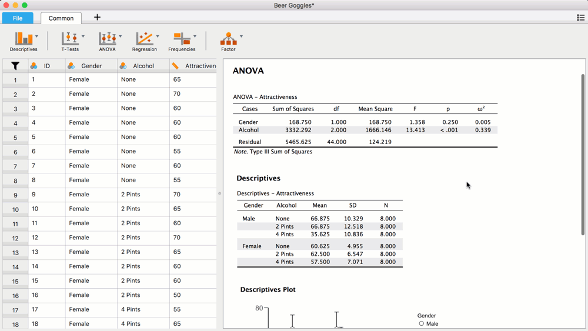
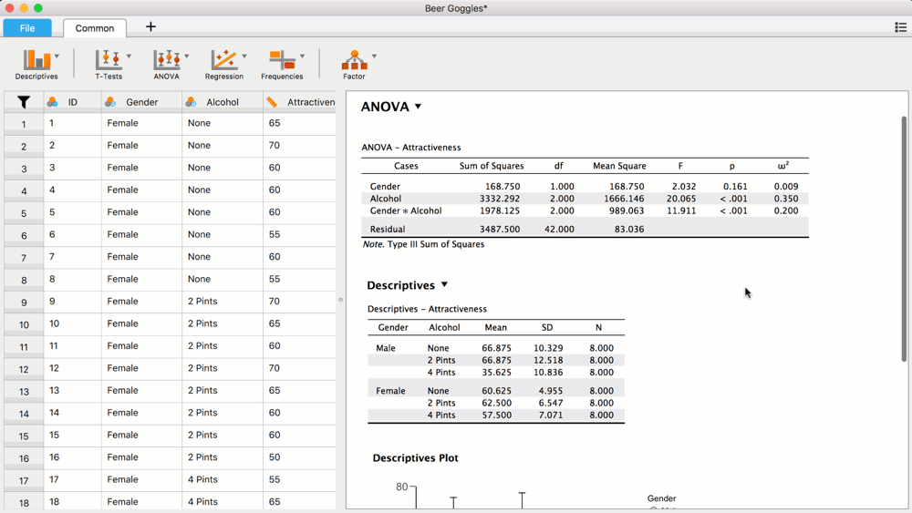
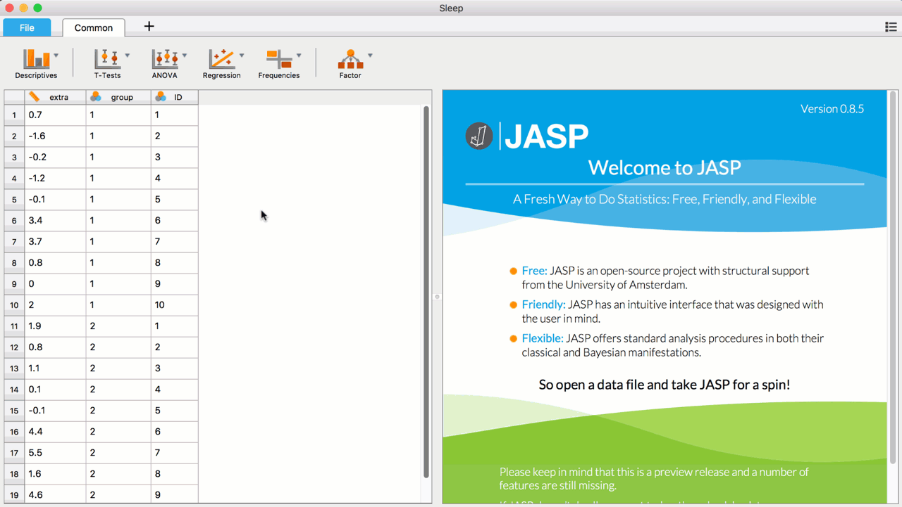

 # ANOVA 
---
ANOVA allows the user to analyze the difference among three, or more, group means.

### Assumptions 
- The dependent variable is normally distributed for every group.
- The independent variables are categorical, the dependent variable is continuous. 
- The variance of the dependent variable is the same for every group. This is called homogeneity of variances. 
- The groups are independent. 

## Input 
--- 
### Assignment Box 
- 'Dependent Variable': The variable of interest. Also called the outcome variable. 
- Fixed Factors: The variables that are manipulated/define the different groups. Also called the independent variables.   
- WLS Weights: Weighted Least Squares, here the variable specifying which points have more weight and are therefore considered more informative can be placed. For this last option it is important to know the weights a priori. This option is primarily used when the errors are heteroskedastic.   

#### Model: 
- Components and model terms 
    - Components: All the independent variables that can be included in the model. 
    - Model terms: The independent variables included in the model. By default all the main effects and interaction effects of the specified independent variables are included in the model. 

  
<b>Add interaction </b>

  

- Sum of Squares: There are different types of the Sum of Squares. The choice of the type is important when there is more than one factor, and when the data is unbalanced. In an unbalanced design the different levels of the independent variable do not contain an equal number of observations (e.g., one group contains more obsevations than another group). In this scenario the Sum of Squares type can influence the results.
    - Type I: Sequential sum of squares. It is the reduction of error when each factor of the model is added to the factors already included, containing the order in the model. The results depend on the order of the factors in the model. This is important to consider when the model contains more than one factor. 
    - Type II: Hierarchical/Partially sequential sum of squares. It is the reduction of error when a factor is added to the model that includes all the other factors, except the factors where the added factor is part of. Therefore, it does not include interactions. Langsrud (2003) advises to apply this type for an ANOVA with unbalanced data. 
    - Type III: Partial sum of squares. It is the reduction of error when a factors is added at last to the model, a model that includes all the other factors, including interactions with this factor. This type is often selected, because it takes interactions into account (Langsrud, 2003). This type is selected by default. 

#### Assumption Checks: 
- Homogeneity tests: By selecting this option, it will be checked whether the variance of the dependent variable is equal between the groups by performing Levene's test of equal variances.
- Homogeneity corrections: If the assumption of homogeneity is not met, corrections can be selected. 
    - None: No homogeneity correction. 
    - Brown-Forsythe: If the homogeneity assumption is not met, this correction could be used. This correction is only available for one-way ANOVA.  
    - Welch: If the homogeneity assumption is not met, this correction could be used. This correction is only available for one-way ANOVA. - Q-Q plot of residuals: Checks the validity of the distributional assumption of the data set. Specifically, the plot illustrates whether the data are normally distributed and linear.  

#### Contrasts: 
For every independent variable a specific contrast can be selected by clicking on `none` in the right column. 

  
<b> </b>

  

 
- Factors: These are the independent variables included in the analysis (i.e., the variables placed in the `Fixed Factors` box).  
- Contrasts: Contrasts enable the analysis of planned comparisons. There are different contrasts that allow for different types of comparisons.
    - none: By selecting this option, no contrasts are calculated. This option is selected by default. 
    - deviation: By selecting this contrast, the mean of each level of the independent variable is compared with the overall mean (the mean when all the levels are taken together). 
    - simple: When this contrast is selected, the mean of each level is compared to the mean of a specified level, for example with the mean of the control group. 
    - difference: This contrast is also called reverse Helmert. By selecting this contrast, the mean of each level is compared to the mean of the previous levels. 
    - Helmert: When this contrast is selected, the mean of each level is compared to the mean of the subsequent levels. This is the reverse of the difference contrast. 
    - repeated: By selecting this contrast, the mean of each level is compared to the mean of the following level. 
    - polynomial: This contrast tests polynomial trends in the data. The specific polynomial that will be used for the analysis depends on the number of levels of the independent variable. The degree of the trend used for the analysis is the amount of levels minus 1. Therefore, if the independent variable consist of 2 levels, a linear trend is analysed. If the independent variable consists of three levels, a quadratic trend is analysed in addition to the linear trend. 
- Assume equal variances: This option can be selected when the variances of the levels of the independent variable are assumed to be equal. This option is selected by default. 
- Confidence Intervals: By selecting this option, confidence intervals for the estimated mean difference will be included. By default the confidence level is set to 95%. This can be changeed into the desired percentage. 

#### Post Hoc Tests: 
If there is a significant effect of the independent variable, the analysis can be followed up by performing a post hoc test to see which specific levels of an independent variable differ from the other levels. To perform a post hoc test, drag the factor name to perform the post hoc test on to the right column. Then it is possible to select:    
- Effect size: By selecting this option, the effect size (i.e., the magnitude of the observed effect) will be presented. The used measure for the effect size is Cohen's d. The effect size will only be presented for the post hoc type `Standard`. 
- Confidence intervals: When this option is selected, the confidence interval for the mean difference is calculated. This is done for every post hoc method except for Dunn. By default this is set to 95% but this can be adjusted into the desired percentage.   
- Correction: To correct for multiple comparison testing and avoid Type I errors, different methods for correcting the p-value are available:  
    - Tukey: Compare all possible pairs of group means. This correction can be used when the groups of the independent variable have an equal sample size and variance. This method is commonly used and is selected by default. 
    - Scheffe: Adjusting significance levels in a linear regression, to account for multiple comparisons. This method is considered to be quite conservative. 
    - Bonferroni: This correction is considered conservative. The risk of Type I error is reduced, however the statistical power decreases as well. 
    - Holm: This method is also called sequential Bonferroni, and considered less conservative than the Bonferroni method. 
- Type: Different types of post hoc tests can be selected. 
    -  Standard: Pairwise t-tests are performed. All the corrections can be applied to this method. This option is selected by default. 
    -  Games-Howell: This method can be used when equal group/level variances are not assumed. The p-values are corrected with the Tukey method.
    -  Dunnett: When selecting this method, all the levels are compared to one specific level, for example to the control group. At the moment, it is not possible to manually specify to which level the others levels are compared, but it is based on the order of the levels. To change the order of the levels, the level labels can be adjusted.  

	                                                                  
<b>Adjust level labels </b>

	                                                                  
                                                                      

    
    -  Dunn: This is a non-parametric test that can be used for testing small subsets of pairs. This post hoc test is a follow up for the Kruskal-Wallis test. The p-values are corrected with the Bonferroni and Holm methods.

#### Descriptive Plots:  
To create a descriptive plot, place the independent variable on the horizontal axis. If there is more than one independent variable, the variables can be displayed in one plot by putting the other variable in the box `Separate lines`, or the variables can be displayed in separate plots by dragging the other variable in the box `Separate plots`.
- Factors: The independent variables included in the analysis. 
- Horizontal axis: Place here the independent variable that should be displayed on the horizontal axis of the plot.  
- Separate lines: By placing an independent variable in this box, different lines corresponding to the different levels of the independent variable will be displayed. 
- Separate plots: By placing an independent variable in this box, different plots corresponding to the different levels of the independent variable will be displayed. 
- Display: 
    - Display error bars: By selecting this option, error bars will be displayed in the plot. The error bars can either represent confidence intervals or standard errors. 
        - Confidence interval: This option is selected by default. With this option, the error bars will represent confidence intervals of the mean of each level combination of the independent variables. By default the confidence interval is set to 95%, but this can be changed  into the desired percentage.  
        - Standard error: By selecting this option, the error bars will represent standard errors of the mean of each level combination of the independent variables. 

#### Additional Options: 
- Marginal means: When this option is selected, the mean for each level of the independent variable, adjusted for all the other variables in the model, is calculated. 
- Compare marginal means to 0: By selecting this option, the adjusted means are compared to 0 and the confidence intervals of the adjusted means are calculated.  
    - Confidence interval adjustment: The confidence intervals can be adjusted in several ways. 
        - None: When this option is selected, no adjustment will be applied. 
        - Bonferroni: Bonferroni correction of the confidence intervals. 
        - Sidak: Sidak correction of the confidence intervals. 
- Display: 
    - Descriptive statistics: When this option is selected, the mean, standard deviation, and the sample size will be presented for each level combination of the independent variables. 
    - Estimates of effect size: By selecting this option, the specific types of calculations to estimate the effect size can be specified. 
        - &eta;2 : When this option is selected, the Eta-squared is calculated as an estimate of the effect size. However, this method is considered to overestimate the population variance, making it hard to compare the effect of the same variable across different studies (Goss-Sampson, 2018).      
        - partial &eta;2 : When this option is selected, the Partial eta-squared is calculated as an estimate of the effect size. This method is considered to solve the problem of overestimation of the population variance, which makes it less difficult to compare the effect of the same variable from different studies (Goss-Sampson, 2018). 
        - &omega;2 : When this option is selected, the Omega squared is calculated as an estimate of the effect size. This is considered a good estimate when the sample size is small (Goss-Sampson, 2018). 
    - Vovk-Selke maximum p-ratio: The bound 1/(-e p log(p)) is derived from the shape of the p-value distribution. Under the null hypothesis (H0) it is uniform (0,1), and under the alternative (H1) it is decreasing in p, e.g., a beta (α, 1) distribution, where 0 < α < 1. The Vovk-Sellke MPR is obtained by choosing the shape α of the distribution under H1 such that the obtained p-value is maximally diagnostic. The value is then the ratio of the densities at point p under H0 and H1. For example, if the two-sided p-value equals .05, the Vovk-Sellke MPR equals 2.46, indicating that this p-value is at most 2.46 times more likely to occur under H1 than under H0. More information can be found in this [blogpost](https://jasp-stats.org/2017/06/12/mysterious-vs-mpr/). 

#### Simple Main Effects: 
When the results contain a significant interaction, the main effects can be misleading. To solve this, the simple main effects can be calculated. The simple main effects represent the effect of one independent variable for each level of the other independent variable, by conducting an ANOVA for each subset of the data as specified by the moderator variables. 

	
<b> </b>

	

- Factors: This box contains all the independent variables included in the analysis. 
- Simple effect factor: In this box the independent variable can be placed to determine the effect of this variable. 
- Moderator factor 1: In this box the independent variable that will represent the different levels can be placed. 
- Moderator factor 2: In this box an additional independent variable can be placed (optional, that will add other levels to distinguish the effects from. 

#### Nonparametrics: 
- Kruskal-Wallis test: The Kruskal-Wallis test is a non-parametric ANOVA and can be used to compare two or more groups. This test is a rank-based one-way ANOVA. The Kruskal-Wallis test can be performed when one of the following assumptions is not met: normality of the dependent variable, no outliers, homogeneity of the variance between the groups. To perform the test, move the independent variables from the left column to the right column. 

### Output 
---
#### ANOVA 
ANCOVA - dependent variable: 
- Cases: This column contains the independent variables, their interaction, and the residual. 
- Sum of Squares: The summed squared group-mean differences.  
- df: Degrees of freedom of the model.  
- Mean Square: The estimate of population variance (the sum of squares divided by df's). 
- F: The value of the F-statistic.  
- p: The p-value.  
- VS-MPR: Vovk-Sellke Maximum *p*-ratio.   
- &eta;2 : Estimated effect size eta-squared.      
- &eta;2p : Estimated effect size partial eta-squared.  
- &omega;2 : Estimated effect size omega-squared. 

#### Assumptions Checks: 
Test for Equality of Variances (Levene's) 
- F: F-statistic of Levene's test.  
- df1: Degrees of freedom calculated by k-1, where k represents the number of groups in the analysis. 
- df2: Degrees of freedom calculated by N-k-1, where N represents the total sample size, and k the number of groups in the analysis. 
- p: The p-value. If the p-value is significant, this means that the group variances of the dependent variable are not equal (i.e., the assumption of homogeneity is not met).  
- VS-MPR: Vovk-Sellke Maximum *p*-ratio. 

##### Q-Q Plot: 
With Q-Q plot the normality of the residuals can be inspected visually. The theoretical quantiles are presented on the x-axis and standardized residuals on y-axis. The more dots are on the diagonal line, the more the data are normally distributed. 

#### Contrasts: 
Deviation/Simple/Difference/Helmert/Repeated/Polynomial Contrast: 
- Comparison: The levels of the independent variable that are compared. 
- Estimate: The estimated mean difference between the compared levels. 
- SE: The standard error of the estimated mean. 
- df: The degrees of freedom of the model. 
- t: The value of the t-statistic. 
- p: The p-value. 
- % CI for Mean Difference: % confidence interval of the mean difference. This is 95% by default.   
    - Lower: This is the lower bound of the confidence interval. 
    - Upper: This is the upper bound of the confidence interval. 

#### Post Hoc Tests: 
Post Hoc Comparisons (Standard)- independent variable:  
 - The first two columns represent the levels/groups of the independent variable that are compared with each other. 
- Mean Difference: The mean difference between the levels. 
- % CI for Mean Difference: The confidence interval of the mean difference between the compared levels. By default this is set to 95%. 
    - Lower: The lower bound of the confidence interval. 
    - Upper: The upper bound of the confidence interval. 
- SE: The standard error of the mean difference. 
- t: The value of the t-statistic. 
- Cohen's D: The effect size Cohen's d. Cohen's d does not correct for multiple comparisons. 
- ptukey: Tukey's corrected p-value for multiple comparisons. 
- pscheffe: Scheffe's corrected p-value for multiple comparisons. 
- pbonf: Bonferroni's corrected p-value for multiple comparisons.  
- pholm: Holm's corrected p-value for multiple comparisons. 

Games-Howell Post Hoc Comparisons - independent variable:  
- The first two columns represent the levels/groups of the independent variable that are compared with each other. 
- Mean Difference: The mean difference between the levels. 
- % CI for Mean Difference: The confidence interval of the mean difference between the compared levels. By default this is set to 95%. 
    - Lower: The lower bound of the confidence interval. 
    - Upper: The upper bound of the confidence interval. 
- SE: The standard error of the mean difference. 
- t: The value of the t-statistic. 
- ptukey: Tukey's corrected p-value for multiple comparisons. 
    
Dunnett Post Hoc Comparisons 
- The first two columns represent the levels/groups of the independent variable that are compared to each other. 
- Mean Difference: The mean difference between the levels. 
- % CI for Mean Difference: The confidence interval of the mean difference between the compared levels. By default this is set to 95%. 
    - Lower: The lower bound of the confidence interval. 
    - Upper: The upper bound of the confidence interval. 
- SE: The standard error of the mean difference. 
- t: The value of the t-statistic. 
- pdunnett: Dunnett's p-value. 

Dunn's Post Hoc Comparisons 
- The first two columns represent the levels/groups of the independent variable that are compared with each other. 
- z: The value for the z-statistic. 
- Wi: The mean ranking of the first level/group of the comparison. 
- Wj: The mean ranking of the second level/group of the comparison.  
- p: The p-value.  
- pbonf: Bonferroni's corrected p-value for multiple comparisons.  
- pholm: Holm's corrected p-value for multiple comparisons. 

#### Marginal Means: 
Marginal Means - Independent Variable: 
- The first column contains the levels of the independent variable. 
- Marginal Mean: The marginal mean for each level of the independent variable. This mean is adjusted for all the other variables in the model. 
- SE: The standard error of the marginal mean. 
- Lower CI: The lower bound of the confidence interval. 
- Upper CI: The upper bound of the confidence interval. 
- t: The value for the t-statistic. 
- p: The p-value.

Simple Main Effects - Independent Variable: 
- The first column contains the levels of the other independent variable included in the analysis (if present).  
- Sum of Squares: The summed squared group-mean differences. 
- df: The degrees of freedom. 
- Mean Square: The estimate of the population variance (the sum of squares divided by the degrees of freedom)
- F: The value of the F-statistic. 
- p: The p-value. 

Kruskal-Wallis Test: 
- Factor: This column contains the independent variable included in the analysis. 
- Statistic: The value for the test statistic. 
- df: The degrees of freedom. 
- p: The p-value. 

#### Descriptives: 
Descriptives - dependent variable:
- Independent variables: The levels of the independent variable(s) included in the analysis. If more than 1, the descriptives will be displayed for each combination of levels of the independent variables. 
- Mean: The mean per level or, if more than 1 independent variable, the mean per combination of levels. 
- SD: The standard deviation.  
- N: The sample size. 

##### Descriptives Plot: 
Independent variable on the x-axis and dependent variable on the y-axis. If other independent variables are included, either different lines representing different values of the other independent variable are displayed in the same plot, or different plots representing different values of the other independent variable are displayed. 

### References 
--- 
-	Field, A. (2009). Discovering Statistics using SPSS (3rd ed.). Sage Publishing.
-	Field, A., Miles, J., & Field, Z. (2012). Discovering statistics using R. Sage Publishing.
-	Goss-Sampson, M. A. (2018). Statistical Analysis in JASP: A Guide for Students. Version 2, October 2018. 
-	Langsrud, Ø. (2003). ANOVA for unbalanced data: Use Type II instead of Type III sums of squares. Statistics and Computing, 13(2), 163-167.
-	Moore, D.S., McCabe, G.P., & Craig, B.A. (2012). Introduction to the practice of statistics (7th ed.). New York, NY: W.H. Freeman and Company.
-	Sellke, T., Bayarri, M. J., & Berger, J. O. (2001). Calibration of p values for testing precise null hypotheses. The American Statistician, 55(1), 62-71.
-	Whitlock, M.C. & Schluter, D. (2015). The analysis of biological data (2nd ed.). Greenwood Village, Colorado: Roberts and Company Publishers.

### Example 
--- 
For an example go to `file`-->`data library`-->`ANOVA`-->`Erotic Pictures and Love`. 
For more details about ANOVA in JASP, watch this [video](https://www.youtube.com/watch?v=nlAhWQmG5Iw&feature=youtu.be). 
