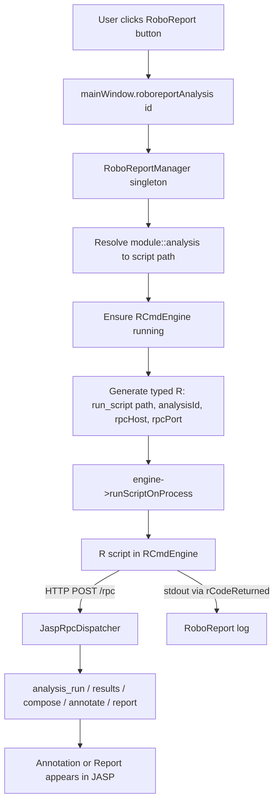

# RoboReport — Implementation Plan

> Deterministic R scripts that drive the JASP RPC toolset to generate
> annotated reports. Same tools as the AI agent, no LLM in the loop.

## 1. Goal

When the user clicks a **RoboReport** button on an analysis, JASP runs a
deterministic, human-authored R script specialized for that analysis type.
The script:

1. Reads the analysis's current options and results (via RPC → RDS).
2. Extracts the numbers it needs (t, df, p, descriptives, …).
3. Composes a markdown annotation/report interleaving prose with references
   to the existing JASP output elements.
4. Commits it as an annotation (duplicate + `composeResults`) or a report.

This is exactly what the AI agent does — minus the AI.

---

## 2. Architecture



### Data flow for results

```
jaspResults (R, analysis engine process)
  └─ saveRDS() [jaspBase rens/master]
       └─ jaspResults.rds  (729K, but 715 bytes real data)
            └─ RoboReport script reads via RPC path
                 └─ rr_results() strips wrapper attrs, fixes warts
                      └─ rr_ttest_independent() subsets columns
                           └─ script writes prose + add_result() refs
```

---

## 3. Components

### 3.1 C++ — `RoboReportManager`

**Location:** `Desktop/roboreport/roboreportmanager.{h,cpp}`

Singleton modeled on `AgentStateTracker` (`Desktop/ai/agentstatetracker.h`).
Isolates all RoboReport logic from `MainWindow`.

```cpp
class RoboReportManager : public QObject
{
    Q_OBJECT
public:
    static RoboReportManager* manager() { return _singleton; }
    static void init(QObject* parent = nullptr);

    // Null-safe entry points
    static void runForAnalysis(int analysisId);
    static bool hasScript(const std::string& module, const std::string& analysis);

signals:
    void scriptStarted(int analysisId);
    void scriptOutput(int analysisId, const QString& line);
    void scriptFinished(int analysisId, bool success, const QString& errorMsg);

private:
    explicit RoboReportManager(QObject* parent);
    void _runForAnalysis(int analysisId);

    EngineRepresentation* _engine = nullptr;
    QHash<int, QString>   _activeScripts;

    static RoboReportManager* _singleton;
};
```

**Responsibilities:**
- Resolve `(module, analysis)` → script path by convention:
  `Resources/roboreport/<module>/<AnalysisName>.R`
- Ensure `JaspRpcServer` is listening (auto-start if disabled).
- Ensure RCmdEngine exists via `EngineSync::createRCmdEngine()` (idempotent).
- Generate typed R code that calls `jaspRoboReport::run_script()` with
  properly typed arguments (no env vars — see §3.3.6):
  ```r
  jaspRoboReport::run_script(
      path       = "<...>/TTestIndependent.R",
      analysisId = 123L,
      rpcHost    = "127.0.0.1",
      rpcPort    = 48164L
  )
  ```
- Listen on `rCodeReturned` / `rCodeReturnedLog` for output streaming.

**RCmdEngine sharing:** Shares the single `_rCmder` with `RCommander`.
Only one of them may run at a time — guard with `_engine->idle()` check,
same pattern as `RCommander::runCode()` (`qquick/rcommander.cpp` L44).

**MainWindow involvement:** Two lines:
```cpp
// MainWindow constructor
RoboReportManager::init(this);

// Q_INVOKABLE passthrough (or register manager as QML type)
Q_INVOKABLE void roboreportAnalysis(int id) { RoboReportManager::runForAnalysis(id); }
```

**Context passing — generated R code, not env vars.** The C++ side forms
a string of typed R that calls `run_script()` directly. No `Sys.setenv()`,
no stringly-typed `as.integer(Sys.getenv())`. Variables are properly typed
(`123L` is an integer, `48164L` is an integer), visible in the RCmdEngine
output log for debugging, and scoped to the call — they don't leak to
child processes or persist between runs.

### 3.2 QML — Button

**Location:** `Desktop/components/JASP/Widgets/AnalysisFormExpander.qml`
beside `annotateButton` (~L415).

```qml
MenuButton
{
    id:                 roboreportButton
    width:              height
    iconSource:         jaspTheme.iconPath + "/roboreport.svg"
    enabled:            expanderButton.expanded
    visible:            myForm ? !myForm.isAnnotated : false
    onClicked:          mainWindow.roboreportAnalysis(formParent.myAnalysis.id)
    toolTip:            qsTr("Generate an annotated report for this analysis")
    radius:             height
    opacity:            editButton.opacity
}
```

### 3.3 R package — `jaspRoboReport`

**Location:** `Engine/jaspRoboReport/` (sibling of `jaspBase`)

One package, internally layered. See §4 for the one-vs-two decision.

```
Engine/jaspRoboReport/
  DESCRIPTION
  NAMESPACE
  R/
    rpc-client.R       # Low layer: rr_call(), transport
    results.R          # Low layer: rr_results(), RDS adapter + wart handling
    getters.R          # Mid layer: per-analysis getters (rr_ttest_independent, ...)
    report.R           # High layer: report DSL (begin/add_md/add_result/commit)
    annotate.R         # High layer: annotation helpers
    format.R           # Formatting: fmt_p, fmt_ci, fmt_effect_size
    run.R              # Entry point: run_script() called by C++
  man/
  inst/
  tests/
```

**Dependencies:**
```
Imports:
  httr2,        # modern HTTP client
  jsonlite,     # JSON (already a jaspBase dep)
  glue          # string interpolation
Suggests:
  testthat (>= 3.0.0)
```

#### 3.3.1 RPC client (`R/rpc-client.R`)

Blocking HTTP. No `coro` — the RCmdEngine is a separate process, so
blocking doesn't freeze JASP, and the dispatcher's `m_inFlight` guard
forbids concurrent dispatch anyway (see §5.1).

```r
# Endpoint config is stored in a package-level env by run_script().
# rr_call() reads it internally — no env vars anywhere.

.rr_endpoint <- function() {
  cfg <- .rr_config  # package-level environment set by .rr_set_endpoint()
  sprintf("http://%s:%s/rpc", cfg$host, cfg$port)
}

rr_call <- function(method, params = list()) {
  body <- list(jsonrpc = "2.0", id = 1L, method = method, params = params)
  req <- httr2::request(.rr_endpoint()) |>
    httr2::req_body_json(body) |>
    httr2::req_timeout(.rr_config$timeoutMs %||% 60000)
  resp <- httr2::req_perform(req)
  json <- httr2::resp_body_json(resp)
  if (!is.null(json$error))
    stop(sprintf("[%d] %s", json$error$code, json$error$message), call. = FALSE)
  json$result
}

.rr_config <- new.env(parent = emptyenv())
.rr_config$host <- "127.0.0.1"
.rr_config$port <- "48164"
.rr_config$timeoutMs <- 60000

.rr_set_endpoint <- function(host, port, timeoutMs = 60000) {
  .rr_config$host      <- host
  .rr_config$port      <- as.character(port)
  .rr_config$timeoutMs <- timeoutMs
}
```

Thin 1:1 tool wrappers in the same file:
```r
rr_analysis_run        <- function(analysisId, options, ...) rr_call("analysis_run", ...)
rr_analysis_results    <- function(analysisId, ...)          rr_call("analysis_results", ...)
rr_get_analyses_state  <- function(analysisIds, ...)         rr_call("get_analyses_state", ...)
rr_create_annotation   <- function(analysisId, elements)     rr_call("analysis_createAnnotation", ...)
rr_write_report        <- function(elements, ...)            rr_call("write_report", ...)
```

#### 3.3.2 Results adapter (`R/results.R`) — the jaspBase containment layer

**This is the only file that knows about jaspBase's RDS format.**
Everything above it sees clean data.frames.

Responsibilities:
1. Read the RDS path (returned in RPC `jaspResultsRds` field).
2. Recursively strip `jaspObjectEnvironment` attributes (the 1000x bloat source).
3. Strip `footnotes` attrs, `.isNewGroup` columns, wrapper classes.
4. Fix wart 1: coerce placeholders (`"."`, `""`) → `NA`; placeholder
   zeros in uncomputed columns → `NA`.
5. Return a clean named list of data.frames (+ plot objects).

```r
rr_results <- function(analysisId) {
  state <- rr_get_analyses_state(analysisId, include_results = TRUE)
  rds_path <- state$analyses[[1]]$jaspResultsRds
  if (is.null(rds_path) || !file.exists(rds_path))
    stop("jaspResults.rds not found for analysis ", analysisId)
  x <- readRDS(rds_path)
  .rr_strip(x)
}

.rr_strip <- function(obj) {
  if (is.data.frame(obj)) {
    attr(obj, "jaspObjectEnvironment") <- NULL
    attr(obj, "footnotes") <- NULL
    obj$.isNewGroup <- NULL
    class(obj) <- "data.frame"
    .rr_fix_placeholders(obj)
  } else if (is.list(obj)) {
    attr(obj, "jaspObjectEnvironment") <- NULL
    attr(obj, "class") <- "list"
    lapply(obj, .rr_strip)
  } else {
    obj
  }
}

.rr_fix_placeholders <- function(df) {
  for (nm in names(df)) {
    col <- df[[nm]]
    if (is.character(col))
      col[col %in% c(".", "", "NaN")] <- NA
    df[[nm]] <- col
  }
  df
}
```

#### 3.3.3 Per-analysis getters (`R/getters.R`)

One function per analysis. Returns a named list of data.frames.
**The "variable name map" is the column subsetting in the function body** —
explicit, self-documenting, fails loudly on schema change.

**Wart 2 handling:** the RDS names elements by TITLE (localized), not KEY.
Getters use **positional indexing** internally to survive language changes.

```r
rr_ttest_independent <- function(analysisId) {
  raw <- rr_results(analysisId)

  # Positional: [[1]] is the main table regardless of localization
  main <- raw[[1]][, c("v", "test", "t", "df", "p",
                       "md", "sed", "d",
                       "lowerCIlocationParameter", "upperCIlocationParameter")]

  # Descriptives, assumptions — positional, guarded for absence
  desc <- if (length(raw) >= 2) raw[[2]][, c("variable", "group", "N", "mean", "sd", "se")] else NULL

  list(main = main, descriptives = desc)
}
```

**Principles:**
- Always return data.frames (handles scalar/vector/multi-DV uniformly).
- Keep original jaspTTests column names (`t`, `df`, `p`, `d`) — they are the contract. No renaming to a third namespace.
- Optional tables guarded with `NULL`, not errors.
- No computation, no reshaping — that's the script's job.

#### 3.3.4 Report DSL (`R/report.R`)

Ergonomic pipeline for composing annotations. Builds `elements[]` list
incrementally, flushes via `rr_create_annotation()` or `rr_write_report()`.

```r
report <- roboreport_begin(source_id = 123) |>
  add_md("## Descriptives\n\nGroup summary:") |>
  add_result("descriptives") |>                   # references element by key
  add_md(sprintf("t(%g) = %.2f, %s", df, t, fmt_p(p))) |>
  add_result("ttest") |>
  roboreport_commit()                             # → analysis_createAnnotation
```

`add_result(name)` embeds an existing result element by referencing its
key. `add_md(text)` inserts a markdown block. Order is preserved.

#### 3.3.5 Formatting (`R/format.R`)

```r
fmt_p  <- function(p) if (p < 0.001) "p < .001" else sprintf("p = %.3f", p)
fmt_ci <- function(est, lo, hi, d = 2) sprintf("%.2f, 95%% CI [%.2f, %.2f]", est, lo, hi)
```

#### 3.3.6 Entry point (`R/run.R`)

Called by C++ via generated R code. **No env vars** — C++ passes typed
arguments directly:

```r
# C++ generates and fires via runScriptOnProcess:
#   jaspRoboReport::run_script(
#       path       = "/opt/.../TTestIndependent.R",
#       analysisId = 123L,
#       rpcHost    = "127.0.0.1",
#       rpcPort    = 48164L
#   )

run_script <- function(path, analysisId, rpcHost, rpcPort) {
  # Store endpoint config in package env — rr_call() reads it internally.
  # Script authors never touch rpcHost/rpcPort.
  .rr_set_endpoint(rpcHost, rpcPort)

  # Source into a fresh env whose parent is the package namespace,
  # so rr_* helpers resolve without jaspRoboReport:: prefix.
  env <- new.env(parent = asNamespace("jaspRoboReport"))
  source(path, local = env)

  if (!exists("roboreport_main", envir = env, inherits = FALSE))
    stop("RoboReport script must define roboreport_main(analysisId): ", path)

  env$roboreport_main(analysisId = analysisId)
}
```

**Script contract:** every script file defines a single function:
```r
roboreport_main <- function(analysisId) {
  res <- rr_ttest_independent(analysisId)
  roboreport_begin(analysisId) |>
    add_md(...) |>
    commit()
}
```

This makes scripts **testable in isolation** — outside JASP you can
`source("TTestIndependent.R"); roboreport_main(1L)` with a mock endpoint.
The `analysisId` is an explicit typed parameter, not an implicit global.
Endpoint config (`rpcHost`/`rpcPort`) is package-internal; script authors
never see it.

---

## 4. Decisions Log

| # | Decision | Rationale |
|---|---|---|
| 1 | **One R package**, `jaspRoboReport`, internally layered | Two packages = premature split; one consumer today. Extract `jaspRpc` later if needed. |
| 2 | **`httr2` + `jsonlite`, not `coro`** | RCmdEngine is a separate process — blocking HTTP doesn't freeze JASP. Dispatcher `m_inFlight` forbids concurrency anyway. `coro` adds no value here. |
| 3 | **HTTP transport** (reuse `JaspRpcServer`) | AI agent uses in-process dispatch; RoboReport runs in RCmdEngine subprocess so must use HTTP. Auto-start server when roboreport fires. |
| 4 | **RDS path for results** (jaspBase `rens/master`) | Typed data.frames > JSON array slop. Live plot objects. Main repo already returns `jaspResultsRds` path. |
| 5 | **Strip RDS bloat in adapter**, defer jaspBase fix | 729K file is 715 bytes real data. `jaspObjectEnvironment` XPtr drags in Rcpp module. Fix in jaspBase later; strip on read for now. |
| 6 | **No recomputation** | Numbers must match displayed tables. Parse from jaspResults. |
| 7 | **Always data.frames from getters** | Handles scalar/vector/multi-DV with one access pattern. No `if(length==1)` branching. |
| 8 | **Per-analysis getter functions** | Schema is analysis-specific. One function per analysis co-locates all knowledge. Map = column subset in code. |
| 9 | **Keep original column names** | `t`, `df`, `p` are jaspTTests' contract. Renaming adds a third namespace for no gain. |
| 10 | **Positional indexing in getters** | RDS names by localized TITLE not KEY. Positional survives language changes. |
| 11 | **RoboReportManager singleton** | Mirror `AgentStateTracker`. Isolate from MainWindow bloat. Null-safe static wrappers. |
| 12 | **Convention-based script lookup** | `Resources/roboreport/<module>/<AnalysisName>.R`. Simple, matches existing `Resources/` layout. |
| 13 | **Default output: annotation** | Matches AI behavior. Source analysis stays pristine. `write_report` for cross-analysis aggregation. |
| 14 | **Generated R code, not env vars** | C++ forms a string of typed R that calls `run_script(path, analysisId, rpcHost, rpcPort)`. Typed (`123L` is int), visible in logs for debugging, scoped to the call. No `Sys.getenv()`/`as.integer()` ceremony. |
| 15 | **Script contract: `roboreport_main(analysisId)`** | Every script defines one function. Sourced into a fresh env (parent = package namespace). Testable in isolation. Explicit typed parameter, not implicit global. |

---

## 5. Known Issues & Deferrals

### 5.1 Re-entrancy: strict sequential RPC
`JaspRpcDispatcher::m_inFlight` allows one dispatch on the call stack at a time.
While `analysis_run(wait=TRUE)` is inside its nested `QEventLoop`, a second
concurrent dispatch returns `-32000`. **R scripts must issue RPC calls
strictly sequentially.** The blocking HTTP design enforces this naturally.

### 5.2 RDS bloat (deferred jaspBase fix)
`jaspObjectEnvironment` attribute serializes the entire Rcpp module (~729K
for a 6-row table, ~22MB uncompressed). The adapter strips it on read
(729K → 715 bytes). **Deferred fix:** strip in `jaspResults::saveResults()`
before `saveRDS()` in the `rens/master` branch — 3-line change, benefits everyone.

### 5.3 RDS title-based naming (localization risk)
`jaspContainer::toRObject()` names children by `_title` (localized), not by
map key. Getters use positional indexing internally to survive this.
**Deferred fix:** change `toRObject()` to push with the key, not the title.

### 5.4 Placeholder values
jaspBase emits `"."`, `""` for uncomputed string cells and `0` for uncomputed
numeric cells instead of `NA`. The adapter coerces placeholders → `NA`.
Placeholder zeros in CI columns are semantically wrong (0 is a real value) —
the adapter cannot distinguish "uncomputed" from "actually zero" generically.
Scripts that read CI columns should check the relevant option flag first.

### 5.5 RCmdEngine sharing with RCommander
RoboReport and RCommander share the single `_rCmder`. Both check
`_engine->idle()` before running. No mutex yet — rely on the idle check
and the single-threaded Qt event loop. If contention appears, add a queue.

### 5.6 Error handling UX
When `rr_call()` throws, the R script aborts and the error surfaces in
`rCodeReturned`. Deferred: detect non-zero R exit in C++ and surface a
friendly message (toast or failed-state annotation).

---

## 6. Phased Plan

| Phase | Scope | Deliverable |
|-------|-------|-------------|
| **1** | R package skeleton + `rr_call()` + tool wrappers | Can call any RPC method from R and get parsed JSON |
| **2** | `rr_results()` adapter + wart handling | Clean data.frames from RDS, bloat stripped |
| **3** | First getter `rr_ttest_independent()` | Validated against real t-test RDS |
| **4** | C++ `RoboReportManager` + QML button | Click → runs R snippet in RCmdEngine, logs output |
| **5** | Report DSL (`report_begin`/`add_md`/`add_result`/`commit`) | Scripts can compose annotations ergonomically |
| **6** | First real script: `jaspTTests/TTestIndependent.R` | End-to-end demo |
| **7** | Format helpers + more scripts (ANOVA, regression, descriptives) | Coverage |

**Critical path:** Phase 1–3 (R package) and Phase 4 (C++) are independent
and can be done in parallel. Phase 6 wires them together.

---

## 7. File Layout (new files)

```
Desktop/roboreport/
  roboreportmanager.h
  roboreportmanager.cpp
  CMakeLists.txt                     # new target, links to Desktop

Engine/jaspRoboReport/
  DESCRIPTION
  NAMESPACE
  R/
    rpc-client.R
    results.R
    getters.R
    report.R
    annotate.R
    format.R
    run.R
  man/
  tests/

Resources/roboreport/
  jaspTTests/
    TTestIndependent.R               # first script (Phase 6)
  jaspAnova/
    Anova.R                          # later
  ...

Desktop/components/JASP/Widgets/
  AnalysisFormExpander.qml           # edit: add roboreportButton

Desktop/mainwindow.{h,cpp}           # edit: init() + Q_INVOKABLE passthrough
```

---

## 8. Open Questions

1. **Output target default** — annotation vs report?
   Recommend: annotation (matches AI, keeps source pristine), with
   `write_report` for cross-analysis aggregation. Confirm.

2. **Can RoboReport scripts create sibling analyses?**
   e.g., "run with effect size enabled" by `analysis_create` + `analysis_run`.
   Recommend: yes — allows richer reports. The script must treat the
   SOURCE analysis as read-only but may create siblings.

3. **Script versioning / manifest?**
   Convention (`<module>/<AnalysisName>.R`) vs a registry JSON.
   Recommend: convention first, manifest if discovery is needed.

4. **Progress reporting to UI during long scripts?**
   The RCmdEngine streams `rCodeReturnedLog`. Could surface as a
   progress overlay. Defer until the happy path works.

---

## 9. Summary

**RoboReport = deterministic R scripts driving the existing JASP RPC toolset.**
No LLM, no new RPC methods, no new transport. Three new components:

1. **`RoboReportManager`** (C++ singleton) — resolves scripts, drives the
   RCmdEngine, isolates logic from MainWindow.

2. **`jaspRoboReport`** (R package) — HTTP RPC client + RDS results adapter
   + per-analysis getters + report composition DSL.

3. **Scripts** (`Resources/roboreport/<module>/<analysis>.R`) — one per
   analysis type, the actual report logic.

**Key technical bets:**
- RDS over JSON for results (typed data.frames, live plots) — adapter
  contains the jaspBase coupling and its two warts (bloat, title-naming).
- Blocking HTTP over async/coro — correct for a separate-process,
  sequentially-dispatched model.
- One R package, internally layered — defer the split until a second
  consumer appears.

**The critical path is Phase 1–4:** R package foundations + C++ launcher.
The first real script (Phase 6) validates the whole pipeline.
